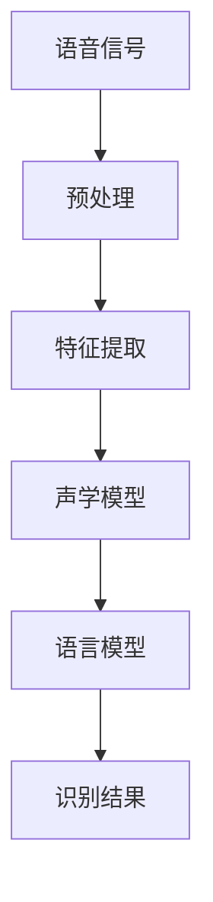
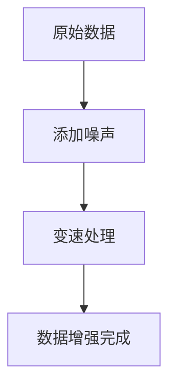
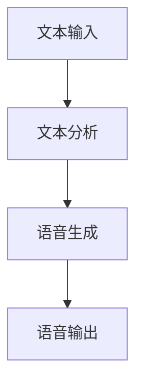
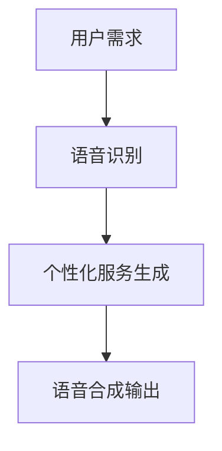
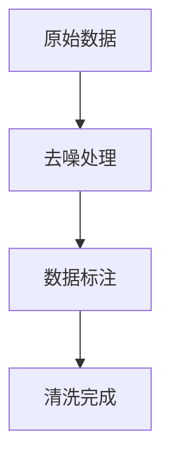
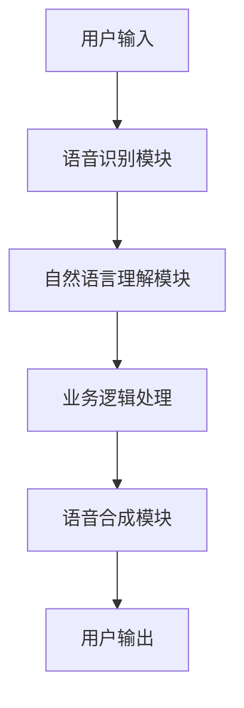

                 


# 语音技术在金融AI中的应用与优化

**关键词**: 语音技术、人工智能、金融应用、语音识别、语音合成、情感分析

**摘要**: 本文深入探讨了语音技术在金融AI中的应用与优化，从语音识别、语音合成到情感分析，结合金融领域的具体场景，分析了语音技术的核心原理、算法优化及系统架构设计。通过实际案例和项目实战，展示了如何在金融行业高效应用语音技术，并提出了未来的发展方向。

---

## 第1章: 语音技术与金融AI的背景介绍

### 1.1 语音技术的基本概念

语音技术是指通过计算机对语音信号进行处理、分析和理解的技术，主要包括语音识别（ASR）、语音合成（TTS）和语音情感分析（VAE）等核心模块。在金融领域，语音技术的应用可以显著提升用户体验，优化业务流程，并降低运营成本。

**关键术语表**:

| 概念 | 定义 | 示例 |
|------|------|------|
| 语音识别 | 将语音信号转换为文字的技术 | 智能音箱、语音助手 |
| 语音合成 | 将文本生成语音的技术 | 智能客服、语音广告 |
| 情感分析 | 识别语音中情感状态的技术 | 风险评估、用户情绪分析 |

### 1.2 语音技术的发展历程

语音技术经历了从简单的声音处理到深度学习驱动的智能语音识别的演变。以下是其主要发展历程：

1. **早期阶段**: 基于模板匹配的语音识别（DTW）。
2. **发展阶段**: 基于隐马尔可夫模型（HMM）的语音识别。
3. **现代阶段**: 基于深度学习（DNN、Transformer）的端到端语音识别。

**语音技术发展时间线**:

```mermaid
timeline
    title 语音技术发展时间线
    : 阶段一[1960-1980] --> 阶段二[1980-2000] --> 阶段三[2000-今]
    : 阶段一 "基于模板匹配的语音识别（DTW）"
    : 阶段二 "基于HMM的语音识别"
    : 阶段三 "基于深度学习的端到端语音识别"
```

### 1.3 语音技术在金融AI中的应用场景

语音技术在金融领域的应用主要集中在以下几个方面：

1. **智能客服**: 提供语音交互服务，解决用户问题。
2. **语音数据处理**: 将语音数据转换为结构化数据，用于金融分析。
3. **情感分析**: 通过语音情感特征识别潜在风险，优化客户服务。

**语音技术在金融中的应用场景对比表**:

| 场景 | 技术需求 | 应用价值 |
|------|----------|----------|
| 智能客服 | 语音识别、语音合成 | 提高用户体验，降低人工成本 |
| 风险评估 | 语音情感分析 | 识别潜在风险，优化信贷评估 |
| 市场分析 | 语音数据处理 | 提供实时市场动态，辅助投资决策 |

---

## 第2章: 语音识别技术原理

### 2.1 语音识别的基本原理

语音识别的核心流程包括语音信号预处理、特征提取、声学模型训练和语言模型构建。

**语音识别流程图**:



### 2.2 常用语音识别算法

1. **基于HMM的语音识别**:
   - 基于状态转移的概率模型。
   - 适用于小词汇量的语音识别任务。

2. **基于DNN的语音识别**:
   - 利用深度神经网络提取语音特征。
   - 在大词汇量场景下表现更优。

3. **基于Transformer的端到端语音识别**:
   - 通过自注意力机制处理序列数据。
   - 支持实时语音识别。

**不同语音识别算法的性能对比表**:

| 算法类型 | 优点 | 缺点 | 适用场景 |
|----------|------|------|----------|
| HMM      | 实现简单 | 识别精度低 | 小词汇量任务 |
| DNN      | 识别精度高 | 训练时间长 | 大词汇量任务 |
| Transformer | 实时性好 | 算法复杂 | 端到端任务 |

### 2.3 语音识别的优化方法

1. **数据增强**: 通过添加噪声、变速等方式增强训练数据。
2. **模型压缩**: 使用知识蒸馏等技术降低模型复杂度。
3. **鲁棒性优化**: 通过多麦克风阵列等技术提升抗噪声能力。

**数据增强流程图**:



---

## 第3章: 语音合成与情感分析

### 3.1 语音合成技术

语音合成技术通过将文本转换为语音，实现人机交互。常见的语音合成方法包括规则驱动和深度学习驱动。

**TTS技术原理图**:



### 3.2 语音情感分析

语音情感分析通过分析语音特征（如音调、语速、停顿）识别情感状态，应用于风险评估等领域。

**语音情感特征对比表**:

| 特征类型 | 描述 | 示例 |
|----------|------|------|
| 音调      | 音高的变化 | 焦虑情绪对应高音调 |
| 语速      | 说话速度 | 兴奋情绪对应快语速 |
| 停顿      | 语音停顿 | 愤怒情绪对应长停顿 |

### 3.3 语音技术在金融营销中的应用

语音技术在金融营销中的应用包括个性化语音服务和语音广告投放。通过语音交互优化用户体验，提升营销效果。

**个性化语音服务流程图**:



---

## 第4章: 语音技术优化与系统架构

### 4.1 数据优化

数据优化是提升语音技术性能的关键。通过数据清洗和标注，确保数据质量和一致性。

**数据清洗流程图**:



### 4.2 系统架构设计

语音技术系统的架构设计包括功能模块设计和接口设计。以下是系统架构图:



### 4.3 项目实战

以智能客服系统为例，展示语音技术的实现过程。

**环境搭建**:
- 安装Python和相关库（如TensorFlow、Keras）。
- 配置语音识别API（如百度语音识别）。

**核心代码实现**:

```python
import tensorflow as tf
from tensorflow.keras import layers

# 定义模型
model = tf.keras.Sequential([
    layers.Dense(128, activation='relu'),
    layers.Dense(32, activation='relu'),
    layers.Dense(1, activation='sigmoid')
])

# 编译模型
model.compile(optimizer='adam', loss='binary_crossentropy', metrics=['accuracy'])

# 训练模型
model.fit(x_train, y_train, epochs=10, batch_size=32)
```

---

## 第5章: 总结与展望

### 5.1 本章总结

本文系统地介绍了语音技术在金融AI中的应用与优化，从核心原理到实际应用，全面分析了语音技术的优势与挑战。

### 5.2 未来展望

未来，语音技术在金融领域的应用将更加智能化和个性化，通过结合NLP和大数据技术，进一步提升用户体验和业务效率。

---

**作者**: AI天才研究院  
**参考文献**: [插入相关文献]

