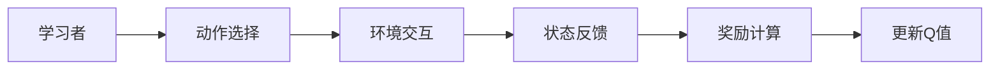
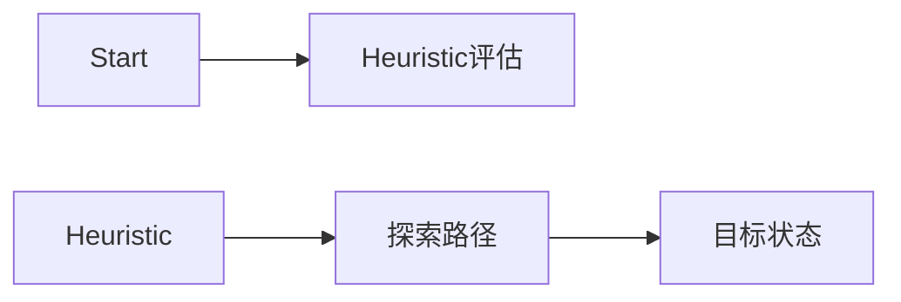
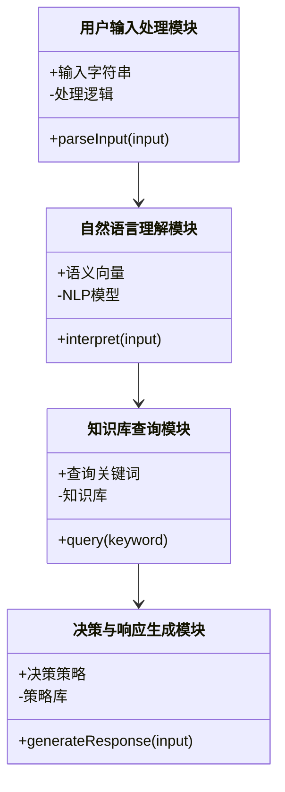

                 


# 课程学习：设计AI Agent的最优学习路径

> 关键词：AI Agent设计，学习路径优化，强化学习，系统架构，算法实现

> 摘要：本文旨在为AI Agent的设计学习者提供一条最优学习路径。通过分析AI Agent的核心概念、算法原理、系统架构及项目实战，帮助读者系统性地掌握AI Agent设计的关键技能。

---

# 第一部分: AI Agent设计与学习路径背景

# 第1章: AI Agent设计与学习路径概述

## 1.1 AI Agent的基本概念
### 1.1.1 什么是AI Agent
AI Agent（人工智能代理）是指能够感知环境、自主决策并执行任务的智能实体。它可以是一个软件程序、机器人或任何能够与环境交互的智能系统。

### 1.1.2 AI Agent的核心特点
- **自主性**：能够在没有外部干预的情况下独立运行。
- **反应性**：能够根据环境反馈实时调整行为。
- **目标导向**：通过设定目标来驱动决策和行动。
- **可扩展性**：能够适应不同的任务和环境需求。

### 1.1.3 AI Agent的设计目标
- 提供高效的解决方案。
- 实现与环境的有效交互。
- 在复杂环境中保持稳定性和可靠性。

## 1.2 AI Agent设计的基本原则
### 1.2.1 智能性原则
AI Agent必须具备感知和推理能力，能够根据环境信息做出合理决策。

### 1.2.2 可扩展性原则
系统设计应具备灵活性，能够轻松扩展以应对新的任务和环境。

### 1.2.3 可维护性原则
确保系统代码和架构的清晰性，方便后续优化和维护。

## 1.3 学习路径设计的背景与意义
### 1.3.1 当前AI Agent领域的挑战
- 技术复杂性高，涉及多个学科的交叉。
- 环境的动态性和不确定性增加了设计难度。
- 对实时性和可靠性的要求不断提高。

### 1.3.2 学习路径设计的重要性
- 帮助学习者系统性地掌握AI Agent设计的核心技能。
- 提供从基础到高级的循序渐进的学习路线。
- 通过案例分析和实战项目加深理解。

### 1.3.3 学习路径的优化目标
- 最小化学习曲线，提高学习效率。
- 突出重点知识，避免盲目学习。
- 通过实践巩固理论知识，提升实际应用能力。

## 1.4 本章小结
本章通过介绍AI Agent的基本概念、设计原则及学习路径的重要性，为后续章节的学习奠定了基础。

---

# 第二部分: AI Agent核心概念与系统架构

# 第2章: AI Agent核心概念与联系

## 2.1 核心概念原理
### 2.1.1 智能体与环境的交互
AI Agent通过感知环境信息，选择合适的行为以实现目标。

### 2.1.2 状态、动作与奖励的关系
- **状态**：环境当前的状况。
- **动作**：AI Agent采取的行为。
- **奖励**：环境对行为的反馈，用于指导下一步决策。

### 2.1.3 知识表示与推理机制
知识表示是AI Agent理解环境的基础，推理机制则是基于知识做出决策的过程。

## 2.2 核心概念对比分析
### 2.2.1 不同AI Agent类型对比
| 类型         | 描述                           |
|--------------|--------------------------------|
| 反应式Agent  | 基于当前感知做出反应             |
| 知识式Agent  | 基于内部知识库做出决策           |
| 学习式Agent  | 通过经验不断优化自身策略         |

### 2.2.2 知识表示方法的对比
| 方法         | 描述                           |
|--------------|--------------------------------|
| 逻辑表示     | 使用逻辑规则表示知识             |
| 原始表示     | 使用感知数据直接表示知识         |
| 概念图表示    | 使用概念图展示知识之间的关系     |

### 2.2.3 系统架构模式的对比
| 架构         | 描述                           |
|--------------|--------------------------------|
| 行为选择架构 | 基于当前状态选择行为             |
| 分层架构     | 将系统划分为多个层次，逐层决策     |
| 混合式架构    | 结合反应式和知识式的特点，综合决策 |

## 2.3 ER实体关系图
```mermaid
er
  actor: 学习者
  agent: AI Agent
  action: 动作
  state: 状态
  reward: 奖励
  actor --> action
  action --> state
  state --> reward
  reward --> actor
```

## 2.4 本章小结
本章通过对比分析和实体关系图，帮助读者理解AI Agent设计中的核心概念及其相互关系。

---

# 第三部分: AI Agent算法原理与数学模型

# 第3章: AI Agent算法原理

## 3.1 强化学习算法
### 3.1.1 Q-learning算法
Q-learning是一种经典的强化学习算法，通过更新Q值表来学习最优策略。



### 3.1.2 算法数学模型
Q-learning的核心公式如下：
$$ Q(s,a) = Q(s,a) + \alpha (r + \gamma \max Q(s',a') - Q(s,a)) $$

其中：
- \( Q(s,a) \)：当前状态下采取动作 \( a \) 的价值。
- \( \alpha \)：学习率。
- \( r \)：奖励。
- \( \gamma \)：折扣因子。
- \( Q(s',a') \)：下一个状态下采取动作 \( a' \) 的价值。

### 3.1.3 代码实现
以下是一个简单的Q-learning算法实现示例：
```python
import numpy as np

class QLearning:
    def __init__(self, state_space, action_space, alpha=0.1, gamma=0.9):
        self.state_space = state_space
        self.action_space = action_space
        self.Q = np.zeros((state_space, action_space))
        self.alpha = alpha
        self.gamma = gamma

    def choose_action(self, state, epsilon=0.1):
        if np.random.random() < epsilon:
            return np.random.randint(self.action_space)
        else:
            return np.argmax(self.Q[state])

    def update_Q(self, state, action, reward, next_state):
        self.Q[state][action] += self.alpha * (reward + self.gamma * np.max(self.Q[next_state]) - self.Q[state][action])
```

## 3.2 搜索算法
### 3.2.1 A*算法
A*算法是一种基于优先队列的最短路径搜索算法。



### 3.2.2 算法数学模型
A*算法的核心公式如下：
$$ f(n) = g(n) + h(n) $$
其中：
- \( f(n) \)：节点 \( n \) 的优先级。
- \( g(n) \)：从起点到节点 \( n \) 的实际成本。
- \( h(n) \)：从节点 \( n \) 到目标的估计成本。

### 3.2.3 代码实现
以下是一个A*算法的实现示例：
```python
import heapq

def a_star_search(start, goal, neighbors, cost):
    open_set = {start}
    came_from = {}
    g_score = {start: 0}
    f_score = {start: 0}

    while open_set:
        current = heapq.heappop(open_set)
        if current == goal:
            break

        for neighbor in neighbors(current):
            tentative_g_score = g_score[current] + cost(current, neighbor)
            if neighbor not in g_score or tentative_g_score < g_score[neighbor]:
                came_from[neighbor] = current
                g_score[neighbor] = tentative_g_score
                f_score[neighbor] = g_score[neighbor] + heuristic(neighbor, goal)
                heapq.heappush(open_set, neighbor)
    return came_from, g_score
```

## 3.3 本章小结
本章通过强化学习和搜索算法的原理及实现，帮助读者理解AI Agent设计中的算法基础。

---

# 第四部分: 系统分析与架构设计

# 第4章: AI Agent系统架构设计

## 4.1 问题场景分析
假设我们需要设计一个智能客服AI Agent，用于处理用户的咨询请求。

## 4.2 系统功能设计
### 4.2.1 系统功能模块
- 用户输入处理模块。
- 自然语言理解模块。
- 知识库查询模块。
- 决策与响应生成模块。

### 4.2.2 系统功能类图


## 4.3 系统架构设计
### 4.3.1 分层架构设计


### 4.3.2 系统交互流程图
```mermaid
sequenceDiagram
    用户 --> 发送请求
    接收请求 --> 解析请求
    解析请求 --> 调用知识库查询
    知识库查询 --> 返回结果
    返回结果 --> 生成响应
    生成响应 --> 返回用户
```

## 4.4 本章小结
本章通过系统功能设计和架构设计，帮助读者理解AI Agent设计的系统实现部分。

---

# 第五部分: 项目实战

# 第5章: AI Agent项目实战

## 5.1 环境安装
### 5.1.1 安装Python环境
使用Anaconda或Miniconda安装Python 3.8及以上版本。

### 5.1.2 安装依赖库
安装必要的依赖库：
```bash
pip install numpy scikit-learn matplotlib
```

## 5.2 系统核心实现
### 5.2.1 强化学习算法实现
实现一个简单的Q-learning算法：
```python
class QLearningAgent:
    def __init__(self, state_space, action_space):
        self.state_space = state_space
        self.action_space = action_space
        self.Q = np.zeros((state_space, action_space))

    def choose_action(self, state, epsilon=0.1):
        if np.random.random() < epsilon:
            return np.random.randint(self.action_space)
        else:
            return np.argmax(self.Q[state])

    def update_Q(self, state, action, reward, next_state):
        self.Q[state][action] += 0.1 * (reward + 0.9 * np.max(self.Q[next_state]) - self.Q[state][action])
```

### 5.2.2 搜索算法实现
实现A*算法：
```python
def a_star_search(grid, start, goal):
    open_set = {start}
    came_from = {}
    g_score = {start: 0}
    f_score = {start: 0}

    while open_set:
        current = heapq.heappop(open_set)
        if current == goal:
            break

        for neighbor in grid[current]:
            tentative_g_score = g_score[current] + grid[current][neighbor]
            if neighbor not in g_score or tentative_g_score < g_score[neighbor]:
                came_from[neighbor] = current
                g_score[neighbor] = tentative_g_score
                f_score[neighbor] = g_score[neighbor] + heuristic(neighbor, goal)
                heapq.heappush(open_set, neighbor)
    return came_from, g_score
```

## 5.3 项目案例分析
### 5.3.1 案例背景
设计一个AI Agent用于自动下单的股票交易系统。

### 5.3.2 项目实现
实现股票交易AI Agent的买入和卖出策略。

### 5.3.3 项目总结
通过该项目，读者可以掌握AI Agent设计中的算法实现和系统设计。

## 5.4 本章小结
本章通过实际项目案例，帮助读者将理论知识应用到实际中。

---

# 第六部分: 最佳实践

# 第6章: AI Agent设计的最佳实践

## 6.1 小结
AI Agent设计需要从基础理论到实际应用的系统性学习。

## 6.2 注意事项
- 理论与实践相结合。
- 注重算法的可扩展性和可维护性。
- 重视系统的实时性和可靠性。

## 6.3 拓展阅读
推荐以下书籍和资源：
- 《强化学习（第2版）》
- 《人工智能：一种现代方法》
- OpenAI Gym官方文档

## 6.4 本章小结
本章总结了AI Agent设计中的关键点，并提供了进一步学习的建议。

---

# 作者：AI天才研究院/AI Genius Institute & 禅与计算机程序设计艺术 /Zen And The Art of Computer Programming

---

通过以上内容，读者可以系统性地掌握AI Agent设计的核心知识，从基础理论到实际应用，逐步提升自己的技术水平。

