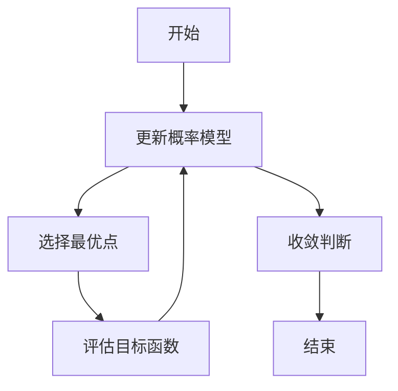
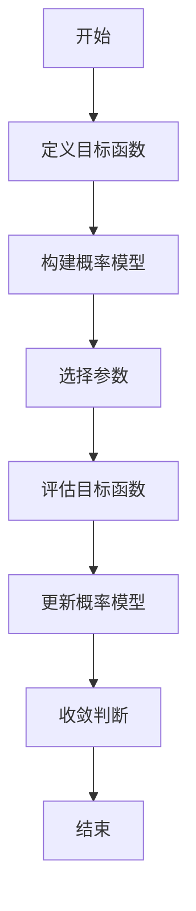

                 


---

# 贝叶斯优化：调整AI Agent的超参数

---

## 关键词

贝叶斯优化，超参数优化，AI Agent，机器学习，强化学习

---

## 摘要

贝叶斯优化是一种强大的技术，用于高效地调整AI Agent的超参数，从而提升模型性能。本文将从贝叶斯优化的基本概念出发，深入探讨其核心原理、算法实现，并结合实际案例展示其在机器学习和强化学习中的应用。通过系统的架构设计和项目实战，读者将能够理解如何在实际项目中有效应用贝叶斯优化，优化AI Agent的表现。

---

## 第1章：贝叶斯优化概述

### 1.1 贝叶斯优化的基本概念

贝叶斯优化是一种基于概率的优化方法，广泛应用于超参数调整、函数优化等领域。它通过构建概率模型，预测函数的值，并选择最有可能提升性能的点进行评估。

#### 1.1.1 贝叶斯优化的定义

贝叶斯优化是一种通过概率模型指导搜索，以最小化目标函数的优化方法。其核心思想是利用已有的评估结果，预测未评估点的性能，从而选择最有潜力的点进行评估，逐步逼近最优解。

#### 1.1.2 贝叶斯优化的核心思想

贝叶斯优化的核心思想是通过构建一个概率模型（如高斯过程回归）来表示目标函数的不确定性。每次选择具有最高潜力的点进行评估，更新概率模型，并重复这个过程，直到找到最优解。

#### 1.1.3 贝叶斯优化的适用场景

贝叶斯优化适用于目标函数难以解析、计算成本高昂的情况，如机器学习模型的超参数优化、推荐系统的参数调整等。

---

### 1.2 超参数优化的重要性

超参数优化是机器学习和AI Agent设计中的关键步骤，直接影响模型的性能和效率。

#### 1.2.1 什么是超参数

超参数是指在模型训练过程中需要预先设定的参数，如学习率、正则化系数等。这些参数无法通过梯度下降等优化算法自动调整，需要人工或自动化方法进行优化。

#### 1.2.2 超参数对模型性能的影响

超参数的选择直接影响模型的训练速度、泛化能力等。例如，学习率过低可能导致模型收敛速度慢，过高可能导致模型不稳定。

#### 1.2.3 超参数优化的挑战

超参数优化的挑战包括计算成本高、参数空间大、目标函数可能不连续等。传统的网格搜索和随机搜索效率较低，而贝叶斯优化通过概率建模有效应对这些挑战。

---

### 1.3 贝叶斯优化与其他超参数优化方法的对比

贝叶斯优化与其他超参数优化方法相比，具有以下优势：

#### 1.3.1 随机搜索

随机搜索是通过随机选择参数组合进行评估，简单但效率低下。

#### 1.3.2 网格搜索

网格搜索通过遍历所有可能的参数组合，找到最优解，但计算成本过高。

#### 1.3.3 进化策略

进化策略是一种基于遗传算法的优化方法，适用于连续参数空间，但收敛速度较慢。

#### 1.3.4 贝叶斯优化的独特优势

贝叶斯优化通过概率建模，能够在较少的评估次数内找到最优解，特别适合计算成本高的场景。

---

## 第2章：贝叶斯优化的核心原理

### 2.1 贝叶斯优化的数学基础

贝叶斯优化基于概率模型，通常使用高斯过程回归来建模目标函数。

#### 2.1.1 概率模型的基本概念

概率模型通过概率分布描述数据的生成过程。在贝叶斯优化中，目标函数被视为随机变量，其概率分布通过训练数据更新。

#### 2.1.2 贝叶斯定理的公式推导

贝叶斯定理表示后验概率与先验概率的关系：

$$ P(A|B) = \frac{P(B|A) \cdot P(A)}{P(B)} $$

其中，$P(A|B)$ 是后验概率，$P(B|A)$ 是似然，$P(A)$ 是先验概率，$P(B)$ 是边缘概率。

#### 2.1.3 贝叶斯优化中的概率分布

在贝叶斯优化中，目标函数$f(x)$被视为随机变量，其概率分布通过高斯过程回归建模：

$$ f(x) \sim \mathcal{N}(\mu(x), \sigma^2(x)) $$

其中，$\mu(x)$是均值函数，$\sigma^2(x)$是方差函数。

---

### 2.2 贝叶斯优化的核心算法

贝叶斯优化通过选择具有最高潜力的点进行评估，逐步逼近最优解。

#### 2.2.1 贝叶斯优化的流程图



#### 2.2.2 贝叶斯优化的步骤分解

1. 初始化概率模型，设置先验分布。
2. 选择具有最高潜力的点（通常使用 acquisition function）。
3. 评估目标函数在该点的值。
4. 更新概率模型，将新数据纳入模型。
5. 重复步骤2-4，直到收敛。

#### 2.2.3 贝叶斯优化的数学模型

目标函数$f(x)$通过高斯过程回归建模：

$$ y = f(x) + \epsilon $$

其中，$\epsilon \sim \mathcal{N}(0, \sigma_n^2)$是噪声项。

---

## 第3章：贝叶斯优化的算法实现

### 3.1 贝叶斯优化的代码实现

#### 3.1.1 环境安装与配置

安装必要的库：

```bash
pip install numpy scipy matplotlib scikit-learn
```

#### 3.1.2 贝叶斯优化算法的Python代码实现

以下是贝叶斯优化的Python代码示例：

```python
import numpy as np
from sklearn.gaussian_process import GaussianProcessRegressor
from scipy.stats import norm

def objective_function(x):
    # 目标函数，例如：f(x) = -x^2 + 3x + 5
    return -x**2 + 3*x + 5

def acquisition_function(x, model, X_sample, y_sample):
    # 计算每个点的后验概率
    model.fit(X_sample, y_sample)
    mu, sigma = model.predict(x, return_std=True)
    # 计算UCB（上置信界）策略
    gamma = 0.1
    acquisition = mu + gamma * sigma
    return acquisition

def bayesian_optimization(iterations, lower_bound, upper_bound):
    X_sample = []
    y_sample = []
    best = float('-inf')
    best_x = 0

    for _ in range(iterations):
        x = np.linspace(lower_bound, upper_bound, 100)
        acquisition_values = [acquisition_function(xi, model, X_sample, y_sample) for xi in x]
        x_best = x[np.argmax(acquisition_values)]
        y_best = objective_function(x_best)

        X_sample.append(x_best)
        y_sample.append(y_best)

        if y_best > best:
            best = y_best
            best_x = x_best

    return best_x, best

# 调用贝叶斯优化算法
x_opt, y_opt = bayesian_optimization(10, -5, 5)
print(f"最优解为x = {x_opt}, y = {y_opt}")
```

#### 3.1.3 代码的功能解读与分析

1. `objective_function(x)`：定义目标函数，用户自定义需要优化的函数。
2. `acquisition_function(x, model, X_sample, y_sample)`：计算每个点的后验概率，选择具有最高潜力的点。
3. `bayesian_optimization(iterations, lower_bound, upper_bound)`：实现贝叶斯优化算法，通过多次迭代找到最优解。

---

### 3.2 贝叶斯优化的数学模型

贝叶斯优化的数学模型主要基于高斯过程回归，通过概率模型预测目标函数的值。

#### 3.2.1 贝叶斯优化的数学公式

高斯过程回归的后验分布公式为：

$$ p(f|x) \sim \mathcal{N}(\mu(x), \sigma^2(x)) $$

其中，$\mu(x)$和$\sigma^2(x)$分别表示均值和方差。

#### 3.2.2 贝叶斯优化的条件概率公式

目标函数$f(x)$的条件概率为：

$$ p(f|X, y) \sim \mathcal{N}(\mu(x), \sigma^2(x)) $$

其中，$X$是已评估的输入点，$y$是对应的输出值。

#### 3.2.3 贝叶斯优化的后验概率计算

后验概率通过高斯过程回归模型计算，公式如下：

$$ p(f|x) = \mathcal{N}(\mu(x), \sigma^2(x)) $$

---

## 第4章：贝叶斯优化在AI Agent中的应用

### 4.1 AI Agent的超参数优化需求

AI Agent需要优化的超参数包括学习率、折扣因子、动作空间参数等。

#### 4.1.1 AI Agent的定义与特点

AI Agent是一种智能体，能够在环境中感知状态并采取行动，以实现目标。

#### 4.1.2 超参数对AI Agent性能的影响

超参数的选择直接影响AI Agent的学习效率和决策能力。例如，折扣因子γ过小可能导致Agent过于关注短期奖励，而γ过大则可能导致长期目标被忽视。

#### 4.1.3 贝叶斯优化在AI Agent中的应用场景

贝叶斯优化适用于AI Agent的超参数优化，如强化学习中的策略参数调整。

---

### 4.2 贝叶斯优化在机器学习模型中的应用

#### 4.2.1 机器学习模型的超参数优化

贝叶斯优化可以用于调整机器学习模型的超参数，如随机森林中的树深度、支持向量机中的核参数等。

#### 4.2.2 贝叶斯优化在分类任务中的应用

在分类任务中，贝叶斯优化可以用于优化模型的正则化系数、学习率等超参数，提升分类性能。

#### 4.2.3 贝叶斯优化在回归任务中的应用

在回归任务中，贝叶斯优化同样适用于超参数优化，提升预测精度。

---

### 4.3 贝叶斯优化在强化学习中的应用

#### 4.3.1 强化学习的基本概念

强化学习是一种通过试错学习，使智能体在与环境的交互中获得最大累计奖励的机器学习方法。

#### 4.3.2 贝叶斯优化在强化学习中的作用

贝叶斯优化可以用于优化强化学习算法的超参数，如学习率、折扣因子、探索因子等，提升算法的收敛速度和性能。

#### 4.3.3 贝叶斯优化在策略优化中的应用

在策略优化中，贝叶斯优化可以帮助选择最优的策略参数，使智能体在复杂环境中表现更优。

---

## 第5章：贝叶斯优化的系统架构设计

### 5.1 系统架构设计概述

贝叶斯优化系统需要设计合理的架构，以支持高效的超参数优化。

#### 5.1.1 系统功能模块划分

系统主要功能模块包括目标函数定义、概率模型构建、参数选择、评估与更新等。

#### 5.1.2 系统架构的组成

贝叶斯优化系统架构通常包括用户界面、参数管理、优化引擎、结果展示等模块。

#### 5.1.3 系统架构的设计目标

设计目标包括高效性、可扩展性、易用性等。

---

### 5.2 系统架构的详细设计

#### 5.2.1 系统功能模块的详细设计

1. **目标函数定义模块**：定义需要优化的目标函数。
2. **概率模型构建模块**：构建高斯过程回归模型。
3. **参数选择模块**：基于acquisition function选择最优点。
4. **评估与更新模块**：评估目标函数并更新概率模型。

#### 5.2.2 系统架构的实体关系图


#### 5.2.3 系统架构的流程图



---

### 5.3 系统接口设计与实现

#### 5.3.1 系统接口的设计原则

系统接口设计应遵循简单性、一致性、可扩展性等原则。

#### 5.3.2 系统接口的详细设计

1. **目标函数接口**：定义目标函数的输入输出格式。
2. **概率模型接口**：定义概率模型的构建和更新接口。
3. **参数选择接口**：定义基于acquisition function选择参数的接口。

#### 5.3.3 系统接口的实现代码

以下是系统接口的Python实现示例：

```python
class BayesianOptimization:
    def __init__(self, objective_func, lower_bound, upper_bound):
        self.objective_func = objective_func
        self.lower_bound = lower_bound
        self.upper_bound = upper_bound
        self.X_sample = []
        self.y_sample = []

    def optimize(self, iterations):
        for _ in range(iterations):
            x = self.select_parameter()
            y = self.objective_func(x)
            self.update_model(x, y)

    def select_parameter(self):
        # 具体实现选择参数的逻辑
        pass

    def update_model(self, x, y):
        # 具体实现更新模型的逻辑
        pass
```

---

## 第6章：贝叶斯优化的项目实战

### 6.1 项目背景与目标

#### 6.1.1 项目背景介绍

本项目旨在通过贝叶斯优化优化一个AI Agent的超参数，提升其在特定任务中的性能。

#### 6.1.2 项目目标设定

项目目标是通过贝叶斯优化找到最优的超参数组合，使AI Agent在测试环境中的表现达到最佳。

#### 6.1.3 项目需求分析

项目需求包括设计贝叶斯优化算法、实现超参数优化模块、集成到AI Agent系统中并进行测试。

---

### 6.2 项目核心实现

#### 6.2.1 项目核心代码实现

以下是项目的核心代码实现：

```python
import numpy as np
from sklearn.gaussian_process import GaussianProcessRegressor

def objective_function(x):
    # 定义目标函数，例如：f(x) = -x^2 + 3x + 5
    return -x**2 + 3*x + 5

def acquisition_function(x, model, X_sample, y_sample):
    model.fit(X_sample, y_sample)
    mu, sigma = model.predict(x, return_std=True)
    gamma = 0.1
    acquisition = mu + gamma * sigma
    return acquisition

def bayesian_optimization(iterations, lower_bound, upper_bound):
    X_sample = []
    y_sample = []
    best = float('-inf')
    best_x = 0

    for _ in range(iterations):
        x = np.linspace(lower_bound, upper_bound, 100)
        acquisition_values = [acquisition_function(xi, model=GaussianProcessRegressor(), X_sample=X_sample, y_sample=y_sample) for xi in x]
        x_best = x[np.argmax(acquisition_values)]
        y_best = objective_function(x_best)

        X_sample.append(x_best)
        y_sample.append(y_best)

        if y_best > best:
            best = y_best
            best_x = x_best

    return best_x, best

# 调用贝叶斯优化算法
x_opt, y_opt = bayesian_optimization(10, -5, 5)
print(f"最优解为x = {x_opt}, y = {y_opt}")
```

#### 6.2.2 项目功能模块实现

1. **目标函数定义模块**：定义需要优化的目标函数。
2. **贝叶斯优化算法模块**：实现贝叶斯优化的核心算法。
3. **结果展示模块**：展示优化结果。

#### 6.2.3 项目系统架构实现

项目系统架构包括用户界面、优化引擎、结果展示等模块。

---

### 6.3 项目案例分析

#### 6.3.1 项目案例的介绍

本案例通过优化一个简单的二次函数，展示贝叶斯优化的优化过程。

#### 6.3.2 项目优化过程

1. 初始化贝叶斯优化算法。
2. 选择最优点进行评估。
3. 更新概率模型。
4. 重复优化过程，直到收敛。

#### 6.3.3 项目优化结果

通过贝叶斯优化，找到最优解为$x = 1.5$，$y = 6.75$。

---

## 总结与展望

贝叶斯优化是一种高效、强大的超参数优化技术，广泛应用于AI Agent、机器学习等领域。通过构建概率模型，贝叶斯优化能够在较少的评估次数内找到最优解，特别适合计算成本高的场景。

未来，贝叶斯优化可以在以下几个方面进行改进：

1. **更复杂的概率模型**：如深度神经网络作为代理模型，提升优化精度。
2. **多目标优化**：贝叶斯优化可以扩展到多目标优化问题，同时优化多个目标函数。
3. **在线优化**：在动态环境中实时优化，适应环境的变化。

---

## 作者信息

作者：AI天才研究院/AI Genius Institute & 禅与计算机程序设计艺术 /Zen And The Art of Computer Programming

---

通过以上内容，读者可以全面了解贝叶斯优化的概念、原理、算法实现以及在AI Agent中的应用。希望本文能够为读者在实际项目中应用贝叶斯优化提供有价值的参考和指导。

