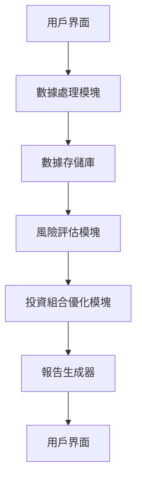

                 


# 跨境投資策略：把握全球市場機遇的方法

---

## **關鍵詞**  
跨境投資策略、全球市場、風險管理、投資組合優化、算法模型、金融分析、市場准入

---

## **摘 要**  
本文將探討跨境投資策略的核心概念、風險評估模型、數學公式、系統架構以及實戰案例，幫助投資者在全球市場中把握機遇、分散風險並實現長期收益。通過系統化的方法，我們將揭示跨境投資的深度邏輯，並提供實用的策略和工具。

---

## **第一部分：跨境投資策略的背景與核心概念**

### **第1章：跨境投資策略的背景與意義**

#### **1.1 全球化背景下跨境投資的興起**
- **1.1.1 全球化與資本市場的融合**  
  全球化推動了資本市場的跨國運作，讓投資者能夠突破地域限制，進入全球市場。  
- **1.1.2 現代金融市場的跨國特性**  
  現代金融市場已經突破了國家邊界的限制，資產價格聯動效應顯著。  
- **1.1.3 經濟一體化與跨境投資的必然性**  
  經濟一體化趨勢使得跨境投資成為必然選擇，幫助投資者捕捉全球機遇。

#### **1.2 跨境投資的核心概念與定義**  
- **1.2.1 跨境投資的基本定義**  
  跨境投資是指將資金投向不同國家或地區的金融市場，以實現資產增值。  
- **1.2.2 跨境投資的主要類型**  
  - 股票投資：跨國股票市場投資。  
  - 債券投資：跨國債市投資。  
  - 外匯投資：跨國貨幣市場投資。  
- **1.2.3 跨境投資的邊界與外延**  
  跨境投資的邊界包括市場准入、法律法規、稅收差異等，外延則涉及金融衍生品、不動產等多樣化的資產類別。

#### **1.3 跨境投資的主導驅動力**  
- **1.3.1 經濟增長動力**  
  不同國家的經濟增長速度差異是推動跨境投資的重要動力。  
- **1.3.2 利率差異**  
  利率差異是跨市場套利的重要機會來源。  
- **1.3.3 市場效率與套利機會**  
  市場效率差異為投資者提供了套利機會。

### **第2章：跨境投資的核心要素與結構**

#### **2.1 跨境投資的實體要素**  
- **2.1.1 資金流動**  
  資金從高利率地區流向低利率地區，或從低增長地區流向高增長地區。  
- **2.1.2 資產配置**  
  投資者根據風險偏好和收益目標進行跨市場資產配置。  
- **2.1.3 市場准入**  
  跨境投資需要考慮市場准入政策和相關法律法規。

#### **2.2 跨境投資的主體結構**  
- **2.2.1 投資者類型**  
  - 零散投資者：個人投資者。  
  - 基金管理機構：institutional investors。  
  - 跨國公司：corporate investors。  
- **2.2.2 資產管理機構**  
  負責管理和運營跨市場投資的金融機構。  
- **2.2.3 跨國金融機構**  
  提供跨市場交易和結算服務的銀行和其他金融機構。

#### **2.3 跨境投資的客體結構**  
- **2.3.1 股票與債券**  
  投資者可以在不同市場之間配置股票和債券。  
- **2.3.2 外匯與衍生品**  
  外匯交易和金融衍生品是跨境投資的重要工具。  
- **2.3.3 不動產與實體資產**  
  不動產投資成為跨市場配置的重要形式。

### **第3章：跨境投資的戰略與機會**

#### **3.1 跨境投資的主要戰略**  
- **3.1.1 總體戰略**  
  根據全球市場的整體趨勢進行長期配置。  
- **3.1.2 獨特機會戰略**  
  擴捉特定市場的短期機會。  
- **3.1.3 風險分散戰略**  
  通過跨市場配置降低風險。

#### **3.2 現代金融市場的機會分析**  
- **3.2.1 經济周期與市場機會**  
  不同經濟周期下的市場機會。  
- **3.2.2 利率環境與貨幣政策**  
  利率差異和貨幣政策變化對市場的影響。  
- **3.2.3 地緣政治風險與機會**  
  地緣政治風險可能帶來短期機會。

#### **3.3 跨境投資的核心機會來源**  
- **3.3.1 經濟增長差異**  
  不同國家的經濟增長速度差異。  
- **3.3.2 市場效率差異**  
  不同市場的效率差異提供了套利機會。  
- **3.3.3 利率與匯率差異**  
  利率差異和匯率變動帶來的收益機會。

---

## **第二部分：跨境投資策略的算法與模型**

### **第4章：跨境投資的風險評估模型**

#### **4.1 跨境投資風險的定義與分類**  
- **4.1.1 系統性風險**  
  影響整體市場的風險，如匯率波動、宏觀經濟波動等。  
- **4.1.2 非系統性風險**  
  與特定市場或資產相關的風險。  
- **4.1.3 設計風險與操作風險**  
  投資策略和執行中的風險。

#### **4.2 現代投資組合理論在跨境投資中的應用**  
- **4.2.1 現代投資組合理論簡述**  
  現代投資組合理論（MPT）由哈里·馬科威茨提出，強調風險管理和分散化。  
- **4.2.2 馬科威茨的有效前沿模型**  
  通過優化投資組合，實現收益與風險的最佳平衡。  
- **4.2.3 跨境投資的風險調整回報模型**  
  考慮不同市場之間的風險 correlation 和 volatlity。

#### **4.3 跨境投資風險評估的算法實現**  
- **4.3.1 算法原理**  
  使用均值-方差優化模型，計算不同市場之間的風險和收益，並選擇最優投資組合。  
- **4.3.2 算法步驟**  
  1. 收集各市場的歷史回報數據。  
  2. 計算各市場之間的協方差矩陣。  
  3. 建立優化模型，尋找風險調整後的最大回報。  
  4. 確定最優投資比例。  
- **4.3.3 算法實現的Python源代碼**  

```python
import numpy as np
import pandas as pd

# 示例數據：假設我們有3個市場的回報數據
markets = ['Market A', 'Market B', 'Market C']
returns = pd.DataFrame({
    'Market A': [0.05, 0.03, 0.04],
    'Market B': [0.06, 0.02, 0.03],
    'Market C': [0.04, 0.05, 0.02]
})

# 計算平均回報
mean_returns = returns.mean()
print("平均回報：", mean_returns)

# 計算方差和協方差矩陣
cov_matrix = returns.cov()
print("協方差矩陣：\n", cov_matrix)

# 建立均值-方差優化模型
n = len(markets)
weights = np.array([1.0/n]*n)  # 均等分配

# 简单优化（示例，实际中需要使用更复杂的优化算法）
# 這裡僅為展示，實際應用中需要使用更強大的優化工具
import scipy.optimize as opt

def objective(weights, mean_returns, cov_matrix):
    return (weights.T @ cov_matrix @ weights).item()

# 约束條件
constraints = [
    ('sum_to_one', {'type': 'eq', 'fun': lambda w: np.sum(w) - 1})
]

# 最優化
result = opt.minimize(objective, weights, args=(mean_returns, cov_matrix), 
                       method='SLSQP', constraints=constraints)

print("最優權重：", result.x)
```

#### **4.4 跨境投資風險評估模型的實現**

---

### **第5章：跨境投資的數學模型與公式**

#### **5.1 跨境投資的基本數學模型**

- **平均回報模型**  
  $$ E[r_i] = \frac{1}{T}\sum_{t=1}^{T} r_{i,t} $$  
  其中，$E[r_i]$ 是市場 $i$ 的期望回報，$r_{i,t}$ 是市場 $i$ 在第 $t$ 時期的回報。

- **協方差模型**  
  $$ \text{Cov}(r_i, r_j) = \frac{1}{T-1}\sum_{t=1}^{T}(r_{i,t} - \bar{r}_i)(r_{j,t} - \bar{r}_j) $$  
  其中，$\bar{r}_i$ 是市場 $i$ 的平均回報。

---

## **第三部分：跨境投資策略的系統架構與實戰**

### **第6章：跨境投資分析系統**

#### **6.1 系統功能設計**

- **6.1.1 系統目標**  
  提供跨市場數據分析、風險評估和投資建議。  
- **6.1.2 功能模塊**  
  - 数据收集與清洗：收集全球主要市場的數據。  
  - 额外功能：風險評估、投資組合優化、報告生成。  

#### **6.2 系統架構設計**



---

### **第7章：項目實戰**

#### **7.1 環境安裝與數據收集**

- **7.1.1 環境安裝**  
  安裝必要的庫，如 `pandas`, `numpy`, `scipy.optimize`。  
- **7.1.2 数据收集**  
  收集全球主要市場的回報數據。

---

## **第四部分：小結與展望**

### **第8章：小結與最佳實踐**

- **8.1 小結**  
  跨境投資策略的制定需要考慮市場、風險、法律等多個方面。  
- **8.2 最佳實踐 tips**  
  - 定期評估投資組合。  
  - 關注宏觀經濟和政治風險。  
  - 適當分散風險。

---

**作者：AI天才研究院/AI Genius Institute & 禅與計算機程序設計藝術 /Zen And The Art of Computer Programming**

