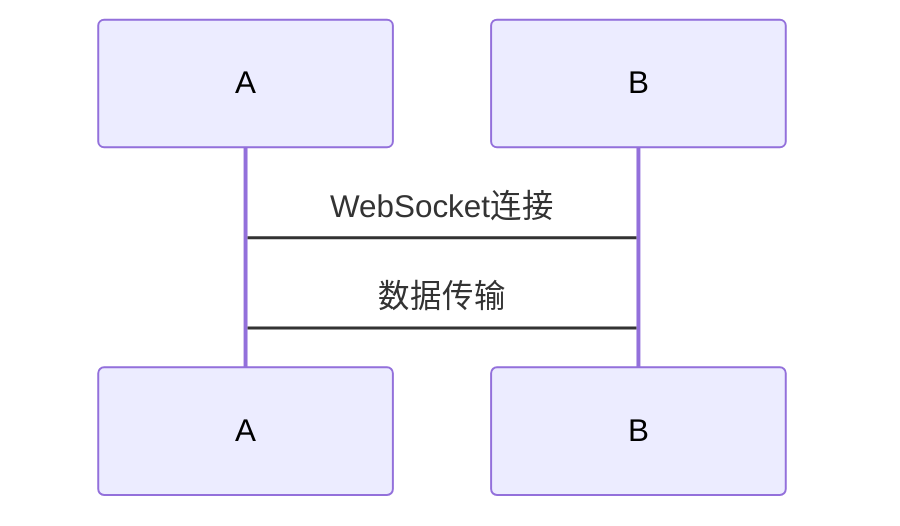
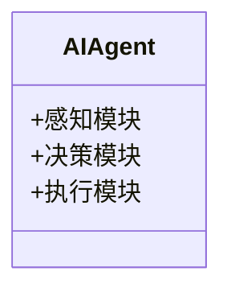
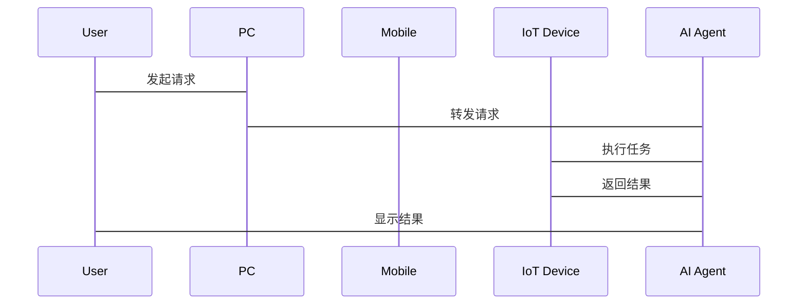

                 


# 跨平台AI Agent：PC、移动端和IoT设备的统一体验

---

## 关键词  
跨平台AI Agent, 多设备协同, 人工智能, 物联网, 统一用户体验

---

## 摘要  
跨平台AI Agent的目标是为PC、移动端和IoT设备提供一致的用户体验。本文将从AI Agent的核心概念出发，逐步分析跨平台通信机制、设备协同策略、交互模型设计等关键问题，并通过具体案例展示如何实现跨平台AI Agent的统一体验。

---

## 第一部分: 跨平台AI Agent的背景与概念

### 第1章: 跨平台AI Agent的背景与概念

#### 1.1 跨平台AI Agent的背景  
AI Agent是一种能够感知环境、执行任务的智能实体，广泛应用于智能家居、医疗、教育等领域。随着多设备协同需求的增加，跨平台AI Agent的市场需求日益增长。  

#### 1.2 跨平台AI Agent的定义  
跨平台AI Agent是指能够在不同平台（如PC、移动端和IoT设备）之间无缝协作，提供统一用户体验的智能实体。  

#### 1.3 跨平台AI Agent的核心目标  
- 提供一致的用户体验。  
- 支持多设备协同工作。  
- 实现设备间数据的无缝流转。  

#### 1.4 跨平台AI Agent的现状与挑战  
- 技术挑战：不同平台间的通信协议不统一，数据格式不兼容。  
- 用户体验问题：设备间协同效率低，用户操作复杂。  

#### 1.5 跨平台AI Agent的核心价值  
- 提高设备协同效率。  
- 提升用户体验。  
- 降低开发成本。  

---

## 第二部分: 跨平台AI Agent的核心概念与联系

### 第2章: 跨平台AI Agent的核心概念

#### 2.1 AI Agent的组成与功能  
- **组成**：感知模块、决策模块、执行模块。  
- **功能**：数据采集、分析、决策、执行。  

#### 2.2 跨平台AI Agent的通信机制  
- **通信协议**：WebSocket、HTTP、MQTT。  
- **实现方式**：通过API或消息队列实现设备间通信。  

#### 2.3 跨平台AI Agent的设备协同策略  
- **设备协同原则**：设备间数据共享、任务分配。  
- **实现方式**：基于设备角色的协同策略。  

#### 2.4 跨平台AI Agent的交互模型  
- **交互模型**：基于用户意图的交互流程。  
- **实现方式**：通过自然语言处理技术实现人机交互。  

---

## 第三部分: 跨平台AI Agent的算法原理

### 第3章: 跨平台AI Agent的通信机制  

#### 3.1 跨平台通信协议的选择  
- **WebSocket**：支持实时双向通信。  
- **HTTP**：适用于短连接请求。  

#### 3.2 跨平台通信的实现方式  



#### 3.3 跨平台通信的性能优化  
- 使用压缩算法减少数据传输量。  

---

## 第四部分: 跨平台AI Agent的系统架构设计

### 第4章: 系统架构设计  

#### 4.1 系统功能设计  
- **领域模型**：  


- **系统架构**：  


#### 4.2 系统接口设计  
- **API接口**：提供统一的API接口，支持不同平台调用。  

#### 4.3 系统交互流程  



---

## 第五部分: 跨平台AI Agent的项目实战

### 第5章: 项目实战  

#### 5.1 项目背景  
- 智能家居控制：通过AI Agent实现PC、手机和智能家电的协同控制。  

#### 5.2 项目环境搭建  
- **开发工具**：Python、Django、WebSocket库。  

#### 5.3 项目核心实现  

```python
import websockets
import asyncio

async def agent_handler(websocket, path):
    async for message in websocket:
        print(f"收到消息：{message}")
        # 处理消息并返回响应
        response = f"收到消息：{message}"
        await websocket.send(response)

start_server = websockets.serve(agent_handler, "localhost", 8000)
asyncio.get_event_loop().run_until_complete(start_server)
asyncio.get_event_loop().run_forever()
```

#### 5.4 项目测试与优化  
- **测试**：验证PC、手机和IoT设备的协同效果。  
- **优化**：优化通信延迟和数据传输效率。  

---

## 第六部分: 跨平台AI Agent的高级主题与未来趋势

### 第6章: 高级主题  

#### 6.1 多模态交互  
- **多模态交互**：支持语音、手势等多种交互方式。  

#### 6.2 边缘计算与AI Agent  
- **边缘计算**：AI Agent在边缘设备上的部署与优化。  

#### 6.3 AI Agent的伦理与安全  
- **AI伦理**：AI Agent的行为规范与伦理问题。  
- **安全问题**：跨平台AI Agent的安全防护。  

### 第7章: 未来趋势  

#### 7.1 跨平台AI Agent的发展方向  
- **智能化**：AI Agent的自主决策能力提升。  
- **分布式计算**：AI Agent的分布式部署与协同。  

---

## 总结  

跨平台AI Agent的实现需要综合考虑通信机制、设备协同策略、交互模型设计等多方面因素。通过统一的用户体验设计和高效的系统架构优化，可以实现PC、移动端和IoT设备的无缝协同，为用户带来更智能化的服务体验。

---

## 注意事项  

- 在实现跨平台AI Agent时，需注意不同平台间的通信协议兼容性问题。  
- 数据安全和隐私保护是跨平台AI Agent设计中的重要环节。  

---

## 作者  

作者：AI天才研究院/AI Genius Institute & 禅与计算机程序设计艺术 /Zen And The Art of Computer Programming

