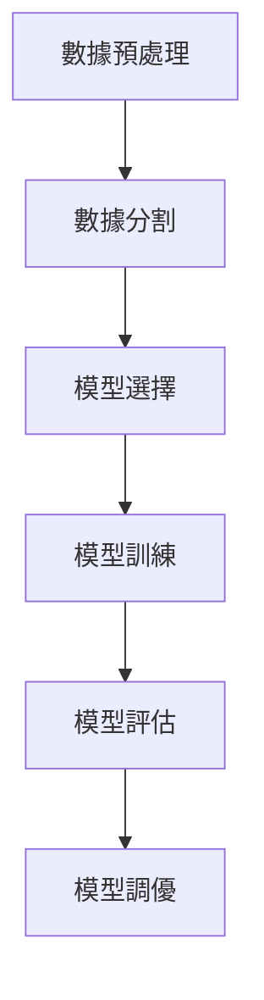
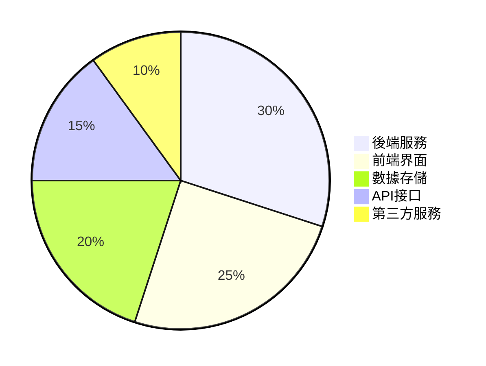

                 


# 跨平台投資理財智能助手的開發技巧

> **关键词**: 跨平台開發, AI算法, 投资理财,_flutter, React Native, 系統架構, 技術實現

> **摘要**: 本文將探討如何開發跨平台的投資理財智能助手，涵蓋從概念到實現的整個過程，包括跨平台開發技術、AI算法原理、數學模型設計、系統架構方案以及實際項目實戰。文章旨在幫助開發者掌握關鍵技術，並提供實用的開發技巧和經驗分享。

---

## 第一部分: 背景介紹

### 第1章: 問題背景與描述

#### 1.1 啥叫跨平台投資理財智能助手？
跨平台投資理財智能助手是一種能夠在多個平台上（如移動端、Web、桌面端）運行的軟件，旨在為用戶提供個性化的投資建議、財務分析和理財規劃。用戶可以通過多個渠道使用同一款應用，實現信息同步和操作便捷。

#### 1.2 投資理財行業的挑戰
- **信息碎片化**：投資者需要從多個來源獲取信息，數據分散且不易整合。
- **需求多樣化**：用戶可能需要從股票、基金到債券等多種理財產品的分析。
- **技術複雜性**：跨平台開發需要考慮不同操作系統的差異和性能優化。

#### 1.3 現有解決方案的不足
- **功能局限性**：許多投資理財應用只針對某個平台或單一類型的投資工具。
- **用戶體驗差**：信息同步不夠流暢，功能使用不便。
- **技術瓶頸**：不同平台的架構差異導致開發成本高、維護困難。

#### 1.4 問題解決方案
跨平台投資理財智能助手通過統一的後端和前端架構，實現多平台的數據同步和功能共享，提升用戶體驗並降低開發成本。

#### 1.5 核心要素與概念結構
- **數據層**：整合來自不同金融數據來源的信息。
- **算法層**：基於深度學習的金融模型進行預測和推薦。
- **用戶界面層**：提供多平台支持的統一界面。
- **後端服務**：實現數據存儲、計算和接口調用。

---

## 第二部分: 核心概念與技術聯繫

### 第2章: 跨平台開發的基礎

#### 2.1 React Native 與 Flutter 框架的對比

| **特性**          | **React Native**                | **Flutter**                     |
|--------------------|---------------------------------|---------------------------------|
| **渲染方式**      | 基於原生组件，(JS -> Native)     | 基於widget，USTOM-renderer     |
| **性能**          | 原生性能，JS性能受限            | 高性能，Render.ComposePipeline  |
| **生態系統**      | 基於React，社區活躍             | 基於Dart，Google強力支持        |
| **適合場景**      | 快速迭代、小型項目              | 大型、複雜項目標                 |

#### 2.2 跨平台開發的優缺點
- **優點**：
  - 編寫一次，随处運行。
  - 降低開發成本和維護成本。
- **缺點**：
  - 部分功能受限，需額外開發。
  - 原生體驗不如_NATIVE	app。

---

## 第三部分: 算法原理與實現

### 第3章: 自然語言處理模型的訓練過程



#### 3.1 自然語言處理模型
- **模型選擇**：如BERT、GPT等。
- **數據預處理**：清洗、分詞、向量化。
- **模型訓練**：基於語料庫進行微調。
- **模型評估**：accuracy, precision, recall。

---

## 第四部分: 系統分析與架構設計

### 第4章: 系統架構設計



#### 4.1 微服務架構
- **後端服務**：獨立的RESTful API。
- **前端界面**：React Native和Flutter混合架構。
- **數據存儲**：基於云數據庫或本地存儲。

---

## 第五部分: 項目實戰

### 第5章: 股票推薦系統實現

#### 5.1 環境安裝
```bash
npm install react-native
flutter doctor
```

#### 5.2 核心代碼實現
```python
def predict_price(data):
    # 假設data為數據集
    model = load_model('stock_model.h5')
    prediction = model.predict(data)
    return prediction
```

#### 5.3 案例分析
- **數據來源**：yahoo finance API。
- **模型訓練**：使用_lstm進行時序預測。
- **用戶反饋**：收集用戶反饋，優化推薦算法。

---

## 第六部分: 最佳實踐與小結

### 第6章: 開發經驗分享

#### 6.1 開發技巧
- **選擇合適的跨平台框架**。
- **數據處理要謹慎**。
- **後端服務要做好安全措施**。

#### 6.2 小結
跨平台投資理財智能助手的開發是一個複雜但有趣的過程，涉及多方面的技術和知識。希望本書能為開發者提供實用的指導和啟發。

---

**作者：AI天才研究院 & 禪與電腦程序設計藝術**

