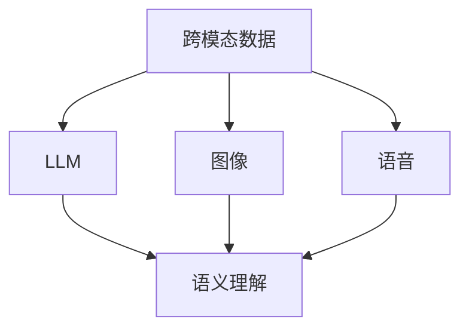
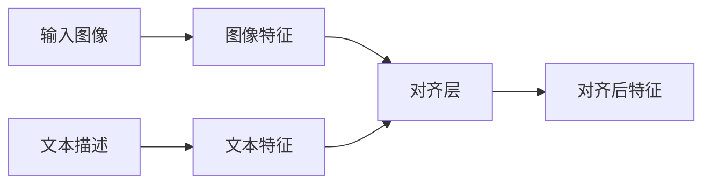
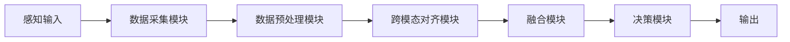

                 


```markdown
# 跨模态AI Agent：LLM与多种感知输入的融合

> 关键词：跨模态AI Agent, 大语言模型, 多模态数据融合, 感知输入, LLM应用

> 摘要：本文深入探讨了跨模态AI Agent的核心概念、算法原理、系统架构及实际应用。通过详细分析LLM与视觉、听觉等多种感知输入的融合方法，结合数学模型和系统设计，展示了如何构建高效的跨模态AI Agent系统。

---

# 第一部分：跨模态AI Agent的背景与概念

## 第1章：跨模态AI Agent的背景与问题描述

### 1.1 背景介绍

#### 1.1.1 人工智能的发展历程
人工智能（AI）技术近年来取得了显著进展，特别是在自然语言处理和计算机视觉领域。大语言模型（LLM）如GPT-4和视觉模型如DALL-E的成功应用，推动了AI技术的普及。

#### 1.1.2 大语言模型（LLM）的崛起
LLM通过海量数据训练，能够理解和生成人类语言，具备强大的上下文理解和生成能力，适用于多种任务，如文本生成、问答系统等。

#### 1.1.3 跨模态技术的兴起
跨模态技术涉及多种数据形式（如文本、图像、语音）的处理与融合。随着传感器技术的进步和数据多样性的增加，跨模态技术在多个领域展现出巨大潜力。

### 1.2 问题背景

#### 1.2.1 多种感知输入的融合挑战
传统AI系统通常处理单一类型的数据，但在现实场景中，信息往往以多种形式呈现。如何有效融合这些数据，提高系统理解和决策能力，是当前面临的主要挑战。

#### 1.2.2 LLM与感知输入的结合难点
LLM擅长处理文本数据，但直接处理其他类型的数据（如图像、语音）存在困难。如何将LLM与这些感知输入有效结合，是跨模态AI Agent的核心问题。

#### 1.2.3 跨模态融合的场景与应用
跨模态技术广泛应用于图像描述生成、语音辅助理解、多模态对话系统等领域。LLM与感知输入的融合能够提升系统的智能化水平。

## 第2章：跨模态AI Agent的核心概念与联系

### 2.1 概念结构

#### 2.1.1 跨模态数据的定义与特征
跨模态数据指来自不同感官的数据，如图像、文本、语音等。这些数据具有多样性、异构性和关联性。

#### 2.1.2 跨模态融合的原理与方法
跨模态融合旨在将不同模态的数据进行整合，提取共同特征，提升系统的理解能力。常用方法包括对齐、映射和融合。

#### 2.1.3 跨模态AI Agent的核心要素
包括感知输入模块、LLM处理模块、跨模态融合模块和决策输出模块。

### 2.2 LLM与感知输入的融合方式

#### 2.2.1 多模态对齐的概念与技术
多模态对齐指将不同模态的数据映射到同一空间，以便进行有效融合。常用技术包括特征对齐和语义对齐。

#### 2.2.2 LLM在多模态输入中的应用
通过将感知输入转换为文本描述，LLM能够处理多模态数据。例如，将图像描述为文本，供LLM生成响应。

#### 2.2.3 跨模态融合的实现路径
包括模态对齐、特征融合和联合推理三个阶段，确保不同模态的信息能够协同工作。

### 2.3 对比表格与实体关系图

#### 2.3.1 模态类型对比表
| 模态类型 | 数据形式 | 示例 |
|----------|----------|------|
| 文本      | 文本字符串 | "狗在公园里跑" |
| 图像      | 图像数据 | 照片 |
| 语音      | 音频数据 | "今天天气不错" |

#### 2.3.2 实体关系图（Mermaid）


---

# 第二部分：跨模态AI Agent的算法原理

## 第3章：跨模态数据融合的算法原理

### 3.1 多模态对齐的数学模型

#### 3.1.1 对齐目标函数


#### 3.1.2 余弦相似度公式
跨模态对齐常用余弦相似度衡量特征向量的相似性：
$$ \text{sim}(x, y) = \frac{x \cdot y}{\|x\| \|y\|} $$

### 3.2 LLM与感知输入融合的算法步骤

#### 3.2.1 数据预处理
将图像和语音数据转换为文本描述，便于LLM处理。

#### 3.2.2 模型训练
使用多模态数据对LLM进行微调，使其能够理解和生成跨模态信息。

#### 3.2.3 融合策略
根据任务需求，选择合适的融合策略，如加权融合、注意力机制等。

### 3.3 跨模态推理与决策算法

#### 3.3.1 融合模块
将不同模态的特征进行融合，生成统一的语义表示。

#### 3.3.2 决策模块
基于融合后的语义表示，生成最终的决策输出。

---

# 第三部分：系统架构与设计

## 第4章：跨模态AI Agent的系统架构

### 4.1 系统功能设计

#### 4.1.1 数据采集模块
负责采集多种感知数据，如图像、语音和文本。

#### 4.1.2 数据融合模块
将不同模态的数据进行对齐和融合，生成统一的语义表示。

#### 4.1.3 决策模块
基于融合后的语义表示，生成决策输出，如文本回复或动作指令。

### 4.2 系统架构图（Mermaid）



---

# 第四部分：项目实战

## 第5章：环境安装与系统实现

### 5.1 环境安装

```bash
pip install transformers torch numpy matplotlib
```

### 5.2 核心代码实现

#### 5.2.1 数据预处理代码

```python
import torch
from transformers import AutoTokenizer, AutoModel

# 加载预训练模型
tokenizer = AutoTokenizer.from_pretrained('bert-base-uncased')
model = AutoModel.from_pretrained('bert-base-uncased')

# 文本编码
def encode_text(text):
    inputs = tokenizer(text, return_tensors='pt')
    return model(**inputs).last_hidden_state
```

#### 5.2.2 融合模块代码

```python
import numpy as np

def cosine_similarity(x, y):
    return np.dot(x, y) / (np.linalg.norm(x) * np.linalg.norm(y))
```

### 5.3 代码解读与分析

#### 5.3.1 数据预处理模块
将图像和语音数据转换为文本描述，以便LLM处理。

#### 5.3.2 融合模块
计算不同模态特征向量的余弦相似度，进行对齐和融合。

---

# 第五部分：总结与展望

## 第6章：总结与最佳实践

### 6.1 最佳实践

#### 6.1.1 数据对齐的重要性
确保不同模态的数据在语义上一致，提升融合效果。

#### 6.1.2 模型选择与调优
根据具体任务选择合适的模型，并进行充分的训练和调优。

### 6.2 小结
跨模态AI Agent通过融合多种感知输入，显著提升了系统的智能化水平。本文详细探讨了其核心概念、算法原理和系统架构。

### 6.3 注意事项

- 数据质量对融合效果影响重大，需确保数据的准确性和多样性。
- 融合策略的选择需根据具体任务需求，避免一刀切。

### 6.4 拓展阅读
推荐阅读相关论文和文献，深入了解最新的跨模态技术进展。

---

作者：AI天才研究院/AI Genius Institute & 禅与计算机程序设计艺术 /Zen And The Art of Computer Programming
```

