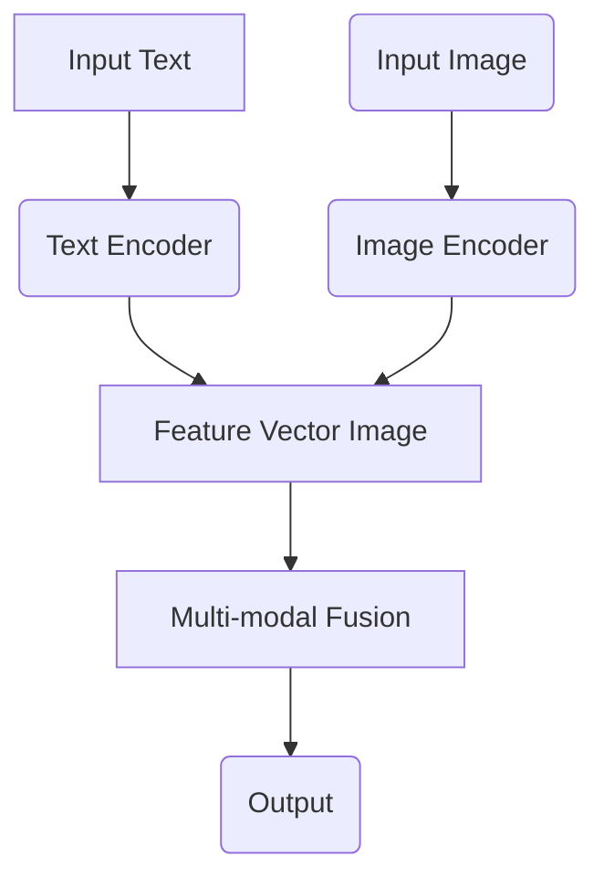
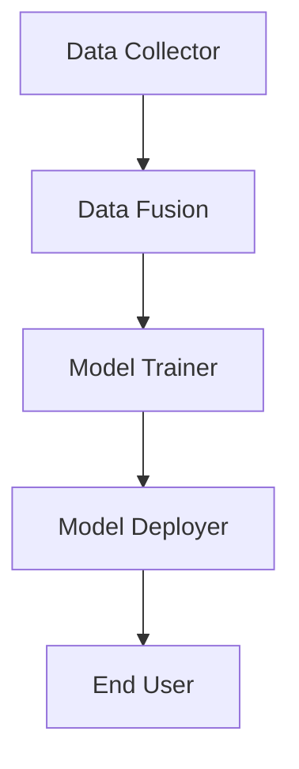

                 


# 跨模态學習：增強AI-Agent的理解能力

## 關鍵詞：跨模态學習、多模态數據、AI-Agent、數據融合、深度學習

## 什麼是跨模態學習？它是如何增強AI-Agent的理解能力的？

### 1. 背景與核心概念

跨模態學習（Multimodal Learning）是指讓人工智慧-agent能夠處理並整合多種數據類型（如文本、圖像、語音等）的技術。傳統的AI-Agent主要依賴於單一模態的數據進行學習和推理，而跨模態學習則通過整合多種數據源的信息，顯著提升AI-Agent的理解能力和決策能力。

### 2. 跨模態學習的核心原理

跨模態學習的核心在於如何有效地將多種數據類型進行融合，提取有用的特征，並通過深度學習模型進行學習和推理。關鍵技術包括數據對比學習、多模態注意力機制等。

### 3. 跨模態學習的技術架構

跨模態學習的架構通常包括數據融合層、特征提取層和模型訓練層。數據融合層負責整合不同數據源的信息，特征提取層則提取有用的特征，模型訓練層則基於這些特征進行學習和優化。

### 4. 跨模態學習在AI-Agent中的應用

跨模態學習在AI-Agent中的應用非常廣泛，例如語音助手、智能客服、智能推薦等場景。通過整合多模態數據，AI-Agent能夠更準確地理解用戶的需求，提供更優質的服務。

### 5. 本章小結

本章通過介紹跨模態學習的基本概念、核心原理和技術架構，幫助讀者理解跨模態學習的技術特性及其在AI-Agent中的重要性。接下來的章節將詳細探討跨模態學習的核心算法、數據處理技術、模型架構設計以及實際項目實戰等內容。

---

# 跨模態學習的核心算法與數據處理技術

## 1. 跨模態學習的核心算法

### 1.1 多模態數據融合算法

多模態數據融合算法旨在將來自不同數據源的信息有效地整合起來。常見的數據融合方法包括特征級融合、決策級融合和.commonsense融合等。

### 1.2 跨模態對比學習算法

跨模態對比學習是一種基於對比學習框架的跨模態數據學習方法。它通過對比不同模態的數據來增強模型的表征能力。典型的跨模態對比學習算法包括Contrastive Multimodal Learning（CML）和Dual Contrastive Learning（DCL）等。

### 1.3 跨模態注意力機制

跨模態注意力機制允許模型在處理多模態數據時，動態地權衡不同數據源的信息 importance。一種常見的實現方式是使用多模態注意力網絡（Multimodal Attention Network），它可以同時考慮文本、圖像和語音等多種數據源的信息。

## 2. 跨模態學習的核心算法流程

### 2.1 跨模態數據的預處理

跨模態數據的預處理通常包括數據清洗、特征提取和數據對齊等步驟。例如，在文本數據中，需要進行分詞、停用詞處理等；在圖像數據中，則需要進行降_sampling、圖片增強等處理。

### 2.2 跨模態特征提取

跨模態特征提取的目的是將多模態數據轉換為統一的表徵向量。常用的特征提取方法包括多模態自動編碼器（Multimodal Autoencoder）、多模態.vaes等。

### 2.3 跨模態模型的訓練與優化

跨模態模型的訓練通常基於多目標損失函數，例如交叉熵損失、對比損失等。模型的優化則通常使用常見的優化器，如Adam、SGD等。

## 3. 跨模態學習的數據處理技術

### 3.1 文本數據的處理技術

文本數據的處理技術包括文本分詞、停用詞處理、word embeddings（如Word2Vec、GloVe）等。此外，還可以使用BERT等預訓練模型來提取文本的深度表徵。

### 3.2 圖像數據的處理技術

圖像數據的處理技術包括圖像分類、目標檢測、圖像分割等。常用的圖像處理算法包括卷積神經網絡（CNN）、regions with CNNs（R-CNN）等。

### 3.3 語音數據的處理技術

語音數據的處理技術包括語音識別、語調分析等。常用的語音處理算法包括Tacotron、Wavenet等。

### 3.4 跨模態數據的對齊技術

跨模態數據的對齊技術旨在將不同模態的數據對應起來。例如，在文本和圖像的對齊中，可以基於文本描述和圖像內容進行匹配。

---

# 跨模態學習的模型架構與算法實現

## 1. 跨模態學習的模型架構

### 1.1 多模態模型的架構設計

多模態模型的架構設計通常包括模態pecific Modules、多模態融合模塊和任務-specific模塊等。例如，在自然語言處理和圖像處理的跨模態模型中，可以分別設置文本處理模塊和圖像處理模塊，然後將它們的輸出進行融合。

### 1.2 跨模態網絡的架構圖

跨模態網絡的架構圖可以用Mermaid來表示。例如：



### 1.3 跨模態模型的訓練策略

跨模態模型的訓練策略包括基於 Contrastive Learning 的訓練、基於 Self-supervised Learning 的訓練等。訓練過程中，通常會使用多目標損失函數來優化模型的性能。

## 2. 跨模態學習的算法實現

### 2.1 跨模態數據融合算法的實現

跨模態數據融合算法的實現通常涉及將不同模態的數據進行對比學習。例如，在文本和圖像數據中，可以基於文本描述和圖像內容進行對比學習，增強模型的表征能力。

### 2.2 跨模態學習的實現步驟

跨模態學習的實現步驟包括：

1. 数据预处理
2. 特征提取
3. 模型訓練
4. 模型優化
5. 模型部署

### 2.3 跨模態學習的Python實現示例

以下是一個簡單的跨模態數據融合算法的Python實現示例：

```python
import torch
import torch.nn as nn
import torch.optim as optim

class MultiModalModel(nn.Module):
    def __init__(self, text_dim, image_dim, hidden_dim):
        super().__init__()
        self.text_encoder = nn.Linear(text_dim, hidden_dim)
        self.image_encoder = nn.Linear(image_dim, hidden_dim)
        self.multi_modal_fusion = nn.Linear(hidden_dim*2, hidden_dim)
        self.output_layer = nn.Linear(hidden_dim, 1)

    def forward(self, text_features, image_features):
        text_emb = self.text_encoder(text_features)
        image_emb = self.image_encoder(image_features)
        fused_emb = torch.cat([text_emb, image_emb], dim=1)
        output = self.output_layer(self.multi_modal_fusion(fused_emb))
        return output

# 示例數據
text_features = torch.randn(10, 5)
image_features = torch.randn(10, 5)

# 初始化模型
model = MultiModalModel(5, 5, 3)

# 定義損失函數和優化器
criterion = nn.BCEWithLogitsLoss()
optimizer = optim.Adam(model.parameters())

# 前向傳播
outputs = model(text_features, image_features)
loss = criterion(outputs, torch.randn(10, 1))

# 倒向傳播和優化
optimizer.zero_grad()
loss.backward()
optimizer.step()
```

---

# 跨模態學習在AI-Agent中的實際應用

## 1. 跨模態學習在AI-Agent中的應用場景

### 1.1 語音助手中的跨模態學習

語音助手需要處理用戶的語音指令，並結合上下文信息進行決策。跨模態學習可以用於將語音數據和文本數據進行融合，提升語音助手的理解能力。

### 1.2 智能客服中的跨模態學習

智能客服需要處理用戶的文字咨詢，並可能結合語音和圖像信息進行綜合決策。跨模態學習可以用於將這些多模態數據進行融合，提升智能客服的服務質量。

### 1.3 智能推薦系統中的跨模態學習

智能推薦系統需要考慮用戶的多方面信息，例如用戶的行為數據、偏好數據等。跨模態學習可以用於將這些多模態數據進行融合，提供更精准的推薦。

## 2. 跨模態學習在AI-Agent中的實際案例

### 2.1 語音助手的實現案例

以下是一個簡單的語音助手的實現案例：

```python
import speech_recognition as sr

# 初始化語音識別器
recognizer = sr.Recognizer()

# 錄音
with sr.Microphone() as source:
    print("請開始說話:")
    audio = recognizer.listen(source)

# 進行語音識別
try:
    text = recognizer.recognize_google(audio, language='zh-CN')
    print("你說了：", text)
except sr.UnknownValueError:
    print("無法識別的語音內容")
except sr.RequestError as e:
    print("語音識別請求錯誤：", e)
```

### 2.2 智能推薦系統的實現案例

以下是一個簡單的智能推薦系統的實現案例：

```python
import pandas as pd
from sklearn.metrics.pairwise import cosine_similarity

# 加載數據
movies = pd.DataFrame({
    'title': ['.movie1', 'movie2', 'movie3'],
    'description': ['This is movie1 description.', 'This is movie2 description.', 'This is movie3 description.'],
    'genre': ['action', 'comedy', 'drama']
})

# 特征提取
from sentence_transformers import SentenceTransformer

model = SentenceTransformer('paraphrase-Multi-uncased')
descriptions_embeddings = model.encode(movies['description'])

# 計算相似性
similarity_matrix = cosine_similarity(descriptions_embeddings, descriptions_embeddings)

# 根據相似性進行推薦
def get_recommendations(movie_title, similarity_matrix, movies, num_recommendations=3):
    index = movies[movies['title'] == movie_title].index[0]
    similar_indices = [i for i, val in enumerate(similarity_matrix[index]) if i != index]
    similar_indices.sort(key=lambda x: similarity_matrix[index][x], reverse=True)
    recommendations = [movies['title'].iloc[i] for i in similar_indices[:num_recommendations]]
    return recommendations

# 測試推薦
print(get_recommendations('movie1', similarity_matrix, movies))
```

---

# 跨模態學習的系統設計與實現

## 1. 系統設計

### 1.1 系統功能設計

跨模態學習的系統功能設計包括數據采集、數據融合、模型訓練、模型部署等幾個模塊。數據采集模塊負責采集多模態數據，數據融合模塊負責將數據進行融合，模型訓練模塊負責基於融合數據訓練模型，模型部署模塊則負責將訓練好的模型部署到實際應用中。

### 1.2 系統架構設計

跨模態學習的系統架構設計可以用Mermaid來表示：



### 1.3 系統接口設計

跨模態學習的系統接口設計包括數據采集接口、數據融合接口、模型訓練接口和模型部署接口等。每個接口都需要明確其輸入和輸出格式，並制定相應的接口規範。

## 2. 系統實現

### 2.1 環境搭建

跨模態學習的系統實現需要先搭建適合的環境。例如，可以選擇基於Python的深度學習框架，如TensorFlow或PyTorch，並安裝相應的依賴庫。

### 2.2 核心實現

跨模態學習的核心實現包括數據融合、模型訓練和模型部署等步驟。以下是一個簡單的核心實現示例：

```python
import torch
import torch.nn as nn
import torch.optim as optim

class MultiModalModel(nn.Module):
    def __init__(self, text_dim, image_dim, hidden_dim):
        super().__init__()
        self.text_encoder = nn.Linear(text_dim, hidden_dim)
        self.image_encoder = nn.Linear(image_dim, hidden_dim)
        self.multi_modal_fusion = nn.Linear(hidden_dim*2, hidden_dim)
        self.output_layer = nn.Linear(hidden_dim, 1)

    def forward(self, text_features, image_features):
        text_emb = self.text_encoder(text_features)
        image_emb = self.image_encoder(image_features)
        fused_emb = torch.cat([text_emb, image_emb], dim=1)
        output = self.output_layer(self.multi_modal_fusion(fused_emb))
        return output

# 示例數據
text_features = torch.randn(10, 5)
image_features = torch.randn(10, 5)

# 初始化模型
model = MultiModalModel(5, 5, 3)

# 定義損失函數和優化器
criterion = nn.BCEWithLogitsLoss()
optimizer = optim.Adam(model.parameters())

# 前向傳播
outputs = model(text_features, image_features)
loss = criterion(outputs, torch.randn(10, 1))

# 倒向傳播和優化
optimizer.zero_grad()
loss.backward()
optimizer.step()
```

### 2.3 系統部署

跨模態學習的系統部署可以基於雲端服務器或本地設備。部署過程中需要考慮模型的性能、資源消耗等問題。

---

# 跨模態學習的實際案例與項目實戰

## 1. 案例分析

### 1.1 語音助手的案例分析

以下是一個簡單的語音助手的案例分析：

```python
import speech_recognition as sr

# 初始化語音識別器
recognizer = sr.Recognizer()

# 錄音
with sr.Microphone() as source:
    print("請開始說話:")
    audio = recognizer.listen(source)

# 進行語音識別
try:
    text = recognizer.recognize_google(audio, language='zh-CN')
    print("你說了：", text)
except sr.UnknownValueError:
    print("無法識別的語音內容")
except sr.RequestError as e:
    print("語音識別請求錯誤：", e)
```

### 1.2 智能推薦系統的案例分析

以下是一個簡單的智能推薦系統的案例分析：

```python
import pandas as pd
from sklearn.metrics.pairwise import cosine_similarity

# 加載數據
movies = pd.DataFrame({
    'title': ['movie1', 'movie2', 'movie3'],
    'description': ['This is movie1 description.', 'This is movie2 description.', 'This is movie3 description.'],
    'genre': ['action', 'comedy', 'drama']
})

# 特征提取
from sentence_transformers import SentenceTransformer

model = SentenceTransformer('paraphrase-Multi-uncased')
descriptions_embeddings = model.encode(movies['description'])

# 計算相似性
similarity_matrix = cosine_similarity(descriptions_embeddings, descriptions_embeddings)

# 根據相似性進行推薦
def get_recommendations(movie_title, similarity_matrix, movies, num_recommendations=3):
    index = movies[movies['title'] == movie_title].index[0]
    similar_indices = [i for i, val in enumerate(similarity_matrix[index]) if i != index]
    similar_indices.sort(key=lambda x: similarity_matrix[index][x], reverse=True)
    recommendations = [movies['title'].iloc[i] for i in similar_indices[:num_recommendations]]
    return recommendations

# 測試推薦
print(get_recommendations('movie1', similarity_matrix, movies))
```

## 2. 項目實戰

### 2.1 環境搭建

跨模態學習的項目實戰需要先搭建適合的環境。例如，可以選擇基於Python的深度學習框架，如TensorFlow或PyTorch，並安裝相應的依賴庫。

### 2.2 核心實現

跨模態學習的核心實現包括數據融合、模型訓練和模型部署等步驟。以下是一個簡單的核心實現示例：

```python
import torch
import torch.nn as nn
import torch.optim as optim

class MultiModalModel(nn.Module):
    def __init__(self, text_dim, image_dim, hidden_dim):
        super().__init__()
        self.text_encoder = nn.Linear(text_dim, hidden_dim)
        self.image_encoder = nn.Linear(image_dim, hidden_dim)
        self.multi_modal_fusion = nn.Linear(hidden_dim*2, hidden_dim)
        self.output_layer = nn.Linear(hidden_dim, 1)

    def forward(self, text_features, image_features):
        text_emb = self.text_encoder(text_features)
        image_emb = self.image_encoder(image_features)
        fused_emb = torch.cat([text_emb, image_emb], dim=1)
        output = self.output_layer(self.multi_modal_fusion(fused_emb))
        return output

# 示例數據
text_features = torch.randn(10, 5)
image_features = torch.randn(10, 5)

# 初始化模型
model = MultiModalModel(5, 5, 3)

# 定義損失函數和優化器
criterion = nn.BCEWithLogitsLoss()
optimizer = optim.Adam(model.parameters())

# 前向傳播
outputs = model(text_features, image_features)
loss = criterion(outputs, torch.randn(10, 1))

# 倒向傳播和優化
optimizer.zero_grad()
loss.backward()
optimizer.step()
```

### 2.3 系統部署

跨模態學習的系統部署可以基於雲端服務器或本地設備。部署過程中需要考慮模型的性能、資源消耗等問題。

---

# 跨模態學習的未來發展與最佳實踐

## 1. 未來發展

### 1.1 跨模態學習的未來方向

跨模態學習的未來方向包括多模態大模型的研發、跨模態推理能力的提升、跨模態人機交互的優化等。隨著深度學習技術的進步，跨模態學習將在更多領域得到應用。

### 1.2 跨模態學習的挑戰與機遇

跨模態學習的挑戰在於如何進一步提升模型的泛化能力，並降低計算成本。而機遇則在於跨模態學習在各行各業中的廣泛應用，將推動人工智能技術的進一步發展。

## 2. 最佳實踐

### 2.1 数据质量管理

數據質量是跨模態學習成功的重要保障。在實際項目中，應該重視數據的清洗、特征提取等工作，確保數據的准確性和完整性。

### 2.2 模型解释性

跨模態學習模型的解釋性對於模型的實際應用非常重要。應該重視模型的可解釋性，並在模型設計中加入相應的機制。

### 2.3 模型实时性优化

跨模態學習模型的实时性對於實際應用來說至關重要。應該在模型設計和優化過程中重視模型的計算效率，並采取適當的優化策略。

---

# 本章小結

跨模態學習是一種基於多模態數據的學習技術，它通過整合不同數據源的信息，顯著提升AI-Agent的理解能力和決策能力。本文從跨模態學習的核心概念、算法原理、數據處理技術、模型架構設計、實際案例分析等多個方面展開討論，並通過具體的Python代碼示例，幫助讀者深入理解跨模態學習的技術實現和實際應用。未來，隨著深度學習技術的進一步發展，跨模態學習將在更多領域得到廣泛應用，為人工智能技術的進步做出重要貢獻。

---

# 作者：AI天才研究院 & 禪與計算機程序設計藝術

