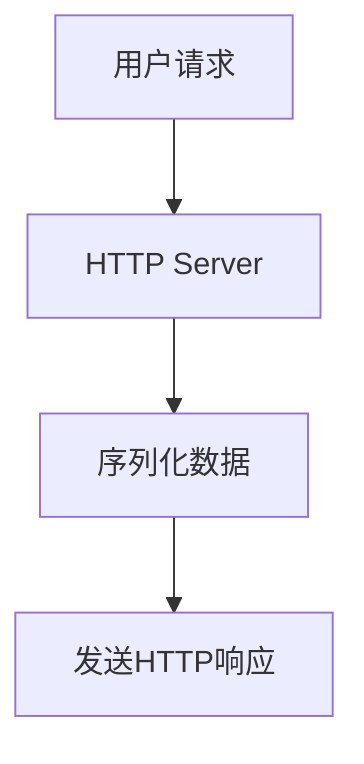
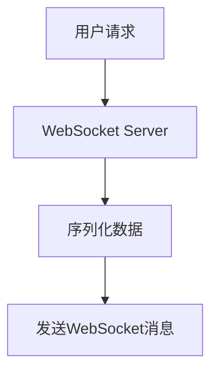
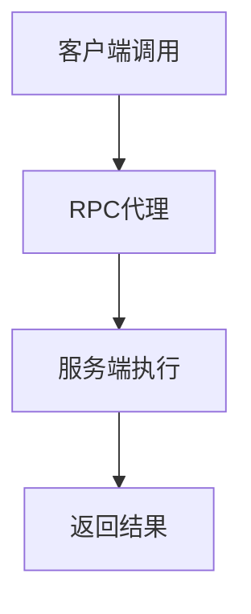
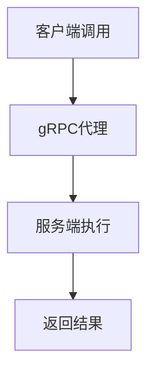
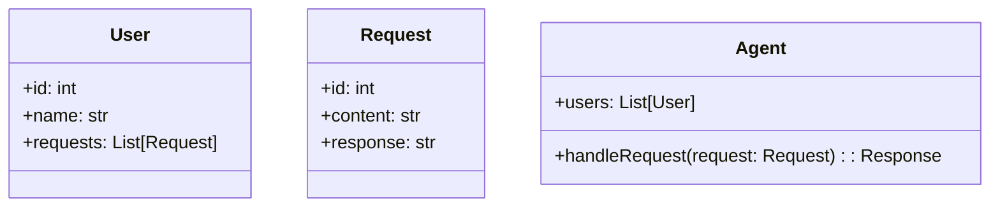
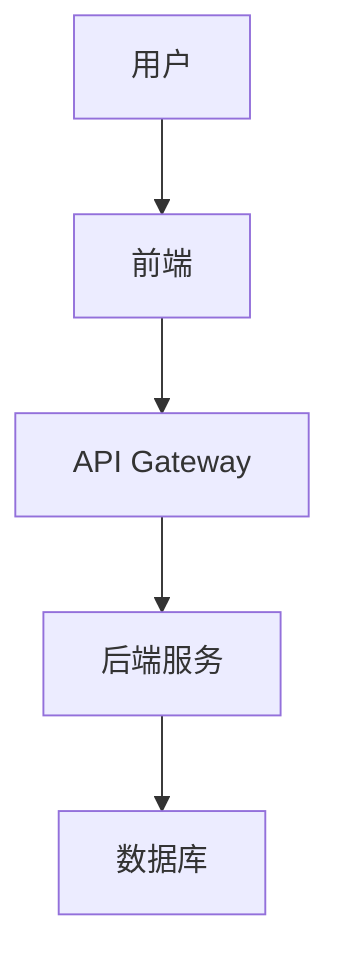
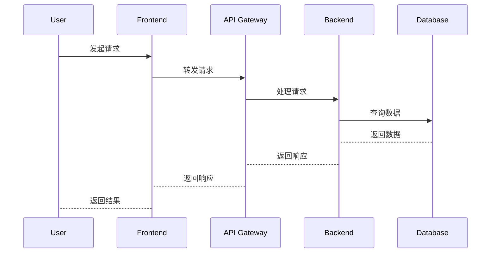

                 


# 跨语言AI Agent的开发挑战与解决方案

---

## 关键词：
跨语言AI Agent，多语言支持，跨平台通信，API调用，序列化机制，AI开发

---

## 摘要：
本文将探讨跨语言AI Agent的开发挑战与解决方案，从背景介绍、核心概念、算法原理、系统架构到项目实战，全面解析如何在多语言环境下实现高效、可靠的AI代理。通过详细分析跨语言通信的技术难点，结合实际案例，提供可行的解决方案和最佳实践。

---

# 第一部分：跨语言AI Agent的背景与挑战

## 第1章：跨语言AI Agent的背景与挑战

### 1.1 跨语言AI Agent的定义与背景
#### 1.1.1 跨语言AI Agent的定义
跨语言AI Agent是指能够理解、处理和生成多种编程语言代码的智能代理，旨在通过跨语言通信实现不同语言之间的协作与交互。

#### 1.1.2 跨语言AI Agent的发展背景
随着AI技术的普及，跨语言协作的需求日益增长。AI Agent需要在多种编程语言环境中运行，以满足复杂应用场景的需求。

#### 1.1.3 跨语言AI Agent的应用场景
- **多语言开发环境**：支持Python、Java、C++等多种语言的协作。
- **分布式系统**：跨语言通信在分布式系统中的应用。
- **混合开发模式**：结合不同语言的优势进行开发。

### 1.2 跨语言AI Agent的核心挑战
#### 1.2.1 多语言支持的技术难点
- 不同语言的数据类型差异。
- 多语言环境下的代码转换与兼容性问题。

#### 1.2.2 跨平台通信的实现障碍
- 跨平台通信协议的选择与实现。
- 跨平台通信中的延迟与性能优化。

#### 1.2.3 跨语言API调用的复杂性
- 不同语言API的接口差异。
- 跨语言API调用的安全性与稳定性。

### 1.3 跨语言AI Agent的解决方案概述
#### 1.3.1 统一接口设计
- 提供统一的接口供不同语言调用。
- 使用中间件实现跨语言通信。

#### 1.3.2 跨语言通信机制
- 基于HTTP的RESTful API。
- 使用WebSocket实现实时通信。

#### 1.3.3 API适配策略
- 使用适配器实现API兼容。
- 通过插件化设计扩展功能。

### 1.4 本章小结
本章介绍了跨语言AI Agent的背景、核心挑战及解决方案的概述，为后续章节的详细分析奠定了基础。

---

# 第二部分：跨语言AI Agent的核心概念与联系

## 第2章：跨语言AI Agent的核心概念

### 2.1 跨语言AI Agent的核心原理
#### 2.1.1 多语言支持的实现机制
- 使用序列化机制统一数据格式。
- 通过中间件实现跨语言通信。

#### 2.1.2 跨平台通信的协议选择
- 基于HTTP/2的高效通信。
- 使用JSON作为数据交换格式。

#### 2.1.3 跨语言API调用的实现方法
- 使用RPC（远程过程调用）实现跨语言调用。
- 通过gRPC实现高效的通信。

### 2.2 跨语言AI Agent的关键技术
#### 2.2.1 跨语言数据序列化
- 使用Protocol Buffers或JSON进行数据序列化。
- 序列化过程中的数据转换与反序列化。

#### 2.2.2 跨平台通信协议
- HTTP/2的优缺点分析。
- WebSocket的实时通信特性。

#### 2.2.3 跨语言API适配器
- API适配器的设计与实现。
- 插件化设计的优缺点。

### 2.3 跨语言AI Agent的核心要素对比
#### 2.3.1 不同语言的API调用方式对比
| 语言 | 调用方式 | 优缺点 |
|------|----------|--------|
| Python | 函数调用 | 简单易用，但性能较低 |
| Java | 方法调用 | 类型安全，性能较高 |
| C++ | 函数调用 | 高效，但开发复杂 |

#### 2.3.2 跨平台通信协议的优缺点分析
| 协议 | 优点 | 缺点 |
|------|------|------|
| HTTP/2 | 支持异步通信，高效 | 配置复杂 |
| WebSocket | 实时通信，低延迟 | 不支持文件上传 |

#### 2.3.3 跨语言数据序列化的效率对比
| 序列化方式 | 优缺点 | 适用场景 |
|----------|--------|----------|
| JSON | �易读性高，跨语言支持好 | 适用于简单的数据结构 |
| Protocol Buffers | 性能高，空间占用小 | 适用于复杂数据结构 |

### 2.4 跨语言AI Agent的ER实体关系图
```mermaid
er
  actor: 用户
  agent: AI Agent
  language_layer: 多语言层
  communication_layer: 通信层
  api_adapter: API适配器
  actor --> agent: 用户请求
  agent --> language_layer: 语言处理
  language_layer --> communication_layer: 通信协议
  communication_layer --> api_adapter: API
```

---

## 第3章：跨语言AI Agent的算法原理

### 3.1 跨语言数据序列化的算法原理
#### 3.1.1 序列化算法的步骤
1. 数据收集与预处理。
2. 数据转换为中间格式。
3. 数据反序列化为目标语言的数据结构。

#### 3.1.2 序列化算法的数学模型
序列化过程可以表示为：
$$ \text{序列化}(x) = f(x) $$
反序列化过程可以表示为：
$$ \text{反序列化}(f(x)) = x $$

#### 3.1.3 序列化算法的实现代码
```python
def serialize(data):
    import json
    return json.dumps(data)

def deserialize(data):
    import json
    return json.loads(data)
```

### 3.2 跨语言通信协议的实现算法
#### 3.2.1 基于HTTP的通信算法


#### 3.2.2 基于WebSocket的通信算法


### 3.3 跨语言API调用的实现算法
#### 3.3.1 基于RPC的调用算法


#### 3.3.2 基于gRPC的调用算法


---

## 第4章：跨语言AI Agent的系统分析与架构设计

### 4.1 跨语言AI Agent的项目场景介绍
- 实现一个支持多语言的客服AI Agent。
- 提供跨平台的通信能力。

### 4.2 系统功能设计
#### 4.2.1 领域模型类图


#### 4.2.2 系统架构图


#### 4.2.3 系统接口设计
- 前端接口：`POST /api/agent/request`
- 后端接口：`POST /api/agent/handle`

#### 4.2.4 系统交互序列图


---

## 第5章：跨语言AI Agent的项目实战

### 5.1 环境安装
- 安装Python、Java、C++开发环境。
- 安装跨语言通信工具（如RabbitMQ、Kafka）。

### 5.2 核心代码实现
#### 5.2.1 跨语言数据序列化代码
```python
def serialize(data):
    import json
    return json.dumps(data)

def deserialize(data):
    import json
    return json.loads(data)
```

#### 5.2.2 跨语言通信代码
```python
import requests

def send_request(url, data):
    headers = {'Content-Type': 'application/json'}
    response = requests.post(url, headers=headers, json=data)
    return response.json()
```

### 5.3 代码解读与分析
- 代码实现了跨语言数据序列化和通信。
- 使用HTTP协议进行跨语言通信。

### 5.4 实际案例分析
- 实现一个跨语言的客服AI Agent。
- 展示如何在实际项目中应用跨语言通信技术。

### 5.5 项目小结
本章通过实际案例展示了跨语言AI Agent的开发过程，帮助读者理解理论与实践的结合。

---

## 第6章：跨语言AI Agent的最佳实践与注意事项

### 6.1 最佳实践
- 使用中间件实现跨语言通信。
- 选择高效的序列化方式。
- 定期优化代码，提升性能。

### 6.2 小结
总结全文内容，强调跨语言AI Agent的开发要点。

### 6.3 注意事项
- 注意数据类型转换的潜在问题。
- 优化通信协议，提升性能。
- 定期维护代码，确保兼容性。

### 6.4 拓展阅读
推荐相关书籍和资源，帮助读者深入学习跨语言开发技术。

---

## 作者信息

作者：AI天才研究院/AI Genius Institute & 禅与计算机程序设计艺术 /Zen And The Art of Computer Programming

---

# 结语

通过本文的详细讲解，读者可以全面理解跨语言AI Agent的开发挑战与解决方案。从背景介绍到实际案例，从理论分析到代码实现，本文为读者提供了一个完整的跨语言AI Agent开发指南。

