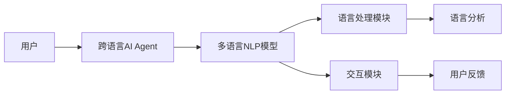

                 


# 跨语言AI Agent：突破语言障碍的智能助手

---

## 关键词：跨语言AI Agent, 多语言处理, 自然语言处理, AI助手, 跨语言智能助手

---

## 摘要：  
本文深入探讨了跨语言AI Agent的核心概念、算法原理、系统架构以及实际应用场景。通过分析多语言处理的技术挑战，结合具体的算法实现和系统设计，展示了如何构建一个能够跨越语言障碍的智能助手。文章从背景介绍、核心概念、算法原理、系统架构、项目实战等多个维度展开，为读者提供全面的技术解读和实践指导。

---

## 第一部分：跨语言AI Agent的背景与概念

### 第1章：跨语言AI Agent的背景与问题背景

#### 1.1 问题背景

- **全球化背景下的语言障碍**  
  在全球化背景下，跨语言交流变得越来越频繁。然而，语言障碍仍然是阻碍高效沟通的主要问题。例如，在跨国企业中，不同国家的员工可能需要使用多种语言进行协作，这会增加沟通成本并降低效率。

- **AI技术在语言处理中的应用需求**  
  随着自然语言处理（NLP）技术的快速发展，AI已经能够处理多种语言。然而，现有的AI工具大多局限于单一语言，无法满足跨语言场景的需求。例如，用户可能需要一个能够同时理解中文、英文和西班牙文的智能助手。

- **跨语言AI Agent的定义与目标**  
  跨语言AI Agent是一种能够理解和处理多种语言的智能助手，其目标是突破语言障碍，为用户提供无缝的语言交互体验。它不仅能够翻译语言，还能在多语言场景下提供智能服务，例如跨语言对话、信息检索和任务执行。

#### 1.2 跨语言AI Agent的核心概念

- **多语言处理的基本原理**  
  多语言处理是指AI系统能够理解和处理多种语言的能力。与单语言处理不同，多语言处理需要考虑语言之间的差异，例如语法结构、词汇差异和文化背景。

- **跨语言AI Agent的功能与应用场景**  
  跨语言AI Agent的功能包括跨语言对话、信息翻译、多语言内容生成等。它适用于跨国企业、多语言客服、国际会议等多种场景。

- **跨语言AI Agent的边界与外延**  
  跨语言AI Agent的边界在于其处理语言的种类和深度。外延则包括其与其他AI系统的集成，例如与机器翻译、语音识别等技术的结合。

#### 1.3 跨语言AI Agent的核心要素

- **自然语言处理（NLP）技术**  
  NLP技术是跨语言AI Agent的核心，它涵盖了文本理解、语言生成和语言分析等多个方面。

- **多语言模型的构建与训练**  
  多语言模型需要同时处理多种语言，通常采用联合训练的方法，以提高模型的跨语言泛化能力。

- **跨语言AI Agent的交互设计**  
  交互设计是跨语言AI Agent的重要组成部分，它需要考虑用户的语言偏好、上下文理解和实时反馈机制。

#### 1.4 本章小结

本章介绍了跨语言AI Agent的背景、核心概念和核心要素。通过分析全球化的语言障碍和AI技术的应用需求，明确了跨语言AI Agent的目标和功能。接下来，将深入探讨其核心概念和原理。

---

## 第二部分：跨语言AI Agent的核心概念与联系

### 第2章：核心概念与原理

#### 2.1 跨语言AI Agent的核心原理

- **多语言模型的工作原理**  
  多语言模型通常采用Transformer架构，通过共享不同语言的表示，实现跨语言的统一处理。例如，BERT-Multi语言模型可以在多种语言上同时进行预训练。

- **跨语言AI Agent的算法选择与优化**  
  在算法选择上，Transformer模型因其强大的语言表示能力而被广泛采用。优化方面，可以通过调整模型的参数设置、引入跨语言对比学习等方式，提升模型的性能。

- **跨语言AI Agent的性能评估指标**  
  性能评估指标包括准确率、BLEU分数、ROUGE分数等。这些指标可以衡量模型在跨语言任务中的表现。

#### 2.2 跨语言AI Agent的实体关系图



#### 2.3 跨语言AI Agent的核心概念对比

- **多语言模型与单语言模型的对比**  
  多语言模型可以在多种语言上同时进行训练，而单语言模型仅针对一种语言进行优化。

- **不同语言处理技术的优缺点分析**  
  - 统一语言模型：优点是训练效率高，缺点是跨语言能力有限。  
  - 多语言模型：优点是跨语言能力强，缺点是训练复杂度高。  

- **跨语言AI Agent与其他AI助手的对比**  
  跨语言AI Agent的独特之处在于其支持多种语言，而其他AI助手通常局限于单一语言。

---

## 第三部分：跨语言AI Agent的算法原理与数学模型

### 第3章：跨语言AI Agent的算法原理

#### 3.1 多语言模型的算法选择

- **Transformer模型的原理与应用**  
  Transformer模型通过自注意力机制，能够捕捉文本中的长距离依赖关系。它在跨语言任务中表现出色。

- **多语言模型的训练策略**  
  多语言模型通常采用联合训练策略，通过共享语言嵌入，实现跨语言的统一表示。

- **跨语言AI Agent的算法优化**  
  通过引入跨语言对比学习、语言自适应等技术，可以进一步优化模型的性能。

#### 3.2 多语言模型的数学公式

- **Transformer模型的注意力机制公式**  
  注意力机制的计算公式如下：
  $$
  \text{Attention}(Q, K, V) = \text{softmax}\left(\frac{QK^T}{\sqrt{d_k}}\right)V
  $$
  其中，$Q$、$K$、$V$分别是查询、键和值向量，$d_k$是向量的维度。

- **多语言模型的损失函数**  
  多语言模型的损失函数通常包括语言内损失和跨语言损失两部分：
  $$
  \mathcal{L} = \mathcal{L}_{\text{in}} + \lambda \mathcal{L}_{\text{cross}}
  $$
  其中，$\lambda$是调节参数，控制跨语言损失的影响程度。

#### 3.3 跨语言AI Agent的实际案例分析

- **跨语言对话案例**  
  用户用中文提问：“如何预订机票？”  
  AI Agent理解并生成英文回复：“Please book a flight ticket.”

- **多语言内容生成案例**  
  用户输入西班牙文：“Haga un resumen de este artículo.”  
  AI Agent生成中文摘要：“这篇文章的主要内容是...”

#### 3.4 本章小结

本章详细介绍了跨语言AI Agent的算法原理，包括Transformer模型的注意力机制、多语言模型的训练策略以及数学公式的推导。通过实际案例分析，进一步验证了算法的有效性。

---

## 第四部分：跨语言AI Agent的系统架构设计

### 第4章：系统架构与实现

#### 4.1 系统功能设计

- **领域模型设计**  
  通过Mermaid类图展示系统的主要模块和交互关系：
  ```mermaid
  classDiagram
      class 用户 {
          发送请求
          接收响应
      }
      class 跨语言AI Agent {
          处理请求
          发送响应
      }
      class 多语言NLP模型 {
          分析文本
          生成回复
      }
      用户 --> 跨语言AI Agent
      跨语言AI Agent --> 多语言NLP模型
  ```

- **系统架构设计**  
  系统采用微服务架构，包括前端交互模块、后端处理模块和模型服务模块。通过Mermaid架构图展示系统整体架构：
  ```mermaid
  graph LR
      A[用户] --> B[前端交互模块]
      B --> C[后端处理模块]
      C --> D[多语言NLP模型服务]
      D --> B
  ```

- **系统接口设计**  
  系统主要提供RESTful API接口，包括文本分析接口和生成接口。

- **系统交互设计**  
  通过Mermaid序列图展示用户与系统之间的交互流程：
  ```mermaid
  sequenceDiagram
      用户->>API Gateway: 发送请求
      API Gateway->>后端处理模块: 转发请求
      后端处理模块->>多语言NLP模型: 处理请求
      多语言NLP模型->>后端处理模块: 返回结果
      后端处理模块->>用户: 返回响应
  ```

#### 4.2 项目实战

- **环境安装**  
  需要安装Python、TensorFlow、Hugging Face Transformers等库：
  ```bash
  pip install python python-tensorflow transformers
  ```

- **核心代码实现**  
  下面是一个简单的跨语言AI Agent实现示例：
  ```python
  from transformers import AutoTokenizer, AutoModelForSeq2SeqLM

  model_name = "microsoft/bart-large-mnli-multi-lingual"
  tokenizer = AutoTokenizer.from_pretrained(model_name)
  model = AutoModelForSeq2SeqLM.from_pretrained(model_name)

  def translate(text, src_lang, tgt_lang):
      inputs = tokenizer.encode(text, src_lang=src_lang, tgt_lang=tgt_lang)
      outputs = model.generate(inputs.input_ids, max_length=100)
      return tokenizer.decode(outputs[0], skip_special_tokens=True)

  # 示例
  input_text = "Hello, how are you?"
  src_lang = "en"
  tgt_lang = "zh"
  print(translate(input_text, src_lang, tgt_lang))  # 输出：你好，你怎么样？
  ```

- **实际案例分析**  
  通过上述代码，我们可以实现跨语言翻译和文本生成功能。例如，用户输入西班牙文：“Hoy es un día bonito”，AI Agent可以将其翻译成中文：“今天是一个美好的日子”。

#### 4.3 本章小结

本章详细介绍了跨语言AI Agent的系统架构设计，包括功能设计、架构设计、接口设计和交互设计。通过实际的项目实战，展示了如何实现跨语言文本处理功能。

---

## 第五部分：跨语言AI Agent的总结与展望

### 第5章：总结与展望

#### 5.1 本章总结

- **核心内容回顾**  
  本文系统介绍了跨语言AI Agent的核心概念、算法原理、系统架构和项目实现。通过理论与实践的结合，深入探讨了跨语言AI Agent的技术细节。

- **关键点总结**  
  - 多语言模型是跨语言AI Agent的核心技术。  
  - 跨语言AI Agent的实现依赖于先进的NLP技术和高效的系统架构。  
  - 跨语言AI Agent的应用场景广泛，具有重要的现实意义。

#### 5.2 未来展望

- **技术发展趋势**  
  随着AI技术的不断进步，跨语言AI Agent将更加智能化和个性化。未来的模型可能会支持更多的语言，并具备更强的上下文理解和语境分析能力。

- **潜在的研究方向**  
  - 提高多语言模型的泛化能力。  
  - 探索跨语言AI Agent与语音识别、计算机视觉等技术的结合。  
  - 研究跨语言AI Agent在教育、医疗等领域的深度应用。

#### 5.3 最佳实践 tips

- **小贴士**  
  在实际应用中，建议优先选择经过大规模预训练的多语言模型，例如_mBART、XLM等。这些模型通常具有较强的跨语言能力。

- **注意事项**  
  跨语言AI Agent的性能依赖于模型的训练数据和应用场景。在实际使用中，需要根据具体需求进行模型的微调和优化。

- **拓展阅读**  
  推荐阅读相关领域的经典论文，例如《BERT: Pre-training of Deep Bidirectional Transformers for NLP》和《Multilingual Universal Sentence Encoder for Cross-Lingual NLP》。

#### 5.4 本章小结

本文总结了跨语言AI Agent的核心内容，并展望了其未来的发展方向。通过最佳实践 tips和注意事项，为读者提供了实用的指导。

---

## 作者：AI天才研究院/AI Genius Institute & 禅与计算机程序设计艺术 /Zen And The Art of Computer Programming

---

通过以上目录和内容的详细规划，我将按照这个结构逐步撰写完整的博客文章，确保每个部分都涵盖所需的技术细节和实际应用案例。

