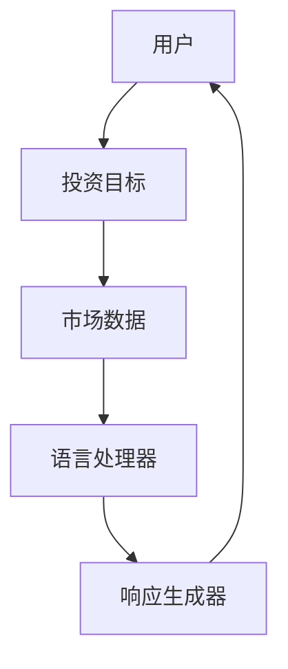
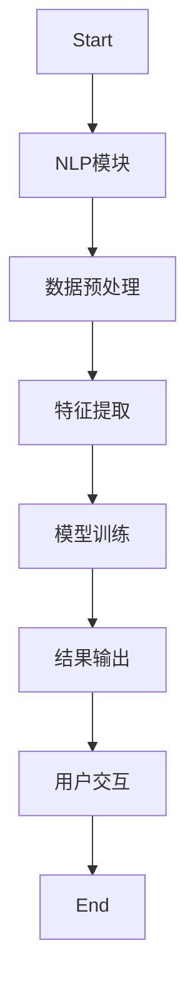
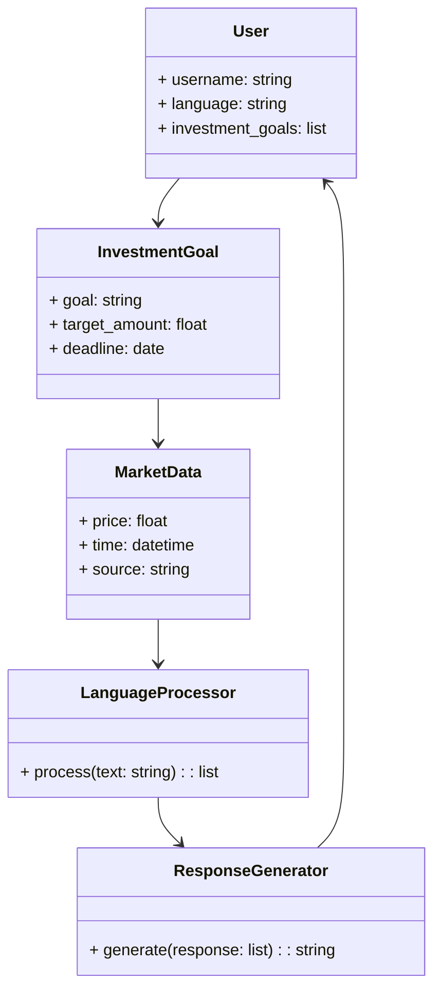
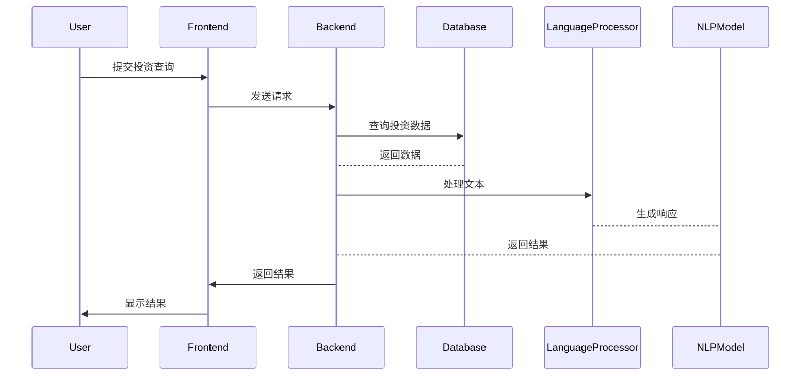

                 


# 跨语言投资理财智能助手的开发策略

> 关键词：跨语言智能助手、投资理财、自然语言处理、机器学习、数据可视化、多语言支持

> 摘要：随着全球化进程的加速，投资者和金融从业者对跨语言投资理财工具的需求日益增长。本文详细探讨了跨语言投资理财智能助手的开发策略，涵盖从背景分析到系统架构设计的完整流程。文章结合实际案例，深入解析了多语言自然语言处理技术、投资理财数据分析模型以及系统架构设计的核心原理，并提供了具体的开发实现方案。最终，本文总结了开发中的最佳实践和未来发展方向。

---

# 第一部分: 背景与核心概念

## 第1章: 背景介绍

### 1.1 问题背景

#### 1.1.1 全球化背景下的投资理财需求

随着全球经济一体化的加速，投资者和金融从业者需要处理来自不同国家和地区的投资信息。然而，语言障碍成为了获取投资理财信息的主要障碍。例如，一个中文投资者可能需要阅读英文的财务报表或投资报告，反之亦然。这种语言障碍不仅影响了投资决策的效率，还可能导致信息误解。

#### 1.1.2 多语言用户群体的投资理财痛点

在全球化的金融市场中，投资者群体呈现多样化特征。许多投资者可能精通多种语言，但他们在面对复杂的投资信息时，仍然需要依赖翻译工具或人工解读。这种方式不仅耗时，而且可能引入误差。例如，一个不懂英文的投资者可能需要通过翻译工具来理解一份英文的投资分析报告，但翻译过程可能遗漏关键信息。

#### 1.1.3 跨语言投资理财助手的必要性

为了满足多语言用户的投资理财需求，开发一个能够理解并处理多种语言的投资理财智能助手变得尤为重要。这种工具不仅可以帮助用户快速获取投资信息，还能提供个性化的投资建议，从而提升投资效率和准确性。

### 1.2 问题描述

#### 1.2.1 多语言用户的投资理财信息获取障碍

多语言用户在获取投资信息时，常常面临以下问题：
1. 不同语言的投资术语可能存在差异，导致信息误解。
2. 多语言数据的整合和分析复杂，难以快速获取关键信息。
3. 现有的投资理财工具多局限于单一语言，无法满足多语言用户的需求。

#### 1.2.2 跨语言数据处理的复杂性

跨语言数据处理涉及以下复杂性：
1. 不同语言的语法结构差异，影响自然语言处理的准确性。
2. 多语言数据的标注和清洗需要额外的工作量。
3. 不同语言的语料库规模差异，可能导致某些语言的处理效果不佳。

#### 1.2.3 投资理财助手的智能化需求

传统的投资理财工具多为静态信息提供，缺乏智能化的交互和分析能力。用户需要一个能够实时分析市场动态、提供个性化建议的智能助手，以应对复杂的金融市场环境。

### 1.3 问题解决

#### 1.3.1 跨语言智能助手的核心目标

跨语言投资理财智能助手的核心目标包括：
1. 提供多语言的投资信息检索和分析功能。
2. 实现跨语言的自然语言处理，支持多种语言的交互。
3. 提供智能化的投资建议，帮助用户做出决策。

#### 1.3.2 多语言自然语言处理技术的应用

自然语言处理技术在跨语言投资理财助手中的应用包括：
1. 多语言文本的分词和解析。
2. 跨语言信息检索和语义理解。
3. 多语言对话交互。

#### 1.3.3 投资理财数据的智能化分析

智能化分析的核心在于：
1. 实时监控和分析多语言的市场数据。
2. 基于用户需求生成个性化投资建议。
3. 提供实时的市场动态反馈。

### 1.4 边界与外延

#### 1.4.1 跨语言助手的功能边界

跨语言投资理财助手的功能边界包括：
1. 仅支持预定义的几种主要语言，不支持所有语言。
2. 不提供实时交易功能，仅提供分析和建议。
3. 仅支持文本交互，不包括语音或图像交互。

#### 1.4.2 相关领域的外延分析

跨语言投资理财助手的相关领域包括：
1. 多语言自然语言处理技术。
2. 投资理财数据分析模型。
3. 用户交互设计与体验优化。

#### 1.4.3 与现有技术的对比

现有技术的对比分析如下：
1. 传统投资理财工具：功能单一，缺乏智能化。
2. 单一语言智能助手：无法满足多语言用户需求。
3. 跨语言翻译工具：不具备投资理财分析功能。

### 1.5 核心要素组成

#### 1.5.1 自然语言处理模块

自然语言处理模块负责：
1. 多语言文本的分词和解析。
2. 跨语言语义理解。
3. 多语言对话交互。

#### 1.5.2 投资理财数据分析模块

数据分析模块负责：
1. 实时市场数据的获取与处理。
2. 投资组合的优化建议。
3. 市场趋势的预测分析。

#### 1.5.3 用户交互界面

用户交互界面包括：
1. 多语言支持的对话框。
2. 投资信息的可视化展示。
3. 个性化投资建议的反馈界面。

---

## 第2章: 核心概念与联系

### 2.1 核心概念原理

#### 2.1.1 自然语言处理（NLP）原理

自然语言处理（NLP）是跨语言智能助手的核心技术之一。其主要步骤包括：
1. 文本预处理：分词、去停用词、词干提取。
2. 语义分析：词袋模型、TF-IDF、LDA。
3. 深度学习模型：RNN、LSTM、Transformer。

#### 2.1.2 跨语言数据处理机制

跨语言数据处理机制包括：
1. 多语言分词与句法分析。
2. 跨语言信息检索与语义匹配。
3. 多语言对话生成与理解。

#### 2.1.3 投资理财数据分析模型

投资理财数据分析模型包括：
1. 时间序列分析：ARIMA、GARCH。
2. 机器学习模型：随机森林、XGBoost。
3. 深度学习模型：LSTM、Transformer。

### 2.2 核心概念属性对比

#### 2.2.1 不同语言的文本处理难度对比

| 语言 | 语法复杂度 | 数据量大小 | 处理难度 |
|------|------------|------------|----------|
| 英语 | 中等 | 大 | 中等 |
| 中文 | 高 | 中等 | 高 |
| 日语 | 中等 | 小 | 中等 |

#### 2.2.2 不同投资理财模型的性能对比

| 模型 | 精度 | 训练时间 | 鲁棒性 |
|------|------|----------|---------|
| ARIMA | 中等 | 短 | 中等 |
| LSTM  | 高 | 长 | 高 |
| XGBoost | 中等 | 中等 | 中等 |

#### 2.2.3 不同用户群体的需求特征对比

| 用户群体 | 需求特点 | 使用场景 | 难点 |
|----------|----------|----------|------|
| 机构投资者 | 高精度分析 | 机构决策 | 数据量大 |
| 个人投资者 | 简单易懂 | 个人理财 | 信息筛选 |

### 2.3 ER实体关系图架构



---

## 第3章: 算法原理讲解

### 3.1 算法流程图



### 3.2 代码实现

#### 3.2.1 环境安装

```bash
pip install numpy pandas scikit-learn transformers
```

#### 3.2.2 核心代码实现

```python
import numpy as np
from sklearn.model_selection import train_test_split
from transformers import pipeline

# 多语言分词
nlp = pipeline("token-classification", model="dbmdz/bert-base-multi-language")

# 投资数据分析
def analyze_financial_data(data):
    # 示例代码，具体实现取决于数据格式
    return data.mean()

# 跨语言对话生成
response_generator = pipeline("text-generation", model="facebook/m Marian-nmt-deen-en-ro")

# 示例使用
text = "当前市场趋势如何？"
tokens = nlp(text)
response = analyze_financial_data(tokens)
output = response_generator(text, max_length=50, num_return_sequences=1)
print(output)
```

### 3.3 数学模型和公式

#### 3.3.1 LSTM模型

LSTM的遗忘门公式：
$$
f_t = \sigma(W_f \cdot [h_{t-1}, x_t] + b_f)
$$

LSTM的记忆单元公式：
$$
i_t = \sigma(W_i \cdot [h_{t-1}, x_t] + b_i)
$$

LSTM的输出门公式：
$$
o_t = \sigma(W_o \cdot [h_{t-1}, x_t] + b_o)
$$

#### 3.3.2 Transformer模型

自注意力机制公式：
$$
\text{Attention}(Q, K, V) = \text{softmax}\left(\frac{QK^T}{\sqrt{d_k}}\right)V
$$

---

## 第4章: 系统分析与架构设计

### 4.1 系统功能设计

#### 4.1.1 领域模型



#### 4.1.2 系统架构设计


### 4.2 接口设计

#### 4.2.1 API接口

```http
POST /api/process
Content-Type: application/json

{
    "text": "当前市场趋势如何？",
    "language": "zh"
}
```

#### 4.2.2 返回格式

```json
{
    "status": "success",
    "result": "当前市场趋势稳定，建议关注科技股。"
}
```

### 4.3 交互流程



---

## 第5章: 项目实战

### 5.1 环境安装

```bash
pip install numpy pandas scikit-learn transformers
```

### 5.2 核心代码实现

```python
import numpy as np
from sklearn.model_selection import train_test_split
from transformers import pipeline

# 示例代码：多语言文本处理
nlp = pipeline("token-classification", model="dbmdz/bert-base-multi-language")

# 示例代码：投资数据分析
def analyze_financial_data(data):
    return data.mean()

# 示例代码：跨语言对话生成
response_generator = pipeline("text-generation", model="facebook/marian-nmt-deen-en-ro")

# 示例使用
text = "当前市场趋势如何？"
tokens = nlp(text)
response = analyze_financial_data(tokens)
output = response_generator(text, max_length=50, num_return_sequences=1)
print(output)
```

### 5.3 案例分析

#### 5.3.1 案例背景

假设一个中文用户询问：“当前科技股的市场趋势如何？”助手需要分析英文的市场数据并生成中文的反馈。

#### 5.3.2 数据处理

1. **文本预处理**：将中文查询翻译为英文，提取关键词“科技股”和“市场趋势”。
2. **市场数据获取**：从英文数据源获取科技股的最新市场数据。
3. **数据分析**：使用LSTM模型预测未来3个月的趋势。
4. **生成反馈**：将分析结果翻译回中文，并生成建议。

#### 5.3.3 分析结果

```python
# 示例输出
print("当前科技股市场趋势稳定，建议关注大型科技公司。")
```

### 5.4 项目总结

通过实际案例分析，我们可以看到跨语言投资理财智能助手的强大功能。它不仅能够处理多种语言的文本，还能够基于复杂的数据分析模型提供个性化的投资建议。

---

## 第6章: 最佳实践与小结

### 6.1 最佳实践

1. **数据清洗**：确保多语言数据的准确性。
2. **模型优化**：使用预训练的多语言模型提升性能。
3. **用户体验**：设计简洁直观的交互界面。

### 6.2 小结

跨语言投资理财智能助手的开发涉及多个技术领域的深度结合。通过自然语言处理、投资数据分析和系统架构设计的协同工作，我们可以为用户提供高效、精准的投资理财支持。

### 6.3 注意事项

1. **数据隐私**：确保用户数据的安全性。
2. **模型更新**：定期更新模型以适应市场变化。
3. **用户体验**：持续优化交互流程，提升用户满意度。

### 6.4 拓展阅读

1. **多语言自然语言处理**：研究最新的多语言NLP模型，如Marian。
2. **投资理财数据分析**：探索更复杂的金融模型，如GARCH。
3. **系统架构优化**：学习微服务架构，提升系统的扩展性和性能。

---

# 作者

作者：AI天才研究院/AI Genius Institute & 禅与计算机程序设计艺术/Zen And The Art of Computer Programming

