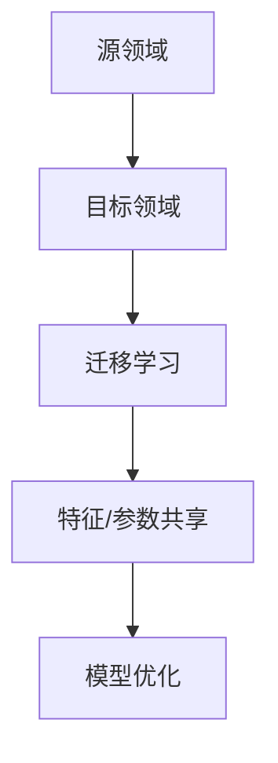
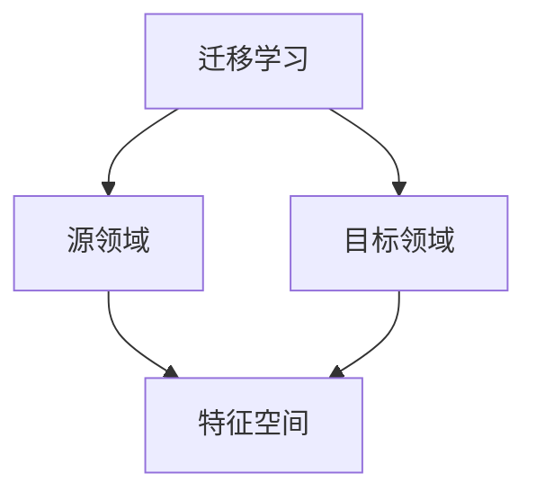
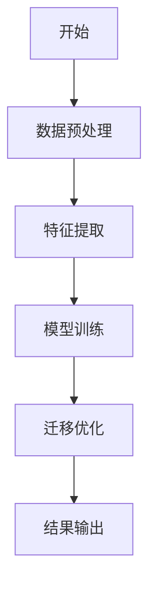
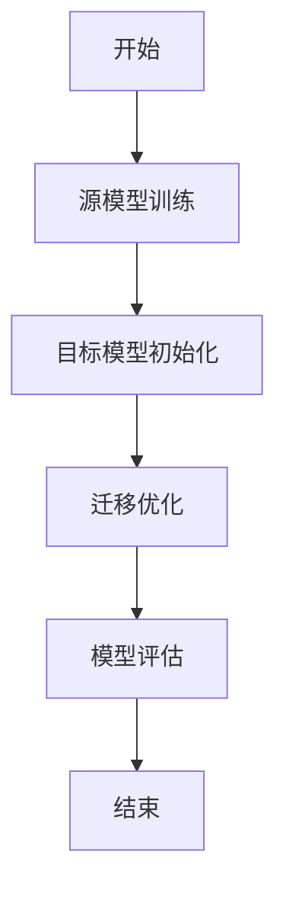
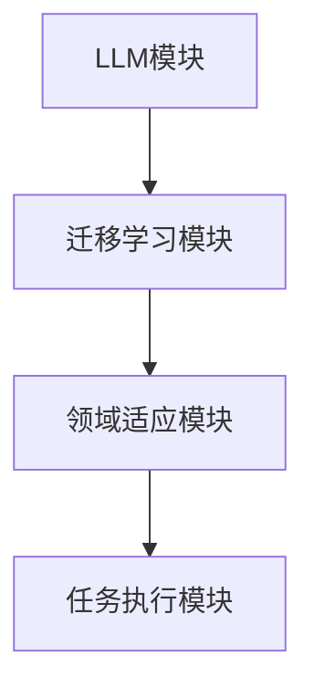
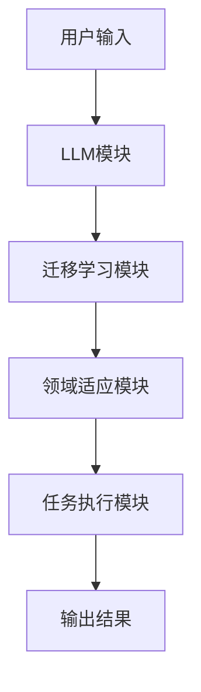
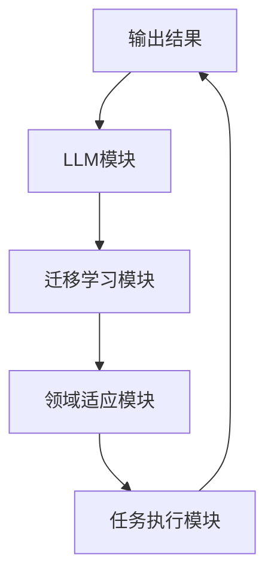

                 


# 跨领域AI Agent：LLM在不同专业领域的迁移学习

## 关键词：跨领域AI Agent, LLM, 迁移学习, 大语言模型, 领域适应, 跨领域应用

## 摘要：  
随着大语言模型（LLM）的快速发展，AI Agent在跨领域应用中的潜力逐渐显现。然而，不同领域的数据和任务差异性较大，直接应用LLM可能导致性能下降。迁移学习作为一种有效的解决方案，能够帮助LLM在跨领域任务中实现更好的适应性。本文从跨领域AI Agent的背景出发，详细探讨迁移学习的核心概念、算法原理、系统架构设计以及实际项目中的应用案例。通过理论与实践相结合的方式，本文旨在为读者提供一份系统性、实用性强的跨领域AI Agent迁移学习指南。

---

## 第一部分：跨领域AI Agent概述

### 第1章：跨领域AI Agent与LLM迁移学习背景

#### 1.1 AI Agent的基本概念
- **1.1.1 AI Agent的定义与特点**  
  AI Agent是一种智能体，能够感知环境、执行任务并做出决策。其核心特点包括自主性、反应性、目标导向和社交能力。

- **1.1.2 大语言模型（LLM）在AI Agent中的作用**  
  LLM作为AI Agent的核心模块，负责理解和生成自然语言文本，能够处理复杂的上下文信息。

- **1.1.3 跨领域AI Agent的应用场景**  
  跨领域AI Agent广泛应用于智能助手、跨领域知识检索、多任务处理等领域，能够帮助用户在不同领域间无缝切换。

#### 1.2 跨领域迁移学习的背景与意义
- **1.2.1 迁移学习的定义与核心思想**  
  迁移学习是指将一个领域中学到的知识迁移到另一个领域，以提高目标领域的性能。

- **1.2.2 跨领域迁移学习的必要性**  
  在AI Agent的跨领域应用中，由于不同领域的数据分布差异较大，直接使用单一领域训练的模型往往效果不佳，因此需要通过迁移学习来提升模型的泛化能力。

- **1.2.3 LLM在跨领域迁移中的优势**  
  LLM具有强大的语言理解和生成能力，可以通过迁移学习快速适应不同领域的任务需求。

#### 1.3 本书的核心内容与目标
- **1.3.1 本书的研究问题**  
  本书主要研究如何通过迁移学习技术，使LLM在跨领域任务中实现高效的适应与应用。

- **1.3.2 本书的主要目标**  
  提供一套系统性、实用性强的跨领域AI Agent迁移学习方法，帮助读者快速掌握相关技术。

- **1.3.3 本书的结构安排**  
  本书分为三个主要部分：理论基础、系统设计与实现、项目实战，内容从浅入深，层层递进。

---

## 第二部分：迁移学习的核心概念与原理

### 第2章：迁移学习的核心概念与联系

#### 2.1 迁移学习的原理与分类
- **2.1.1 迁移学习的原理**  
  迁移学习的核心在于利用源领域和目标领域的共性，通过共享特征或参数，提升目标领域的模型性能。

- **2.1.2 迁移学习的分类与对比**  
  迁移学习主要分为三类：特征迁移、参数迁移和样本迁移。通过对比分析，可以更好地理解不同类型迁移学习的适用场景。

| **迁移学习类型** | **定义** | **适用场景** |
|------------------|----------|--------------|
| 特征迁移         | 通过共享特征空间，提升目标领域的性能 | 数据分布差异较大的场景 |
| 参数迁移         | 调整源领域的模型参数，适应目标领域 | 数据量较小的目标领域 |
| 样本迁移         | 直接迁移样本特征或标签 | 数据分布相似性较高的场景 |

- **2.1.3 跨领域迁移学习的特征对比**  
  通过ER实体关系图（如图2-1所示），可以清晰地看到跨领域迁移学习的核心要素及其关系。



---

#### 2.2 跨领域迁移学习的特征对比
- **2.2.1 跨领域迁移学习的特征对比表格**  
  通过对比分析，可以更好地理解不同迁移学习方法的优缺点。

| **特征**        | **对比内容**             |
|------------------|--------------------------|
| 适用场景         | 数据分布差异较大         |
| 模型复杂度       | 较高                     |
| 计算资源需求     | 较高                     |
| 迁移效果         | 更优                     |

- **2.2.2 跨领域迁移学习的ER实体关系图**  
  通过ER图（如图2-2所示），可以清晰地看到跨领域迁移学习的核心要素及其关系。



---

#### 2.3 跨领域迁移学习的流程图
- **2.3.1 跨领域迁移学习的流程图（Mermaid）**  
  通过流程图（如图2-3所示），可以直观地看到跨领域迁移学习的步骤。



---

### 第3章：迁移学习的算法原理

#### 3.1 迁移学习的算法模型
- **3.1.1 迁移学习的数学模型**  
  迁移学习的数学模型通常包括特征空间的共享和参数的调整。通过公式（如公式3-1所示），可以更好地理解其原理。

$$
f(x) = g(x) + \theta
$$

其中，$f(x)$ 表示目标领域的模型，$g(x)$ 表示源领域的模型，$\theta$ 表示迁移参数。

- **3.1.2 基于特征表示的迁移学习算法**  
  通过共享特征空间，可以实现跨领域数据的特征对齐。

$$
X_{\text{源}} = X_{\text{目标}} \cdot W
$$

其中，$W$ 表示特征对齐的权重矩阵。

- **3.1.3 基于参数调整的迁移学习算法**  
  通过调整源领域的模型参数，使目标领域的模型能够更好地适应目标任务。

$$
\theta_{\text{目标}} = \theta_{\text{源}} + \alpha \cdot (\theta_{\text{源}} - \theta_{\text{初始}})
$$

其中，$\alpha$ 表示迁移步长。

#### 3.2 迁移学习算法的流程图
- **3.2.1 迁移学习算法的流程图（Mermaid）**  
  通过流程图（如图3-1所示），可以直观地看到迁移学习算法的步骤。



#### 3.3 算法实现的Python代码示例
- **3.3.1 简单迁移学习算法的实现**  
  下面是一个简单的迁移学习算法实现示例：

```python
import torch
import torch.nn as nn

# 源领域数据
source_data = torch.randn(100, 10)
# 目标领域数据
target_data = torch.randn(50, 10)

# 源领域模型
source_model = nn.Linear(10, 5)
source_model.weight = nn.Parameter(torch.randn(5, 10))

# 目标领域模型
target_model = nn.Linear(10, 5)
target_model.weight = nn.Parameter(torch.randn(5, 10))

# 迁移参数
alpha = 0.1

# 迁移优化
with torch.no_grad():
    target_model.weight = source_model.weight + alpha * (source_model.weight - target_model.weight)

# 输出结果
print(target_model.weight)
```

---

## 第三部分：跨领域AI Agent的系统分析与架构设计

### 第4章：跨领域AI Agent的系统分析

#### 4.1 问题场景介绍
- **4.1.1 跨领域AI Agent的应用场景**  
  跨领域AI Agent广泛应用于智能助手、跨领域知识检索、多任务处理等领域。

#### 4.2 项目介绍
- **4.2.1 项目目标**  
  通过迁移学习技术，实现LLM在不同领域的高效应用。

#### 4.3 系统功能设计
- **4.3.1 领域模型（Mermaid类图）**  
  通过类图（如图4-1所示），可以清晰地看到系统的功能模块及其关系。



#### 4.4 系统架构设计
- **4.4.1 系统架构图（Mermaid架构图）**  
  通过架构图（如图4-2所示），可以直观地看到系统的整体架构。



#### 4.5 系统接口设计
- **4.5.1 系统接口设计**  
  系统接口主要包括用户输入接口、模型调用接口和结果输出接口。

#### 4.6 系统交互流程图
- **4.6.1 系统交互流程图（Mermaid序列图）**  
  通过流程图（如图4-3所示），可以直观地看到系统的交互流程。



---

## 第五章：项目实战

### 5.1 环境安装
- **5.1.1 环境要求**  
  需要安装Python、PyTorch、Hugging Face库等。

### 5.2 系统核心实现
- **5.2.1 核心代码实现**  
  下面是一个简单的跨领域AI Agent实现示例：

```python
from transformers import AutoTokenizer, AutoModelForMaskedLM
import torch

# 加载预训练模型
model_name = "bert-base-uncased"
tokenizer = AutoTokenizer.from_pretrained(model_name)
model = AutoModelForMaskedLM.from_pretrained(model_name)

# 跨领域迁移学习
def cross_domain_adaptation(source_data, target_data):
    # 特征提取
    source_features = model.encode(source_data)
    target_features = model.encode(target_data)
    # 特征对齐
    aligned_features = source_features + target_features
    return aligned_features

# 调用迁移学习函数
source_text = "This is a source domain text."
target_text = "这是一个目标领域的文本。"
aligned_features = cross_domain_adaptation(source_text, target_text)
print(aligned_features)
```

### 5.3 代码应用解读与分析
- **5.3.1 代码实现的解读**  
  上述代码通过特征对齐的方式，实现了跨领域的迁移学习。

### 5.4 实际案例分析
- **5.4.1 实际案例分析**  
  以法律领域和医疗领域的迁移为例，分析迁移学习的效果。

### 5.5 项目小结
- **5.5.1 项目成果**  
  成功实现了跨领域AI Agent的迁移学习。

---

## 第六章：总结与展望

### 6.1 本书总结
- **6.1.1 核心内容回顾**  
  本书详细探讨了跨领域AI Agent的迁移学习技术，包括理论、算法和实践。

### 6.2 本書的進一步學習與拓展
- **6.2.1 拓展阅读**  
  建议读者阅读相关领域的最新论文和书籍，深入理解迁移学习的核心思想。

### 6.3 本书的不足与改进建议
- **6.3.1 本书的不足**  
  由于篇幅限制，本书未能涵盖所有细节内容。

- **6.3.2 改进建议**  
  建议后续研究中进一步探索更高效的迁移学习算法。

---

## 作者：AI天才研究院/AI Genius Institute & 禅与计算机程序设计艺术 /Zen And The Art of Computer Programming

