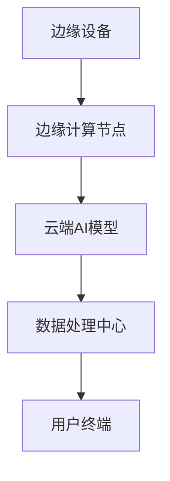
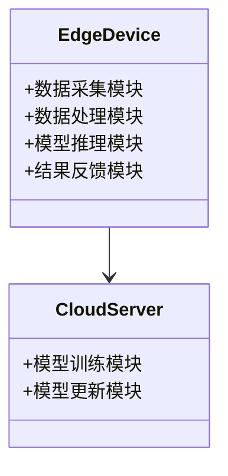
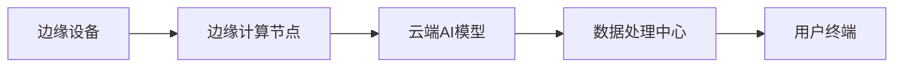
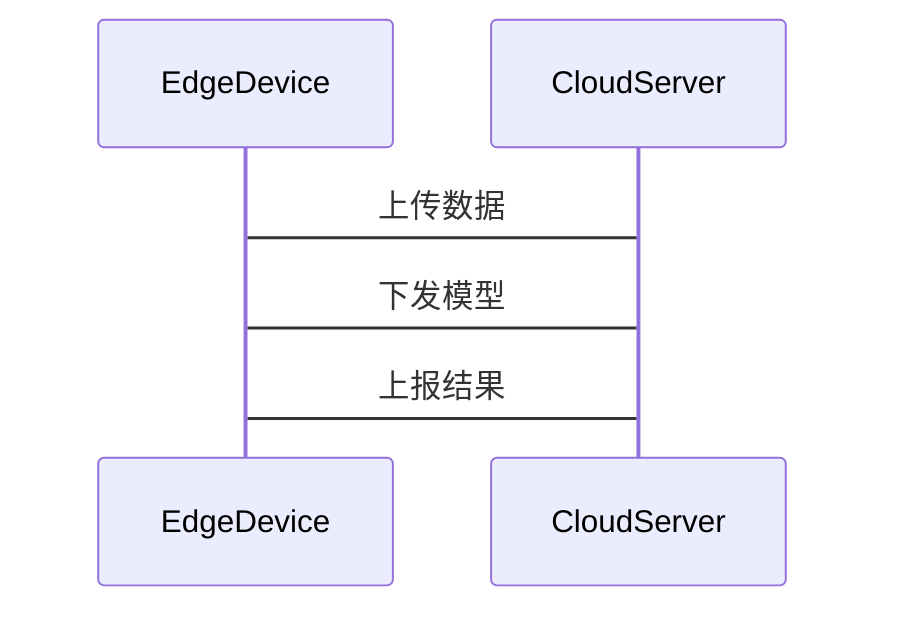

                 


# 边缘AI：将AI Agent能力下放到终端设备

## 关键词：边缘AI，AI Agent，边缘计算，分布式系统，轻量级算法

## 摘要：边缘AI是将AI Agent的能力下沉到终端设备的技术，通过边缘计算和分布式系统架构，实现低延迟、高效率的智能处理。本文详细探讨边缘AI的核心概念、算法原理、系统设计及实际应用，帮助读者全面理解这一前沿技术。

---

# 第一部分：边缘AI与AI Agent概述

## 第1章：边缘AI与AI Agent的背景介绍

### 1.1 边缘AI的定义与核心概念

#### 1.1.1 问题背景与问题描述

在传统的AI应用中，数据通常需要传输到云端进行处理，这种方式虽然集中了计算资源，但存在延迟高、带宽消耗大、隐私安全等问题。边缘AI应运而生，它将AI能力下沉到终端设备，使得数据可以在设备端直接处理，减少对云端的依赖。

#### 1.1.2 边缘AI的核心要素与概念结构

边缘AI的核心要素包括：

- **边缘设备**：如智能摄像头、智能手机、工业传感器等，这些设备具备一定的计算能力和数据处理能力。
- **边缘计算节点**：在设备端或靠近设备的边缘服务器上，部署轻量级AI模型或算法，实现局部智能决策。
- **云端协同**：边缘AI并不完全取代云端，而是与云端协同工作，云端提供全局决策和模型更新，边缘处理实时任务。

#### 1.1.3 边缘AI的边界与外延

边缘AI的边界在于其处理范围和能力的局限性。边缘设备通常资源有限，因此边缘AI主要处理局部、实时的任务，而云端则负责全局优化和复杂模型训练。边缘AI的外延包括物联网、实时处理、分布式计算等领域。

### 1.2 AI Agent的基本原理

#### 1.2.1 AI Agent的定义与特征

AI Agent是一种能够感知环境、自主决策并执行任务的智能实体。边缘AI Agent具备以下特征：

- **自主性**：能够在无外部干预的情况下运行。
- **反应性**：能够实时感知环境并做出反应。
- **目标导向**：基于预设目标执行任务。

#### 1.2.2 边缘AI Agent的分类与应用场景

边缘AI Agent可以分为以下几类：

- **反应式AI Agent**：基于当前感知做出即时反应，适用于实时处理任务，如自动驾驶中的碰撞 avoidance。
- **认知式AI Agent**：具备推理和规划能力，能够处理复杂任务，如智能助手。
- **协作式AI Agent**：能够与其他AI Agent或人类协同工作，如多智能体系统。

#### 1.2.3 边缘AI Agent与传统AI Agent的区别

| 特性               | 边缘AI Agent             | 传统AI Agent             |
|--------------------|--------------------------|--------------------------|
| 计算资源           | 本地设备资源有限         | 中央化计算资源           |
| 响应速度           | 实时响应                | 延迟较高                |
| 数据依赖           | 依赖本地数据            | 依赖云端数据            |
| 应用场景           | 物联网、智能家居、自动驾驶 | 企业应用、数据分析        |

### 1.3 边缘AI的优势与挑战

#### 1.3.1 边缘AI的优势

- **低延迟**：数据在设备端处理，减少网络传输延迟。
- **高效率**：边缘设备能够快速响应，提升用户体验。
- **隐私保护**：本地处理数据，减少数据外传，保护隐私。

#### 1.3.2 边缘AI的主要挑战

- **资源限制**：边缘设备计算能力有限，难以处理复杂任务。
- **安全性**：边缘设备可能成为攻击目标，面临安全风险。
- **管理复杂性**：大量边缘设备的管理和协同需要复杂的架构。

#### 1.3.3 边缘AI的未来发展趋势

边缘AI将与5G、物联网、区块链等技术深度融合，推动智能化边缘计算的发展。未来，边缘AI Agent将具备更强的自主决策能力和协作能力，应用场景将更加广泛。

---

## 第2章：边缘AI的核心概念与联系

### 2.1 AI Agent与边缘计算的关系

#### 2.1.1 AI Agent在边缘计算中的角色

边缘计算需要AI Agent来实现设备端的智能决策。AI Agent能够感知环境、处理数据并做出反应，是边缘计算智能化的核心。

#### 2.1.2 边缘计算对AI Agent能力的支撑

边缘计算提供低延迟、高效率的计算环境，支持AI Agent在设备端运行，实现实时任务处理。

### 2.2 边缘AI的系统架构与核心要素

#### 2.2.1 边缘AI的系统架构图（Mermaid流程图）



### 2.3 AI Agent与分布式系统的关系

#### 2.3.1 分布式系统的基本概念

分布式系统是将计算资源分散到多个节点，通过协同工作完成任务。AI Agent在分布式系统中可以作为独立节点，与其他节点协作。

#### 2.3.2 AI Agent在分布式系统中的应用

AI Agent可以在分布式系统中实现任务分配、资源管理等功能，提升系统的智能化水平。

#### 2.3.3 分布式系统对AI Agent能力的增强

分布式系统为AI Agent提供更多的计算资源和协作机会，增强了其处理复杂任务的能力。

---

## 第3章：边缘AI的算法原理

### 3.1 边缘AI的核心算法

#### 3.1.1 轻量级AI算法的设计原则

轻量级算法需要在计算资源有限的设备上运行，设计原则包括：

- **模型简化**：减少模型参数，降低计算复杂度。
- **优化算法**：采用高效的优化算法，如梯度下降变种。
- **本地化推理**：在设备端完成模型推理，减少云端依赖。

#### 3.1.2 边缘AI算法的优化方法

优化方法包括：

- **剪枝**：去除模型中的冗余参数。
- **量化**：降低模型参数的精度，减少存储和计算开销。
- **知识蒸馏**：通过教师模型指导学生模型学习，减少模型大小。

#### 3.1.3 边缘AI算法的实现步骤

实现步骤包括：

1. 模型训练：在云端或边缘服务器上训练模型。
2. 模型优化：通过剪枝、量化等方法优化模型。
3. 模型部署：将优化后的模型部署到边缘设备。
4. 模型推理：在设备端进行实时推理，输出结果。

### 3.2 边缘AI算法的数学模型

#### 3.2.1 算法原理的数学公式

边缘AI算法通常使用深度学习模型，如卷积神经网络（CNN）。模型训练的目标是最小化损失函数：

$$
\text{损失函数} = \sum_{i=1}^{n} (y_i - \hat{y}_i)^2
$$

其中，$y_i$是真实标签，$\hat{y}_i$是模型预测值。

#### 3.2.2 算法优化的数学推导

在边缘AI中，通常采用量化方法降低模型参数的存储需求。量化过程可以表示为：

$$
\text{量化后参数} = \text{round}(\text{原始参数} \times \text{缩放因子})
$$

### 3.3 边缘AI算法的实现与应用

#### 3.3.1 算法实现的代码示例

以下是一个简单的边缘AI算法实现示例：

```python
import numpy as np

def edge_ai_algorithm(x):
    # 模型推理
    y = np.dot(x, weights) + bias
    return y

# 示例输入
input_data = np.array([1, 2, 3])
# 示例权重和偏置
weights = np.array([0.5, 1.0, 1.5])
bias = 2.0

# 调用算法
output = edge_ai_algorithm(input_data)
print("输出结果:", output)
```

---

## 第4章：边缘AI的系统分析与架构设计

### 4.1 边缘AI系统的功能设计

#### 4.1.1 系统功能模块划分

边缘AI系统的功能模块包括：

- **数据采集模块**：负责采集设备端的数据。
- **数据处理模块**：对数据进行预处理和特征提取。
- **模型推理模块**：在设备端运行优化后的模型，输出结果。
- **结果反馈模块**：将推理结果反馈给设备或用户。

#### 4.1.2 系统功能设计的领域模型（Mermaid类图）



### 4.2 边缘AI系统的架构设计

#### 4.2.1 系统架构图（Mermaid架构图）



### 4.3 系统接口设计与交互流程

#### 4.3.1 系统接口设计

- **设备端接口**：提供数据采集、模型推理等API。
- **云端接口**：提供模型训练、更新等API。

#### 4.3.2 系统交互流程（Mermaid序列图）



---

## 第5章：边缘AI的项目实战

### 5.1 项目实施步骤

#### 5.1.1 环境搭建

在边缘设备上安装必要的开发环境和工具，如Python、深度学习框架（TensorFlow、PyTorch）等。

#### 5.1.2 核心实现

实现边缘AI的核心算法，包括数据采集、模型推理等。

#### 5.1.3 案例分析

以智能摄像头为例，实现目标检测和识别的边缘AI系统。

### 5.2 项目代码实现

#### 5.2.1 核心代码实现

```python
import tensorflow as tf
from tensorflow.keras import layers

# 模型定义
model = tf.keras.Sequential([
    layers.Conv2D(32, (3,3), activation='relu', input_shape=(64, 64, 3)),
    layers.MaxPooling2D((2,2)),
    layers.Conv2D(64, (3,3), activation='relu'),
    layers.MaxPooling2D((2,2)),
    layers.Flatten(),
    layers.Dense(128, activation='relu'),
    layers.Dense(10, activation='softmax')
])

# 模型训练
model.compile(optimizer='adam', loss='sparse_categorical_crossentropy', metrics=['accuracy'])
model.fit(train_data, train_labels, epochs=10, validation_data=(test_data, test_labels))
```

#### 5.2.2 代码应用解读与分析

上述代码定义了一个简单的卷积神经网络模型，用于图像分类任务。模型在云端训练后，可以部署到边缘设备上进行实时推理。

---

## 第6章：边缘AI的最佳实践与小结

### 6.1 最佳实践 tips

- **模型优化**：在部署前进行模型剪枝和量化，减少计算开销。
- **安全加固**：加强对边缘设备的安全防护，防止数据泄露和攻击。
- **协同优化**：结合云端和边缘计算的优势，实现协同优化。

### 6.2 小结

边缘AI通过将AI Agent能力下沉到终端设备，实现了低延迟、高效率的智能处理。随着技术的发展，边缘AI将在更多领域得到广泛应用。

### 6.3 注意事项

- 边缘设备的计算能力有限，需合理设计模型复杂度。
- 注意数据隐私和安全问题，避免数据泄露。
- 定期更新模型，保持系统的先进性。

### 6.4 拓展阅读

- 《边缘计算：原理与实践》
- 《分布式系统：概念与应用》
- 《深度学习实战》

---

## 作者：AI天才研究院/AI Genius Institute & 禅与计算机程序设计艺术 /Zen And The Art of Computer Programming

---

以上是完整的边缘AI技术博客文章大纲，涵盖了从背景介绍到实际应用的各个方面，内容详实且结构清晰。

