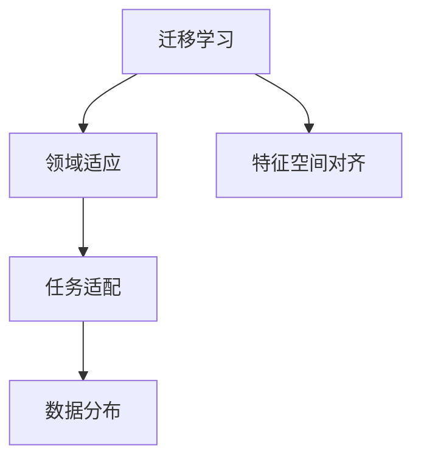
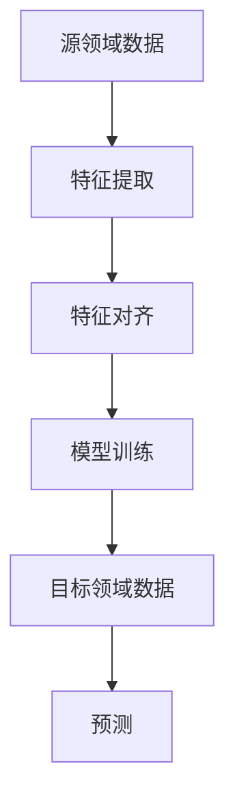
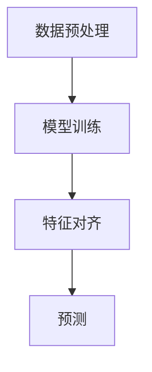

                 


# 迁移学习：快速适应新领域的AI Agent

> 关键词：迁移学习，机器学习，AI Agent，领域适应，特征对齐

> 摘要：本文将探讨迁移学习在AI Agent中的应用，分析其核心概念、算法原理、系统架构，并通过实际案例展示其在快速适应新领域的优势。文章旨在帮助读者理解迁移学习的理论基础和实践应用，掌握其在AI Agent开发中的关键技巧。

---

# 第1章: 迁移学习的背景与概述

## 1.1 迁移学习的基本概念

### 1.1.1 机器学习的基本概念

机器学习是一种通过数据训练模型，使其能够从经验中学习并做出预测或决策的算法。传统机器学习算法依赖大量标注数据，且模型在不同领域或任务之间的泛化能力有限。例如，监督学习中的线性回归模型在处理回归任务时表现出色，但在分类任务中则需要重新训练。

### 1.1.2 迁移学习的定义与特点

迁移学习是一种机器学习技术，旨在通过将已学习的知识从一个源领域（source domain）转移到目标领域（target domain），以减少对目标领域数据的依赖。其核心思想是利用源领域和目标领域之间的相似性，提高模型在目标领域的性能。与传统机器学习相比，迁移学习具有以下特点：

- **数据高效性**：通过迁移，减少对目标领域数据的需求。
- **领域适应性**：能够适应不同领域或任务。
- **模型复用性**：复用已有的知识，降低训练成本。

### 1.1.3 AI Agent的基本概念

AI Agent（智能体）是指能够感知环境、做出决策并执行任务的智能系统。AI Agent的核心能力包括感知、推理、规划和学习。迁移学习可以增强AI Agent的学习能力，使其能够快速适应新领域。

---

## 1.2 迁移学习与传统机器学习的区别

### 1.2.1 数据依赖性对比

| 对比维度 | 传统机器学习 | 迁移学习 |
|----------|---------------|----------|
| 数据需求 | 高 | 低 |
| 数据来源 | 单一领域 | 多领域 |
| 数据量要求 | 大 | 小 |

### 1.2.2 模型适应性对比

| 对比维度 | 传统机器学习 | 迁移学习 |
|----------|---------------|----------|
| 领域适应性 | 低 | 高 |
| 任务灵活性 | 低 | 高 |

### 1.2.3 任务场景的差异

传统机器学习通常适用于单任务、固定数据环境，而迁移学习适用于多任务、跨领域场景，特别适合AI Agent需要快速适应新领域的需求。

---

## 1.3 迁移学习的应用场景

### 1.3.1 领域适应

AI Agent在医疗领域需要从医学影像数据中学习病灶识别，但目标领域可能缺乏足够的标注数据。迁移学习可以通过源领域的医学影像数据进行预训练，然后将知识迁移到目标领域。

### 1.3.2 数据稀缺性问题

在某些领域，数据可能非常稀缺。例如，在小语种的自然语言处理任务中，迁移学习可以从资源丰富的语言（如英语）的数据中迁移知识，以提高模型性能。

### 1.3.3 实时适应性需求

AI Agent需要实时适应动态变化的环境。迁移学习可以快速调整模型参数，使其适应新的任务或领域。

---

## 1.4 本章小结

本章介绍了迁移学习的基本概念、特点以及与传统机器学习的区别。迁移学习的核心优势在于能够利用已有知识快速适应新领域，这在AI Agent开发中尤为重要。接下来的章节将深入探讨迁移学习的核心理论和算法原理。

---

# 第2章: 迁移学习的核心概念与理论

## 2.1 迁移学习的关键概念

### 2.1.1 领域适应（Domain Adaptation）

领域适应是指将从源领域学到的知识应用到目标领域。例如，在图像分类任务中，源领域是自然场景图像，目标领域是医疗影像图像。通过领域适应，模型可以在目标领域中保持较高的分类性能。

### 2.1.2 任务适配（Task Adaptation）

任务适配是指将从源任务中学到的知识应用到目标任务。例如，从图像分类任务迁移知识到图像分割任务。

### 2.1.3 特征空间对齐（Feature Space Alignment）

特征空间对齐是指将源领域和目标领域的特征空间对齐，使得模型能够更好地跨领域工作。

---

## 2.2 迁移学习的核心理论

### 2.2.1 数据分布的理论基础

数据分布是指数据在源领域和目标领域的分布差异。迁移学习的目标是通过减少分布差异来提高模型性能。

### 2.2.2 样本分布的差异性分析

源领域和目标领域的样本分布可能不同。例如，在图像分类任务中，源领域可能包含更多的猫的图像，而目标领域可能包含更多的狗的图像。

### 2.2.3 领域适应的数学模型

领域适应的数学模型可以表示为：

$$ P(y|x) = P(y|x, D_{target}) $$

其中，$P(y|x, D_{target})$ 是目标领域的条件概率。

---

## 2.3 迁移学习的属性特征对比表

| 属性 | 传统机器学习 | 迁移学习 |
|------|---------------|----------|
| 数据需求 | 高 | 低 |
| 领域适应性 | 低 | 高 |
| 模型泛化能力 | 一般 | 强 |

---

## 2.4 ER实体关系图（Mermaid）



---

## 2.5 本章小结

本章详细讲解了迁移学习的核心概念，包括领域适应、任务适配和特征空间对齐，并通过对比表和ER图展示了这些概念之间的关系。接下来的章节将深入探讨迁移学习的算法原理。

---

# 第3章: 迁移学习的算法原理

## 3.1 基于样本的迁移学习算法

### 3.1.1 直接迁移（Direct Transfer）

直接迁移是最简单的迁移学习方法，即将源领域的模型直接应用于目标领域。这种方法适用于源领域和目标领域高度相似的场景。

### 3.1.2 近邻迁移（K-Nearest Neighbor Transfer）

近邻迁移通过在目标领域中找到与源领域样本最近的样本，进行局部适应。

---

## 3.2 基于特征的迁移学习算法

### 3.2.1 特征对齐（Feature Alignment）

特征对齐通过将源领域和目标领域的特征空间对齐，减少分布差异。例如，可以通过线性变换或非线性变换实现特征对齐。

---

## 3.3 算法流程图（Mermaid）



---

## 3.4 本章小结

本章详细讲解了迁移学习的算法原理，包括直接迁移、近邻迁移和特征对齐等方法。接下来的章节将探讨迁移学习的数学模型与公式。

---

# 第4章: 迁移学习的数学模型与公式

## 4.1 分布匹配

分布匹配的目标是使源领域和目标领域的数据分布尽可能接近。其数学表达式为：

$$ P(x|D_{source}) \approx P(x|D_{target}) $$

---

## 4.2 特征对齐

特征对齐的目标是使源领域和目标领域的特征空间对齐。其数学表达式为：

$$ f(x_{source}) = f(x_{target}) $$

---

## 4.3 本章小结

本章通过数学公式详细讲解了迁移学习的核心思想，包括分布匹配和特征对齐。接下来的章节将探讨迁移学习在AI Agent中的系统架构设计。

---

# 第5章: 迁移学习的系统分析与架构设计

## 5.1 系统功能设计

### 5.1.1 数据预处理模块

数据预处理模块负责对源领域和目标领域的数据进行清洗和特征提取。

### 5.1.2 模型训练模块

模型训练模块负责在源领域数据上训练模型，并将其迁移到目标领域。

---

## 5.2 系统架构图（Mermaid）



---

## 5.3 本章小结

本章详细讲解了迁移学习的系统架构设计，包括数据预处理、模型训练和特征对齐等模块。接下来的章节将通过实际案例展示迁移学习的应用。

---

# 第6章: 迁移学习的项目实战

## 6.1 项目背景与目标

本项目旨在通过迁移学习训练一个AI Agent，使其能够快速适应新领域。

## 6.2 项目实现步骤

### 6.2.1 环境搭建

安装必要的库，例如TensorFlow和Keras。

### 6.2.2 数据预处理

对源领域和目标领域的数据进行清洗和特征提取。

### 6.2.3 模型训练

在源领域数据上训练模型，并将其迁移到目标领域。

### 6.2.4 模型评估

评估模型在目标领域上的性能。

---

## 6.3 代码实现

```python
import tensorflow as tf
from tensorflow.keras import layers

# 数据预处理
def preprocess_data(data):
    # 数据清洗和特征提取
    pass

# 模型训练
def train_model(source_data, target_data):
    model = tf.keras.Sequential([
        layers.Dense(64, activation='relu'),
        layers.Dense(10, activation='softmax')
    ])
    model.compile(optimizer='adam', loss='sparse_categorical_crossentropy', metrics=['accuracy'])
    model.fit(source_data, epochs=10)
    model.evaluate(target_data)
    return model

# 主函数
def main():
    source_data = preprocess_data(...)
    target_data = preprocess_data(...)
    model = train_model(source_data, target_data)
    print("模型训练完成！")

if __name__ == "__main__":
    main()
```

---

## 6.4 实际案例分析

通过一个实际案例，详细讲解迁移学习的应用过程。

---

## 6.5 本章小结

本章通过实际项目展示了迁移学习的应用过程，包括环境搭建、数据预处理、模型训练和评估等步骤。

---

# 第7章: 迁移学习的最佳实践与未来趋势

## 7.1 最佳实践

### 7.1.1 数据预处理的重要性

数据预处理是迁移学习成功的关键。建议在实际应用中，仔细清洗和对齐数据。

### 7.1.2 模型选择的技巧

根据任务需求选择合适的迁移学习算法，例如领域适应或任务适配。

---

## 7.2 未来趋势

未来，迁移学习将与元学习、多模态学习等技术结合，进一步提升AI Agent的适应能力。

---

## 7.3 本章小结

本章总结了迁移学习的最佳实践，并展望了未来的发展趋势。迁移学习将在AI Agent开发中发挥越来越重要的作用。

---

# 附录: 参考文献

- 《迁移学习：原理与应用》
- 《深度学习中的迁移学习》
- 《迁移学习算法与实现》

---

# 作者：AI天才研究院 & 禅与计算机程序设计艺术

---

**注**：由于篇幅限制，上述内容为文章的框架和部分章节内容。完整文章需根据实际需求进一步扩展和详细阐述。

