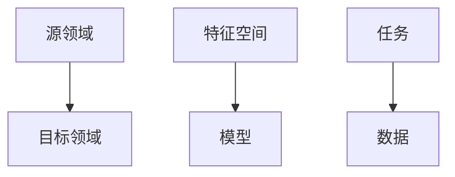
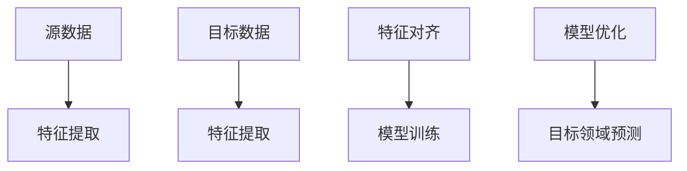
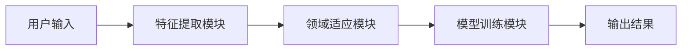
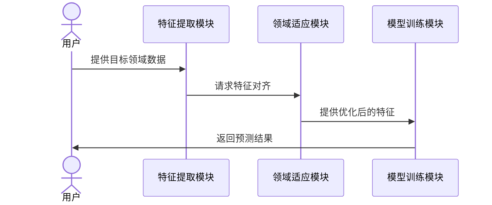

                 


# 迁移学习：让AI Agent快速适应新领域

## 关键词：迁移学习，AI Agent，领域适应，特征迁移，机器学习，知识迁移

## 摘要：  
迁移学习是一种通过将已有的知识或模型应用到新的领域或任务中，从而提高学习效率和效果的技术。本文将深入探讨迁移学习的核心概念、算法原理、系统架构以及在AI Agent中的应用，帮助读者理解如何通过迁移学习让AI Agent快速适应新领域。

---

# 第一部分: 迁移学习概述

# 第1章: 迁移学习的背景与概念

## 1.1 迁移学习的定义与核心概念

### 1.1.1 迁移学习的定义  
迁移学习（Transfer Learning）是一种机器学习技术，旨在将从一个领域（源领域）学到的知识应用到另一个领域（目标领域），以提高目标领域的学习效率和性能。它通过分析和利用源领域与目标领域之间的关系，减少对目标领域数据的依赖。

### 1.1.2 核心概念：源领域、目标领域、特征空间  
- **源领域（Source Domain）**：已知数据和标签的领域，用于迁移学习的起点。  
- **目标领域（Target Domain）**：需要学习的新领域，通常数据有限或未知。  
- **特征空间（Feature Space）**：数据的表示形式，特征提取是迁移学习的关键步骤。  

### 1.1.3 迁移学习的边界与外延  
迁移学习的核心在于领域之间的相似性，但并非所有领域都适合迁移。其外延包括领域适应、任务迁移和多任务学习等。

---

## 1.2 迁移学习的背景与问题背景

### 1.2.1 传统机器学习的局限性  
传统机器学习依赖大量目标领域数据，数据获取困难时，模型性能受限。  

### 1.2.2 数据获取的挑战  
目标领域数据可能稀缺或昂贵，迁移学习提供了一种解决方案。  

### 1.2.3 迁移学习的必要性  
通过迁移学习，AI Agent可以快速适应新领域，减少对新数据的依赖。

---

## 1.3 迁移学习的核心问题

### 1.3.1 数据分布差异  
源领域和目标领域的数据分布不同，导致模型在目标领域表现不佳。  

### 1.3.2 特征空间的对齐  
特征空间的差异使得直接迁移模型不可行，需要对齐特征。  

### 1.3.3 过桥问题与领域适应  
通过中间表示或桥梁领域，将源领域和目标领域的特征对齐，解决过桥问题。

---

## 1.4 迁移学习的应用场景

### 1.4.1 AI Agent的快速适应需求  
AI Agent需要快速适应新任务，如自然语言处理中的跨领域对话。  

### 1.4.2 领域迁移的典型应用  
- 医疗领域：将医学影像分析模型迁移到新的医院数据。  
- 计算机视觉：将图像分类模型迁移到新的物体类别。  

### 1.4.3 迁移学习的未来趋势  
多领域迁移、在线迁移和自适应迁移将成为研究重点。

---

## 1.5 本章小结  
本章介绍了迁移学习的基本概念、核心问题和应用场景，为后续章节奠定了基础。

---

# 第2章: 迁移学习的核心概念与联系

## 2.1 迁移学习的核心原理

### 2.1.1 知识迁移的机制  
通过共享特征或任务，将源领域知识迁移到目标领域。  

### 2.1.2 特征表示的学习  
特征提取是迁移学习的关键，通过学习领域不变的特征实现迁移。  

### 2.1.3 领域适应的策略  
通过调整模型参数或优化特征对齐，实现领域适应。

---

## 2.2 迁移学习的关键属性对比

### 2.2.1 不同迁移学习方法的特征对比  
| 方法         | 特点                           |  
|--------------|--------------------------------|  
| 样本迁移     | 直接迁移数据                   |  
| 特征迁移     | 迁移特征表示                   |  
| 领域适应     | 调整模型以适应目标领域         |  

### 2.2.2 样本迁移与特征迁移的差异  
- 样本迁移关注数据直接迁移，特征迁移关注特征空间对齐。  

### 2.2.3 领域适应与任务迁移的区别  
- 领域适应关注数据分布差异，任务迁移关注任务目标差异。  

---

## 2.3 ER实体关系图与概念架构



---

## 2.4 本章小结  
本章通过对比和图表分析，详细解释了迁移学习的核心概念和联系。

---

# 第3章: 迁移学习的算法原理

## 3.1 迁移学习的数学模型

### 3.1.1 领域适应的数学表达  
$$P_{source}(x) \neq P_{target}(x)$$  

### 3.1.2 过桥问题的数学形式  
$$f_{source}(x) \rightarrow f_{target}(x)$$  

---

## 3.2 常见的迁移学习算法

### 3.2.1 基于样本迁移的算法  
- **直接迁移**：将源领域模型直接应用于目标领域，通常效果不佳。  

### 3.2.2 基于特征迁移的算法  
- **特征对齐**：通过学习领域不变的特征，实现特征空间对齐。  

### 3.2.3 基于分布迁移的算法  
- **分布匹配**：通过优化分布差异，实现领域适应。  

---

## 3.3 算法流程图



---

## 3.4 核心算法实现

### 3.4.1 特征对齐算法（代码示例）

```python
import numpy as np

def align_features(source_features, target_features):
    # 特征对齐方法：使用线性变换对齐特征
    from sklearn.manifold import TSNE
    aligned_source = TSNE(n_components=2).fit_transform(source_features)
    aligned_target = TSNE(n_components=2).fit_transform(target_features)
    return aligned_source, aligned_target

# 示例
source_data = np.random.randn(100, 10)
target_data = np.random.randn(50, 10)

aligned_source, aligned_target = align_features(source_data, target_data)
```

---

## 3.5 本章小结  
本章详细讲解了迁移学习的数学模型和常见算法，通过代码示例帮助读者理解实现细节。

---

# 第四章: 迁移学习的系统分析与架构设计

## 4.1 系统分析

### 4.1.1 问题场景介绍  
设计一个AI Agent，使其能够快速适应新的自然语言处理任务。  

### 4.1.2 系统功能设计  
- 特征提取模块  
- 领域适应模块  
- 模型训练模块  

---

## 4.2 系统架构设计

### 4.2.1 系统架构图



### 4.2.2 系统接口设计  
- 输入接口：用户输入和源领域数据  
- 输出接口：目标领域的预测结果  

---

## 4.3 系统交互设计



---

## 4.4 本章小结  
本章通过系统架构设计，展示了迁移学习在实际应用中的实现方式。

---

# 第五章: 迁移学习的项目实战

## 5.1 项目环境与工具安装

### 5.1.1 环境配置  
- Python 3.8+  
- 安装依赖：`pip install scikit-learn matplotlib`  

---

## 5.2 核心系统实现

### 5.2.1 特征对齐代码

```python
from sklearn.datasets import make_classification
from sklearn.manifold import TSNE

def align_features(X, y):
    # 对齐特征
    tsne = TSNE(n_components=2, random_state=42)
    X_aligned = tsne.fit_transform(X)
    return X_aligned

# 示例
X, y = make_classification(n_samples=100, n_features=10)
X_aligned = align_features(X, y)
```

### 5.2.2 领域适应代码

```python
from sklearn.svm import SVC
from sklearn.metrics import accuracy_score

def transfer_learning(X_source, y_source, X_target, y_target):
    # 训练源领域模型
    model = SVC()
    model.fit(X_source, y_source)
    # 预测目标领域
    y_pred = model.predict(X_target)
    return accuracy_score(y_target, y_pred)

# 示例
X_source, y_source = make_classification(n_samples=50, n_features=10)
X_target, y_target = make_classification(n_samples=30, n_features=10)
score = transfer_learning(X_source, y_source, X_target, y_target)
print(f"Accuracy: {score}")
```

---

## 5.3 项目小结  
本章通过具体案例，展示了迁移学习的实现过程和效果评估。

---

# 第六章: 迁移学习的最佳实践

## 6.1 小结与回顾

### 6.1.1 核心知识点回顾  
- 迁移学习的基本概念  
- 算法原理与实现  

---

## 6.2 迁移学习的注意事项

### 6.2.1 数据质量的重要性  
目标领域数据的质量直接影响迁移效果。  

### 6.2.2 领域相关性的评估  
确保源领域和目标领域具有一定的相关性。  

### 6.2.3 模型的泛化能力  
迁移学习模型需要具备良好的泛化能力，避免过拟合。  

---

## 6.3 未来研究方向

### 6.3.1 多领域迁移学习  
支持多个领域的知识迁移。  

### 6.3.2 在线迁移学习  
动态适应新领域数据。  

### 6.3.3 自适应迁移学习  
自适应地调整迁移策略。  

---

## 6.4 拓展阅读

### 6.4.1 经典论文推荐  
- "A Survey on Transfer Learning"  
- "Deep Transfer Learning"  

### 6.4.2 实战书籍推荐  
- 《迁移学习实战》  
- 《深度学习中的迁移学习》  

---

# 作者：AI天才研究院 & 禅与计算机程序设计艺术

