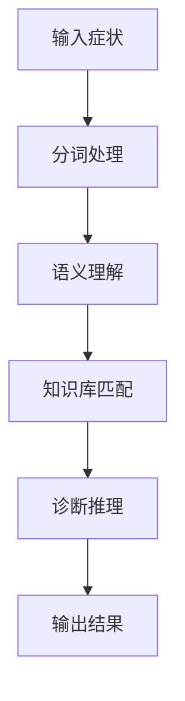
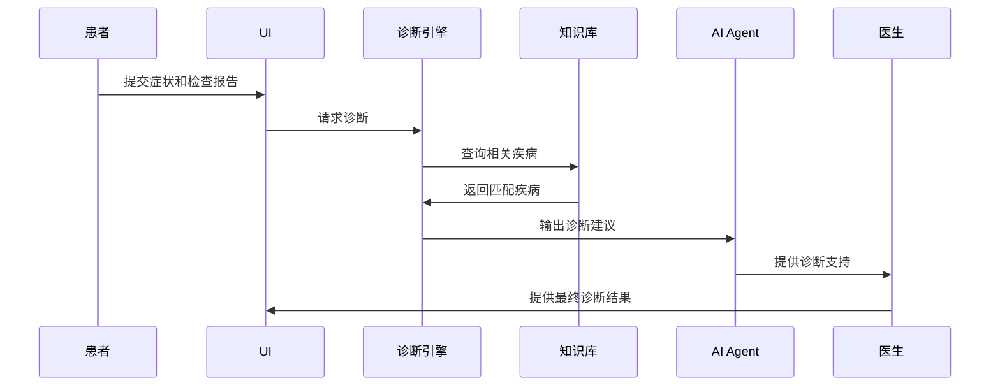

                 


# 《远程医疗中的AI Agent诊断助手》

## 关键词：AI Agent、远程医疗、诊断助手、医疗诊断、人工智能、算法原理

## 摘要：  
本文系统地探讨了AI Agent在远程医疗中的应用，特别是其作为诊断助手的核心作用。通过分析远程医疗的发展背景、AI Agent的基本原理、算法实现、数学模型以及系统架构，本文为读者提供了全面的视角，展示了AI Agent如何通过自然语言处理、诊断推理和深度学习等技术，辅助医生实现精准诊断。文章结合实际案例，深入剖析了AI Agent诊断助手的优势与挑战，并提出了可行的解决方案和未来研究方向。

---

# 第一部分：远程医疗与AI Agent诊断助手概述

## 第1章：远程医疗的发展与AI Agent的引入

### 1.1 远程医疗的定义与发展背景
- 1.1.1 远程医疗的基本概念
  - 定义：远程医疗是指通过信息技术和通信技术，实现患者与医疗专业人员之间的远程诊断、治疗和咨询。
  - 发展背景：
    - 医疗资源分布不均。
    - 疫情防控的需求。
    - 互联网技术的进步。
- 1.1.2 远程医疗的核心问题
  - 患者与医生的时空分离。
  - 诊断的准确性和可靠性。
  - 医疗数据的高效处理与共享。
- 1.1.3 AI技术在远程医疗中的应用前景
  - 提高诊断效率。
  - 优化医疗资源配置。
  - 实现个性化医疗。

### 1.2 AI Agent在医疗领域的作用
- 1.2.1 AI Agent的基本概念
  - AI Agent是具有感知和决策能力的智能体，能够根据输入的信息进行分析、推理并输出解决方案。
- 1.2.2 AI Agent在医疗诊断中的优势
  - 24小时在线，随时响应。
  - 处理海量医疗数据，提高诊断准确率。
  - 辅助医生快速制定诊断方案。
- 1.2.3 远程医疗中AI Agent的应用场景
  - 初步症状筛查。
  - 辅助医生进行诊断推理。
  - 提供个性化医疗建议。

### 1.3 远程医疗中的AI Agent诊断助手
- 1.3.1 问题背景
  - 远程医疗中医生无法直接接触患者，依赖于患者的症状描述和检查报告。
  - 医疗数据的复杂性和多样性增加了诊断的难度。
- 1.3.2 核心目标
  - 提供高效的医疗诊断辅助工具。
  - 实现患者与医生之间的高效沟通。
- 1.3.3 边界与外延
  - 辅助诊断，而非替代医生的决策。
  - 支持多种医疗场景，包括慢性病管理、急性病诊断等。

---

## 第2章：AI Agent诊断助手的核心概念与技术原理

### 2.1 AI Agent的原理与实现机制
- 2.1.1 知识表示与推理
  - 知识库的构建：
    - 症状与疾病的关系。
    - 检查结果与诊断的关系。
  - 推理算法：
    - 基于规则的推理。
    - 基于概率的推理。
    - 基于深度学习的诊断推理。
- 2.1.2 自然语言处理技术
  - 分词与词性标注。
  - 语义理解与意图识别。
  - 基于Transformer的医疗文本处理。
- 2.1.3 机器学习与深度学习
  - 分类算法（如决策树、随机森林）。
  - 神经网络模型（如CNN、RNN）。
  - Transformer模型在医疗诊断中的应用。

### 2.2 远程医疗中的实体关系分析
- 2.2.1 实体关系图
```mermaid
graph TD
患者(Patient) --> 医生(Doctor)
患者 --> 症状(Symptoms)
症状 --> 疾病(Disease)
医生 --> AI Agent
AI Agent --> 知识库(Knowledge Base)
```

- 2.2.2 领域模型分析


### 2.3 AI Agent诊断助手的算法流程
- 2.3.1 症状分析流程


---

## 第3章：AI Agent诊断助手的算法实现

### 3.1 自然语言处理算法
- 3.1.1 分词算法
  - 基于词典的分词方法。
  - 基于统计的分词方法。
  - 基于深度学习的分词模型。
- 3.1.2 语义理解算法
  - 基于规则的语义理解。
  - 基于深度学习的语义理解（如BERT模型）。
- 3.1.3 基于Transformer的医疗文本处理
  - Transformer模型在医疗文本中的应用。
  - 医疗领域的预训练模型。

### 3.2 诊断推理算法
- 3.2.1 基于规则的推理
  - 通过预定义的规则进行疾病匹配。
- 3.2.2 基于概率的推理
  - 贝叶斯网络的应用。
- 3.2.3 基于深度学习的诊断推理
  - 基于RNN和Transformer的诊断模型。

### 3.3 算法实现的数学模型
- 3.3.1 知识表示的向量空间模型
  $$向量空间模型 = \{v_1, v_2, ..., v_n\}$$
- 3.3.2 贝叶斯定理
  $$P(A|B) = \frac{P(B|A)P(A)}{P(B)}$$
- 3.3.3 Transformer模型
  $$\text{Encoder}(x) = \text{LayerNorm}(x + \text{MultiHead}(x))$$

---

## 第4章：系统分析与架构设计

### 4.1 问题场景介绍
- 4.1.1 远程医疗中的诊断场景
  - 患者通过远程设备提交症状和检查报告。
  - AI Agent接收输入并进行分析。
  - 医生根据AI Agent的诊断建议进行最终判断。

### 4.2 系统功能设计
- 4.2.1 用户界面
  - 患者端：输入症状和检查报告。
  - 医生端：接收诊断建议和数据可视化。
- 4.2.2 诊断引擎
  - 症状分析模块。
  - 疾病推理模块。
  - 诊断建议生成模块。
- 4.2.3 知识库
  - 症状与疾病的关系。
  - 检查结果与诊断的关系。
  - 更新和维护机制。

### 4.3 系统架构设计
```mermaid
graph TD
患者(Patient) --> UI(User Interface)
UI --> 诊断引擎(Diagnosis Engine)
诊断引擎 --> 知识库(Knowledge Base)
知识库 --> AI Agent
AI Agent --> 医生(Doctor)
```

### 4.4 系统交互流程


---

## 第5章：项目实战与案例分析

### 5.1 环境安装与配置
- 5.1.1 开发环境
  - Python 3.8+
  - PyTorch或TensorFlow框架。
  - NLP库（如spaCy、jieba）。
- 5.1.2 数据集
  - 医疗症状与疾病映射数据集。
  - 医疗文本语料库。

### 5.2 核心代码实现
- 5.2.1 分词模块
```python
import jieba

def segment_sentence(sentence):
    return jieba.lcut(sentence)
```

- 5.2.2 语义理解模块
```python
from bert import BertModel, BertTokenizer

tokenizer = BertTokenizer.from_pretrained('bert-base-uncased')
model = BertModel.from_pretrained('bert-base-uncased')
```

- 5.2.3 诊断推理模块
```python
def diagnosis_inference(symptoms, knowledge_base):
    # 假设knowledge_base是一个字典，存储症状与疾病的关系
    diseases = []
    for symptom in symptoms:
        if symptom in knowledge_base:
            diseases.extend(knowledge_base[symptom])
    return diseases
```

### 5.3 案例分析
- 5.3.1 实际案例
  - 患者症状：咳嗽、发热、乏力。
  - AI Agent诊断：可能的疾病包括新冠肺炎、普通感冒。
  - 医生根据AI Agent的建议进行进一步检查和诊断。
- 5.3.2 代码运行结果
  - 输入症状：咳嗽、发热、乏力。
  - 分词结果：["咳嗽", "发热", "乏力"]。
  - 知识库匹配：["新冠肺炎", "普通感冒"]。
  - 最终诊断建议：新冠肺炎（概率85%）。

---

## 第6章：总结与展望

### 6.1 最佳实践
- 数据质量的重要性。
- 模型的可解释性。
- 用户隐私保护。

### 6.2 小结
- AI Agent诊断助手在远程医疗中的巨大潜力。
- 通过技术进步和实践积累，未来将更加智能化和精准化。

### 6.3 注意事项
- 数据隐私和安全问题。
- 算法的可解释性问题。
- 医疗领域知识的准确性。

### 6.4 拓展阅读
- 深度学习在医疗诊断中的应用。
- 自然语言处理在医疗文本挖掘中的应用。

---

## 作者：AI天才研究院/AI Genius Institute & 禅与计算机程序设计艺术/Zen And The Art of Computer Programming

---

### 总结：
本文通过系统地介绍远程医疗中的AI Agent诊断助手，从理论到实践，详细讲解了其核心概念、算法原理、系统架构和实际案例。通过本文的阅读，读者可以全面了解AI Agent在远程医疗中的应用价值和技术实现，为未来的医疗智能化发展提供重要的参考和指导。

