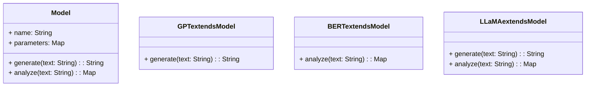
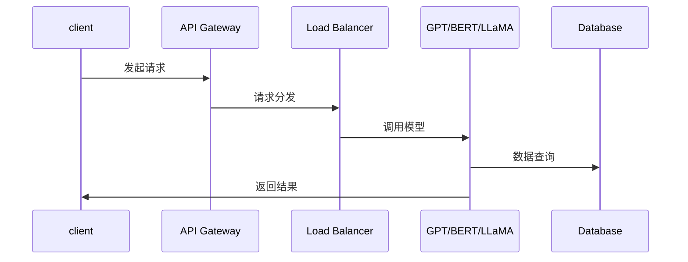

                 


# 选择合适的LLM：OpenAI GPT vs. Google BERT vs. Facebook LLaMA

## 关键词：大语言模型（LLM）、OpenAI GPT、Google BERT、Facebook LLaMA、自然语言处理（NLP）、模型对比

## 摘要：在自然语言处理（NLP）领域，选择合适的大型语言模型（LLM）对于实现高效的文本生成和理解至关重要。本文将深入分析OpenAI GPT、Google BERT和Facebook LLaMA这三种主流模型的特点、优势与劣势，并提供如何根据具体需求选择合适模型的实用建议。通过对比分析，读者能够更好地理解不同模型的应用场景和性能差异，从而做出明智的选择。

---

# 第1章: 大语言模型（LLM）背景介绍

## 1.1 什么是大语言模型

### 1.1.1 大语言模型的定义

大语言模型（Large Language Model, LLM）是指基于大量文本数据训练的深度学习模型，能够理解和生成人类语言。这些模型通常使用Transformer架构，具备强大的自然语言处理能力。

### 1.1.2 大语言模型的核心要素

- **训练数据**：大规模的文本语料库，如书籍、网页、论文等。
- **模型架构**：主要使用Transformer架构，包括编码器和解码器。
- **训练目标**：通常通过预训练任务（如掩码语言模型任务）进行训练。

### 1.1.3 大语言模型的演进历程

从最初的BERT到GPT系列，再到开源的LLaMA，大语言模型在技术上不断进步，应用场景也日益广泛。

## 1.2 主流大语言模型介绍

### 1.2.1 OpenAI GPT系列

GPT（Generative Pre-trained Transformer）系列模型以生成能力强著称，适用于文本生成、对话系统等场景。

### 1.2.2 Google BERT系列

BERT（Bidirectional Encoder Representations from Transformers）系列模型专注于理解和生成双向上下文信息，适合文本理解任务。

### 1.2.3 Facebook LLaMA系列

LLaMA（Large Language Model Meta AI）是Meta推出的开源大语言模型，具有多语言支持和高可扩展性。

## 1.3 选择合适的大语言模型的重要性

### 1.3.1 不同场景下的模型适用性

- **生成任务**：GPT系列更优。
- **理解任务**：BERT系列更优。
- **多语言支持**：LLaMA系列更优。

### 1.3.2 模型性能与应用场景的关系

模型的性能与其应用场景密切相关，选择合适的模型可以显著提高任务效率。

### 1.3.3 选择模型的常见误区

- **盲目追求模型规模**：不一定适合所有任务。
- **忽略实际需求**：选择模型时需明确具体应用场景。

## 1.4 本章小结

本章介绍了大语言模型的基本概念、主流模型及其特点，强调了选择合适模型的重要性。

---

# 第2章: 大语言模型的核心原理

## 2.1 大语言模型的基本原理

### 2.1.1 概率生成模型的概念

大语言模型通过概率分布生成文本，目标是最小化生成文本的条件概率。

### 2.1.2 变压器（Transformer）架构

Transformer由编码器和解码器组成，通过自注意力机制捕捉文本中的长程依赖关系。

### 2.1.3 注意力机制的实现

通过计算词与词之间的相关性，注意力机制能够聚焦于重要的上下文信息。

## 2.2 大语言模型的训练方法

### 2.2.1 监督学习与无监督学习

- **监督学习**：基于特定任务标签进行训练。
- **无监督学习**：利用大量未标注数据进行自监督学习。

### 2.2.2 预训练与微调

- **预训练**：在大规模通用数据上进行训练。
- **微调**：针对特定任务调整模型参数。

### 2.2.3 模型压缩与优化

通过剪枝、量化等技术优化模型，降低计算成本和资源消耗。

## 2.3 大语言模型的评估指标

### 2.3.1 常见评估指标

- **BLEU**：基于n-gram的精确率。
- **ROUGE**：基于召回率的评估指标。
- **METEOR**：结合准确率和 fluency 的指标。

### 2.3.2 模型的通用性与专用性

通用模型适用于多种任务，专用模型针对特定任务优化。

### 2.3.3 模型的可解释性

模型的可解释性对于理解其决策过程和优化至关重要。

## 2.4 本章小结

本章深入讲解了大语言模型的核心原理，包括Transformer架构、训练方法和评估指标。

---

# 第3章: GPT、BERT与LLaMA的对比分析

## 3.1 GPT系列模型的特点

### 3.1.1 GPT的生成能力

GPT模型专注于生成任务，如文本生成、对话系统。

### 3.1.2 GPT的文本生成优势

生成能力强，适合创意写作、代码生成等场景。

### 3.1.3 GPT的应用场景

文本生成、对话系统、机器翻译等。

## 3.2 BERT系列模型的特点

### 3.2.1 BERT的双向编码能力

BERT通过双向Transformer结构，能够捕捉文本的双向上下文信息。

### 3.2.2 BERT在自然语言理解中的优势

在问答系统、文本摘要等任务中表现优异。

### 3.2.3 BERT的应用场景

文本理解、问答系统、情感分析等。

## 3.3 LLaMA系列模型的特点

### 3.3.1 LLaMA的开源特性

开源模型便于定制和优化。

### 3.3.2 LLaMA的多语言支持

支持多种语言，适合全球化应用。

### 3.3.3 LLaMA的应用场景

多语言文本生成、内容创作等。

## 3.4 三者的对比与选择建议

### 3.4.1 模型性能对比

- **生成能力**：GPT > LLaMA > BERT
- **理解能力**：BERT > LLaMA > GPT
- **多语言支持**：LLaMA > BERT > GPT

### 3.4.2 训练成本对比

- **计算资源需求**：GPT > BERT > LLaMA
- **训练数据规模**：GPT > BERT > LLaMA

### 3.4.3 使用场景对比

| 模型 | 生成任务 | 理解任务 | 多语言支持 |
|------|----------|----------|------------|
| GPT  | 强        | 弱        | 一般        |
| BERT | 弱        | 强        | 较好        |
| LLaMA | 中等       | 中等       | 优秀        |

---

# 第4章: 系统架构与设计

## 4.1 项目背景介绍

本项目旨在通过对比分析GPT、BERT和LLaMA，帮助用户选择合适的模型。

## 4.2 系统功能设计

### 4.2.1 领域模型（Mermaid 类图）



### 4.2.2 系统架构设计（Mermaid 架构图）


### 4.2.3 系统接口设计

- **生成接口**：`POST /generate`
- **分析接口**：`POST /analyze`

### 4.2.4 系统交互流程（Mermaid 序列图）



---

# 第5章: 项目实战

## 5.1 环境搭建

### 5.1.1 安装依赖

```bash
pip install transformers torch
```

## 5.2 核心实现

### 5.2.1 GPT模型实现

```python
from transformers import GPT2LMHeadModel, GPT2Tokenizer

tokenizer = GPT2Tokenizer.from_pretrained('gpt2')
model = GPT2LMHeadModel.from_pretrained('gpt2')

def generate_text(prompt):
    inputs = tokenizer.encode(prompt, return_tensors='pt')
    outputs = model.generate(inputs, max_length=50, temperature=0.7)
    return tokenizer.decode(outputs[0], skip_special_tokens=True)
```

### 5.2.2 BERT模型实现

```python
from transformers import BertTokenizer, BertModel

tokenizer = BertTokenizer.from_pretrained('bert-base-uncased')
model = BertModel.from_pretrained('bert-base-uncased')

def analyze_text(text):
    inputs = tokenizer.encode(text, return_tensors='pt')
    outputs = model(inputs)[0]
    return outputs
```

### 5.2.3 LLaMA模型实现

```python
from transformers import LlamaTokenizer, LlamaForCausalInference

tokenizer = LlamaTokenizer.from_pretrained('meta-llama')
model = LlamaForCausalInference.from_pretrained('meta-llama')

def generate_llama(prompt):
    inputs = tokenizer.encode(prompt, return_tensors='pt')
    outputs = model.generate(inputs, max_length=50, temperature=0.7)
    return tokenizer.decode(outputs[0], skip_special_tokens=True)
```

## 5.3 案例分析

### 5.3.1 GPT生成任务

```python
print(generate_text("写一篇关于人工智能的文章。"))
```

### 5.3.2 BERT分析任务

```python
print(analyze_text("人工智能是未来发展的趋势。"))
```

### 5.3.3 LLaMA综合任务

```python
print(generate_llama("设计一个自然语言处理系统。"))
```

---

# 第6章: 总结与展望

## 6.1 本章总结

本文详细对比了GPT、BERT和LLaMA三种主流模型的特点和应用场景，帮助读者选择合适的模型。

## 6.2 未来展望

随着技术进步，大语言模型将在更多领域发挥重要作用，选择合适的模型将变得更加关键。

---

# 作者：AI天才研究院（AI Genius Institute） & 禅与计算机程序设计艺术（Zen And The Art of Computer Programming）

---

本文通过详细分析和对比，帮助读者了解如何选择合适的LLM模型，适用于文本生成、理解等多种场景。希望本文能为读者在实际应用中提供有价值的参考。

