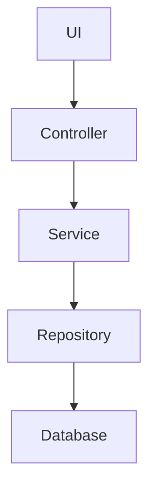
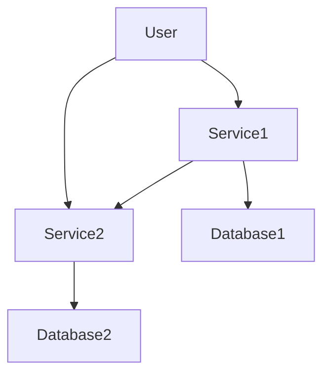
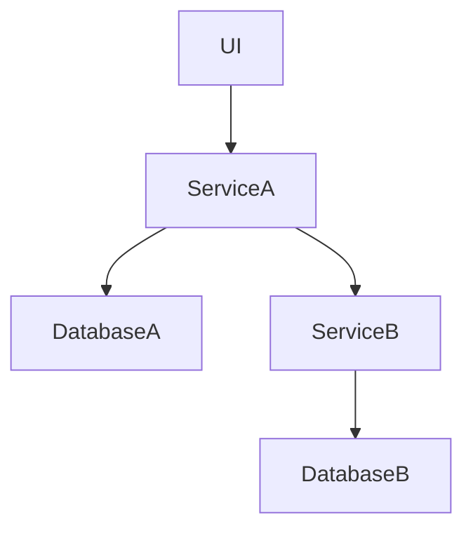

                 


# 选择适合企业的AI Agent平台

> 关键词：AI Agent，企业选型，自然语言处理，机器学习，系统架构

> 摘要：本文旨在帮助企业技术负责人、项目经理和CTO系统地了解AI Agent平台的核心概念、技术原理和选型标准。通过详细分析AI Agent的定义、类型、应用场景，以及选择适合企业的AI Agent平台的策略和方法，提供实用的技术指导和建议。

---

## 第1章: AI Agent平台概述

### 1.1 AI Agent的基本概念

AI Agent（人工智能代理）是一种能够感知环境、执行任务并做出决策的智能实体。它通过与用户或系统的交互，帮助完成特定任务，如信息检索、自动化操作、问题解答等。

#### 1.1.1 AI Agent的定义

AI Agent可以分为以下几类：
- **基于规则的AI Agent**：根据预定义的规则执行任务，适用于简单且规则明确的场景。
- **基于模型的AI Agent**：利用知识库或模型进行推理和决策，适用于复杂场景。
- **基于机器学习的AI Agent**：通过机器学习模型进行自适应和优化，适用于动态环境。

#### 1.1.2 AI Agent的核心属性

AI Agent的核心属性包括：
- **自主性**：能够在没有外部干预的情况下自主运行。
- **反应性**：能够感知环境变化并做出实时反应。
- **目标导向性**：具备明确的目标，能够采取行动以实现目标。
- **学习能力**：能够通过数据和经验不断优化性能。

#### 1.1.3 AI Agent与传统软件的区别

AI Agent与传统软件的主要区别在于：
- **智能性**：AI Agent具备学习和推理能力，能够处理复杂任务。
- **适应性**：能够根据环境变化自适应调整行为。
- **自主性**：能够在没有人工干预的情况下完成任务。

### 1.2 AI Agent的类型与应用场景

#### 1.2.1 基于规则的AI Agent

基于规则的AI Agent通过预定义的规则执行任务，适用于规则明确且变化较小的场景。例如：
- **客服机器人**：根据预设的规则回答用户问题。
- **自动化工具**：根据预设规则自动执行任务。

#### 1.2.2 基于模型的AI Agent

基于模型的AI Agent利用知识库或模型进行推理和决策，适用于复杂场景。例如：
- **医疗诊断系统**：通过知识库和推理引擎帮助医生进行诊断。
- **金融风险评估系统**：利用模型评估投资风险。

#### 1.2.3 基于机器学习的AI Agent

基于机器学习的AI Agent通过机器学习模型进行自适应和优化，适用于动态环境。例如：
- **智能推荐系统**：根据用户行为推荐相关内容。
- **自动驾驶汽车**：通过深度学习模型实时感知和决策。

#### 1.2.4 AI Agent在企业中的应用场景

AI Agent在企业中的应用场景包括：
- **客户服务**：智能客服机器人提供24/7的客户支持。
- **自动化操作**：自动化工具执行重复性任务，提高效率。
- **数据分析**：利用AI Agent进行数据挖掘和预测分析。

### 1.3 AI Agent平台的技术基础

#### 1.3.1 自然语言处理技术

自然语言处理（NLP）是AI Agent与用户交互的核心技术。NLP技术包括：
- **文本解析**：将自然语言文本转换为结构化的信息。
- **意图识别**：识别用户的意图并生成相应的响应。
- **情感分析**：分析文本中的情感倾向。

#### 1.3.2 机器学习与深度学习

机器学习与深度学习是AI Agent的核心技术，用于模型训练和优化。常用的算法包括：
- **监督学习**：利用标记数据进行训练，如决策树、随机森林。
- **无监督学习**：利用未标记数据进行聚类分析，如k-means。
- **深度学习**：利用神经网络进行特征提取和模型训练，如卷积神经网络（CNN）、循环神经网络（RNN）。

#### 1.3.3 知识图谱与推理引擎

知识图谱是结构化的知识表示，推理引擎用于根据知识图谱进行推理和决策。知识图谱包括实体和关系，推理引擎利用逻辑推理或概率推理生成结论。

### 1.4 本章小结

本章介绍了AI Agent的基本概念、类型与应用场景，以及AI Agent平台的技术基础。了解这些内容有助于企业更好地选择和实施适合的AI Agent平台。

---

## 第2章: 选择AI Agent平台的背景与需求

### 2.1 企业数字化转型中的AI Agent需求

#### 2.1.1 数字化转型的定义

数字化转型是指企业利用数字技术改变业务模式、流程、文化和组织结构，以实现业务创新和价值增长。AI Agent作为数字化转型的重要工具，能够帮助企业实现智能化和自动化。

#### 2.1.2 AI Agent在企业数字化转型中的作用

AI Agent在数字化转型中的作用包括：
- **提高效率**：自动化处理重复性任务，减少人工干预。
- **增强用户体验**：提供个性化的服务和体验。
- **支持决策**：通过数据分析和预测提供决策支持。

### 2.2 企业选择AI Agent平台的核心问题

#### 2.2.1 业务需求与技术能力的匹配

企业在选择AI Agent平台时，需要考虑自身的业务需求和平台的技术能力是否匹配。例如，对于需要处理大量非结构化数据的企业，应选择具备强大NLP能力的平台。

#### 2.2.2 平台的可扩展性与灵活性

平台的可扩展性和灵活性是企业在选择AI Agent平台时的重要考虑因素。企业需要选择能够根据业务需求进行扩展和调整的平台。

#### 2.2.3 成本效益分析

企业在选择AI Agent平台时，需要进行成本效益分析，综合考虑平台的采购成本、维护成本和预期收益。

### 2.3 企业AI Agent平台的选型标准

#### 2.3.1 功能需求

企业需要根据自身的业务需求选择具备相应功能的AI Agent平台。例如，需要具备多轮对话能力的平台。

#### 2.3.2 技术架构

企业的技术架构决定了选择AI Agent平台的架构要求。例如，支持微服务架构的平台能够更好地与企业现有的系统集成。

#### 2.3.3 可扩展性与可维护性

平台的可扩展性和可维护性是长期使用的关键因素。企业需要选择能够根据业务需求进行扩展和维护的平台。

### 2.4 本章小结

本章探讨了企业数字化转型中的AI Agent需求，分析了企业在选择AI Agent平台时需要考虑的核心问题和选型标准。

---

## 第3章: AI Agent平台的核心技术与实现原理

### 3.1 自然语言处理技术

#### 3.1.1 NLP的基本原理

自然语言处理（NLP）是AI Agent与用户交互的核心技术。NLP的基本原理包括文本预处理、特征提取和模型训练。

#### 3.1.2 常见的NLP算法与模型

常用的NLP算法和模型包括：
- **分词**：将文本分割成词语或短语。
- **词性标注**：对词语进行词性标注。
- **句法分析**：分析句子的语法结构。
- **情感分析**：分析文本的情感倾向。

#### 3.1.3 NLP在AI Agent中的应用

NLP在AI Agent中的应用包括：
- **意图识别**：识别用户的意图并生成相应的响应。
- **实体识别**：识别文本中的实体信息。
- **对话管理**：管理多轮对话的流程。

#### 3.1.4 实验室环境安装与代码实现

为了实现NLP功能，我们需要安装以下工具：
- **Python**：编程语言。
- **NLTK**：自然语言处理工具包。
- **spaCy**：高性能NLP库。

以下是实现意图识别的代码示例：

```python
import spacy

# 加载预训练模型
nlp = spacy.load("en_core_web_sm")

# 定义意图识别函数
def identify_intent(text):
    doc = nlp(text)
    # 提取实体信息
    entities = [(ent.text, ent.label_) for ent in doc.ents]
    # 提取关键词
    keywords = [token.text for token in doc if token.is_stop == False]
    return {"intent": "information_request", "entities": entities, "keywords": keywords}

# 测试意图识别
text = "What is the weather in New York today?"
result = identify_intent(text)
print(result)
```

### 3.2 机器学习与深度学习

#### 3.2.1 机器学习的基本原理

机器学习的基本原理包括数据预处理、特征提取和模型训练。常用的机器学习算法包括线性回归、支持向量机（SVM）和随机森林。

#### 3.2.2 深度学习的核心算法

深度学习的核心算法包括卷积神经网络（CNN）、循环神经网络（RNN）和长短期记忆网络（LSTM）。这些算法常用于处理图像、文本和时间序列数据。

#### 3.2.3 机器学习在AI Agent中的应用

机器学习在AI Agent中的应用包括：
- **用户画像**：通过机器学习模型分析用户行为，生成用户画像。
- **推荐系统**：基于用户行为和偏好推荐相关内容。
- **异常检测**：检测系统中的异常行为。

#### 3.2.4 机器学习算法的数学模型

以下是线性回归的数学模型：

$$ y = \beta_0 + \beta_1 x + \epsilon $$

其中，$y$ 是目标变量，$\beta_0$ 和 $\beta_1$ 是回归系数，$x$ 是自变量，$\epsilon$ 是误差项。

### 3.3 知识图谱与推理引擎

#### 3.3.1 知识图谱的构建与管理

知识图谱的构建包括数据采集、数据清洗、实体识别和关系抽取。知识图谱的管理包括数据存储、更新和查询。

#### 3.3.2 推理引擎的工作原理

推理引擎通过逻辑推理或概率推理生成结论。常用的推理方法包括演绎推理、归纳推理和 abduction推理。

#### 3.3.3 知识图谱在AI Agent中的应用

知识图谱在AI Agent中的应用包括：
- **知识检索**：根据用户需求检索相关知识。
- **推理与决策**：利用知识图谱进行推理和决策。
- **上下文理解**：通过知识图谱理解上下文信息。

#### 3.3.4 知识图谱构建的代码实现

以下是构建知识图谱的代码示例：

```python
from kgclient import KGClient

# 初始化知识图谱客户端
kg = KGClient()

# 添加实体
kg.add_entity("New York", "City")
kg.add_entity("USA", "Country")
kg.add_relation("New York", "located_in", "USA")

# 查询知识图谱
result = kg.query("What city is located in USA?")
print(result)
```

### 3.4 本章小结

本章详细介绍了AI Agent平台的核心技术，包括自然语言处理、机器学习与深度学习、知识图谱与推理引擎。通过代码示例和数学模型，帮助读者理解这些技术的实现原理。

---

## 第4章: AI Agent平台的系统架构与设计

### 4.1 系统架构设计

#### 4.1.1 分层架构

分层架构将系统划分为多个层次，如表现层、业务逻辑层和数据访问层。每一层负责不同的功能模块，实现职责分离。

#### 4.1.2 微服务架构

微服务架构将系统划分为多个独立的服务，每个服务负责不同的功能模块。微服务架构具有良好的可扩展性和灵活性。

#### 4.1.3 异构架构

异构架构允许系统使用不同的技术栈和框架，适用于复杂的分布式系统。异构架构能够更好地满足多样化的业务需求。

### 4.2 功能模块设计

#### 4.2.1 用户界面模块

用户界面模块是用户与AI Agent交互的界面，包括对话框、按钮和菜单等。用户界面模块需要设计直观且易于使用的界面。

#### 4.2.2 自然语言处理模块

自然语言处理模块负责处理用户的输入，包括分词、词性标注和意图识别等。自然语言处理模块是AI Agent的核心模块。

#### 4.2.3 机器学习模块

机器学习模块负责训练和优化模型，包括数据预处理、特征提取和模型训练等。机器学习模块是AI Agent的核心模块。

#### 4.2.4 知识图谱模块

知识图谱模块负责知识图谱的构建、管理和查询，包括实体识别、关系抽取和知识检索等。知识图谱模块是AI Agent的核心模块。

### 4.3 系统架构设计

#### 4.3.1 分层架构的系统架构图

以下是分层架构的系统架构图：



#### 4.3.2 微服务架构的系统架构图

以下是微服务架构的系统架构图：



#### 4.3.3 异构架构的系统架构图

以下是异构架构的系统架构图：



### 4.4 本章小结

本章详细介绍了AI Agent平台的系统架构与设计，包括分层架构、微服务架构和异构架构。通过系统架构图和功能模块设计，帮助读者理解系统的整体结构和工作流程。

---

## 第5章: AI Agent平台的项目实战

### 5.1 环境安装与配置

#### 5.1.1 安装Python

安装Python：
```bash
sudo apt-get install python3
```

#### 5.1.2 安装NLP工具

安装NLTK和spaCy：
```bash
pip install nltk spacy
python -m spacy download en_core_web_sm
```

#### 5.1.3 安装机器学习库

安装Scikit-learn和TensorFlow：
```bash
pip install scikit-learn tensorflow
```

### 5.2 核心代码实现

#### 5.2.1 自然语言处理模块

实现意图识别的代码：

```python
import spacy

# 加载预训练模型
nlp = spacy.load("en_core_web_sm")

# 定义意图识别函数
def identify_intent(text):
    doc = nlp(text)
    entities = [(ent.text, ent.label_) for ent in doc.ents]
    keywords = [token.text for token in doc if token.is_stop == False]
    return {"intent": "information_request", "entities": entities, "keywords": keywords}

# 测试意图识别
text = "What is the weather in New York today?"
result = identify_intent(text)
print(result)
```

#### 5.2.2 机器学习模块

实现用户画像的代码：

```python
from sklearn.feature_extraction.text import TfidfVectorizer
from sklearn.cluster import KMeans

# 定义用户行为数据
user_behaviors = ["喜欢看电影", "喜欢听音乐", "喜欢阅读书籍"]

# 特征提取
vectorizer = TfidfVectorizer()
tfidf = vectorizer.fit_transform(user_behaviors)

# 聚类分析
model = KMeans(n_clusters=2)
model.fit(tfidf)

# 获取聚类结果
clusters = model.predict(tfidf)
print(clusters)
```

### 5.3 项目实战总结

通过本章的项目实战，读者可以掌握AI Agent平台的核心技术的实现方法。从环境安装到代码实现，逐步构建一个简单的AI Agent平台。

---

## 第6章: 总结与展望

### 6.1 总结

本文系统地介绍了AI Agent平台的核心概念、技术基础、系统架构和选型标准。通过详细的分析和代码示例，帮助读者理解AI Agent平台的实现原理和应用方法。

### 6.2 展望

未来，随着人工智能技术的不断发展，AI Agent平台将具备更强的智能性和适应性。企业需要持续关注技术发展，优化AI Agent平台的性能和功能。

---

## 作者

作者：AI天才研究院/AI Genius Institute & 禅与计算机程序设计艺术 /Zen And The Art of Computer Programming

---

**注**：由于篇幅限制，本文仅为部分内容，完整文章请参考《选择适合企业的AI Agent平台》。

