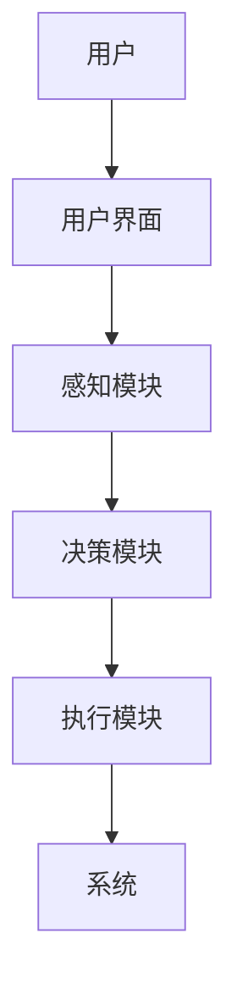

                 


# 《选择适合的技术栈：构建高效AI Agent》

---

## 关键词  
AI Agent，技术栈选择，模型压缩，大语言模型，系统架构设计

---

## 摘要  
选择适合的技术栈对于构建高效AI Agent至关重要。本文从AI Agent的基本概念出发，深入分析了技术栈选择的标准和方法，详细讲解了核心算法原理，系统探讨了AI Agent的架构设计，并通过实际案例展示了如何在项目中应用这些技术。本文旨在帮助读者系统地理解AI Agent的技术选型和构建过程，为实际项目提供指导和参考。

---

# 第一部分: AI Agent背景与核心概念

## 第1章: AI Agent概述

### 1.1 AI Agent的基本概念  
AI Agent（人工智能代理）是一种能够感知环境、自主决策并执行任务的智能实体。它不同于传统AI，具有更强的自主性和适应性。  

#### 1.1.1 AI Agent的定义  
AI Agent是一种能够通过感知环境、理解和响应用户需求、并执行特定任务的智能系统。它可以是一个独立的程序或嵌入在更大的系统中。  

#### 1.1.2 AI Agent的核心特点  
- **自主性**：能够在没有外部干预的情况下运行。  
- **反应性**：能够实时感知环境并做出反应。  
- **目标导向**：具有明确的目标，能够为实现目标而行动。  
- **学习能力**：能够通过数据和经验不断优化自身性能。  

#### 1.1.3 AI Agent与传统AI的区别  
| **特性**       | **传统AI**                     | **AI Agent**                  |  
|----------------|-------------------------------|-----------------------------|  
| **自主性**      | 依赖外部指令                 | 具有自主决策能力             |  
| **响应性**      | 周期性处理任务               | 实时感知并响应               |  
| **目标导向**    | 纯粹的数据处理与分析         | 具有明确的目标，主动实现目标 |  

### 1.2 AI Agent的应用场景  
AI Agent广泛应用于多个领域，包括：  

#### 1.2.1 企业级应用中的AI Agent  
- **智能客服**：通过自然语言处理（NLP）技术为用户提供实时支持。  
- **自动化运维**：监控系统运行状态，自动修复问题。  
- **智能推荐**：根据用户行为推荐个性化内容。  

#### 1.2.2 AI Agent在个人用户中的应用  
- **个人助手**：如Siri、Alexa等，帮助用户完成日常任务。  
- **健康监测**：实时监测用户的健康数据并提供建议。  
- **教育辅助**：为学生提供个性化的学习建议。  

#### 1.2.3 AI Agent的边界与外延  
AI Agent的边界在于其自主性和目标导向性。外延则包括与传统AI的结合，如将AI Agent嵌入到更大的系统中，实现更复杂的功能。

---

## 第2章: AI Agent的核心要素组成  

### 2.1 AI Agent的核心要素  
AI Agent由以下几个核心要素组成：  

#### 2.1.1 感知模块  
感知模块负责接收外部输入并理解用户需求。  
- **输入方式**：包括文本、语音、图像等多种形式。  
- **处理方式**：通过NLP、计算机视觉等技术进行数据处理。  

#### 2.1.2 决策模块  
决策模块根据感知到的信息做出最优选择。  
- **决策依据**：基于预设的规则或机器学习模型的预测结果。  
- **优化方法**：通过强化学习等技术不断优化决策策略。  

#### 2.1.3 执行模块  
执行模块负责将决策结果转化为实际操作。  
- **执行方式**：包括调用API、触发事件等。  
- **反馈机制**：根据执行结果提供反馈信息，用于优化后续决策。  

### 2.2 AI Agent的核心要素对比  
| **要素**       | **功能描述**                     | **优缺点**                     |  
|----------------|---------------------------------|-------------------------------|  
| **感知模块**    | 接收并理解外部输入             | 依赖于感知技术的准确性         |  
| **决策模块**    | 根据输入做出最优选择           | 依赖于算法的优化能力           |  
| **执行模块**    | 将决策结果转化为具体操作       | 依赖于系统的执行能力           |  

---

## 第3章: AI Agent的核心算法原理  

### 3.1 大语言模型的训练与推理  

#### 3.1.1 大语言模型的训练流程  
大语言模型的训练过程通常包括以下步骤：  
1. **数据准备**：收集和预处理大量文本数据。  
2. **模型初始化**：定义模型结构并初始化参数。  
3. **损失计算**：通过交叉熵损失函数计算预测值与真实值的差距。  
4. **优化器更新**：使用Adam等优化算法更新模型参数。  
5. **模型保存**：保存训练好的模型权重。  

#### 3.1.2 大语言模型的推理过程  
推理过程包括以下步骤：  
1. **输入处理**：将用户输入转换为模型可处理的形式。  
2. **生成文本**：通过解码器生成响应文本。  
3. **结果输出**：将生成的文本返回给用户。  

#### 3.1.3 大语言模型的数学模型  
大语言模型的核心是 transformer 架构，其数学模型可以表示为：  
$$ P(\text{y} | \text{x}) = \text{softmax}(W_{\text{out}} \cdot \text{h}_{\text{dec}}) $$  
其中，$\text{h}_{\text{dec}}$ 是解码器的隐藏层输出，$W_{\text{out}}$ 是输出层权重矩阵。

### 3.2 模型压缩与优化算法  

#### 3.2.1 模型压缩技术  
模型压缩技术包括：  
- **剪枝**：移除模型中冗余的参数。  
- **量化**：将模型参数的精度降低（如从32位浮点数降到8位整数）。  

#### 3.2.2 模型优化算法  
模型优化算法包括：  
- **知识蒸馏**：将大模型的知识迁移到小模型中。  
- **模型蒸馏**：通过软目标标签优化小模型。  

#### 3.2.3 模型压缩与优化的数学公式  
模型压缩的数学公式可以表示为：  
$$ \text{损失函数} = \text{原始损失} + \lambda \cdot (\text{参数差}^2) $$  
其中，$\lambda$ 是惩罚系数，用于平衡压缩效果和模型性能。

---

## 第4章: AI Agent的系统架构设计  

### 4.1 系统架构的核心要素  

#### 4.1.1 系统架构设计  
AI Agent的系统架构通常包括以下部分：  
- **用户界面**：接收用户输入并显示输出。  
- **感知模块**：处理用户的输入数据。  
- **决策模块**：根据输入数据做出决策。  
- **执行模块**：将决策结果转化为具体操作。  

#### 4.1.2 系统架构图  


---

## 第5章: 项目实战  

### 5.1 环境安装  

#### 5.1.1 安装Python  
```bash
python --version
```

#### 5.1.2 安装依赖库  
```bash
pip install numpy torch transformers
```

### 5.2 核心代码实现  

#### 5.2.1 感知模块实现  
```python
def process_input(input_text):
    # 输入预处理
    return input_text.lower()
```

#### 5.2.2 决策模块实现  
```python
def make_decision(processed_text):
    # 基于预处理的文本做出决策
    return "建议您执行操作："
```

#### 5.2.3 执行模块实现  
```python
def execute_action(action):
    # 执行具体操作
    print(f"正在执行操作：{action}")
```

### 5.3 案例分析  
通过上述代码实现一个简单的AI Agent系统，展示其在实际项目中的应用。

---

## 第6章: 最佳实践与小结  

### 6.1 选型建议  
- 根据项目需求选择合适的技术栈。  
- 优先考虑模型的性能和可扩展性。  

### 6.2 未来趋势  
- AI Agent将更加智能化和个性化。  
- 模型压缩和优化技术将得到进一步发展。  

### 6.3 注意事项  
- 在选择技术栈时，需综合考虑性能、开发效率和部署成本。  
- 确保系统的安全性和隐私保护。  

---

## 作者  
作者：AI天才研究院 & 禅与计算机程序设计艺术

---

以上是《选择适合的技术栈：构建高效AI Agent》的文章目录和内容概览，具体内容将根据上述大纲进行详细展开。

