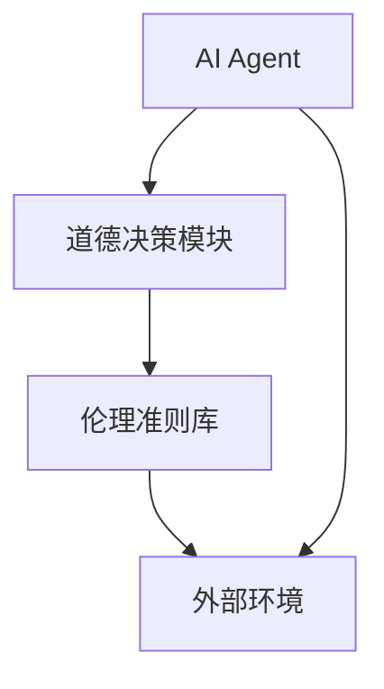
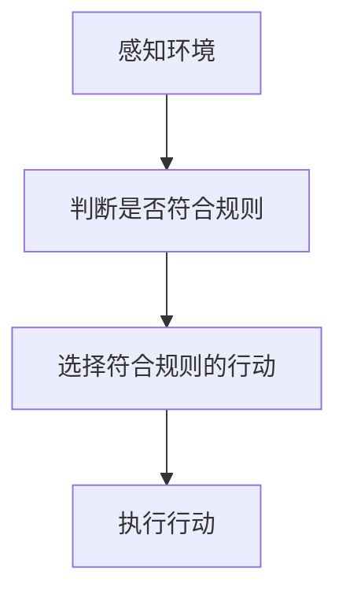
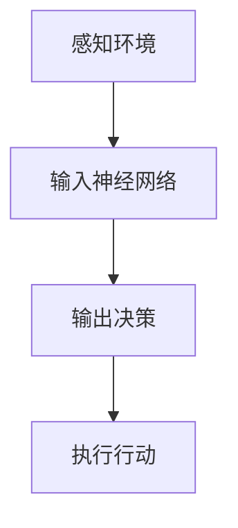
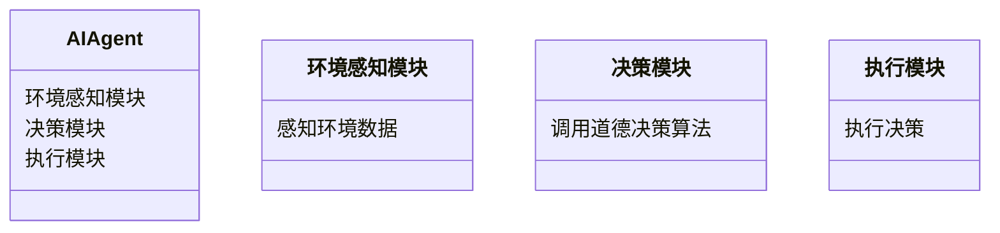
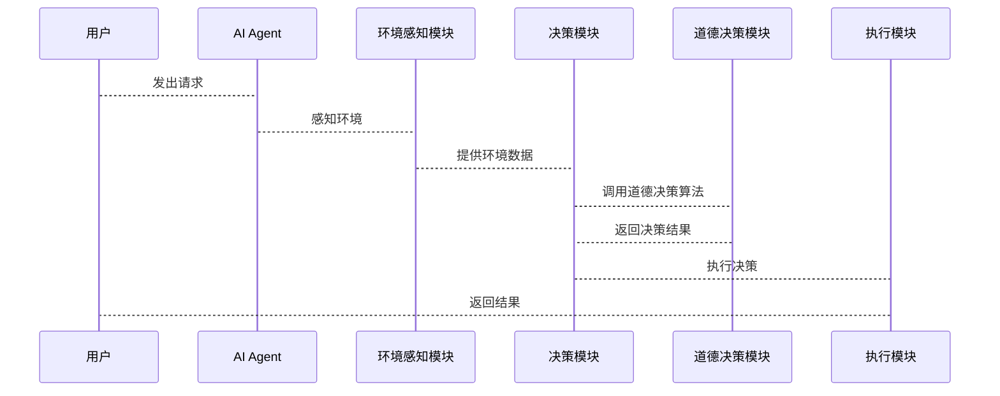
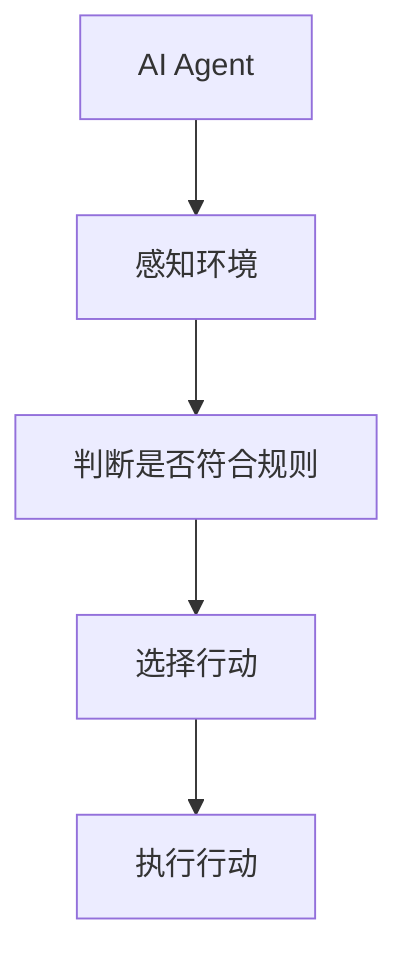

                 


# 道德决策：在AI Agent中实现伦理准则

---

## 关键词：AI Agent、道德决策、伦理准则、规则系统、神经网络

---

## 摘要：  
在AI Agent中实现道德决策是一项具有挑战性的任务，涉及伦理学、人工智能和计算机科学的交叉领域。本文系统地探讨了AI Agent道德决策的核心概念、算法原理和系统架构。首先，我们介绍了AI Agent的基本概念和道德决策的重要性，分析了当前AI Agent面临的道德挑战。接着，我们详细讲解了基于规则和基于学习的道德决策算法，并通过数学模型和公式展示了如何将伦理准则转化为可执行的决策规则。最后，我们构建了一个完整的AI Agent系统架构，并通过实际案例展示了如何在项目中实现道德决策。本文还提供了最佳实践建议，以帮助读者更好地理解和应用这些技术。

---

## 第1章: AI Agent与道德决策的背景介绍

### 1.1 AI Agent的基本概念
AI Agent（人工智能代理）是一种能够感知环境并采取行动以实现目标的智能实体。它可以分为**简单反射型Agent**、**基于模型的反射型Agent**、**目标驱动型Agent**和**效用驱动型Agent**。AI Agent广泛应用于自动驾驶、智能助手、机器人和推荐系统等领域。

### 1.2 道德决策的定义与特征
道德决策是指在复杂的环境中，AI Agent在遵守伦理准则的前提下做出最优决策的过程。其核心特征包括**可解释性**、**一致性**和**可调整性**。

---

## 第2章: 道德决策的背景与问题描述

### 2.1 当前AI Agent面临的道德挑战
1. **决策的不确定性**：AI Agent需要在模糊和不完整的信息下做出决策。
2. **道德决策的复杂性**：不同伦理准则可能冲突，例如“功利主义”与“义务论”之间的矛盾。
3. **可解释性要求**：用户和监管机构需要理解AI Agent的决策过程。

### 2.2 道德决策在AI Agent中的问题解决
1. **算法实现**：如何将伦理准则转化为可执行的规则。
2. **准则编码**：如何将复杂的伦理准则编码到AI系统中。
3. **决策验证**：如何验证AI Agent的道德决策是否符合预期。

---

## 第3章: 道德决策的核心概念与联系

### 3.1 道德准则的核心要素
| **准则类型** | **定义** | **示例** |
|--------------|----------|----------|
| **功利主义** | 最大化整体幸福 | 在自动驾驶中优先保护行人 |
| **义务论**   | 遵循道德义务 | 在医疗AI中优先治疗危重患者 |

### 3.2 道德决策与AI Agent的联系
通过Mermaid图展示道德决策与AI Agent的关系：



---

## 第4章: 道德决策算法的核心原理

### 4.1 基于规则的道德决策算法
#### 4.1.1 原理
基于规则的道德决策算法通过预定义的伦理准则生成决策。例如：



#### 4.1.2 Python实现
```python
def道德决策(环境):
    for 准则 in 伦理准则库:
        if 环境符合准则条件:
            return 准则对应的行动
    return 默认行动
```

### 4.2 基于学习的道德决策算法
#### 4.2.1 原理
基于学习的道德决策算法通过神经网络学习伦理准则。例如：



#### 4.2.2 Python实现
```python
import numpy as np

def神经网络决策(环境):
    输入 = np.array(环境)
    输出 = 神经网络模型预测(输入)
    return 输出
```

---

## 第5章: 道德决策算法的数学模型

### 5.1 基于规则的道德决策模型
约束条件：
$$ \text{如果条件} C_1 \text{满足，则选择行动} A_1 $$

决策函数：
$$ f(x) = \begin{cases} 
A_1 & \text{如果 } x \text{ 满足 } C_1 \\
A_2 & \text{否则}
\end{cases} $$

### 5.2 基于学习的道德决策模型
损失函数：
$$ L = \sum_{i=1}^{n} (y_i - \hat{y_i})^2 $$

优化方法：
$$ \theta = \theta - \eta \cdot \frac{\partial L}{\partial \theta} $$

---

## 第6章: 系统架构设计

### 6.1 问题场景介绍
假设我们正在开发一个自动驾驶AI Agent，需要在紧急情况下做出道德决策。

### 6.2 系统功能设计
领域模型：


### 6.3 系统架构设计
系统架构：


---

## 第7章: 项目实战

### 7.1 环境搭建
安装Python和相关库：
```bash
pip install numpy tensorflow
```

### 7.2 核心代码实现
```python
import numpy as np
import tensorflow as tf

# 基于规则的道德决策实现
def道德决策(环境):
    for 准则 in 伦理准则库:
        if 环境符合准则条件:
            return 准则对应的行动
    return 默认行动

# 基于神经网络的道德决策实现
def神经网络决策(环境):
    输入 = np.array(环境)
    输出 = 神经网络模型预测(输入)
    return 输出
```

### 7.3 案例分析
自动驾驶场景：


---

## 第8章: 最佳实践与总结

### 8.1 经验总结
1. **规则权重设置**：需要根据实际场景调整不同伦理准则的权重。
2. **可解释性设计**：确保用户能够理解AI Agent的决策过程。
3. **模型泛化能力**：道德决策模型需要具备一定的泛化能力，以应对复杂场景。

### 8.2 注意事项
1. **规则冲突处理**：需要明确规则的优先级。
2. **模型训练数据**：确保训练数据的多样性和代表性。

### 8.3 未来展望
1. **结合强化学习**：将强化学习应用于道德决策，以提高决策的灵活性。
2. **边缘计算**：在边缘设备上实现道德决策，以减少延迟。

---

## 结论

在AI Agent中实现伦理准则是一项复杂但至关重要的任务。本文通过系统地分析道德决策的核心概念、算法原理和系统架构，为读者提供了全面的技术指导。未来，随着AI技术的不断发展，道德决策的研究将更加深入，为人类社会带来更多的福祉。

---

## 作者：AI天才研究院 & 禅与计算机程序设计艺术

