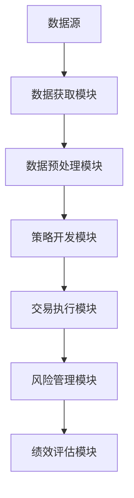

                 


# 量化投资策略在高波动市场中的表现

## 关键词：
量化投资、高波动市场、风险管理、时间序列分析、机器学习、系统架构

## 摘要：
本文深入探讨了量化投资策略在高波动市场中的表现，分析了不同策略的适用性及数学模型的应用。通过系统架构设计和实战案例，展示了如何构建高效的量化交易系统，并总结了最佳实践和未来趋势。

---

# 量化投资策略在高波动市场中的表现

## 第1章: 量化投资策略概述

### 1.1 量化投资的定义与特点
量化投资是一种基于数学模型和算法的投资方法，通过分析大量数据来寻找投资机会。其特点包括数据驱动、模型化、自动化和纪律性。

### 1.2 高波动市场的特点
高波动市场通常表现为价格剧烈波动、不确定性高、交易机会多但风险大。这种环境对量化策略的适应性提出了更高要求。

### 1.3 量化投资策略的背景与意义
随着技术进步和数据量的增加，量化投资逐渐成为主流。在高波动市场中，量化策略能够快速捕捉机会，降低人为情绪干扰，提高决策效率。

---

## 第2章: 量化投资策略的核心概念

### 2.1 量化策略的分类
#### 2.1.1 均值回归策略
基于价格回归均值的假设，通过买入低估资产、卖出高估资产获利。

#### 2.1.2 动量策略
利用价格动量效应，投资于近期表现强劲的资产。

#### 2.1.3 统计套利策略
通过寻找资产间的定价偏差，利用无风险套利机会获利。

#### 2.1.4 预测模型驱动策略
使用机器学习等模型预测市场走势，指导投资决策。

### 2.2 高波动市场中的策略选择
在高波动市场中，动量策略和统计套利策略表现较好，但需注意风险控制。

---

## 第3章: 量化投资的数学模型与算法

### 3.1 时间序列分析
#### 3.1.1 ARIMA模型
ARIMA（自回归积分滑动平均模型）用于预测时间序列数据，公式如下：
$$ ARIMA(p, d, q) $$
其中，p为自回归阶数，d为差分阶数，q为滑动平均阶数。

#### 3.1.2 GARCH模型
GARCH（广义自回归条件异方差模型）用于估计金融资产的波动性，公式如下：
$$ GARCH(p, q) $$
其中，p为自回归阶数，q为滑动平均阶数。

### 3.2 机器学习算法在量化投资中的应用
#### 3.2.1 线性回归与分类算法
线性回归用于预测资产价格，分类算法用于识别市场状态。

#### 3.2.2 支持向量机（SVM）
SVM用于分类和回归分析，应用于市场趋势预测。

#### 3.2.3 随机森林与梯度提升树
随机森林和梯度提升树用于特征重要性分析和预测。

### 3.3 风险管理模型
#### 3.3.1 VaR模型
VaR（在险价值）用于衡量投资组合的最大潜在损失，公式如下：
$$ VaR = \alpha \times \sigma $$
其中，α为分位数，σ为标准差。

#### 3.3.2 波动率模型
波动率模型用于估计资产价格的波动性，应用于风险控制。

---

## 第4章: 量化投资策略的系统架构设计

### 4.1 系统架构概述
量化交易系统由数据获取、策略开发、交易执行和风险管理四个模块组成。

#### 4.1.1 数据获取与预处理模块
负责获取市场数据并进行清洗和转换。

#### 4.1.2 策略开发与回测模块
开发和测试量化策略，评估其表现。

#### 4.1.3 交易执行与风险管理模块
根据策略信号执行交易，并实时监控和管理风险。

#### 4.1.4 绩效评估与优化模块
评估策略表现，优化模型参数。

### 4.2 系统架构图


---

## 第5章: 项目实战

### 5.1 环境安装
安装Python、Pandas、NumPy、Scikit-learn等库。

### 5.2 系统核心实现源代码
```python
import pandas as pd
import numpy as np
from sklearn.linear_model import LinearRegression

# 示例代码：使用线性回归预测股票价格
data = pd.read_csv('stock_data.csv')
X = data[['open', 'high', 'low', 'volume']]
y = data['close']
model = LinearRegression()
model.fit(X, y)
predictions = model.predict(X)
```

### 5.3 实际案例分析
以某股票为例，分析模型预测结果与实际价格的差异，优化模型参数。

### 5.4 项目小结
讨论项目中的挑战和解决方案，总结经验教训。

---

## 第6章: 总结与展望

### 6.1 量化投资的未来趋势
随着人工智能和大数据技术的发展，量化投资将更加智能化和自动化。

### 6.2 改进建议
建议优化风险管理模型，引入更复杂的算法，如深度学习。

### 6.3 最佳实践 tips
1. 定期监控和优化策略。
2. 注意市场变化，及时调整模型。
3. 结合多策略进行风险分散。

---

## 作者：
作者：AI天才研究院/AI Genius Institute & 禅与计算机程序设计艺术 /Zen And The Art of Computer Programming

