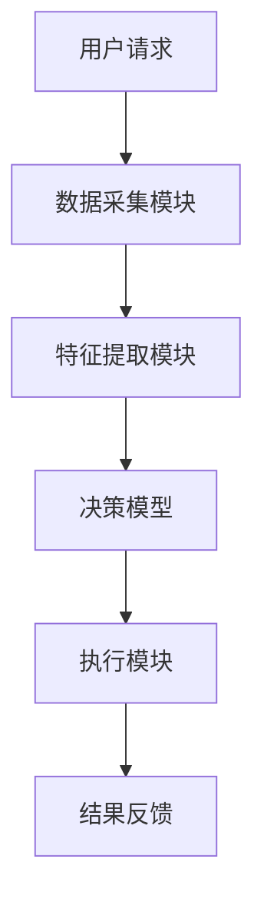

                 


# 《金融AI Agent：风险评估与决策支持》

---

## 关键词

- 金融AI Agent
- 风险评估
- 决策支持
- 强化学习
- 系统架构

---

## 摘要

随着人工智能技术的快速发展，金融领域对AI Agent的需求日益增长。本文将深入探讨金融AI Agent在风险评估与决策支持中的应用，分析其核心原理、系统架构以及实际案例，为读者提供全面的技术解读。

---

## 正文

### 第一部分: 金融AI Agent的背景与核心概念

#### 第1章: 金融AI Agent的基本概念

##### 1.1 AI Agent的定义与特点

**AI Agent**（人工智能代理）是指能够感知环境、自主决策并执行任务的智能实体。其核心特点包括：

- **自主性**：能够在无外部干预的情况下运行。
- **反应性**：能够根据环境变化动态调整行为。
- **目标导向**：通过优化目标函数实现特定任务。

##### 1.2 金融风险评估与决策支持的背景

传统金融风险评估依赖于人工分析和统计模型，存在效率低、覆盖面窄等问题。AI Agent通过整合大数据和机器学习技术，能够实时分析市场波动、客户行为等复杂因素，为金融决策提供支持。

##### 1.3 AI Agent在金融领域的独特性

AI Agent能够处理多维度数据，识别潜在风险，并在复杂场景中做出最优决策。例如，在股票交易中，AI Agent可以实时分析市场数据，自动执行交易策略。

##### 1.4 本章小结

本章介绍了AI Agent的基本概念及其在金融领域的独特优势，为后续分析奠定基础。

---

### 第二部分: AI Agent的核心原理与技术

#### 第2章: AI Agent的核心原理

##### 2.1 AI Agent的感知、决策与执行机制

**感知层**：通过数据采集模块获取市场数据、客户信息等输入。

**决策层**：基于感知数据，利用机器学习模型生成决策策略。

**执行层**：根据决策结果，执行交易或发出警报。

##### 2.2 AI Agent的核心算法与模型

**强化学习**：通过与环境交互，逐步优化策略。例如，使用Q-learning算法：

$$ Q(s, a) = r + \gamma \max_{a'} Q(s', a') $$

其中，$s$是状态，$a$是动作，$r$是奖励，$\gamma$是折扣因子。

**监督学习**：通过标注数据训练分类模型，预测风险等级。

##### 2.3 AI Agent的数学模型与公式

**Q-learning算法**：用于状态-动作价值函数的更新：

$$ Q(s, a) = r + \gamma \max_{a'} Q(s', a') $$

**神经网络模型**：用于特征提取和非线性关系建模。

##### 2.4 本章小结

本章详细介绍了AI Agent的核心算法及其数学模型，为后续系统设计提供理论支持。

---

### 第三部分: 金融AI Agent的系统架构与设计

#### 第3章: 系统架构与功能

##### 3.1 系统架构设计

**系统架构图**：



##### 3.2 系统功能设计

**数据采集模块**：实时采集市场数据和客户信息。

**特征提取模块**：提取关键特征，如波动率、相关性等。

**决策模型**：基于强化学习生成交易策略。

**执行模块**：根据决策结果执行交易或发出警报。

##### 3.3 本章小结

本章通过系统架构图和功能模块图，展示了金融AI Agent的整体设计。

---

## 项目实战

### 第4章: 项目实战

#### 4.1 环境安装

- 安装Python和相关库：
  ```bash
  pip install numpy pandas scikit-learn tensorflow
  ```

#### 4.2 核心代码实现

**Q-learning算法实现**：

```python
import numpy as np

class AI-Agent:
    def __init__(self, state_space, action_space):
        self.q_table = np.zeros((state_space, action_space))
        self.lr = 0.1
        self.gamma = 0.9

    def choose_action(self, state):
        return np.argmax(self.q_table[state])

    def learn(self, state, action, reward, next_state):
        self.q_table[state][action] = self.lr * (reward + self.gamma * np.max(self.q_table[next_state])) + (1 - self.lr) * self.q_table[state][action]
```

#### 4.3 实际案例分析

**案例分析**：在股票交易中，AI Agent通过分析市场数据，自动执行买卖决策，实现风险控制和收益最大化。

#### 4.4 本章小结

本章通过实际项目，展示了金融AI Agent的实现过程和应用效果。

---

## 总结与展望

### 第5章: 总结与展望

#### 5.1 最佳实践

- 数据质量是模型性能的关键。
- 模型优化需要结合业务需求。
- 风险管理是系统设计的核心。

#### 5.2 本章小结

本文全面分析了金融AI Agent的风险评估与决策支持技术，为实际应用提供了理论和实践指导。

---

## 作者信息

作者：AI天才研究院/AI Genius Institute & 禅与计算机程序设计艺术 /Zen And The Art of Computer Programming

---

# 结语

金融AI Agent正在改变金融行业的运作方式，通过不断优化算法和系统架构，未来将实现更智能、更高效的金融决策支持。

