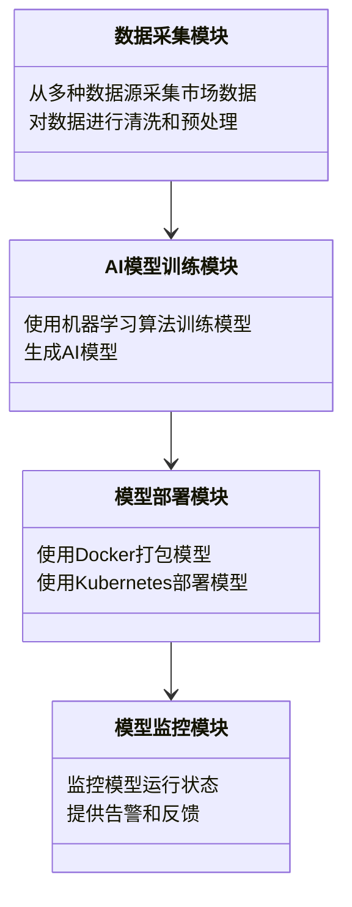
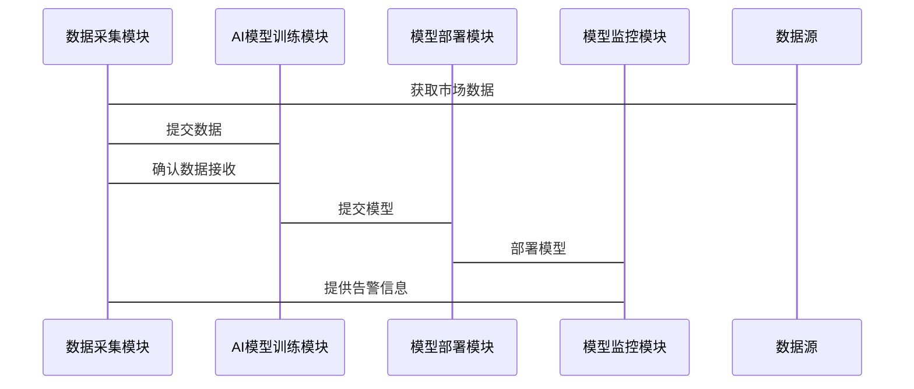

                 


# 《金融AI应用的DevOps流程设计与实施》

## 关键词：金融AI，DevOps，算法交易，风险管理，系统架构，CI/CD

## 摘要：  
随着人工智能技术的快速发展，金融行业正经历着一场深刻的数字化变革。从算法交易到风险管理，AI技术正在重塑金融行业的运作方式。与此同时，DevOps作为一种高效的研发和运维模式，也在金融行业得到了广泛应用。本文将详细探讨金融AI应用中的DevOps流程设计与实施，从背景、技术原理到系统架构，再到项目实战，全面解析如何在金融领域高效落地AI应用。

---

## 第一部分: 金融AI应用的背景与概述

### 第1章: 金融AI应用的背景与现状

#### 1.1 人工智能在金融领域的应用背景  
人工智能（AI）技术的快速发展为金融行业带来了前所未有的机遇。金融行业的核心任务包括数据分析、风险控制、投资决策等，这些都离不开对大量数据的处理和分析能力。AI技术通过机器学习、深度学习等方法，能够从海量数据中提取有价值的信息，帮助金融机构做出更精准的决策。  

此外，金融行业的竞争日益激烈，传统的基于规则的交易和投资策略逐渐暴露出效率低、反应慢的缺陷。而AI技术能够通过自动化和智能化的方式，快速分析市场变化，捕捉投资机会，从而提升金融机构的竞争力。  

---

#### 1.2 DevOps在金融行业的发展  
DevOps是一种结合了开发（Development）和运维（Operations）的协作模式，旨在通过自动化工具和流程，实现快速交付、持续集成和持续交付（CI/CD）。在金融行业，DevOps的应用主要集中在以下几个方面：  
1. **自动化部署**：通过自动化工具（如Jenkins、Docker）实现金融系统的快速部署和版本管理。  
2. **实时监控**：通过日志分析和监控工具（如Prometheus、Grafana）实时监控金融系统的运行状态，确保系统的稳定性和可用性。  
3. **高效协作**：通过DevOps模式，开发人员和运维人员能够更好地协作，缩短开发周期，提升交付效率。  

然而，金融行业对系统的稳定性和安全性要求极高，这也给DevOps的实施带来了挑战。金融系统的复杂性和高风险要求DevOps流程必须经过严格的测试和验证，确保每一步操作都符合行业标准和监管要求。  

---

#### 1.3 金融AI应用与DevOps的结合  
AI技术的应用需要依赖大量的数据和计算资源，而DevOps的流程能够帮助金融机构高效地管理和部署AI应用。例如，在金融算法交易中，AI模型需要实时分析市场数据并生成交易信号。通过DevOps模式，开发人员可以快速迭代和优化模型，运维人员则可以通过自动化工具确保模型的稳定运行。  

此外，DevOps的CI/CD流程也能够帮助金融机构实现AI模型的快速交付和部署。通过持续集成，开发人员可以快速验证模型的准确性，通过持续交付确保模型能够及时上线并为业务提供支持。  

---

## 第二部分: 金融AI应用的核心概念与技术

### 第2章: 金融AI应用的核心技术

#### 2.1 人工智能在金融中的核心应用领域  
AI技术在金融领域的应用非常广泛，主要包括以下几个方面：  

##### 2.1.1 金融数据分析与预测  
通过机器学习算法，AI能够从历史数据中提取特征，预测未来的市场趋势。例如，使用时间序列分析模型（如ARIMA、LSTM）预测股票价格走势。  

##### 2.1.2 算法交易与量化投资  
算法交易是指通过计算机程序自动执行交易指令。AI技术可以通过分析市场数据，生成交易信号，帮助交易员做出更快速、更准确的决策。  

##### 2.1.3 风险管理与信用评估  
AI技术可以通过构建信用评分模型，评估客户的信用风险。例如，使用逻辑回归、随机森林等算法，对客户的信用情况进行分类，帮助金融机构做出风险控制决策。  

##### 2.1.4 客户画像与精准营销  
通过大数据分析，AI技术可以构建客户画像，识别不同客户的需求，从而实现精准营销。例如，使用聚类算法将客户分为不同的群体，针对不同群体设计个性化的金融产品和服务。  

---

#### 2.2 DevOps在金融AI中的技术实现  

##### 2.2.1 CI/CD在AI模型开发中的应用  
持续集成（CI）和持续交付（CD）是DevOps的核心流程。在金融AI应用中，开发人员可以通过CI工具（如Jenkins、GitHub Actions）自动化运行测试，确保AI模型的稳定性和准确性。  

##### 2.2.2 AI模型的自动化部署与监控  
通过DevOps工具，AI模型可以实现自动化部署。例如，使用Docker容器化技术将AI模型打包成镜像，通过Kubernetes实现容器的自动扩缩容。同时，通过监控工具（如Prometheus、Grafana）实时监控模型的运行状态，确保模型的高效运行。  

##### 2.2.3 金融数据的实时处理与分析  
金融行业对实时数据处理的需求非常高。通过DevOps模式，金融机构可以构建高效的数据处理 pipeline，利用流处理框架（如Kafka、Apache Flink）实时分析市场数据，快速生成交易信号或风险预警。  

---

### 第3章: 金融AI应用的系统架构与流程

#### 3.1 金融AI应用的系统架构  

##### 3.1.1 数据采集与预处理模块  
数据是AI模型的核心，金融AI系统需要从多种数据源（如股票市场数据、新闻数据、社交媒体数据等）采集数据，并进行清洗、转换和特征提取。  

##### 3.1.2 AI模型训练与部署模块  
通过机器学习算法对数据进行训练，生成AI模型，并将其部署到生产环境中。  

##### 3.1.3 系统监控与维护模块  
通过监控工具实时监控AI模型的运行状态，及时发现并修复问题。  

##### 3.1.4 业务集成与反馈模块  
将AI模型的预测结果集成到业务系统中，同时根据业务反馈不断优化模型。  

---

#### 3.2 金融AI应用的DevOps流程  

##### 3.2.1 模型开发与测试流程  
1. 开发人员编写AI模型代码。  
2. 通过CI工具自动化运行单元测试和集成测试。  
3. 确保模型的准确性和稳定性。  

##### 3.2.2 模型部署与上线流程  
1. 使用Docker将模型打包成镜像。  
2. 通过Kubernetes实现容器的自动部署和扩缩容。  
3. 通过CD工具自动化上线模型。  

##### 3.2.3 模型迭代与优化流程  
1. 根据业务反馈，定期优化AI模型。  
2. 通过A/B测试验证模型的优化效果。  
3. 将优化后的模型重新部署到生产环境。  

---

## 第三部分: 金融AI应用的算法原理与数学模型

### 第4章: 金融AI应用中的算法原理与数学模型

#### 4.1 常见金融AI算法介绍  

##### 4.1.1 线性回归与金融预测  
线性回归是一种简单而强大的回归算法，适用于预测连续型变量。例如，可以使用线性回归模型预测股票价格的变化趋势。  

公式：$$ y = \beta_0 + \beta_1x + \epsilon $$  
其中，$y$ 是预测目标，$x$ 是输入特征，$\beta_0$ 和 $\beta_1$ 是回归系数，$\epsilon$ 是误差项。  

##### 4.1.2 支持向量机在金融分类中的应用  
支持向量机（SVM）是一种监督学习算法，适用于分类问题。例如，可以使用SVM算法对股票进行涨跌分类。  

公式：$$ y = \text{sign}(\beta_0 + \beta_1x_1 + \beta_2x_2 + \dots + \beta_nx_n) $$  
其中，$x_1, x_2, \dots, x_n$ 是输入特征，$\beta_0$ 是偏置项，$\beta_1, \beta_2, \dots, \beta_n$ 是权重系数。  

##### 4.1.3 随机森林在金融数据处理中的应用  
随机森林是一种基于决策树的集成算法，适用于分类和回归问题。例如，可以使用随机森林算法对客户信用风险进行评估。  

##### 4.1.4 神经网络在金融时间序列分析中的应用  
神经网络是一种强大的非线性模型，适用于处理复杂的时间序列数据。例如，可以使用LSTM（长短期记忆网络）模型预测外汇汇率的变化趋势。  

---

## 第四部分: 金融AI应用的系统分析与架构设计方案

### 第5章: 金融AI应用的系统分析与架构设计

#### 5.1 问题场景介绍  
假设我们正在为一家中型证券公司设计一个算法交易系统，该系统需要实时分析市场数据，生成交易信号，并自动执行交易指令。  

#### 5.2 系统功能设计  
系统功能包括：  
1. 数据采集与预处理  
2. AI模型训练与部署  
3. 模型监控与维护  
4. 交易执行与结果反馈  

##### 5.2.1 领域模型（mermaid 类图）  


#### 5.3 系统架构设计  
##### 5.3.1 系统架构图（mermaid 架构图）  
```mermaid
container 金融AI系统 {
    数据采集模块
    AI模型训练模块
    模型部署模块
    模型监控模块
}
container 数据源 {
    股票市场数据
    新闻数据
    社交媒体数据
}
数据采集模块 --> 数据源
数据采集模块 --> AI模型训练模块
AI模型训练模块 --> 模型部署模块
模型部署模块 --> 模型监控模块
```

#### 5.4 系统接口设计  
##### 5.4.1 系统接口  
1. 数据采集接口：接收外部数据源的数据。  
2. 模型训练接口：接收训练数据，生成AI模型。  
3. 模型部署接口：接收模型镜像，部署到生产环境。  
4. 模型监控接口：监控模型运行状态，提供告警信息。  

#### 5.5 系统交互设计  
##### 5.5.1 系统交互流程图（mermaid 序列图）  


---

## 第五部分: 金融AI应用的项目实战

### 第6章: 项目实战：基于AI的算法交易系统

#### 6.1 环境安装  
1. 安装Python和必要的库（如NumPy、Pandas、Scikit-learn、TensorFlow）。  
2. 安装Docker和Kubernetes工具（如Minikube）。  
3. 安装CI/CD工具（如Jenkins、GitHub Actions）。  

#### 6.2 核心代码实现  

##### 6.2.1 数据采集与预处理  
```python
import pandas as pd
import requests

def fetch_data(api_key):
    url = f"https://api.example.com/stock_data?api_key={api_key}"
    response = requests.get(url)
    data = response.json()
    df = pd.DataFrame(data)
    return df
```

##### 6.2.2 AI模型训练  
```python
from sklearn.linear_model import LinearRegression

def train_model(X, y):
    model = LinearRegression()
    model.fit(X, y)
    return model
```

##### 6.2.3 模型部署与监控  
```python
import docker

client = docker.from_env()
def deploy_model(model_image):
    container = client.containers.run(model_image, detach=True)
    return container.id
```

##### 6.2.4 交易执行  
```python
import tradingapi

def execute_trade(trade_signal):
    tradingapi.submit_order(trade_signal)
```

#### 6.3 实际案例分析与详细解读  
假设我们使用LSTM模型预测股票价格，代码如下：  
```python
import numpy as np
from tensorflow.keras.layers import LSTM, Dense
from tensorflow.keras.models import Sequential

model = Sequential()
model.add(LSTM(64, input_shape=(1, 1)))
model.add(Dense(1))
model.compile(loss='mean_squared_error', optimizer='adam')
model.fit(X_train, y_train, epochs=100, batch_size=32)
```

---

## 第六部分: 金融AI应用的最佳实践与总结

### 第7章: 最佳实践与总结

#### 7.1 最佳实践 Tips  
1. 在金融AI应用中，确保数据的准确性和完整性。  
2. 使用自动化工具（如Docker、Kubernetes）实现模型的快速部署和扩展。  
3. 定期监控模型的运行状态，及时修复问题。  

#### 7.2 小结  
金融AI应用的DevOps流程设计与实施是一个复杂而系统的过程。通过结合AI技术和DevOps模式，金融机构可以实现高效的数据处理、快速的模型迭代和稳定的系统运行。  

#### 7.3 注意事项  
1. 在金融行业，系统的稳定性和安全性要求极高，必须严格遵守行业规范和监管要求。  
2. AI模型的准确性和实时性是关键，需要通过持续测试和优化确保模型的高效运行。  

#### 7.4 拓展阅读  
1. 《机器学习实战》—— 周志华  
2. 《DevOps 实战手册》—— 鲍勃·克莱因等  
3. 《Python机器学习》—— 潘德林  

---

## 作者  
作者：AI天才研究院 / AI Genius Institute  
联系方式：[email protected]

