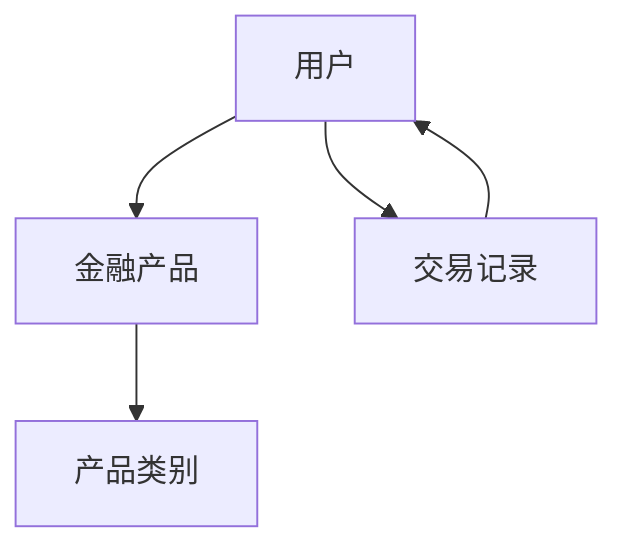

                 


# 金融产品交叉销售推荐引擎

> 关键词：金融推荐系统、交叉销售、机器学习、深度学习、系统架构

> 摘要：本文详细探讨了金融产品交叉销售推荐引擎的设计与实现，从背景分析、算法原理到系统架构，再到项目实战，系统地介绍了如何利用机器学习和深度学习技术构建高效、智能的金融推荐系统，帮助金融机构提升客户满意度和销售转化率。

---

## 第一部分: 金融产品交叉销售推荐引擎概述

### 第1章: 金融产品交叉销售推荐引擎的背景与概念

#### 1.1 问题背景与描述

- **1.1.1 金融产品销售的现状与挑战**
  - 传统金融销售模式依赖人工推荐，效率低、覆盖面有限。
  - 客户需求多样，金融产品种类繁多，如何精准匹配是难点。
  - 数据孤岛问题严重，难以实现跨产品推荐。

- **1.1.2 交叉销售在金融业务中的重要性**
  - 提高客户满意度和忠诚度。
  - 增加收入来源，提升销售转化率。
  - 增强客户粘性，降低客户流失率。

- **1.1.3 当前推荐系统存在的问题**
  - 数据稀疏性问题：用户行为数据不足。
  - 算法单一性问题：推荐结果不够精准。
  - 用户隐私保护问题：数据泄露风险。

#### 1.2 问题解决与边界

- **1.2.1 交叉销售推荐引擎的目标**
  - 提供个性化的产品推荐。
  - 实现跨产品、跨业务的协同推荐。
  - 提高推荐系统的实时性和准确性。

- **1.2.2 系统的边界与外延**
  - 系统边界：仅限于金融产品推荐，不涉及其他业务领域。
  - 外延：支持多渠道（线上、线下）推荐，覆盖多种金融产品类型。

- **1.2.3 核心要素与组成结构**
  - 用户信息：用户ID、属性、行为数据。
  - 产品信息：产品ID、属性、类别。
  - 交易数据：交易时间、金额、渠道。
  - 推荐结果：推荐列表、推荐理由。

#### 1.3 核心概念与联系

- **1.3.1 实体关系图（ER图）**


- **1.3.2 核心概念属性对比表**
| 概念 | 属性 | 描述 |
|------|------|------|
| 用户 | ID | 用户唯一标识 |
| 产品 | Code | 产品代码 |
| 交易 | Time | 交易时间 |
| 类别 | Name | 产品类别名称 |

### 1.4 本章小结

通过本章的介绍，我们明确了金融产品交叉销售推荐引擎的核心概念、目标和边界，并通过ER图和对比表展示了系统的组成结构和要素关系。

---

## 第2章: 交叉销售推荐引擎的核心算法

### 2.1 算法原理与流程

- **2.1.1 协同过滤算法**
  - 基于用户相似性或产品相似性进行推荐。
  - 示例：
    ```mermaid
    graph TD
        User1 --> Rate1[评分]
        User2 --> Rate2
        Rate1 --> Product1
        Rate2 --> Product2
        Product1 --> SimilarProduct[相似产品]
    ```

- **2.1.2 基于聚类的推荐算法**
  - 将用户或产品进行聚类，推荐相似类别中的产品。
  - 示例：
    ```mermaid
    graph TD
        User --> Cluster[用户聚类]
        Cluster --> ProductRecommendation[产品推荐]
    ```

- **2.1.3 深度学习模型**
  - 使用神经网络模型（如DNN、CNN）进行推荐。
  - 示例：
    ```mermaid
    graph TD
        Input --> Embedding[嵌入层]
        Embedding --> DNN[深度神经网络]
        DNN --> Output[输出层]
    ```

### 2.2 数学模型与公式

- **2.2.1 协同过滤公式**
  $$相似度 = \frac{\sum (r_{ui} - \bar{r}_u)(r_{vi} - \bar{r}_v)}{\sqrt{\sum (r_{ui} - \bar{r}_u)^2} \sqrt{\sum (r_{vi} - \bar{r}_v)^2}}$$

- **2.2.2 深度学习模型损失函数**
  $$\text{损失} = \sum (\text{预测值} - \text{真实值})^2$$`

### 2.3 算法实现与优化

- **2.3.1 算法实现步骤**
  1. 数据预处理：清洗、特征提取。
  2. 模型训练：选择合适的算法进行训练。
  3. 模型评估：使用准确率、召回率等指标进行评估。
  4. 模型优化：调整超参数、优化算法。

- **2.3.2 算法优化策略**
  - 基于规则的优化：结合业务规则进行推荐。
  - 混合推荐：结合协同过滤和深度学习模型。

### 2.4 本章小结

本章详细介绍了交叉销售推荐引擎的核心算法，包括协同过滤、聚类和深度学习模型，并通过数学公式和流程图展示了算法的实现和优化策略。

---

## 第3章: 系统架构与设计

### 3.1 系统功能设计

- **3.1.1 功能模块划分**
  - 用户信息管理模块：用户注册、登录、信息维护。
  - 产品信息管理模块：产品录入、分类管理。
  - 推荐引擎模块：计算相似度、生成推荐列表。
  - 推荐结果展示模块：推荐列表展示、推荐理由解释。

- **3.1.2 系统功能流程**
  ```mermaid
  graph TD
      User --> ProductRecommendation[推荐引擎]
      ProductRecommendation --> Transaction[交易记录]
      Transaction --> User
  ```

### 3.2 系统架构设计

- **3.2.1 系统架构图**
  ```mermaid
  graph TD
      Frontend[前端] --> Backend[后端]
      Backend --> Database[数据库]
      Backend --> Recommender[推荐引擎]
      Database --> Recommender
  ```

- **3.2.2 系统接口设计**
  - 用户信息接口：RESTful API（GET、POST、PUT、DELETE）。
  - 产品推荐接口：基于用户ID返回推荐列表。

### 3.3 系统交互设计

- **3.3.1 系统交互流程**
  ```mermaid
  graph TD
      User --> Frontend[前端]
      Frontend --> Backend[后端]
      Backend --> Recommender[推荐引擎]
      Recommender --> Database[数据库]
      Database --> Recommender
      Recommender --> Backend
      Backend --> Frontend
      Frontend --> User
  ```

### 3.4 本章小结

通过本章的系统架构设计，我们明确了推荐引擎的模块划分、接口设计和交互流程，并通过mermaid图展示了系统的整体架构和各部分的交互关系。

---

## 第4章: 项目实战

### 4.1 环境安装与配置

- **4.1.1 环境要求**
  - 操作系统：Linux/Windows/MacOS。
  - 开发工具：Python、Jupyter Notebook、IDE（PyCharm）。
  - 依赖库：Pandas、NumPy、Scikit-learn、Keras、TensorFlow。

### 4.2 核心代码实现

- **4.2.1 数据预处理**
  ```python
  import pandas as pd
  # 读取数据
  df = pd.read_csv('financial_products.csv')
  # 数据清洗
  df.dropna(inplace=True)
  ```

- **4.2.2 协同过滤实现**
  ```python
  from sklearn.metrics.pairwise import cosine_similarity
  # 计算用户相似度
  user_similarity = cosine_similarity(user_features)
  ```

- **4.2.3 深度学习模型实现**
  ```python
  import tensorflow as tf
  model = tf.keras.Sequential([
      tf.keras.layers.Dense(64, activation='relu'),
      tf.keras.layers.Dense(1, activation='sigmoid')
  ])
  model.compile(optimizer='adam', loss='binary_crossentropy')
  ```

### 4.3 案例分析与效果评估

- **4.3.1 案例分析**
  - 示例用户：用户A，已购买理财产品X，推荐相关保险产品Y。

- **4.3.2 效果评估**
  - 准确率：推荐列表中用户实际购买的比例。
  - 召回率：推荐列表中包含用户实际购买的产品的比例。
  - F1分数：综合准确率和召回率的指标。

### 4.4 项目小结

通过本章的项目实战，我们展示了如何在实际场景中应用推荐引擎，并通过案例分析和效果评估验证了系统的有效性和实用性。

---

## 第5章: 最佳实践与注意事项

### 5.1 最佳实践

- **5.1.1 数据隐私保护**
  - 遵守GDPR等数据保护法规。
  - 匿化处理用户数据。

- **5.1.2 模型迭代优化**
  - 定期更新模型参数。
  - 结合业务规则进行调整。

### 5.2 小结

通过本文的介绍，我们系统地探讨了金融产品交叉销售推荐引擎的设计与实现，从背景分析到算法实现，再到系统架构和项目实战，为读者提供了全面的技术指导。

### 5.3 注意事项

- 数据质量：确保数据的完整性和准确性。
- 模型选择：根据实际需求选择合适的算法。
- 系统性能：优化推荐引擎的响应速度和稳定性。

---

## 第6章: 总结与展望

### 6.1 总结

通过本文的介绍，我们系统地探讨了金融产品交叉销售推荐引擎的设计与实现，从背景分析到算法实现，再到系统架构和项目实战，为读者提供了全面的技术指导。

### 6.2 展望

未来，随着人工智能和大数据技术的不断发展，金融产品交叉销售推荐引擎将更加智能化和个性化，推荐算法也将更加精准和高效。

---

## 作者

作者：AI天才研究院/AI Genius Institute & 禅与计算机程序设计艺术 /Zen And The Art of Computer Programming

---

通过本文的系统介绍，读者可以全面了解金融产品交叉销售推荐引擎的核心技术，并能够在实际项目中应用这些方法和思路，提升金融业务的销售效率和客户满意度。

