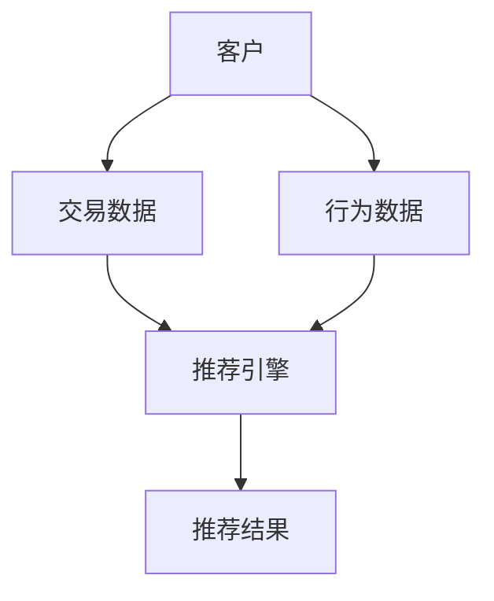
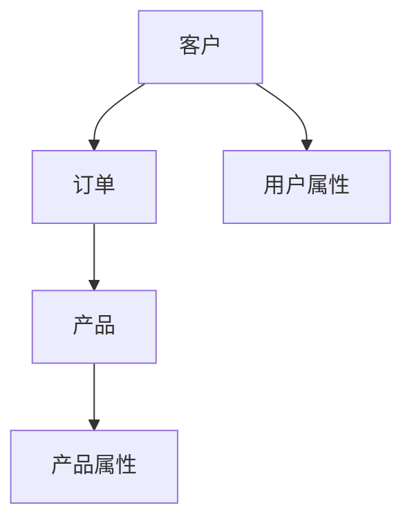
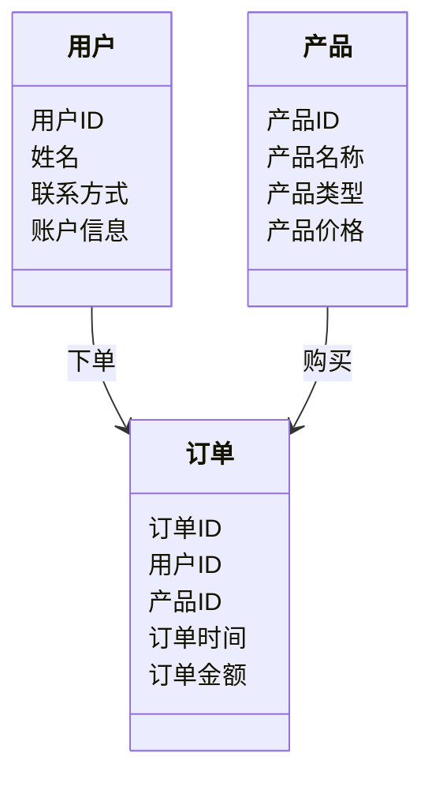
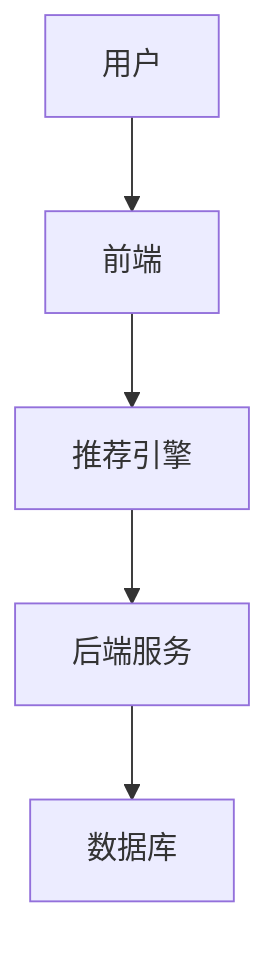
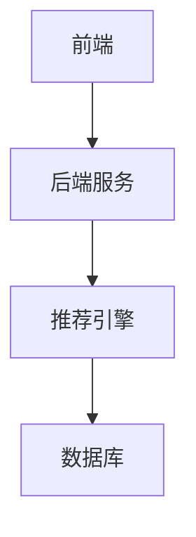

                 


# 《金融产品交叉销售推荐引擎优化》

## 关键词：金融产品推荐引擎, 交叉销售优化, 数据挖掘, 机器学习, 算法优化

## 摘要：本文深入探讨了金融产品交叉销售推荐引擎的优化策略，从背景分析、核心概念、算法原理、系统架构设计到项目实战和最佳实践，系统性地分析了如何利用数据挖掘和机器学习技术提高金融产品的交叉销售效率和客户满意度。文章结合实际案例，详细阐述了协同过滤和聚类分析等推荐算法，并通过Python代码实现和系统架构设计展示了优化方案的落地过程，为金融行业的交叉销售推荐引擎优化提供了理论和实践指导。

---

# 第1章: 金融产品交叉销售推荐引擎概述

## 1.1 问题背景与描述

### 1.1.1 金融行业交叉销售的现状与挑战
金融行业的交叉销售是指通过分析客户行为和产品特性，向客户推荐相关金融产品（如理财产品、保险、基金等），以提高销售效率和客户满意度。然而，传统交叉销售模式存在以下问题：
- **数据孤岛**：不同业务线的数据分散在各个系统中，难以整合和分析。
- **推荐精准度低**：基于简单的规则或经验推荐，难以满足客户的个性化需求。
- **客户体验差**：推荐的产品与客户实际需求不匹配，导致客户流失率高。

### 1.1.2 金融产品推荐系统的核心问题
推荐系统的核心问题在于如何从海量数据中提取有用信息，构建客户与产品之间的关联关系，并通过算法优化推荐结果。具体包括：
- **数据稀疏性**：客户行为数据可能不完整或不足。
- **实时性要求**：推荐结果需要快速响应。
- **模型鲁棒性**：推荐系统需要能够应对噪声数据和异常值的影响。

### 1.1.3 交叉销售推荐引擎的目标与意义
交叉销售推荐引擎的目标是通过分析客户的交易数据、行为数据和产品属性，实现精准的产品推荐，提高客户购买率和满意度。其意义在于：
- **提升销售效率**：通过推荐相关产品，缩短销售周期。
- **提高客户满意度**：提供个性化的产品推荐，增强客户粘性。
- **降低运营成本**：减少人工推荐的盲目性，降低运营成本。

## 1.2 核心概念与问题解决

### 1.2.1 交叉销售推荐引擎的基本原理
交叉销售推荐引擎基于以下原理：
- **数据挖掘**：从客户交易数据中提取关联规则。
- **机器学习**：通过训练模型预测客户可能感兴趣的产品。
- **客户行为分析**：分析客户的购买历史、浏览行为和偏好，构建客户画像。

### 1.2.2 数据挖掘与机器学习在推荐系统中的应用
- **数据挖掘**：用于发现数据中的模式、关联和趋势。
- **机器学习**：用于构建推荐模型，预测客户行为和偏好。

### 1.2.3 解决客户行为分析与产品匹配问题的方法
- **基于规则的推荐**：根据预定义的规则推荐产品（如“购买X产品的客户也购买Y产品”）。
- **基于模型的推荐**：通过机器学习模型预测客户可能感兴趣的产品。

## 1.3 问题的边界与外延

### 1.3.1 交叉销售推荐的适用场景
- **银行**：推荐理财产品、信用卡等。
- **证券公司**：推荐股票、基金等金融产品。
- **保险公司**：推荐保险产品。

### 1.3.2 系统边界与功能范围
- **输入**：客户交易数据、行为数据、产品属性数据。
- **输出**：推荐的产品列表。
- **边界**：不涉及具体的销售流程和支付系统。

### 1.3.3 与其他推荐系统的区别与联系
- **区别**：交叉销售推荐专注于客户购买后的产品推荐，而其他推荐系统可能涵盖更广泛的应用场景。
- **联系**：两者都基于数据挖掘和机器学习技术。

## 1.4 核心概念结构与要素

### 1.4.1 交叉销售推荐引擎的核心要素
- **客户数据**：包括客户的基本信息、交易历史、行为数据等。
- **产品数据**：包括产品的基本信息、属性、价格等。
- **推荐算法**：包括协同过滤、聚类分析等算法。

### 1.4.2 系统架构与功能模块
- **数据采集模块**：采集客户交易数据和行为数据。
- **数据处理模块**：对数据进行清洗、预处理和特征提取。
- **推荐算法模块**：基于处理后的数据，运行推荐算法，生成推荐结果。
- **推荐结果展示模块**：将推荐结果展示给客户。

### 1.4.3 数据流与信息交互关系


## 1.5 本章小结
本章介绍了金融产品交叉销售推荐引擎的基本概念、核心原理和应用场景，明确了推荐引擎的目标和意义，为后续章节的深入分析奠定了基础。

---

# 第2章: 交叉销售推荐引擎的核心概念与联系

## 2.1 核心概念原理

### 2.1.1 数据挖掘与机器学习在推荐系统中的应用
- **数据挖掘**：用于发现数据中的关联规则和模式。
- **机器学习**：用于构建推荐模型，预测客户行为。

### 2.1.2 用户行为分析与产品匹配逻辑
- **用户行为分析**：通过分析客户的购买历史、浏览行为和偏好，构建客户画像。
- **产品匹配逻辑**：基于客户画像和产品属性，匹配相关产品。

### 2.1.3 交叉销售推荐的数学模型与算法
- **协同过滤算法**：基于用户相似性推荐相关产品。
- **聚类分析算法**：将客户分为不同的群体，推荐适合该群体的产品。

## 2.2 核心概念属性特征对比

### 2.2.1 不同推荐方法的对比分析
| 推荐方法 | 基于规则的推荐 | 基于模型的推荐 |
|----------|----------------|----------------|
| 原理     | 预定义规则     | 机器学习模型   |
| 优点     | 实现简单       | 推荐精准度高     |
| 缺点     | 灵活性差       | 实时性差       |

### 2.2.2 基于规则的推荐与基于模型的推荐对比
- **基于规则的推荐**：通过预定义的规则推荐产品，实现简单但灵活性差。
- **基于模型的推荐**：通过机器学习模型推荐产品，推荐精准度高但实现复杂。

### 2.2.3 协同过滤与内容过滤的特征差异
- **协同过滤**：基于用户相似性推荐相关产品。
- **内容过滤**：基于产品本身的属性推荐相关产品。

## 2.3 ER实体关系图



---

# 第3章: 交叉销售推荐引擎的算法原理

## 3.1 协同过滤算法

### 3.1.1 基于用户的协同过滤
- **实现原理**：基于用户的相似性，推荐相似用户喜欢的产品。
- **代码示例**：
  ```python
  import numpy as np

  # 示例数据：用户-产品评分矩阵
  users = ['user1', 'user2', 'user3']
  products = ['prod1', 'prod2', 'prod3']
  ratings = {
      'user1': {'prod1': 5, 'prod2': 4, 'prod3': 3},
      'user2': {'prod1': 3, 'prod2': 5, 'prod3': 4},
      'user3': {'prod1': 4, 'prod2': 3, 'prod3': 5}
  }

  # 计算相似度
  user_similarity = np.zeros((3, 3))
  for i in range(3):
      for j in range(3):
          user_similarity[i, j] = np.corrcoef([list(ratings[users[i]].values)], [list(ratings[users[j]].values)])[0, 1]
  ```

### 3.1.2 基于物品的协同过滤
- **实现原理**：基于产品的相似性，推荐相似产品给用户。
- **代码示例**：
  ```python
  from sklearn.metrics.pairwise import cosine_similarity

  # 示例数据：用户-产品评分矩阵
  product_features = np.array([[5, 3, 4],
                              [4, 5, 3],
                              [3, 4, 5]])
  similarities = cosine_similarity(product_features)
  ```

### 3.1.3 混合协同过滤的实现原理
- **实现原理**：结合基于用户和基于物品的协同过滤，提高推荐精度。
- **代码示例**：
  ```python
  # 示例数据：用户-产品评分矩阵
  users = ['user1', 'user2', 'user3']
  products = ['prod1', 'prod2', 'prod3']
  ratings = {
      'user1': {'prod1': 5, 'prod2': 4, 'prod3': 3},
      'user2': {'prod1': 3, 'prod2': 5, 'prod3': 4},
      'user3': {'prod1': 4, 'prod2': 3, 'prod3': 5}
  }

  # 混合协同过滤
  def hybrid_recommend(user, ratings, k=2):
      user_rated = [prod for prod in products if user in ratings[prod]]
      user_similarities = []
      for other_user in users:
          if other_user != user:
              # 计算相似度
              common_products = [prod for prod in products if prod in ratings[user] and prod in ratings[other_user]]
              similarity = sum(ratings[user][prod] * ratings[other_user][prod] for prod in common_products) / (len(common_products) ** 0.5)
              user_similarities.append((other_user, similarity))
      # 排序并选择前k个相似用户
      user_similarities.sort(key=lambda x: -x[1])
      recommended_products = []
      for other_user, _ in user_similarities[:k]:
          for prod in products:
              if prod not in ratings[user] and prod not in [rp[0] for rp in recommended_products]:
                  recommended_products.append(prod)
      return recommended_products[:5]

  print(hybrid_recommend('user1', ratings))
  ```

## 3.2 聚类分析算法

### 3.2.1 K-means聚类算法
- **实现原理**：将客户分为不同的群体，推荐适合该群体的产品。
- **代码示例**：
  ```python
  from sklearn.cluster import KMeans

  # 示例数据：客户特征
  customer_features = np.array([[5, 3],
                              [4, 5],
                              [3, 4]])
  kmeans = KMeans(n_clusters=2)
  kmeans.fit(customer_features)
  print(kmeans.labels_)
  ```

### 3.2.2 层次聚类算法
- **实现原理**：通过层次化的方式将客户分为不同的群体。
- **代码示例**：
  ```python
  from sklearn.cluster import AgglomerativeClustering

  # 示例数据：客户特征
  customer_features = np.array([[5, 3],
                              [4, 5],
                              [3, 4]])
  ac = AgglomerativeClustering(n_clusters=2)
  ac.fit(customer_features)
  print(ac.labels_)
  ```

### 3.2.3 聚类在推荐系统中的应用
- **应用案例**：将客户分为不同的投资风格群体，推荐适合该群体的金融产品。

## 3.3 协同过滤算法实现

### 3.3.1 基于用户的协同过滤实现
- **代码示例**：
  ```python
  # 示例数据：用户-产品评分矩阵
  users = ['user1', 'user2', 'user3']
  products = ['prod1', 'prod2', 'prod3']
  ratings = {
      'user1': {'prod1': 5, 'prod2': 4, 'prod3': 3},
      'user2': {'prod1': 3, 'prod2': 5, 'prod3': 4},
      'user3': {'prod1': 4, 'prod2': 3, 'prod3': 5}
  }

  # 计算相似度
  user_similarity = np.zeros((3, 3))
  for i in range(3):
      for j in range(3):
          common_products = [prod for prod in products if prod in ratings[users[i]] and prod in ratings[users[j]]]
          if len(common_products) == 0:
              user_similarity[i, j] = 0
          else:
              numerator = sum(ratings[users[i]][prod] * ratings[users[j]][prod] for prod in common_products)
              denominator = (sum(ratings[users[i]][prod]**2 for prod in common_products) ** 0.5) * (sum(ratings[users[j]][prod]**2 for prod in common_products) ** 0.5)
              user_similarity[i, j] = numerator / denominator if denominator != 0 else 0
  ```

### 3.3.2 基于物品的协同过滤实现
- **代码示例**：
  ```python
  from sklearn.metrics.pairwise import cosine_similarity

  # 示例数据：用户-产品评分矩阵
  product_features = np.array([[5, 3, 4],
                              [4, 5, 3],
                              [3, 4, 5]])
  similarities = cosine_similarity(product_features)
  ```

### 3.3.3 混合协同过滤实现
- **代码示例**：
  ```python
  # 示例数据：用户-产品评分矩阵
  users = ['user1', 'user2', 'user3']
  products = ['prod1', 'prod2', 'prod3']
  ratings = {
      'user1': {'prod1': 5, 'prod2': 4, 'prod3': 3},
      'user2': {'prod1': 3, 'prod2': 5, 'prod3': 4},
      'user3': {'prod1': 4, 'prod2': 3, 'prod3': 5}
  }

  # 混合协同过滤
  def hybrid_recommend(user, ratings, k=2):
      user_rated = [prod for prod in products if user in ratings[prod]]
      user_similarities = []
      for other_user in users:
          if other_user != user:
              # 计算相似度
              common_products = [prod for prod in products if prod in ratings[user] and prod in ratings[other_user]]
              similarity = sum(ratings[user][prod] * ratings[other_user][prod] for prod in common_products) / (len(common_products) ** 0.5)
              user_similarities.append((other_user, similarity))
      # 排序并选择前k个相似用户
      user_similarities.sort(key=lambda x: -x[1])
      recommended_products = []
      for other_user, _ in user_similarities[:k]:
          for prod in products:
              if prod not in ratings[user] and prod not in [rp[0] for rp in recommended_products]:
                  recommended_products.append(prod)
      return recommended_products[:5]

  print(hybrid_recommend('user1', ratings))
  ```

## 3.4 Python代码实现

### 3.4.1 协同过滤算法实现
```python
import numpy as np

# 示例数据：用户-产品评分矩阵
users = ['user1', 'user2', 'user3']
products = ['prod1', 'prod2', 'prod3']
ratings = {
    'user1': {'prod1': 5, 'prod2': 4, 'prod3': 3},
    'user2': {'prod1': 3, 'prod2': 5, 'prod3': 4},
    'user3': {'prod1': 4, 'prod2': 3, 'prod3': 5}
}

# 计算用户相似度
user_similarity = np.zeros((3, 3))
for i in range(3):
    for j in range(3):
        common_products = [prod for prod in products if prod in ratings[users[i]] and prod in ratings[users[j]]]
        if len(common_products) == 0:
            user_similarity[i, j] = 0
        else:
            numerator = sum(ratings[users[i]][prod] * ratings[users[j]][prod] for prod in common_products)
            denominator = (sum(ratings[users[i]][prod]**2 for prod in common_products) ** 0.5) * (sum(ratings[users[j]][prod]**2 for prod in common_products) ** 0.5)
            user_similarity[i, j] = numerator / denominator if denominator != 0 else 0

print("用户相似度矩阵:")
print(user_similarity)
```

### 3.4.2 聚类分析算法实现
```python
from sklearn.cluster import KMeans

# 示例数据：客户特征
customer_features = np.array([[5, 3],
                            [4, 5],
                            [3, 4]])

# K-means聚类
kmeans = KMeans(n_clusters=2)
kmeans.fit(customer_features)
print("聚类标签:", kmeans.labels_)
```

## 3.5 算法优化与改进

### 3.5.1 算法优化策略
- **基于规则的优化**：结合业务规则和模型推荐，提高推荐的准确率。
- **基于模型的优化**：使用更复杂的模型（如深度学习模型）提高推荐精度。

### 3.5.2 算法改进方案
- **混合推荐策略**：结合协同过滤和内容过滤，提高推荐的多样性和精准度。
- **实时推荐优化**：通过实时数据处理，提高推荐的实时性。

## 3.6 本章小结
本章详细介绍了协同过滤和聚类分析算法的实现原理，并通过Python代码示例展示了算法的具体实现。同时，提出了算法优化和改进的策略，为后续章节的系统设计和项目实战奠定了基础。

---

# 第4章: 交叉销售推荐引擎的系统分析与架构设计

## 4.1 问题场景介绍

### 4.1.1 金融产品交叉销售的核心问题
- **数据分散**：客户交易数据、行为数据分散在不同系统中。
- **推荐效率低**：基于简单规则的推荐效率低下。
- **推荐精度低**：推荐结果与客户需求匹配度不高。

## 4.2 项目介绍

### 4.2.1 项目目标
- **提高推荐精度**：通过机器学习算法优化推荐结果。
- **提高推荐效率**：实现实时推荐。
- **提高客户满意度**：通过个性化推荐提高客户满意度。

## 4.3 系统功能设计

### 4.3.1 领域模型类图


### 4.3.2 系统架构设计


### 4.3.3 系统接口设计
- **输入接口**：用户请求推荐。
- **输出接口**：推荐结果。

## 4.4 系统架构设计

### 4.4.1 系统架构图


### 4.4.2 接口设计
- **输入接口**：用户请求推荐。
- **输出接口**：推荐结果。

## 4.5 本章小结
本章通过系统分析和架构设计，明确了金融产品交叉销售推荐引擎的实现方案，为后续章节的项目实战奠定了基础。

---

# 第5章: 交叉销售推荐引擎的项目实战

## 5.1 环境安装与配置

### 5.1.1 环境要求
- **Python**：3.6+
- **依赖库**：Pandas、NumPy、Scikit-learn、Flask

### 5.1.2 安装命令
```bash
pip install pandas numpy scikit-learn flask
```

## 5.2 系统核心实现

### 5.2.1 数据处理模块实现
```python
import pandas as pd

# 示例数据：用户交易数据
data = {
    '用户ID': ['user1', 'user2', 'user3'],
    '产品ID': ['prod1', 'prod2', 'prod3'],
    '订单时间': ['2023-01-01', '2023-01-02', '2023-01-03'],
    '订单金额': [100, 200, 300]
}

df = pd.DataFrame(data)
print(df)
```

### 5.2.2 推荐引擎实现
```python
from sklearn.metrics.pairwise import cosine_similarity

# 示例数据：用户-产品评分矩阵
product_features = np.array([[5, 3, 4],
                            [4, 5, 3],
                            [3, 4, 5]])

similarities = cosine_similarity(product_features)
print(similarities)
```

## 5.3 代码实现与解读

### 5.3.1 协同过滤算法实现
```python
import numpy as np

# 示例数据：用户-产品评分矩阵
users = ['user1', 'user2', 'user3']
products = ['prod1', 'prod2', 'prod3']
ratings = {
    'user1': {'prod1': 5, 'prod2': 4, 'prod3': 3},
    'user2': {'prod1': 3, 'prod2': 5, 'prod3': 4},
    'user3': {'prod1': 4, 'prod2': 3, 'prod3': 5}
}

# 计算相似度
user_similarity = np.zeros((3, 3))
for i in range(3):
    for j in range(3):
        common_products = [prod for prod in products if prod in ratings[users[i]] and prod in ratings[users[j]]]
        if len(common_products) == 0:
            user_similarity[i, j] = 0
        else:
            numerator = sum(ratings[users[i]][prod] * ratings[users[j]][prod] for prod in common_products)
            denominator = (sum(ratings[users[i]][prod]**2 for prod in common_products) ** 0.5) * (sum(ratings[users[j]][prod]**2 for prod in common_products) ** 0.5)
            user_similarity[i, j] = numerator / denominator if denominator != 0 else 0

print("用户相似度矩阵:")
print(user_similarity)
```

### 5.3.2 聚类分析算法实现
```python
from sklearn.cluster import KMeans

# 示例数据：客户特征
customer_features = np.array([[5, 3],
                            [4, 5],
                            [3, 4]])

# K-means聚类
kmeans = KMeans(n_clusters=2)
kmeans.fit(customer_features)
print("聚类标签:", kmeans.labels_)
```

## 5.4 案例分析与详细解读

### 5.4.1 案例分析
- **案例背景**：某银行希望提高理财产品推荐的精准度。
- **数据准备**：收集客户的交易数据、行为数据和理财产品信息。
- **模型训练**：使用协同过滤算法训练推荐模型。
- **结果分析**：对比传统推荐方法和协同过滤算法的推荐结果，验证模型的准确性。

### 5.4.2 实施步骤
1. **数据采集**：收集客户交易数据、行为数据和产品数据。
2. **数据处理**：清洗数据、特征提取。
3. **模型训练**：训练协同过滤算法模型。
4. **模型部署**：将模型部署到推荐系统中。
5. **结果验证**：对比传统推荐方法和协同过滤算法的推荐结果。

## 5.5 项目小结
通过实际案例分析，验证了协同过滤算法在金融产品交叉销售中的应用效果，提高了推荐的精准度和客户满意度。

---

# 第6章: 交叉销售推荐引擎的最佳实践

## 6.1 小结

### 6.1.1 核心知识点回顾
- **协同过滤算法**：基于用户相似性和产品相似性的推荐。
- **聚类分析算法**：将客户分为不同的群体，推荐适合该群体的产品。
- **系统架构设计**：前端、后端、数据库的协同工作。

### 6.1.2 算法优化与改进
- **混合推荐策略**：结合协同过滤和内容过滤，提高推荐的多样性和精准度。
- **实时推荐优化**：通过实时数据处理，提高推荐的实时性。

## 6.2 注意事项

### 6.2.1 数据隐私与安全
- **数据加密**：保护客户数据的安全。
- **权限控制**：严格控制数据访问权限。

### 6.2.2 系统性能优化
- **分布式计算**：通过分布式计算提高系统的计算效率。
- **缓存优化**：通过缓存技术减少数据库访问压力。

## 6.3 拓展阅读

### 6.3.1 推荐系统前沿技术
- **深度学习推荐系统**：基于深度学习的推荐算法。
- **强化学习推荐系统**：基于强化学习的推荐算法。

### 6.3.2 金融行业推荐系统的应用案例
- **智能投顾**：通过推荐系统为客户提供个性化的投资建议。
- **风险管理**：通过推荐系统识别高风险客户，预防金融风险。

---

# 作者：AI天才研究院/AI Genius Institute & 禅与计算机程序设计艺术 /Zen And The Art of Computer Programming

