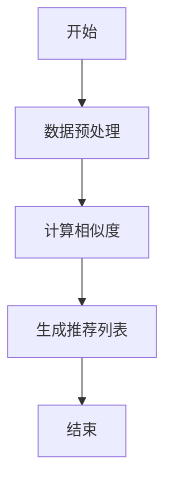
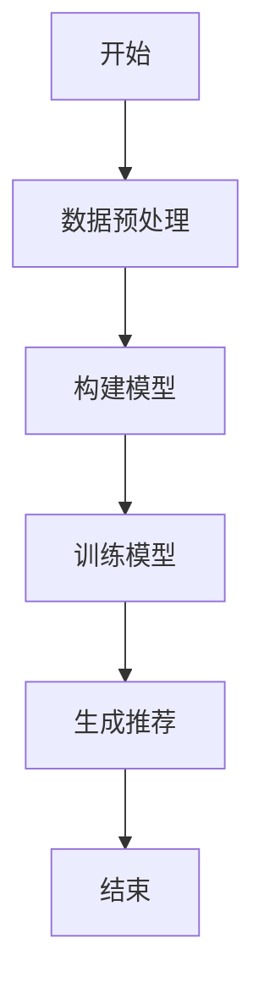
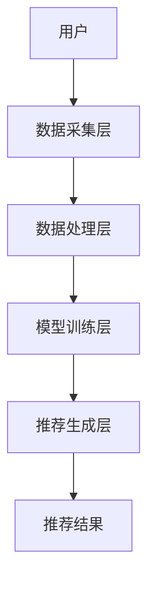
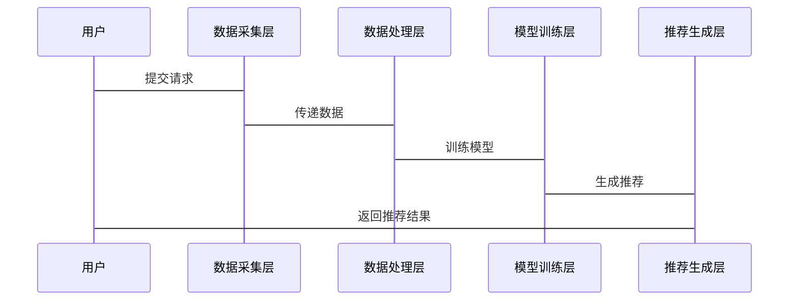

                 


# 《金融产品交叉销售机会识别与个性化推荐》

## 关键词：金融产品，交叉销售，个性化推荐，机器学习，深度学习，推荐系统

## 摘要：  
本文深入探讨了金融产品交叉销售机会识别与个性化推荐的核心概念、算法原理、系统设计及实际应用。通过分析用户行为和产品特征，结合协同过滤、聚类分析和深度学习模型，提出了一套完整的解决方案，帮助金融机构提高客户满意度和产品销售效率。

---

# 第1章: 金融产品交叉销售机会识别与个性化推荐概述

## 1.1 问题背景与描述

### 1.1.1 金融产品交叉销售的背景
在金融行业，交叉销售是指在同一客户生命周期的不同阶段，向客户推荐多种金融产品，以增加客户粘性和收入来源。例如，银行可能会向存款客户推荐贷款或理财服务。

### 1.1.2 个性化推荐的定义与特点
个性化推荐是基于用户行为、偏好和需求，利用算法和技术，向用户推荐符合其需求的产品或服务。其特点是实时性、精准性和动态性。

### 1.1.3 交叉销售与个性化推荐的结合
通过个性化推荐技术，金融机构可以识别客户潜在的需求，主动推荐相关金融产品，从而实现交叉销售的目标。

## 1.2 核心概念与问题解决

### 1.2.1 问题背景与目标
- **问题背景**：传统交叉销售依赖人工推荐，效率低且难以覆盖所有客户。
- **问题目标**：通过技术手段实现自动化、精准化的交叉销售。

### 1.2.2 问题解决的思路与方法
- **数据驱动**：利用客户行为数据和产品特征数据，构建推荐模型。
- **算法优化**：通过机器学习算法提升推荐准确性和效率。
- **实时反馈**：根据用户反馈动态调整推荐策略。

### 1.2.3 边界与外延
- **边界**：仅关注交叉销售机会识别，不涉及产品设计和定价。
- **外延**：推荐系统可以扩展到其他领域，如电商、教育等。

### 1.2.4 核心概念结构与组成要素
- **用户数据**：包括用户基本信息、交易记录、行为数据等。
- **产品数据**：包括产品类型、收益、风险等级等。
- **推荐模型**：基于协同过滤、聚类分析或深度学习的推荐算法。

## 1.3 本章小结
本章介绍了金融产品交叉销售与个性化推荐的背景、核心概念和解决思路，为后续章节奠定了基础。

---

# 第2章: 核心概念与联系

## 2.1 核心概念原理

### 2.1.1 交叉销售的核心原理
交叉销售的核心在于识别客户在购买某一产品时，可能感兴趣的其他产品。通过分析客户行为和产品关联性，可以实现精准推荐。

### 2.1.2 个性化推荐的数学模型
个性化推荐可以看作是一个矩阵填充问题，通过构建用户-产品交互矩阵，利用矩阵分解技术预测潜在的交互行为。

### 2.1.3 两者之间的联系与区别
- **联系**：交叉销售是个性化推荐的一种应用场景。
- **区别**：交叉销售更注重产品的组合销售，而个性化推荐更注重根据用户需求推荐产品。

## 2.2 核心概念对比表

| **对比维度** | **交叉销售** | **个性化推荐** |
|--------------|--------------|----------------|
| 目标          | 提高产品销量 | 提高用户满意度 |
| 数据需求      | 产品关联性   | 用户行为与偏好 |
| 技术手段      | 聚类分析     | 协同过滤、深度学习 |

## 2.3 ER实体关系图

```mermaid
erDiagram
    customer[客户] {
        id : int
        name : string
        age : int
        gender : string
    }
    product[金融产品] {
        id : int
        name : string
        type : string
        risk_level : int
    }
    recommendation[推荐关系] {
        customer_id : int
        product_id : int
        score : float
    }
    customer o-- recommendation : "推荐金融产品"
    product o-- recommendation : "被推荐的金融产品"
```

## 2.4 本章小结
本章通过对比和ER图，清晰地展示了交叉销售与个性化推荐之间的联系和区别，为后续算法设计提供了理论基础。

---

# 第3章: 算法原理与数学模型

## 3.1 协同过滤算法

### 3.1.1 协同过滤的基本原理
协同过滤基于“相似的用户喜欢相似的产品”的假设，通过计算用户或产品的相似度，推荐用户可能感兴趣的产品。

### 3.1.2 基于用户的协同过滤
1. **计算用户相似度**：使用余弦相似度或欧氏距离。
2. **生成推荐列表**：根据相似用户的评分，加权平均生成推荐。

### 3.1.3 基于物品的协同过滤
1. **计算产品相似度**：基于产品被推荐的频率和关联性。
2. **生成推荐列表**：根据用户已购买的产品，推荐相似的产品。

## 3.2 聚类分析算法

### 3.2.1 聚类的基本原理
聚类分析通过将用户或产品分成若干类别，推荐用户可能感兴趣的产品。

### 3.2.2 K-means算法在推荐中的应用
1. **数据预处理**：标准化用户数据。
2. **聚类**：将用户分为K个簇。
3. **推荐**：根据用户所属的簇推荐相关产品。

### 3.2.3 层次聚类在交叉销售中的应用
1. **构建层次聚类树**：根据产品相似度构建树状结构。
2. **推荐**：根据用户兴趣，推荐树中相近的产品。

## 3.3 深度学习模型

### 3.3.1 神经网络在推荐系统中的应用
神经网络通过非线性特征提取，提升推荐系统的准确性和鲁棒性。

### 3.3.2 基于矩阵分解的深度学习模型
1. **矩阵分解**：将用户-产品交互矩阵分解为两个低维矩阵。
2. **模型训练**：使用梯度下降优化模型参数。

## 3.4 算法流程图

### 协同过滤算法流程图



### 深度学习模型训练流程图



## 3.5 本章小结
本章详细介绍了协同过滤、聚类分析和深度学习模型的算法原理，并通过流程图展示了推荐系统的设计思路。

---

# 第4章: 系统分析与架构设计方案

## 4.1 问题场景介绍

### 4.1.1 金融产品交叉销售的典型场景
- 客户购买理财产品后，推荐保险产品。
- 高净值客户购买基金后，推荐私人银行服务。

### 4.1.2 个性化推荐的系统需求
- 实时性：推荐结果需要快速返回。
- 精准性：推荐结果需要符合用户需求。
- 可扩展性：支持多种金融产品的推荐。

## 4.2 系统目标与功能

### 4.2.1 系统目标
- 实现金融产品的交叉销售机会识别。
- 提供个性化推荐服务。

### 4.2.2 系统功能
- 数据采集：收集用户行为和产品数据。
- 数据处理：清洗和预处理数据。
- 模型训练：训练推荐模型。
- 推荐生成：根据模型生成推荐列表。

## 4.3 系统架构设计

### 4.3.1 系统架构图



### 系统交互图



## 4.4 本章小结
本章从系统架构和交互角度，详细设计了金融产品交叉销售机会识别与个性化推荐的实现方案。

---

# 第5章: 项目实战

## 5.1 环境安装

### 5.1.1 安装Python
```bash
python --version
pip install --upgrade pip
```

### 5.1.2 安装依赖库
```bash
pip install numpy pandas scikit-learn keras
```

## 5.2 系统核心实现源代码

### 5.2.1 数据预处理代码
```python
import pandas as pd
import numpy as np

# 加载数据
data = pd.read_csv('customer_product.csv')

# 数据清洗
data.dropna(inplace=True)
```

### 5.2.2 协同过滤实现代码
```python
from sklearn.metrics.pairwise import cosine_similarity

# 计算用户相似度
user_similarity = cosine_similarity(data)
```

### 5.2.3 深度学习模型训练代码
```python
from keras import layers

# 构建模型
model = keras.Sequential()
model.add(layers.Dense(64, activation='relu', input_shape=(input_dim,)))
model.add(layers.Dense(output_dim, activation='sigmoid'))
model.compile(optimizer='adam', loss='binary_crossentropy', metrics=['accuracy'])
model.fit(X_train, y_train, epochs=10, batch_size=32)
```

## 5.3 案例分析与解读

### 5.3.1 案例背景
假设我们有一个银行客户数据集，包括客户的存款、贷款和理财产品的持有情况。

### 5.3.2 推荐结果
通过协同过滤算法，发现某客户可能对保险产品感兴趣，并生成推荐列表。

## 5.4 本章小结
本章通过实际案例展示了如何在金融产品交叉销售中应用推荐算法，并提供了完整的代码实现。

---

# 第6章: 最佳实践与小结

## 6.1 小结

### 6.1.1 核心要点
- 数据是推荐系统的基础。
- 算法选择影响推荐效果。
- 系统架构设计决定系统的稳定性和扩展性。

### 6.1.2 注意事项
- 数据隐私保护。
- 模型的实时性和响应速度。
- 持续优化推荐策略。

## 6.2 拓展阅读

### 6.2.1 推荐系统优化
- 基于深度学习的推荐系统。
- 混合推荐模型。

### 6.2.2 金融领域应用
- 金融风控中的推荐系统应用。
- 金融产品组合优化。

## 6.3 本章小结
本章总结了金融产品交叉销售机会识别与个性化推荐的关键点，并提出了进一步研究的方向。

---

# 作者：AI天才研究院 & 禅与计算机程序设计艺术

