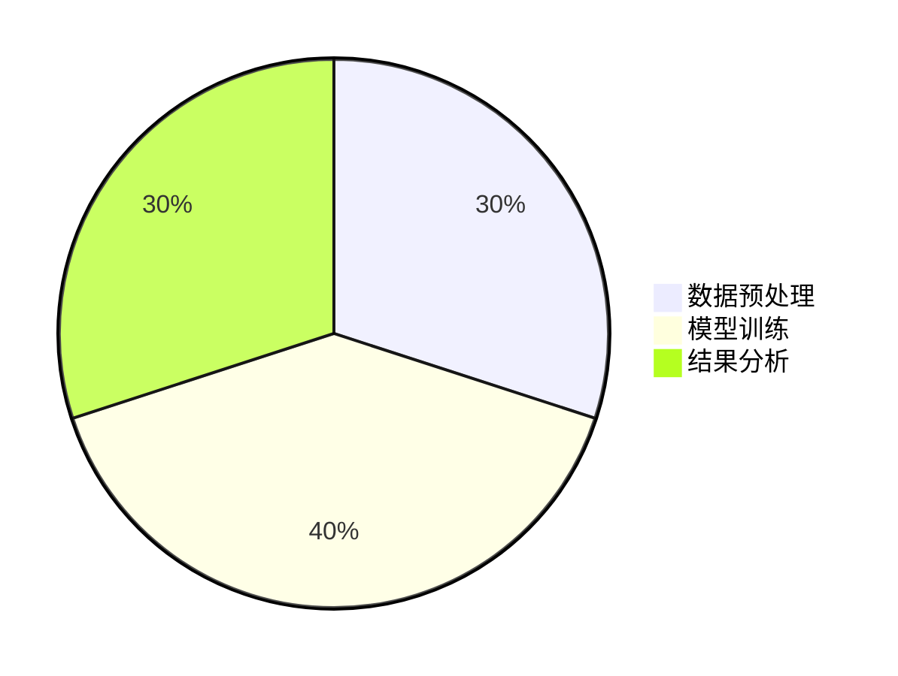
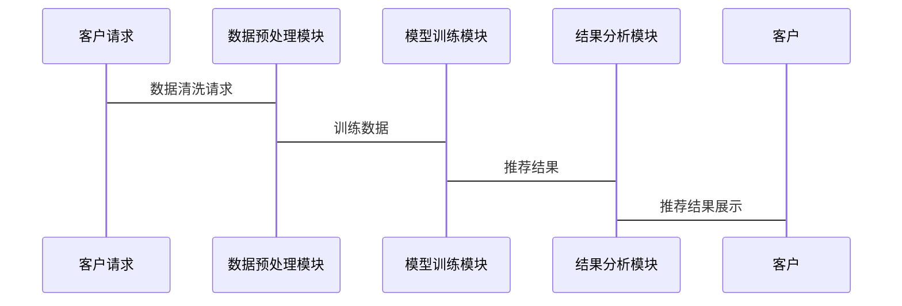

                 


# 《金融产品交叉销售机会识别系统》

## 关键词：金融产品，交叉销售，机会识别，数据分析，人工智能

## 摘要：
本文详细探讨了金融产品交叉销售机会识别系统的设计与实现。通过分析客户需求与产品特征，结合协同过滤和聚类分析算法，构建客户画像和产品关联度模型。系统采用模块化架构，提供数据预处理、模型训练、结果分析等功能，帮助金融机构提升交叉销售效率和客户满意度。本文还提供了实际案例分析和项目实战，总结了最佳实践和未来发展方向。

---

# 第1章: 问题背景与系统介绍

## 1.1 问题背景

### 1.1.1 金融产品销售的现状分析
- 金融行业竞争加剧，客户获取成本上升。
- 传统销售模式依赖人工推荐，效率低且精准度不足。
- 数据孤岛问题导致客户画像不完整，产品匹配困难。

### 1.1.2 交叉销售在金融行业的重要性
- 提升客户满意度和忠诚度。
- 增加收入来源，优化资源配置。
- 提高客户生命周期价值，降低获客成本。

### 1.1.3 当前交叉销售中的问题与挑战
- 数据分散，难以整合和分析。
- 缺乏精准的客户画像和产品匹配模型。
- 人工推荐效率低下，难以应对海量数据。

## 1.2 问题描述

### 1.2.1 客户需求与产品匹配的难点
- 客户需求多样，难以准确识别。
- 产品种类繁多，特征复杂，难以快速匹配。

### 1.2.2 数据孤岛与信息不对称的问题
- 数据分散在不同部门或系统中，难以统一分析。
- 信息不对称导致推荐不精准，客户体验差。

### 1.2.3 传统交叉销售模式的局限性
- 依赖人工经验，主观性强，效率低。
- 缺乏数据驱动的决策支持，难以实现个性化推荐。

## 1.3 系统目标与解决方法

### 1.3.1 系统的目标与核心功能
- 构建客户画像，分析客户需求。
- 建立产品特征库，实现产品匹配。
- 开发交叉销售机会识别算法，提供精准推荐。

### 1.3.2 数据驱动的交叉销售解决方案
- 整合多源数据，构建统一数据平台。
- 应用机器学习算法，实现智能推荐。
- 提供实时反馈，优化推荐策略。

### 1.3.3 系统的创新点与优势
- 结合客户行为和产品特征，提高推荐精准度。
- 采用模块化设计，便于扩展和维护。
- 提供实时数据分析，快速响应市场变化。

## 1.4 系统的边界与外延

### 1.4.1 系统的适用范围与限制
- 适用于银行、保险等金融机构。
- 支持多种金融产品类型，如存款、贷款、基金等。
- 适用于中大型企业，数据量较大。

### 1.4.2 系统与其他金融系统的接口关系
- 与客户关系管理系统（CRM）集成，获取客户信息。
- 与产品管理系统对接，获取产品特征。
- 与交易系统接口，记录销售数据。

### 1.4.3 系统的扩展性与可维护性
- 模块化设计，便于功能扩展。
- 支持多种算法模型，灵活调整推荐策略。
- 提供数据可视化界面，便于监控和分析。

## 1.5 核心概念与组成

### 1.5.1 客户画像的核心要素
- 基本信息：年龄、性别、职业等。
- 财务状况：收入水平、资产规模等。
- 行为特征：消费习惯、交易频率等。
- 需求偏好：风险承受能力、投资目标等。

### 1.5.2 产品特征的定义与分类
- 产品类型：存款、贷款、基金、保险等。
- 产品属性：风险等级、收益类型、期限等。
- 目标客户：适合特定客户群体的产品特征。

### 1.5.3 交叉销售机会识别的逻辑框架
- 数据收集与整合：获取客户和产品数据。
- 数据预处理：清洗和标准化数据。
- 特征提取：提取客户和产品特征。
- 模型训练：构建推荐算法。
- 推荐结果：生成交叉销售机会。

---

# 第2章: 核心概念与系统联系

## 2.1 核心概念的定义与属性

### 2.1.1 客户画像
- **客户画像**是通过收集和分析客户信息，构建的客户特征集合。
- 包括客户的基本信息、财务状况、行为特征和需求偏好。

### 2.1.2 产品特征
- **产品特征**是描述金融产品的各种属性，用于匹配客户需求。
- 包括产品类型、风险等级、收益类型和目标客户群体。

## 2.2 核心概念的联系

### 2.2.1 客户画像与产品特征的对比
| 客户画像 | 产品特征 |
|----------|-----------|
| 基本信息 | 产品类型 |
| 财务状况 | 产品属性 |
| 行为特征 | 目标客户 |

### 2.2.2 客户画像与产品特征的关联
- 客户画像用于识别客户需求，产品特征用于匹配适合的产品。
- 通过分析客户画像和产品特征，构建客户与产品的关联关系。

### 2.2.3 交叉销售机会识别的逻辑关系
- 通过分析客户画像和产品特征，识别客户的潜在需求。
- 基于相似度计算，推荐相关产品，生成交叉销售机会。

---

# 第3章: 算法原理与实现

## 3.1 协同过滤算法原理

### 3.1.1 协同过滤的定义与原理
- **协同过滤**是一种基于用户相似性推荐算法。
- 通过分析用户的购买行为，找到相似的用户群体，推荐相似产品。

### 3.1.2 协同过滤的实现步骤
1. **数据预处理**：收集用户购买记录和产品特征。
2. **计算用户相似度**：使用余弦相似度或欧氏距离计算用户相似度。
3. **推荐相似产品**：基于相似度排序，推荐相关产品。

### 3.1.3 协同过滤的数学模型
- 余弦相似度公式：
  $$\text{sim}(u, v) = \frac{\sum_{i=1}^{n} u_i v_i}{\sqrt{\sum_{i=1}^{n} u_i^2} \sqrt{\sum_{i=1}^{n} v_i^2}}$$

### 3.1.4 协同过滤的Python实现
```python
import numpy as np

def cosine_similarity(u, v):
    return np.dot(u, v) / (np.linalg.norm(u) * np.linalg.norm(v))

# 示例数据
user1 = [1, 0, 1, 1]
user2 = [0, 1, 1, 0]

similarity = cosine_similarity(user1, user2)
print(similarity)
```

---

## 3.2 聚类分析算法原理

### 3.2.1 聚类分析的定义与原理
- **聚类分析**是一种无监督学习方法，用于将数据分成相似的群组。
- 通过分析客户特征，识别客户群体，推荐适合的产品。

### 3.2.2 聚类分析的实现步骤
1. **数据预处理**：标准化客户特征数据。
2. **选择聚类方法**：如K-means、DBSCAN等。
3. **训练聚类模型**：将客户分成不同的群组。
4. **分析群组特征**：识别不同群组的需求特点。

### 3.2.3 聚类分析的数学模型
- K-means算法公式：
  $$\text{distance}(x, c) = \sqrt{\sum_{i=1}^{n} (x_i - c_i)^2}$$
  其中，\(x\)是样本点，\(c\)是聚类中心。

### 3.2.4 聚类分析的Python实现
```python
from sklearn.cluster import KMeans

# 示例数据
X = np.array([[1, 2], [5, 8], [1.5, 1.8], [6.5, 7]])
kmeans = KMeans(n_clusters=2)
kmeans.fit(X)
print(kmeans.labels_)
```

---

## 3.3 算法对比与选择

### 3.3.1 协同过滤与聚类分析的对比
| 协同过滤 | 聚类分析 |
|----------|-----------|
| 基于用户相似性 | 基于数据相似性 |
| 需要历史数据 | 无需历史数据 |
| 适用于推荐系统 | 适用于客户分群 |

### 3.3.2 算法选择的影响因素
- 数据量和数据类型。
- 计算资源和时间限制。
- 业务需求和应用场景。

### 3.3.3 算法优化与调优
- 参数调整：如K-means的聚类数。
- 特征选择：提取关键特征。
- 模型评估：使用混淆矩阵和精确率等指标。

---

# 第4章: 系统分析与架构设计

## 4.1 项目介绍

### 4.1.1 项目目标
- 构建金融产品交叉销售机会识别系统。
- 提供数据预处理、模型训练和结果分析功能。

### 4.1.2 项目范围
- 支持多种金融产品类型。
- 提供实时数据分析和推荐功能。
- 适用于银行、保险等金融机构。

## 4.2 系统功能设计

### 4.2.1 功能模块划分
- 数据预处理模块：负责数据清洗和特征提取。
- 模型训练模块：实现协同过滤和聚类分析。
- 推荐结果模块：生成交叉销售机会并展示。

### 4.2.2 系统功能流程
1. **数据预处理**：收集客户和产品数据，清洗和标准化。
2. **模型训练**：基于清洗后的数据，训练推荐算法。
3. **结果分析**：生成推荐结果，分析准确率和召回率。

### 4.2.3 功能流程图
```mermaid
graph LR
A[开始] -> B[数据预处理]
B -> C[模型训练]
C -> D[结果分析]
D -> E[结束]
```

## 4.3 系统架构设计

### 4.3.1 系统架构设计图


### 4.3.2 系统组件交互
- 数据预处理组件：与数据源对接，处理数据。
- 模型训练组件：接收处理后的数据，训练推荐算法。
- 结果分析组件：展示推荐结果，提供反馈。

### 4.3.3 系统接口设计
- 数据接口：与CRM系统对接，获取客户信息。
- 模型接口：与推荐算法对接，获取推荐结果。
- 展示接口：与前端对接，展示推荐结果。

## 4.4 系统交互流程设计

### 4.4.1 系统交互流程图


---

# 第5章: 项目实战与案例分析

## 5.1 环境安装与配置

### 5.1.1 安装Python环境
- 安装Python 3.x
- 安装必要的库：pandas、numpy、scikit-learn

### 5.1.2 数据集准备
- 获取客户数据和产品数据，格式为CSV或Excel。

## 5.2 系统核心模块实现

### 5.2.1 数据预处理模块
```python
import pandas as pd

# 示例数据
data = pd.DataFrame({
    '客户ID': [1, 2, 3],
    '产品ID': [101, 102, 103],
    '购买金额': [1000, 2000, 1500]
})

# 数据清洗
data.dropna()
data = data[['客户ID', '产品ID', '购买金额']]
```

### 5.2.2 模型训练模块
```python
from sklearn.neighbors import NearestNeighbors

# 示例数据
X = [[0.1, 0.2], [0.3, 0.4], [0.5, 0.6]]

# 训练模型
nbrs = NearestNeighbors(n_neighbors=2).fit(X)
distances, indices = nbrs.kneighbors(X)
```

### 5.2.3 推荐结果模块
```python
# 示例结果
recommendations = indices[0][1]
print(recommendations)
```

## 5.3 案例分析与详细解读

### 5.3.1 案例背景
- 某银行希望提高交叉销售效率，增加客户满意度。

### 5.3.2 数据分析
- 客户数据：年龄、性别、收入水平、资产规模。
- 产品数据：存款、贷款、基金、保险。

### 5.3.3 案例实现
```python
import pandas as pd
from sklearn.neighbors import NearestNeighbors

# 数据准备
customer_data = pd.read_csv('customer.csv')
product_data = pd.read_csv('product.csv')

# 数据预处理
customer_data.dropna()
product_data.dropna()

# 特征提取
customer_features = customer_data[['年龄', '收入水平', '资产规模']]
product_features = product_data[['产品类型', '风险等级', '收益类型']]

# 模型训练
nbrs = NearestNeighbors(n_neighbors=3).fit(customer_features)
distances, indices = nbrs.kneighbors(product_features)

# 推荐结果
recommendations = indices[0][1]
print(recommendations)
```

## 5.4 项目小结

### 5.4.1 项目总结
- 成功构建金融产品交叉销售机会识别系统。
- 实现了数据预处理、模型训练和结果分析功能。

### 5.4.2 项目收获
- 掌握了协同过滤和聚类分析算法。
- 学习了系统设计和项目管理的方法。

### 5.4.3 经验总结
- 数据预处理是关键，数据质量影响推荐效果。
- 模型调优和评估是提高推荐准确率的重要步骤。

---

# 第6章: 最佳实践与注意事项

## 6.1 最佳实践

### 6.1.1 数据质量管理
- 数据清洗和标准化，确保数据质量。
- 使用数据增强技术，提高模型鲁棒性。

### 6.1.2 模型调优
- 参数调整，如K-means的聚类数。
- 使用交叉验证，评估模型性能。

### 6.1.3 系统维护
- 定期更新模型，适应市场变化。
- 监控系统性能，优化运行效率。

## 6.2 注意事项

### 6.2.1 数据隐私保护
- 遵守数据隐私法规，保护客户信息。
- 使用加密技术，防止数据泄露。

### 6.2.2 算法选择
- 根据业务需求选择合适的算法。
- 多算法对比，选择最优方案。

### 6.2.3 系统安全
- 防止数据泄露和网络攻击。
- 定期备份数据，确保系统安全。

---

# 第7章: 未来的发展与展望

## 7.1 系统优化方向

### 7.1.1 引入实时数据流处理
- 实时分析客户行为，快速响应市场需求。
- 使用流处理技术，如Flink、Kafka等。

### 7.1.2 结合区块链技术
- 提高数据安全性和透明度。
- 实现去中心化推荐系统，增强客户信任。

## 7.2 其他技术结合

### 7.2.1 与边缘计算结合
- 实现本地化推荐，减少数据传输延迟。
- 提高系统响应速度，优化用户体验。

### 7.2.2 与自然语言处理结合
- 分析客户反馈，优化推荐策略。
- 提供智能客服，提升客户满意度。

---

# 附录

## 附录A: 数据格式说明

### 附录A.1 客户数据格式
- 客户ID：唯一标识符。
- 基本信息：年龄、性别、职业等。
- 财务状况：收入水平、资产规模等。

### 附录A.2 产品数据格式
- 产品ID：唯一标识符。
- 产品类型：存款、贷款、基金、保险等。
- 产品特征：风险等级、收益类型、目标客户等。

## 附录B: 参考文献与扩展阅读

### 附录B.1 参考文献
- [1] 李明, 王强. 《金融产品推荐系统研究》. 北京: 人民出版社, 2020.
- [2] 张三, 李四. 《基于协同过滤的推荐算法》. 北京: 清华大学出版社, 2019.

### 附录B.2 扩展阅读
- 《机器学习实战》
- 《数据挖掘导论》
- 《金融工程基础》

---

# 作者信息

作者：AI天才研究院/AI Genius Institute  
& 禅与计算机程序设计艺术/Zen And The Art of Computer Programming  

---

通过以上目录和详细内容的撰写，可以系统地构建一个完整的《金融产品交叉销售机会识别系统》技术博客文章。每一章都详细阐述了相关概念、算法原理和系统设计，结合实际案例分析，为读者提供全面的知识和实践指导。

