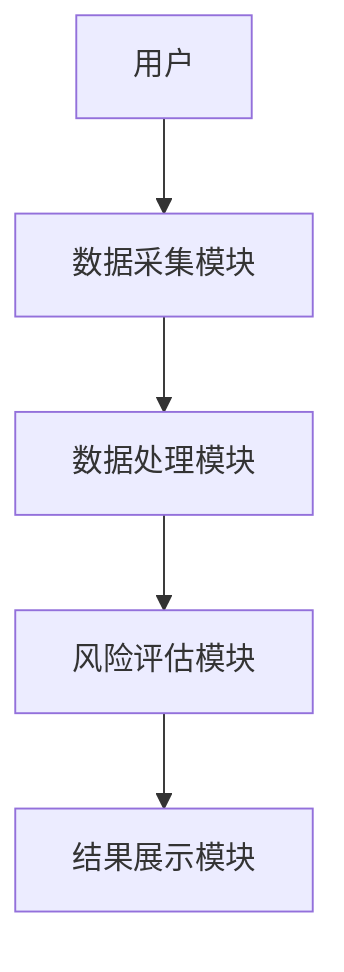

                 


```markdown
# 《金融产品创新风险评估框架》

> 关键词：金融创新，风险评估，数学模型，系统架构，项目实战

> 摘要：本文系统地探讨了金融产品创新中的风险评估问题，结合理论分析和实际案例，提出了一个全面的风险评估框架，涵盖了从背景分析到系统实现的全过程。

---

## 第一部分: 金融产品创新风险评估概述

### 第1章: 金融产品创新风险评估的背景与意义

#### 1.1 金融创新的现状与挑战
- 1.1.1 金融创新的定义与特点
  - 金融创新是指金融机构或市场参与者为了适应经济发展的需求，通过引入新的金融工具、产品、技术和模式来提高市场效率和满足多样化的金融需求。
  - 金融创新的特点包括多样性、风险性、周期性和技术驱动性。
- 1.1.2 金融创新中的主要风险类型
  - 市场风险：由于市场波动引起的损失。
  - 信用风险：由于交易对手违约引起的损失。
  - 操作风险：由于内部操作失误或外部事件引起的损失。
  - 法律与合规风险：由于法律法规变化或不合规操作引起的损失。
- 1.1.3 创新与风险之间的关系
  - 创新带来新的机会，同时也伴随着新的风险。
  - 风险管理是金融创新成功的关键因素。

#### 1.2 金融产品创新风险评估的重要性
- 1.2.1 风险评估在金融创新中的作用
  - 风险评估是金融创新过程中的核心环节，能够帮助机构识别潜在风险，制定应对策略，确保创新的稳健性。
- 1.2.2 全球金融危机案例分析
  - 2008年金融危机的案例展示了金融创新过度和风险管理不足的后果。
  - 该案例强调了建立有效的风险评估框架的重要性。
- 1.2.3 制定风险评估框架的必要性
  - 为了在金融创新中实现风险可控，必须制定系统化的风险评估框架。

### 第2章: 金融产品创新风险评估的核心概念

#### 2.1 金融创新风险的定义与分类
- 2.1.1 金融创新风险的定义
  - 金融创新风险是指在金融产品或服务的创新过程中，由于不确定性因素导致的潜在损失。
- 2.1.2 金融创新风险的分类
  - 按照来源分类：市场风险、信用风险、操作风险、法律风险。
  - 按照影响范围分类：系统性风险、非系统性风险。
  - 按照时间维度分类：短期风险、中期风险、长期风险。
- 2.1.3 各类风险的特征对比
  - 列表对比各类风险的来源、影响范围、应对策略等。

#### 2.2 金融创新风险评估框架的构建
- 2.2.1 框架的核心要素
  - 数据采集与处理、风险识别、风险量化、风险评估与预警。
- 2.2.2 框架的构建步骤
  - 确定目标与范围、数据收集与清洗、模型选择与构建、评估与验证、优化与调整。
- 2.2.3 框架的适用范围
  - 适用于银行、保险、证券等金融机构的新产品开发和现有产品的风险评估。

#### 2.3 本章小结

---

## 第二部分: 金融产品创新风险评估的数学模型与算法

### 第3章: 风险评估的数学模型

#### 3.1 风险评估的数学模型
- 3.1.1 线性回归模型
  - 简单线性回归：$y = \beta_0 + \beta_1x + \epsilon$。
  - 多重线性回归：$y = \beta_0 + \beta_1x_1 + \beta_2x_2 + \dots + \beta_nx_n + \epsilon$。
  - 适用场景：适用于线性关系明显的变量之间的预测。
- 3.1.2 非线性回归模型
  - 逻辑回归：$P(y=1|x) = \frac{1}{1 + e^{-\beta x}}$。
  - 适用场景：适用于二分类问题，如违约概率预测。
- 3.1.3 贝叶斯网络模型
  - 贝叶斯网络通过概率图模型描述变量之间的关系。
  - 适用于复杂变量关系的建模，如信用评分。

#### 3.2 基于机器学习的算法
- 3.2.1 支持向量机（SVM）
  - 基于最大化类间距离的分类算法。
  - 适用场景：适用于高维数据分类，如信用评分。
- 3.2.2 随机森林（Random Forest）
  - 基于决策树的集成学习算法。
  - 适用于特征较多、数据量较大的情况。
- 3.2.3 神经网络（Neural Networks）
  - 多层感知机（MLP）等深度学习模型。
  - 适用于非线性关系复杂的预测任务。

#### 3.3 算法实现与优化
- 3.3.1 算法实现步骤
  - 数据预处理、特征选择、模型训练、模型评估。
- 3.3.2 算法优化方法
  - 参数调优（如网格搜索）、特征重要性分析、模型集成。
- 3.3.3 实验结果分析
  - 对比不同算法的准确率、召回率、F1分数等指标。

#### 3.4 本章小结

---

## 第三部分: 金融产品创新风险评估的系统架构设计

### 第4章: 金融产品创新风险评估系统架构

#### 4.1 系统分析与需求分析
- 4.1.1 问题场景描述
  - 系统需要处理大量金融数据，实时进行风险评估。
- 4.1.2 用户需求分析
  - 金融机构需要快速、准确地评估新产品的风险。
- 4.1.3 功能需求列表
  - 数据采集、风险识别、风险量化、风险评估与预警。

#### 4.2 系统架构设计
- 4.2.1 系统架构图（Mermaid）

- 4.2.2 模块划分与交互
  - 数据采集模块：负责从多个数据源采集数据。
  - 数据处理模块：清洗、转换数据，提取特征。
  - 风险评估模块：选择模型，进行风险评估和预测。
  - 结果展示模块：以可视化形式展示评估结果。

#### 4.3 系统接口设计
- 4.3.1 数据接口
  - 数据输入接口：从数据库或其他数据源获取数据。
  - 数据输出接口：将处理后的数据传递给评估模块。
- 4.3.2 评估接口
  - 模型调用接口：将特征数据传递给风险评估模型。
  - 结果返回接口：将评估结果返回给展示模块。
- 4.3.3 展示接口
  - 图表展示接口：以图表形式展示风险评估结果。
  - 报告生成接口：生成详细的评估报告。

#### 4.4 本章小结

---

## 第四部分: 金融产品创新风险评估的项目实战

### 第5章: 项目实战与应用

#### 5.1 环境搭建与数据准备
- 5.1.1 环境安装
  - 安装Python、Pandas、NumPy、Scikit-learn等库。
- 5.1.2 数据收集与预处理
  - 数据来源：历史交易数据、市场数据、信用数据等。
  - 数据清洗：处理缺失值、异常值，标准化处理。
- 5.1.3 数据存储方案
  - 使用数据库存储结构化数据，使用文件存储非结构化数据。

#### 5.2 核心功能实现
- 5.2.1 风险评估模型的实现
  - 选择合适的模型，进行训练和调优。
- 5.2.2 系统功能模块开发
  - 数据采集模块、数据处理模块、风险评估模块、结果展示模块的实现。
- 5.2.3 测试与调试
  - 单元测试、集成测试、性能测试。

#### 5.3 代码实现与解读
- 5.3.1 数据处理代码
```python
import pandas as pd
import numpy as np

# 数据加载
data = pd.read_csv('financial_data.csv')

# 数据清洗
data = data.dropna()
data = (data - data.mean()) / data.std()  # 标准化处理
```
- 5.3.2 模型训练代码
```python
from sklearn.ensemble import RandomForestClassifier
from sklearn.model_selection import train_test_split

# 数据分割
X = data.drop('target', axis=1)
y = data['target']

X_train, X_test, y_train, y_test = train_test_split(X, y, test_size=0.2)

# 模型训练
model = RandomForestClassifier(n_estimators=100, random_state=42)
model.fit(X_train, y_train)

# 模型评估
score = model.score(X_test, y_test)
print(f'模型准确率：{score}')
```
- 5.3.3 系统接口代码
```python
# 数据接口
def get_data():
    return data

# 评估接口
def assess_risk(features):
    return model.predict(features)

# 展示接口
def show_report(risk_level):
    print(f'风险等级：{risk_level}')
```

#### 5.4 案例分析与结果解读
- 5.4.1 实际案例分析
  - 假设分析某新金融产品的风险，利用构建的模型进行评估。
- 5.4.2 结果展示与解释
  - 使用图表展示风险分布，生成风险评估报告。
- 5.4.3 案例总结与优化
  - 总结评估结果，提出改进建议。

---

## 第五部分: 总结与展望

### 第6章: 总结与展望

#### 6.1 本章总结
- 本文系统地探讨了金融产品创新风险评估的框架、方法和应用。
- 提出了一个完整的风险评估框架，包括数据采集、模型选择、系统实现等环节。

#### 6.2 未来展望
- 结合人工智能技术，如深度学习和自然语言处理，进一步提升风险评估的准确性。
- 探讨多模态数据在风险评估中的应用，如文本数据和图像数据的融合。

---

## 作者：AI天才研究院/AI Genius Institute & 禅与计算机程序设计艺术 /Zen And The Art of Computer Programming
```

