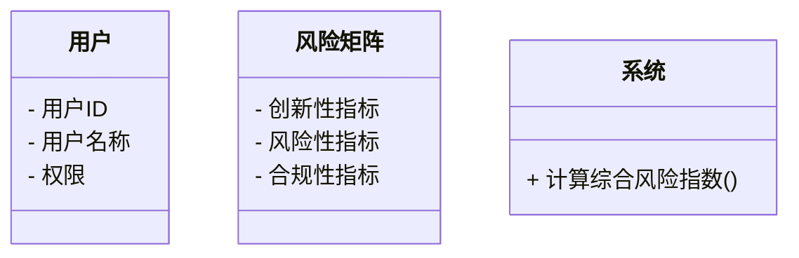
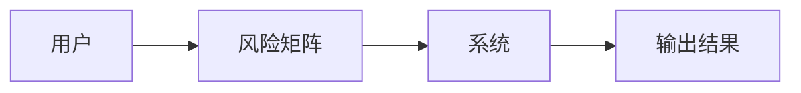
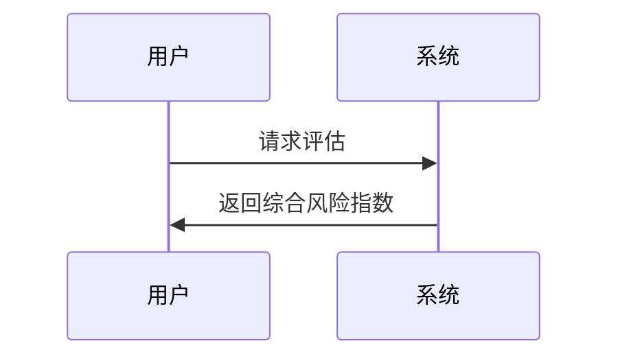

                 


# 《金融产品创新风险评估矩阵》

---

## 关键词：金融创新、风险评估、矩阵模型、系统架构、项目实战

---

## 摘要：  
本文系统地探讨了金融产品创新风险评估矩阵的构建与应用。通过分析金融创新的核心问题，提出了一种基于矩阵模型的风险评估方法，并详细阐述了其数学模型、算法实现及系统架构设计。结合实际案例，展示了该矩阵在金融产品创新中的实践价值，并提出了相关的最佳实践建议。

---

## 第1章：金融产品创新风险评估的背景与意义

### 1.1 问题背景  
金融创新是推动金融市场发展的核心动力，但其复杂性和不确定性也带来了显著的风险。如何系统地评估这些风险，是金融创新成功的关键。  

- **金融创新的现状与趋势**：随着科技的发展，金融创新呈现出数字化、智能化的趋势。  
- **创新带来的风险问题**：创新可能导致市场波动、合规风险和操作风险。  
- **风险评估的重要性**：通过风险评估，可以提前识别潜在问题，优化产品设计。  

### 1.2 问题描述  
- **金融产品创新的核心问题**：创新往往伴随着未知风险，需要系统化的方法来评估。  
- **风险评估的必要性**：通过矩阵模型，可以量化风险，提供决策支持。  
- **矩阵评估的适用场景**：适用于新产品开发、市场拓展和合规审查等场景。  

### 1.3 问题解决  
- **矩阵评估方法的提出**：通过构建矩阵模型，将创新性和风险性进行量化评估。  
- **矩阵评估的优势**：直观、可操作性强，能够快速识别高风险领域。  
- **矩阵评估的边界与外延**：适用于中短期风险评估，长期风险需结合其他模型。  

### 1.4 概念结构与核心要素  
- **矩阵评估的核心要素**：创新性、风险性、合规性、市场适应性。  
- **要素之间的关系**：创新性越高，潜在风险越大；合规性是风险评估的基础。  
- **矩阵评估的逻辑框架**：通过多维度评估，构建综合风险指数。  

---

## 第2章：矩阵评估的核心概念与原理

### 2.1 核心概念  
- **金融产品创新的定义**：指通过引入新技术、新模式或新产品，提升金融服务的效率和价值。  
- **风险评估的维度**：包括市场风险、信用风险、操作风险和合规风险。  
- **矩阵评估的原理**：通过多维度指标，构建矩阵模型，量化风险水平。  

### 2.2 核心概念的属性特征对比  
| 属性维度 | 创新性 | 风险性 | 合规性 | 市场适应性 |
|----------|--------|--------|--------|------------|
| **定义** | 创新程度 | 风险大小 | 合规程度 | 市场接受度 |
| **权重** | 30% | 40% | 20% | 10% |

### 2.3 矩阵评估的ER实体关系图  
```mermaid
er
actor: 用户
action: 评估操作
matrix: 风险矩阵
indicator: 风险指标
```

---

## 第3章：矩阵评估的算法原理

### 3.1 算法原理概述  
- **矩阵评估的基本原理**：通过多维度指标，构建矩阵，计算综合风险指数。  
- **算法流程图**（Mermaid）：  
```mermaid
graph TD
A[开始] -> B[输入创新性指标]
B -> C[输入风险性指标]
C -> D[输入合规性指标]
D -> E[计算综合风险指数]
E -> F[输出结果]
F -> G[结束]
```

### 3.2 算法实现  
- **Python源代码实现**：  
```python
def risk_assessment(innovation, risk, compliance):
    # 创新性权重：30%
    innovation_score = innovation * 0.3
    # 风险性权重：40%
    risk_score = risk * 0.4
    # 合规性权重：20%
    compliance_score = compliance * 0.2
    # 综合风险指数
    total_score = innovation_score + risk_score + compliance_score
    return total_score

# 示例输入
innovation = 80
risk = 60
compliance = 70

result = risk_assessment(innovation, risk, compliance)
print(f"综合风险指数：{result}")
```

---

## 第4章：数学模型与公式

### 4.1 数学模型概述  
- **矩阵评估的数学模型**：  
  综合风险指数 = ∑（各维度指标 × 权重）  

### 4.2 详细讲解与举例  
- **公式推导**：  
  综合风险指数 = 创新性 × 0.3 + 风险性 × 0.4 + 合规性 × 0.2  

- **典型案例分析**：  
  假设某金融产品的创新性得分为80，风险性得分为60，合规性得分为70，计算其综合风险指数：  
  综合风险指数 = 80 × 0.3 + 60 × 0.4 + 70 × 0.2 = 24 + 24 + 14 = 62  

---

## 第5章：系统分析与架构设计方案

### 5.1 系统功能设计  
- **领域模型（Mermaid类图）**：  


### 5.2 系统架构设计  
- **系统架构图（Mermaid架构图）**：  


### 5.3 系统接口设计  
- **接口描述**：提供API接口，输入创新性、风险性和合规性指标，返回综合风险指数。  
- **接口交互图（Mermaid序列图）**：  


---

## 第6章：项目实战

### 6.1 环境安装  
- **工具安装**：安装Python、Jupyter Notebook、Mermaid工具。  

### 6.2 核心代码实现  
- **代码实现**：如前所述的Python代码。  

### 6.3 案例分析  
- **案例描述**：某创新型金融产品的风险评估。  
- **代码应用**：计算综合风险指数，得出结果。  

### 6.4 项目总结  
- **总结**：矩阵模型能够有效地量化风险，为金融创新提供决策支持。  

---

## 第7章：总结与展望

### 7.1 总结  
- **核心内容回顾**：通过矩阵模型，系统地评估金融产品的创新风险，量化分析结果，为决策提供支持。  

### 7.2 注意事项  
- **模型局限性**：矩阵模型适用于中短期风险评估，长期风险需结合其他模型。  
- **数据质量**：输入数据的准确性直接影响评估结果。  

### 7.3 拓展阅读  
- 推荐阅读《风险管理与金融创新》、《矩阵分析与应用》等书籍。  

---

## 作者：AI天才研究院 & 禅与计算机程序设计艺术

