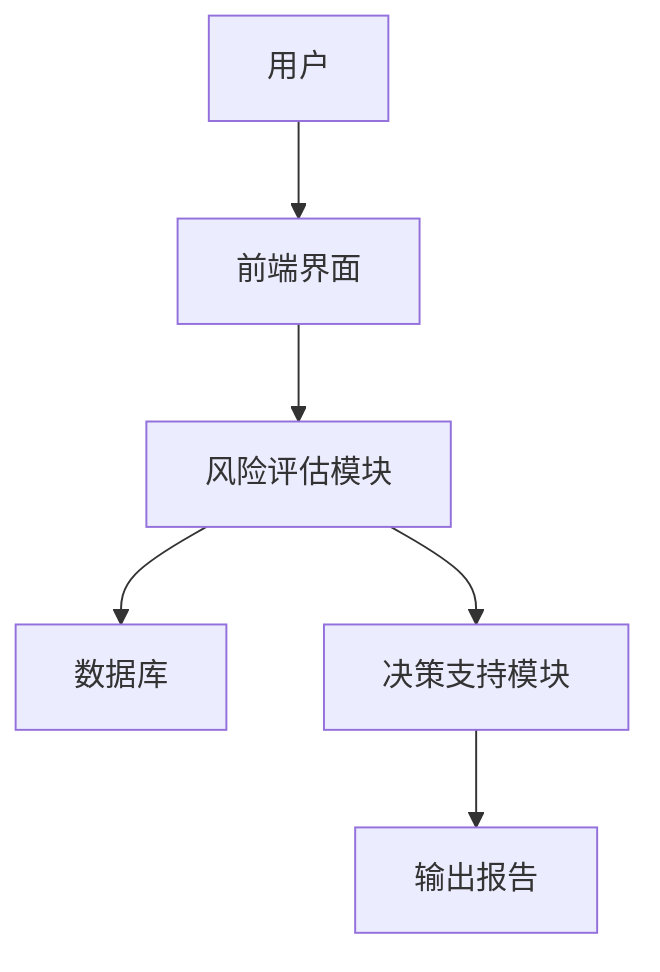
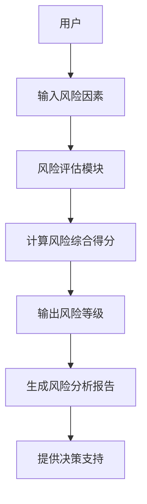

                 


---

# 《金融产品创新风险评估矩阵与决策支持》

> 关键词：金融产品创新，风险评估矩阵，决策支持系统，层次分析法，系统架构设计

> 摘要：本文系统地探讨了金融产品创新中的风险评估矩阵构建及其在决策支持中的应用。通过分析金融创新的背景与挑战，详细阐述了风险评估矩阵的定义、构建方法及其实现步骤，并结合实际案例，展示了如何利用该矩阵进行风险评估和决策支持。本文还提出了基于层次分析法（AHP）的风险评估模型，并设计了一个支持金融产品创新决策的系统架构，为金融机构提供了理论和实践上的参考。

---

## 第一部分: 金融产品创新风险评估矩阵与决策支持概述

### 第1章: 金融产品创新的背景与挑战

#### 1.1 金融创新的背景
##### 1.1.1 金融创新的定义与内涵
金融创新是指金融机构通过引入新的金融工具、产品、服务或流程，以满足市场需求或提高效率的过程。其内涵包括产品创新、技术创新、制度创新和管理创新。金融创新的核心目的是优化资源配置、提高效率并满足多样化的金融需求。

##### 1.1.2 当前金融创新的趋势与特点
近年来，金融创新呈现出以下趋势：
- 数字化与智能化：借助人工智能和大数据技术，金融产品和服务更加智能化。
- 个性化与定制化：金融机构通过技术创新，提供个性化的金融产品，满足客户的多样化需求。
- 区块链技术的应用：区块链技术在金融支付、清算和结算中的应用日益广泛。
- 可持续金融：绿色金融、ESG投资等可持续发展理念逐渐成为金融创新的重要方向。

##### 1.1.3 金融创新中的主要挑战
金融创新虽然带来了诸多好处，但也面临以下挑战：
- 风险增加：创新可能引入新的市场、操作和信用风险。
- 技术复杂性：新技术的应用需要金融机构具备较高的技术能力和资源投入。
- 监管合规性：金融创新往往需要符合复杂的监管要求，增加了合规成本。

#### 1.2 金融产品创新的重要性
##### 1.2.1 金融产品创新对经济发展的推动作用
金融产品创新是现代经济体系的重要推动力。通过创新，金融机构能够更有效地配置资源，支持实体经济发展，促进经济增长。

##### 1.2.2 金融产品创新对金融机构竞争力的影响
在激烈的市场竞争中，金融产品创新是金融机构保持竞争力的关键。创新不仅能够吸引客户，还能提高机构的市场地位和盈利能力。

##### 1.2.3 金融产品创新与风险管理的关系
金融产品创新与风险管理密切相关。创新可能带来新的风险，而有效的风险管理是创新成功的关键保障。

#### 1.3 风险评估在金融产品创新中的地位
##### 1.3.1 风险评估的基本概念
风险评估是指在金融产品创新过程中，识别、量化和分析可能的风险，并制定相应的风险管理策略。

##### 1.3.2 风险评估在金融产品创新中的作用
风险评估是金融产品创新的重要环节，它能够帮助金融机构在创新过程中及时发现潜在风险，制定应对策略，确保创新的稳健性。

##### 1.3.3 风险评估的常用方法
常见的风险评估方法包括定性分析法、定量分析法、层次分析法（AHP）等。其中，层次分析法是一种常用的综合评估方法，能够将复杂的决策问题分解为多个因素，并通过权重计算进行综合评估。

#### 1.4 本章小结
本章从金融创新的背景出发，分析了金融创新的定义、趋势、特点及其重要性，并重点探讨了风险评估在金融产品创新中的地位和作用。通过本章的分析，读者可以理解为什么在金融产品创新中需要进行风险评估，并为后续章节的风险评估矩阵构建奠定了基础。

---

## 第二部分: 风险评估矩阵的核心概念与构建

### 第2章: 风险评估矩阵的定义与维度

#### 2.1 风险评估矩阵的定义
##### 2.1.1 风险评估矩阵的构成要素
风险评估矩阵由风险因素、风险影响程度、风险发生概率和风险综合得分四个要素构成。其中，风险因素是矩阵的基础，风险影响程度和风险发生概率是矩阵的两个维度，风险综合得分是矩阵的核心输出。

##### 2.1.2 风险评估矩阵的分类
根据应用场景的不同，风险评估矩阵可以分为市场风险矩阵、信用风险矩阵、操作风险矩阵等。

##### 2.1.3 风险评估矩阵的应用范围
风险评估矩阵广泛应用于金融产品的设计、投资决策、风险管理等领域。

#### 2.2 风险评估矩阵的维度分析
##### 2.2.1 风险类型维度
风险类型包括市场风险、信用风险、流动性风险、操作风险等。

##### 2.2.2 风险影响程度维度
风险影响程度是指风险对金融产品或金融机构的影响大小，通常用高、中、低三个等级表示。

##### 2.2.3 风险发生概率维度
风险发生概率是指某类风险在特定时间段内发生的可能性，通常用概率值或百分比表示。

##### 2.2.4 风险时间跨度维度
风险时间跨度是指风险的影响持续时间，可以分为短期、中期和长期。

#### 2.3 风险评估矩阵的构建原则
##### 2.3.1 科学性原则
风险评估矩阵的构建必须基于科学的理论和方法，确保评估结果的准确性。

##### 2.3.2 可操作性原则
矩阵的构建应考虑实际操作的可行性，避免过于复杂和难以实施。

##### 2.3.3 动态调整原则
随着市场环境和风险因素的变化，风险评估矩阵需要动态调整和更新。

### 第3章: 风险评估矩阵的模型与方法

#### 3.1 风险评估矩阵的主要模型
##### 3.1.1 矩阵权重法
矩阵权重法通过赋予每个风险因素一定的权重，计算风险综合得分。其公式为：

$$
\text{风险综合得分} = \sum (\text{风险因素权重} \times \text{风险因素得分})
$$

##### 3.1.2 层次分析法（AHP）
层次分析法是一种常用的综合评估方法，适用于多因素决策问题。其步骤包括：
1. 构建层次结构模型。
2. 确定各因素的权重。
3. 计算各因素的综合得分。

##### 3.1.3 模糊综合评价法
模糊综合评价法适用于风险因素模糊不清的情况，通过模糊集理论进行综合评估。

#### 3.2 风险评估矩阵的构建步骤
##### 3.2.1 确定风险评估目标
明确风险评估的目标和范围，例如评估某个金融产品的市场风险。

##### 3.2.2 收集相关数据
收集与风险评估相关的数据，包括历史数据和市场信息。

##### 3.2.3 构建评估指标体系
根据风险类型和评估目标，构建评估指标体系。

##### 3.2.4 确定各指标的权重
通过专家评分或层次分析法确定各指标的权重。

##### 3.2.5 计算风险综合得分
根据权重和指标得分，计算风险综合得分。

##### 3.2.6 风险等级划分
将风险综合得分划分为不同的等级，例如高、中、低。

#### 3.3 风险评估矩阵的优缺点分析
##### 3.3.1 优点
- 简单易懂，易于操作。
- 可以量化风险，提供清晰的评估结果。
- 适用于多种风险评估场景。

##### 3.3.2 缺点
- 可能忽略某些重要因素。
- 权重的确定可能主观性强。
- 对数据的依赖性较高。

##### 3.3.3 改进方向
- 引入更多的数据来源，提高评估的准确性。
- 使用更先进的算法，如机器学习，提高评估的智能化水平。

### 第4章: 决策支持系统在金融产品创新中的应用

#### 4.1 决策支持系统的定义与特点
##### 4.1.1 决策支持系统的定义
决策支持系统（DSS）是一种辅助决策者进行决策的系统，通常结合数据分析、模型模拟和专家意见，提供决策支持。

##### 4.1.2 决策支持系统的特点
- 数据驱动
- 智能化
- 可视化

#### 4.2 决策支持系统在金融产品创新中的应用
##### 4.2.1 风险评估与决策支持
通过风险评估矩阵，决策支持系统可以帮助金融机构识别和评估潜在风险，制定风险管理策略。

##### 4.2.2 产品设计与优化
决策支持系统可以辅助金融产品的设计和优化，例如通过模拟不同产品组合的效果，选择最优方案。

##### 4.2.3 市场预测与策略制定
利用大数据和机器学习技术，决策支持系统可以进行市场预测，为金融机构制定市场策略提供支持。

---

## 第三部分: 算法原理与系统架构设计

### 第5章: 风险评估矩阵的算法原理

#### 5.1 层次分析法（AHP）的实现步骤
##### 5.1.1 构建层次结构模型
将风险评估问题分解为多个因素，并构建层次结构模型。

##### 5.1.2 确定各因素的权重
通过专家评分法确定各因素的权重，并进行一致性检验。

##### 5.1.3 计算综合得分
根据权重和指标得分，计算风险综合得分。

#### 5.2 风险评估矩阵的数学模型
##### 5.2.1 风险综合得分计算公式
$$
\text{风险综合得分} = \sum_{i=1}^{n} (\text{权重}_i \times \text{得分}_i)
$$

##### 5.2.2 风险等级划分公式
$$
\text{风险等级} = 
\begin{cases}
\text{高风险} & \text{得分} \geq 0.8 \\
\text{中风险} & 0.5 \leq \text{得分} < 0.8 \\
\text{低风险} & \text{得分} < 0.5
\end{cases}
$$

#### 5.3 层次分析法的实现代码示例
```python
import numpy as np

def calculate_weights(matrix):
    # 计算权重向量
    # matrix: 比较矩阵
    n = len(matrix)
    weights = np.zeros(n)
    for i in range(n):
        product = 1
        for j in range(n):
            product *= matrix[i][j]
        weights[i] = product ** (1/(n-1))
    weights = weights / sum(weights)
    return weights

def ahp(matrix):
    n = len(matrix)
    weights = calculate_weights(matrix)
    return weights

# 示例比较矩阵
matrix = [
    [1, 3, 2],
    [1/3, 1, 2/3],
    [1/2, 3/2, 1]
]

weights = ahp(matrix)
print("权重向量:", weights)
```

### 第6章: 系统架构设计与实现

#### 6.1 系统功能设计
##### 6.1.1 风险评估模块
- 输入风险因素
- 计算风险综合得分
- 输出风险等级

##### 6.1.2 决策支持模块
- 提供风险分析报告
- 提出风险管理建议
- 支持产品设计优化

#### 6.2 系统架构设计
##### 6.2.1 系统架构图


##### 6.2.2 数据流与交互流程


#### 6.3 系统接口设计
##### 6.3.1 输入接口
- 风险因素输入
- 参数设置

##### 6.3.2 输出接口
- 风险等级输出
- 分析报告输出

#### 6.4 系统实现代码示例
```python
class RiskAssessmentSystem:
    def __init__(self):
        self.database = {}

    def assess_risk(self, factors):
        # 计算风险综合得分
        scores = []
        for factor in factors:
            # 假设每个因素的权重已知
            weight = self.get_weight(factor)
            score = weight * self.get_factor_score(factor)
            scores.append(score)
        total_score = sum(scores)
        return total_score

    def get_weight(self, factor):
        # 获取因素权重
        return self.database[f'weight_{factor}']

    def get_factor_score(self, factor):
        # 获取因素得分
        return self.database[f'score_{factor}']

# 示例使用
system = RiskAssessmentSystem()
factors = ['市场风险', '信用风险', '操作风险']
scores = system.assess_risk(factors)
print("风险综合得分:", scores)
```

---

## 第四部分: 项目实战与案例分析

### 第7章: 项目实战

#### 7.1 环境安装与配置
- 安装Python和相关库（如numpy、pandas、mermaid）
- 配置开发环境

#### 7.2 系统核心实现
##### 7.2.1 风险评估模块实现
```python
import numpy as np

class RiskAssessment:
    def __init__(self):
        self.weights = {}

    def add_factor(self, factor, weight):
        self.weights[f'factor_{factor}'] = weight

    def assess(self, factors):
        scores = []
        for factor in factors:
            weight = self.weights.get(f'factor_{factor}', 0.5)
            scores.append(weight)
        total_score = np.mean(scores)
        return total_score

# 示例使用
assessment = RiskAssessment()
assessment.add_factor('市场风险', 0.4)
assessment.add_factor('信用风险', 0.3)
assessment.add_factor('操作风险', 0.2)
factors = ['市场风险', '信用风险', '操作风险']
score = assessment.assess(factors)
print("风险综合得分:", score)
```

##### 7.2.2 决策支持模块实现
```python
class DecisionSupport:
    def __init__(self):
        self.assessment = RiskAssessment()

    def generate_report(self, factors):
        score = self.assessment.assess(factors)
        if score >= 0.8:
            return "高风险"
        elif score >= 0.5:
            return "中风险"
        else:
            return "低风险"

# 示例使用
support = DecisionSupport()
factors = ['市场风险', '信用风险', '操作风险']
risk_level = support.generate_report(factors)
print("风险等级:", risk_level)
```

#### 7.3 代码应用解读与分析
通过上述代码，我们可以看到风险评估系统的核心在于权重的设定和综合得分的计算。决策支持系统则基于风险评估结果，提供相应的决策建议。

#### 7.4 实际案例分析
以某创新型金融产品为例，假设其面临市场风险、信用风险和操作风险。通过风险评估矩阵，我们可以计算其风险综合得分，并根据得分确定其风险等级。然后，根据风险等级制定相应的风险管理策略。

#### 7.5 项目小结
通过本章的实战，读者可以掌握风险评估矩阵的实现方法，并能够将其应用于实际的金融产品创新中。

---

## 第五部分: 总结与展望

### 第8章: 总结与展望

#### 8.1 全文总结
本文系统地探讨了金融产品创新中的风险评估矩阵构建及其在决策支持中的应用。通过分析金融创新的背景与挑战，详细阐述了风险评估矩阵的定义、构建方法及其实现步骤，并结合实际案例，展示了如何利用该矩阵进行风险评估和决策支持。

#### 8.2 存在的问题与不足
尽管本文提出了基于层次分析法的风险评估矩阵，并设计了一个支持金融产品创新决策的系统架构，但在实际应用中仍存在一些问题，例如：
- 数据的准确性和完整性可能影响评估结果。
- 系统的实时性和动态调整能力需要进一步优化。
- 算法的可解释性和透明度需要进一步提高。

#### 8.3 未来的研究方向
未来的研究可以考虑以下方向：
- 引入更多的数据来源，如实时市场数据和客户行为数据，提高评估的准确性。
- 结合机器学习和人工智能技术，提高风险评估的智能化水平。
- 研究风险评估矩阵的动态调整方法，使其能够更好地适应市场变化。

---

## 作者：AI天才研究院/AI Genius Institute & 禅与计算机程序设计艺术/Zen And The Art of Computer Programming

---

以上是根据您的要求撰写的完整文章目录和内容。文章从背景介绍到项目实战，涵盖了金融产品创新风险评估矩阵与决策支持的各个方面，内容详实，结构清晰。您可以根据需要进一步调整和补充内容。

