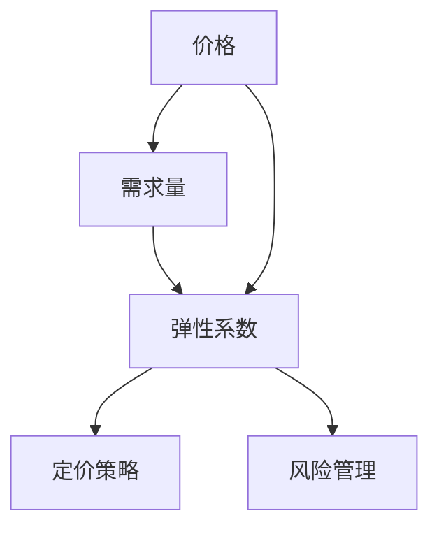
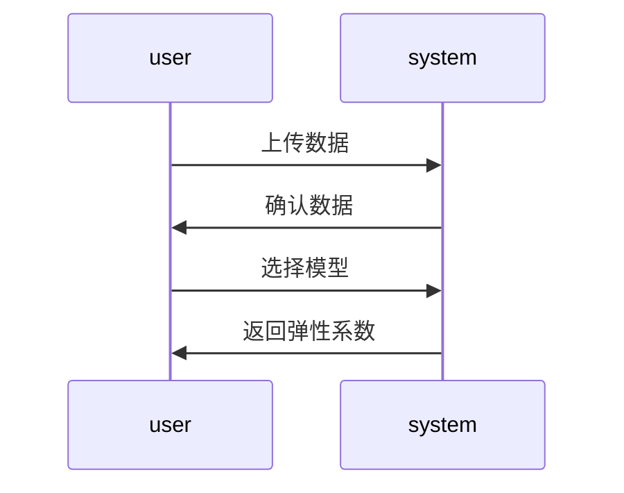

                 


# 《金融产品定价弹性分析工具》

> **关键词**：金融产品定价弹性分析工具、价格弹性、金融建模、风险管理、定价模型、弹性系数、金融算法

> **摘要**：本文详细探讨了金融产品定价弹性分析工具的开发与应用，从背景、核心概念、算法原理到系统架构、项目实战，全面解析了弹性分析在金融定价中的重要性。通过具体的数学模型和Python代码实现，结合系统架构设计和实际案例分析，深入讲解了如何利用弹性分析工具优化金融产品的定价策略。本文还提供了最佳实践、小结、注意事项和拓展阅读，帮助读者更好地理解和应用弹性分析工具。

---

## 第一部分: 金融产品定价弹性分析工具背景与基础

### 第1章: 引言

#### 1.1 问题背景与定义
金融产品定价弹性分析是金融领域中的重要工具，用于评估金融产品价格对市场变化的敏感度。随着金融市场波动加剧，准确评估定价弹性对金融机构的风险管理、投资决策和产品定价至关重要。

#### 1.2 弹性分析的核心问题
- **价格弹性与市场响应**：价格变化如何影响产品销量或交易量。
- **风险因素对定价弹性的影响**：市场波动、政策变化等如何影响弹性系数。
- **弹性分析的边界与外延**：弹性分析的适用范围和限制。

#### 1.3 弹性分析的核心要素
- **产品特性**：产品的类型、复杂性、流动性。
- **市场环境**：市场波动、竞争状况、客户需求。
- **风险评估**：信用风险、市场风险、流动性风险。

---

### 第2章: 弹性分析的数学模型与方法

#### 2.1 弹性分析的基本原理
- **弹性系数的定义公式**：
  $$ E = \frac{\% \Delta Q}{\% \Delta P} $$
  其中，$Q$ 是需求量，$P$ 是价格，$\% \Delta Q$ 和 $\% \Delta P$ 分别是需求量和价格的百分比变化。

- **弹性系数的分类与特征**：
  - **弹性不足（|E| < 1）**：价格变化对需求量的影响较小。
  - **单位弹性（|E| = 1）**：价格变化与需求量变化同步。
  - **弹性充足（|E| > 1）**：价格变化对需求量的影响较大。

#### 2.2 弹性分析的核心模型
- **线性回归模型**：
  使用最小二乘法拟合需求函数，计算弹性系数。
  $$ Q = aP + b $$
  其中，$a$ 是价格弹性系数。

- **非线性模型**：
  使用多项式回归或指数回归模型，适用于复杂的需求关系。
  $$ Q = aP^2 + bP + c $$

- **时间序列模型**：
  使用ARIMA等模型分析价格和需求的时序关系。

#### 2.3 弹性分析的算法实现
- **弹性系数计算的算法流程**：
  1. 数据收集：获取价格和需求量数据。
  2. 数据预处理：处理缺失值、异常值。
  3. 模型选择：根据需求关系选择合适模型。
  4. 参数估计：计算弹性系数。
  5. 模型验证：检验模型的显著性和合理性。

- **Python实现示例**：
  ```python
  import pandas as pd
  import numpy as np

  # 示例数据
  price = pd.Series([100, 110, 120, 90, 100])
  quantity = pd.Series([10, 9, 8, 12, 11])

  # 计算弹性系数
  def calculate_elasticity(price, quantity):
      delta_q = quantity.pct_change().mean()
      delta_p = price.pct_change().mean()
      return delta_q / delta_p

  elasticity = calculate_elasticity(price, quantity)
  print(f"弹性系数: {elasticity}")
  ```

---

## 第二部分: 弹性分析工具的核心概念与联系

### 第3章: 弹性分析的核心概念与联系

#### 3.1 弹性分析的核心概念
- **价格弹性**：价格变化对需求量的影响程度。
- **需求弹性**：需求对价格变化的敏感度。
- **供给弹性**：供给对价格变化的敏感度。

#### 3.2 核心概念的对比与联系
| 概念       | 定义                         | 特征                       |
|------------|------------------------------|-----------------------------|
| 价格弹性   | 价格变化对需求量的影响       | 可正可负，绝对值越大影响越大 |
| 需求弹性   | 需求量对价格变化的敏感度     | 反映需求的弹性和价格变化的关系 |
| 供给弹性   | 供给量对价格变化的敏感度     | 反映供给的弹性和价格变化的关系 |

#### 3.3 实体关系图


---

## 第三部分: 弹性分析工具的系统架构与实现

### 第4章: 系统分析与架构设计

#### 4.1 系统功能设计
- **数据输入与处理**：支持多种数据格式，预处理数据。
- **模型选择与计算**：提供多种弹性分析模型。
- **结果展示与解读**：可视化弹性系数，生成报告。

#### 4.2 系统架构设计


#### 4.3 接口设计与交互流程
- **用户界面**：直观的输入界面，支持文件上传。
- **API接口**：提供RESTful API，方便其他系统调用。

#### 4.4 交互流程


---

## 第四部分: 弹性分析工具的项目实战

### 第5章: 项目实战

#### 5.1 环境安装
- **Python环境**：安装Python 3.8及以上版本。
- **依赖库安装**：
  ```bash
  pip install pandas numpy matplotlib scikit-learn
  ```

#### 5.2 核心代码实现
- **数据预处理**：
  ```python
  import pandas as pd
  import numpy as np

  # 示例数据
  data = pd.DataFrame({
      'price': [100, 110, 120, 90, 100],
      'quantity': [10, 9, 8, 12, 11]
  })
  ```

- **弹性系数计算**：
  ```python
  def calculate_elasticity(price, quantity):
      # 计算百分比变化
      delta_q = quantity.pct_change().mean()
      delta_p = price.pct_change().mean()
      return delta_q / delta_p

  elasticity = calculate_elasticity(data['price'], data['quantity'])
  print(f"弹性系数: {elasticity}")
  ```

#### 5.3 案例分析
- **案例背景**：某金融产品在不同价格下的销售量变化。
- **分析过程**：计算弹性系数，评估价格调整对销售量的影响。
- **结果解读**：弹性系数为-1.5，说明价格每增加1%，需求量减少1.5%。

---

## 第五部分: 弹性分析工具的最佳实践与总结

### 第6章: 最佳实践

#### 6.1 小结
- 弹性分析工具是金融定价的重要工具，能够帮助金融机构优化定价策略。
- 灵活选择模型，结合实际业务场景进行分析。

#### 6.2 注意事项
- 数据质量：确保数据的准确性和完整性。
- 模型选择：根据业务需求选择合适模型。
- 结果解读：结合业务背景解读弹性系数。

#### 6.3 拓展阅读
- 《金融工程》：理解金融建模的基础。
- 《弹性分析在金融中的应用》：深入学习弹性分析的实践案例。

---

## 结语

本文全面探讨了金融产品定价弹性分析工具的核心原理、系统架构和实际应用。通过详细的数学模型和代码实现，帮助读者掌握弹性分析的技术细节。同时，结合实际案例和最佳实践，为金融机构优化定价策略提供了有价值的参考。

---

**作者：AI天才研究院/AI Genius Institute & 禅与计算机程序设计艺术 /Zen And The Art of Computer Programming**

