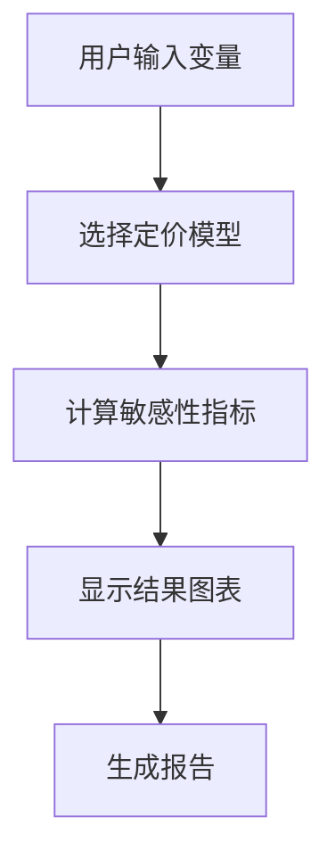

                 


# 《金融产品定价敏感性分析系统》

## 关键词：金融产品定价，敏感性分析，系统架构，算法原理，项目实战

## 摘要：本文详细探讨了金融产品定价中的敏感性分析系统，从背景介绍、核心概念到算法原理、系统架构，再到项目实战和最佳实践，全面解析了如何构建和应用这一系统。通过本文，读者将深入了解敏感性分析的重要性及其在金融定价中的实际应用。

---

## 第一部分: 金融产品定价敏感性分析系统概述

### 第1章: 金融产品定价敏感性分析的背景与意义

#### 1.1 问题背景与问题描述

在金融领域，产品的定价不仅受到市场波动的影响，还与多种经济指标和模型参数密切相关。金融产品定价的核心目标是确保在不同市场条件下，产品价格能够准确反映其内在价值，同时考虑风险和收益的平衡。然而，由于市场环境的复杂性和不确定性，金融产品的定价可能会受到多种因素的影响，例如利率变化、汇率波动、市场流动性变化等。这些因素的变化会对产品价格产生不同程度的影响，而如何量化这些影响，正是敏感性分析的核心任务。

敏感性分析（Sensitivity Analysis）是一种研究变量变化对系统输出结果影响程度的方法。在金融领域，敏感性分析可以帮助投资者和金融机构评估不同风险因素对产品价格的影响，从而制定更为稳健的投资策略和风险管理方案。例如，在衍生品定价中，敏感性分析可以帮助交易员理解不同参数（如波动率、利率、行权价等）对期权价格的影响程度，从而优化定价模型和交易策略。

#### 1.2 敏感性分析的核心概念

敏感性分析的核心概念包括以下几个方面：

1. **变量变化**：在金融定价中，变量通常指的是影响产品价格的各种因素，例如波动率、利率、时间、标的资产价格等。敏感性分析的目标是研究这些变量的变化如何影响产品价格。

2. **影响程度**：通过敏感性分析，可以量化每个变量对产品价格变化的贡献程度。通常，影响程度可以用弹性、基点变化或标准差变化等方式来衡量。

3. **风险评估**：敏感性分析不仅是定价工具，也是风险管理的重要手段。通过分析不同变量对价格的影响，金融机构可以更好地识别和管理潜在风险。

#### 1.3 敏感性分析的系统架构

敏感性分析系统的架构通常包括以下几个核心部分：

1. **输入变量**：包括所有可能影响产品价格的变量，例如波动率、利率、时间、标的资产价格等。

2. **定价模型**：用于计算产品价格的数学模型，例如Black-Scholes模型、CAPM模型等。

3. **敏感性计算**：通过改变输入变量的值，计算产品价格的变化，进而量化每个变量的敏感性。

4. **结果输出**：将敏感性分析的结果以图表或报告的形式展示，帮助用户理解变量对价格的影响。

---

### 第2章: 敏感性分析的原理与方法

#### 2.1 敏感性分析的基本原理

敏感性分析的基本原理是通过改变输入变量的值，计算输出结果的变化程度。具体来说，敏感性分析可以通过以下步骤进行：

1. **定义变量**：明确影响产品价格的所有变量，并确定每个变量的取值范围。

2. **改变变量值**：逐一改变每个变量的值，保持其他变量不变，计算产品价格的变化。

3. **计算敏感性指标**：通过比较价格变化的幅度，量化每个变量的敏感性。常见的敏感性指标包括弹性、基点变化和标准差变化等。

4. **分析结果**：根据敏感性指标，确定哪些变量对产品价格影响最大，哪些变量影响较小。

#### 2.2 敏感性分析的主要方法

敏感性分析的主要方法包括：

1. **回归分析法**：通过回归模型，分析变量与产品价格之间的关系，量化每个变量的回归系数，从而评估其敏感性。

2. **方差分解法**：将产品价格的总方差分解为各个变量的贡献，从而量化每个变量的敏感性。

3. **蒙特卡洛模拟法**：通过随机抽样和模拟，计算变量变化对产品价格的影响，进而评估其敏感性。

---

## 第二部分: 敏感性分析的算法原理与实现

### 第3章: 敏感性分析的算法原理

#### 3.1 敏感性分析的算法流程

敏感性分析的算法流程通常包括以下几个步骤：

1. **初始化参数**：设定所有变量的初始值和变化范围。

2. **定义敏感性分析函数**：选择合适的定价模型，定义产品价格计算函数。

3. **输入变量变化**：逐一改变每个变量的值，保持其他变量不变。

4. **计算输出结果**：根据新的变量值，计算产品价格。

5. **计算敏感性指标**：通过比较价格变化，计算每个变量的敏感性指标。

6. **结果输出**：将敏感性分析的结果以图表或报告的形式展示。

#### 3.2 敏感性分析的数学模型

敏感性分析的数学模型通常包括以下几个部分：

1. **线性回归模型**：$y = \beta x + \epsilon$，其中$y$是产品价格，$x$是变量，$\beta$是回归系数，$\epsilon$是误差项。

2. **非线性回归模型**：$y = f(x) + \epsilon$，其中$f(x)$是非线性函数。

3. **方差分解公式**：$Var(y) = \sum Var(x_i) \cdot \beta_i^2$，其中$Var(x_i)$是变量$x_i$的方差，$\beta_i$是回归系数。

#### 3.3 敏感性分析的实现代码

以下是敏感性分析的Python实现代码示例：

```python
import numpy as np

def calculate_sensitivity(price_model, variables, num_samples=1000):
    """
    计算变量的敏感性指标
    :param price_model: 定价模型函数
    :param variables: 输入变量列表
    :param num_samples: 抽样次数
    :return: 各变量的敏感性指标
    """
    # 初始化结果
    sensitivity = np.zeros(len(variables))
    
    # 遍历每个变量
    for i, var in enumerate(variables):
        # 计算基线价格
        baseline_price = price_model(var)
        
        # 改变变量值，计算敏感性指标
        perturbed_values = np.random.normal(var, var * 0.01, num_samples)
        perturbed_prices = [price_model(pv) for pv in perturbed_values]
        
        # 计算敏感性指标
        sensitivity[i] = np.std(perturbed_prices) / np.std(perturbed_values)
    
    return sensitivity

# 示例定价模型
def price_model(x):
    return x * 2 + 1  # 简单线性模型，仅用于示例

# 示例变量
variables = [1, 2, 3, 4]

# 计算敏感性
sensitivity = calculate_sensitivity(price_model, variables)
print("敏感性指标:", sensitivity)
```

---

### 第4章: 敏感性分析的系统架构设计

#### 4.1 系统功能设计

敏感性分析系统的功能设计通常包括以下几个方面：

1. **输入管理**：允许用户输入所有相关变量的值和变化范围。

2. **模型选择**：支持多种定价模型的选择和配置。

3. **敏感性计算**：根据输入变量和定价模型，计算敏感性指标。

4. **结果展示**：将敏感性分析的结果以图表或报告的形式展示。

#### 4.2 系统架构设计

敏感性分析系统的架构设计通常包括以下几个部分：

1. **输入模块**：用户输入变量和模型参数。

2. **计算模块**：根据输入数据，执行敏感性分析算法，计算敏感性指标。

3. **展示模块**：将敏感性分析的结果以图表或报告的形式展示。

#### 4.3 系统交互设计

以下是敏感性分析系统的交互流程图：



---

## 第三部分: 项目实战与最佳实践

### 第5章: 项目实战

#### 5.1 环境安装

为了运行敏感性分析系统，需要安装以下工具和库：

- Python 3.x
- NumPy
- Matplotlib
- Pandas

#### 5.2 核心代码实现

以下是敏感性分析系统的核心代码实现：

```python
import numpy as np
import matplotlib.pyplot as plt

def price_model(x, y, z):
    """
    示例定价模型，计算产品价格
    :param x: 变量x
    :param y: 变量y
    :param z: 变量z
    :return: 产品价格
    """
    return x * 2 + y * 3 + z * 1 + 10  # 示例模型

def calculate_sensitivity(price_model, variables, num_samples=1000):
    """
    计算变量的敏感性指标
    :param price_model: 定价模型函数
    :param variables: 输入变量列表
    :param num_samples: 抽样次数
    :return: 各变量的敏感性指标
    """
    sensitivity = []
    for var in variables:
        baseline_price = price_model(var)
        perturbed_values = np.random.normal(var, var * 0.01, num_samples)
        perturbed_prices = [price_model(pv) for pv in perturbed_values]
        sensitivity_coeff = np.std(perturbed_prices) / np.std(perturbed_values)
        sensitivity.append(sensitivity_coeff)
    return sensitivity

# 示例变量
variables = [1, 2, 3]

# 计算敏感性
sensitivity = calculate_sensitivity(price_model, variables)

# 绘制图表
plt.bar(variables, sensitivity)
plt.title('敏感性分析结果')
plt.xlabel('变量')
plt.ylabel('敏感性系数')
plt.show()
```

#### 5.3 案例分析

以下是一个具体的案例分析：

假设我们有一个金融产品，其价格受到波动率、利率和时间的影响。我们希望评估这三个变量对产品价格的敏感性。以下是具体的分析步骤：

1. **定义变量**：波动率（volatility）、利率（interest_rate）、时间（time）。

2. **选择定价模型**：例如，使用Black-Scholes模型。

3. **计算敏感性指标**：通过改变每个变量的值，计算产品价格的变化，进而计算敏感性系数。

4. **结果展示**：将敏感性系数以图表形式展示，帮助识别哪些变量对价格影响最大。

---

### 第6章: 最佳实践与注意事项

#### 6.1 最佳实践

1. **选择合适的定价模型**：根据具体金融产品的特性，选择合适的定价模型。

2. **合理设置变量范围**：确保变量的变化范围合理，避免过大或过小。

3. **多次抽样**：为了提高结果的准确性，建议增加抽样次数。

4. **可视化结果**：通过图表形式展示敏感性分析结果，帮助更好地理解变量影响。

#### 6.2 注意事项

1. **变量相关性**：注意变量之间的相关性，避免多重共线性问题。

2. **模型假设**：敏感性分析依赖于定价模型的假设，确保模型的合理性和准确性。

3. **数据质量**：确保输入数据的准确性和完整性，避免数据偏差。

4. **结果解释**：敏感性分析结果仅反映变量对价格的影响程度，不考虑变量之间的相互作用。

---

## 第四部分: 结论与展望

### 7.1 结论

通过本文的详细讲解，读者可以深入了解金融产品定价敏感性分析系统的核心概念、算法原理和系统架构。通过实际案例分析和代码实现，读者可以掌握如何构建和应用敏感性分析系统，从而更好地理解变量对金融产品价格的影响。

### 7.2 展望

随着金融市场的不断发展和复杂化，敏感性分析在金融产品定价中的应用将越来越广泛。未来的研究可以进一步探索更复杂的定价模型和更高效的敏感性分析算法，以应对更复杂的金融市场挑战。

---

## 作者：AI天才研究院/AI Genius Institute & 禅与计算机程序设计艺术 /Zen And The Art of Computer Programming

---

以上是《金融产品定价敏感性分析系统》的目录大纲和部分内容展示。完整文章将涵盖上述所有章节，详细讲解每个部分的核心内容和实现细节。

