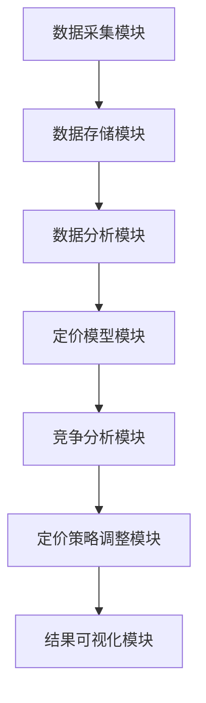

                 


# 《金融产品定价策略优化与竞争分析系统》

---

## 关键词：
金融产品定价，定价策略优化，竞争分析，定价模型，算法优化，系统架构

---

## 摘要：
本文详细探讨了金融产品定价策略优化与竞争分析系统的构建与应用。首先，从金融产品的定价基本概念和模型入手，分析了定价策略优化的必要性与核心方法。接着，深入讲解了定价策略优化的数学模型与算法原理，包括线性回归、遗传算法等，并通过实际案例展示了如何在竞争环境下动态调整定价策略。随后，本文从系统架构的角度，设计了完整的金融产品定价分析系统，涵盖数据采集、分析模块、可视化模块等核心组件，并通过Mermaid图展示了系统架构与交互流程。最后，通过项目实战部分，详细讲解了系统实现的关键步骤与代码示例，总结了系统优化的实践经验与未来研究方向。

---

## 第一部分：金融产品定价策略基础

### 第1章：金融产品定价概述

#### 1.1 金融产品定价的基本概念

金融产品定价是金融服务业的核心环节之一。金融产品包括银行贷款、保险产品、基金、股票等，其定价直接关系到金融机构的收益和市场竞争力。定价的基本目标是实现收益最大化，同时满足客户需求，保证产品在市场上的竞争力。

定价的基本原理包括成本导向定价、需求导向定价和竞争导向定价。成本导向定价以产品的成本为基础，加上合理的利润空间；需求导向定价基于市场需求和客户价值；竞争导向定价则关注竞争对手的定价策略。

定价策略的目标包括提高市场份额、提升产品利润率、增强客户满意度以及应对市场竞争。优化定价策略有助于金融机构在复杂多变的市场环境中保持竞争优势。

---

#### 1.2 定价模型与方法

定价模型是金融产品定价的核心工具，以下是几种常见的定价模型：

1. **市场定价法**：基于市场价格和竞争环境进行定价。  
   $$ P = P_{\text{market}} \times (1 + \alpha) $$  
   其中，$P$ 是产品价格，$P_{\text{market}}$ 是市场平均价格，$\alpha$ 是价格调整系数。

2. **成本加成定价法**：基于产品成本加上合理利润进行定价。  
   $$ P = C + M \times C $$  
   其中，$C$ 是成本，$M$ 是加成比例。

3. **基于竞争的定价法**：根据竞争对手的定价策略和市场地位进行调整。  
   $$ P = P_{\text{competitor}} \times \beta + \gamma $$  
   其中，$\beta$ 是竞争影响系数，$\gamma$ 是调整参数。

---

#### 1.3 定价策略优化的必要性

在金融市场中，定价策略优化的必要性主要体现在以下方面：

- **市场环境变化**：金融市场的波动性要求定价策略能够实时调整以应对利率变化、经济周期波动等因素。
- **竞争加剧**：金融机构之间的竞争日益激烈，优化定价策略是提升市场竞争力的关键。
- **客户需求多样化**：客户需求的多样化要求定价策略更加灵活，以满足不同客户群体的需求。

---

## 第二部分：定价策略优化方法

### 第2章：定价策略优化的核心概念

#### 2.1 定价优化的数学模型

定价优化的数学模型是实现定价策略优化的核心工具。以下是几种常用的数学模型：

1. **线性回归模型**：用于预测价格与市场变量之间的关系。  
   $$ P = \beta_0 + \beta_1 X + \epsilon $$  
   其中，$X$ 是影响价格的市场变量，$\beta_0$ 和 $\beta_1$ 是回归系数。

2. **非线性定价模型**：适用于复杂市场环境下的定价问题。  
   $$ P = f(X, \theta) $$  
   其中，$f$ 是非线性函数，$\theta$ 是模型参数。

3. **基于博弈论的定价模型**：模拟市场竞争中的定价行为。  
   $$ P_i = \argmax_{P_i} \pi_i(P_i, P_j) $$  
   其中，$\pi_i$ 是第 $i$ 家机构的利润函数，$P_j$ 是竞争对手的价格。

---

#### 2.2 数据驱动的定价优化

数据驱动的定价优化是现代金融定价的重要趋势，以下是其实现步骤：

1. **数据采集与处理**：收集市场数据、竞争对手数据和客户数据，并进行清洗和预处理。
2. **数据分析与特征提取**：通过数据分析提取影响定价的关键特征，如市场利率、客户需求弹性等。
3. **数据驱动的定价策略**：基于数据分析结果，制定动态定价策略，实时调整产品价格。

---

### 第3章：定价策略优化的算法原理

#### 3.1 常见优化算法

以下是几种常用的优化算法及其应用场景：

1. **线性规划**：适用于简单的线性定价问题。  
   $$ \text{最大化} \quad \sum P_i \times Q_i $$  
   $$ \text{约束} \quad \sum C_i \times Q_i \leq C_{\text{total}} $$  
   其中，$P_i$ 是产品价格，$Q_i$ 是销售量，$C_i$ 是单位成本，$C_{\text{total}}$ 是总成本。

2. **非线性规划**：适用于复杂的非线性定价问题。  
   $$ \text{最大化} \quad f(P) $$  
   $$ \text{约束} \quad g(P) \leq 0 $$  
   其中，$f(P)$ 是目标函数，$g(P)$ 是约束条件。

3. **遗传算法**：适用于全局优化问题。  
   - 初始化种群
   - 计算适应度
   - 选择、交叉和变异
   - 保留最优个体

4. **粒子群优化算法**：适用于连续优化问题。  
   - 初始化粒子群
   - 计算个体适应度
   - 更新粒子位置和速度
   - 保留最优解

---

#### 3.2 算法实现与优化

算法实现的关键步骤包括：

1. **算法选择与实现步骤**：根据问题特点选择合适的算法，并制定实现步骤。
2. **算法的收敛性分析**：分析算法的收敛速度和稳定性，确保算法在合理时间内收敛。
3. **算法的性能优化**：通过参数调整和并行计算等方法提升算法性能。

---

## 第三部分：竞争分析与定价策略调整

### 第4章：竞争环境下的定价策略

#### 4.1 竞争对手分析

竞争对手分析是定价策略优化的重要环节，以下是其实现步骤：

1. **竞争对手定价策略的识别**：收集竞争对手的定价数据，识别其定价模式。
2. **竞争对手定价行为的预测**：基于历史数据和市场环境，预测竞争对手未来的定价行为。
3. **竞争对手定价策略的影响**：分析竞争对手定价策略对自己定价策略的影响，并制定应对策略。

---

#### 4.2 基于竞争的定价策略调整

在竞争环境下，定价策略的调整需要考虑以下因素：

1. **竞争定价法的应用**：根据竞争对手的价格调整自己的定价策略。
2. **基于市场份额的定价策略**：通过调整价格获取更大的市场份额。
3. **基于差异化竞争的定价策略**：通过产品差异化制定差异化的定价策略。

---

### 第5章：定价策略的动态调整

#### 5.1 动态定价模型

动态定价模型是适应市场变化的重要工具，以下是其实现步骤：

1. **实时数据采集与处理**：收集实时市场数据，如市场利率、客户行为数据等。
2. **动态定价策略的制定**：根据实时数据动态调整定价策略。
3. **定价策略的实时更新**：通过反馈机制实时更新定价策略。

---

## 第四部分：系统架构与实现

### 第6章：金融产品定价分析系统架构

#### 6.1 系统功能设计

金融产品定价分析系统的功能模块包括：

1. **数据采集模块**：采集市场数据、竞争对手数据和客户数据。
2. **数据分析模块**：对数据进行清洗、分析和特征提取。
3. **定价模型模块**：实现各种定价模型和优化算法。
4. **竞争分析模块**：分析竞争对手的定价策略。
5. **定价策略调整模块**：根据分析结果动态调整定价策略。
6. **结果可视化模块**：将分析结果以可视化形式展示。

---

#### 6.2 系统架构设计

金融产品定价分析系统的架构设计如下：



---

## 第五部分：项目实战与案例分析

### 第7章：项目实战

#### 7.1 环境安装与配置

1. **安装Python环境**：安装Anaconda Python分布。
2. **安装依赖库**：安装numpy、pandas、scikit-learn、matplotlib等库。
3. **安装Mermaid工具**：安装Mermaid CLI用于生成图表。

---

#### 7.2 系统核心实现

以下是系统核心实现的代码示例：

```python
import numpy as np
import pandas as pd
from sklearn.linear_model import LinearRegression

# 数据预处理
data = pd.read_csv('pricing_data.csv')
X = data[['market_rate', 'competition_price']]
y = data['product_price']

# 训练线性回归模型
model = LinearRegression()
model.fit(X, y)

# 预测价格
new_market_rate = 5.0
new_competition_price = 100.0
predicted_price = model.predict([[new_market_rate, new_competition_price]])
print(f'预测价格为：{predicted_price[0]:.2f}')
```

---

## 第六部分：数学模型与公式

### 第8章：数学模型

#### 8.1 定价模型

以下是几种常用的定价模型：

1. **线性回归模型**：  
   $$ P = \beta_0 + \beta_1 X + \epsilon $$

2. **博弈论定价模型**：  
   $$ P_i = \argmax_{P_i} \pi_i(P_i, P_j) $$

3. **动态定价模型**：  
   $$ P_t = \alpha P_{t-1} + \beta D_t + \gamma $$  
   其中，$P_t$ 是当前价格，$D_t$ 是当前需求，$\alpha$、$\beta$、$\gamma$ 是模型参数。

---

## 第七部分：结论与展望

### 第9章：结论与展望

#### 9.1 结论

本文系统地探讨了金融产品定价策略优化与竞争分析系统的构建与应用。通过分析定价策略优化的核心概念与算法原理，结合实际案例展示了系统的实现与应用。本文提出的系统架构和算法优化方法为金融机构提供了重要的参考。

---

#### 9.2 未来研究方向

未来的研究可以进一步探索以下方向：

1. **智能定价系统的实现**：结合人工智能技术，实现更加智能化的定价系统。
2. **多目标优化算法的应用**：研究多目标优化算法在定价策略中的应用。
3. **实时定价系统的构建**：实现更加实时和动态的定价系统。

---

## 作者：AI天才研究院/AI Genius Institute & 禅与计算机程序设计艺术/Zen And The Art of Computer Programming

---

