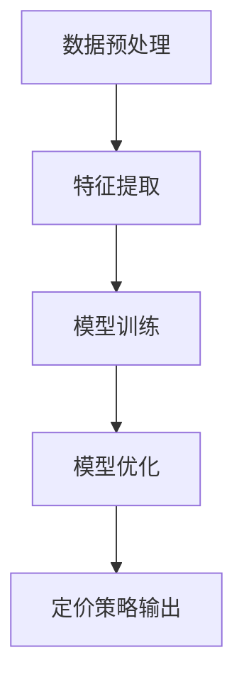
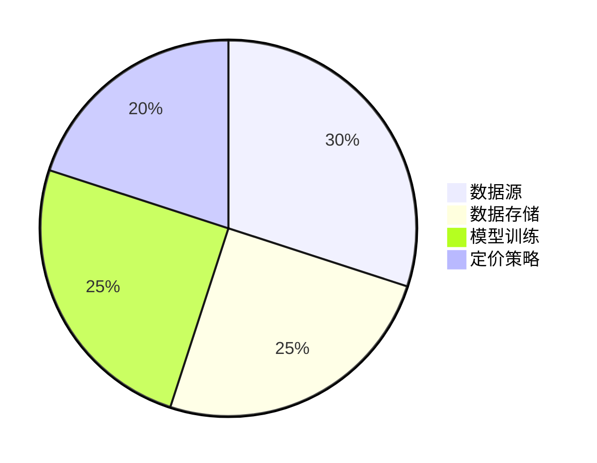
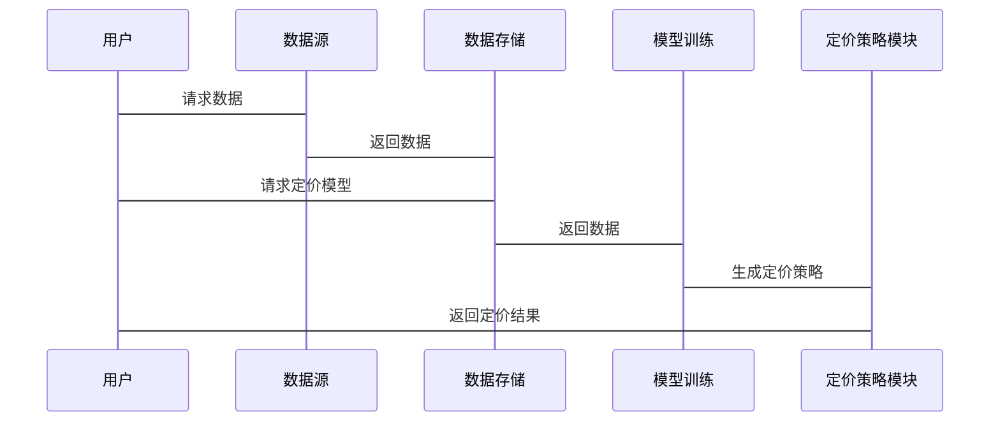

                 


# 《金融产品定价策略优化系统》

## 关键词：金融产品定价、策略优化、人工智能、机器学习、系统架构、数学模型、项目实战

## 摘要：本文详细介绍了金融产品定价策略优化系统的构建与应用。通过分析传统定价方法的局限性，结合人工智能和大数据技术，提出了基于机器学习的定价优化算法。文章从系统架构、数学模型、项目实战等多方面展开，探讨如何利用技术手段提升金融产品的定价效率与准确性。

---

# 第1章: 金融产品定价策略优化系统的背景与重要性

## 1.1 金融产品定价的背景与问题背景

### 1.1.1 传统金融产品定价方法的局限性
传统的金融产品定价方法主要依赖于经验丰富的分析师和简单的统计模型。这种方法存在以下问题：
- **主观性**：定价结果高度依赖分析师的个人经验和判断，存在较大的主观性。
- **数据利用不足**：传统方法通常只利用有限的市场数据，无法充分利用大数据的优势。
- **效率低下**：定价过程繁琐，耗时长，难以应对快速变化的市场环境。

### 1.1.2 数字化与智能化时代的定价需求
随着金融市场的快速发展和技术的进步，金融机构对定价效率和准确性的要求越来越高。数字化和智能化技术的应用为金融产品定价提供了新的可能性：
- **数据驱动**：利用大数据分析技术，可以提取更多的市场信息，提升定价的准确性。
- **自动化**：通过自动化算法，可以快速响应市场变化，提高定价效率。
- **个性化**：基于客户行为和需求的个性化定价，可以提升客户满意度和市场竞争力。

### 1.1.3 金融产品定价策略优化的必要性
在竞争日益激烈的金融市场中，优化定价策略可以帮助金融机构：
- **降低成本**：通过自动化定价减少人工成本。
- **提高收益**：基于实时数据和模型预测，制定更精准的价格策略。
- **增强客户体验**：通过个性化定价提升客户满意度。

## 1.2 金融产品定价策略优化系统的定义与目标

### 1.2.1 系统的定义
金融产品定价策略优化系统是一种基于人工智能和大数据技术的系统，旨在通过自动化和智能化的方式优化金融产品的定价策略。

### 1.2.2 系统的目标与核心价值
- **目标**：通过数据分析和算法优化，帮助金融机构制定科学、精准的定价策略。
- **核心价值**：
  - 提高定价效率和准确性。
  - 降低运营成本。
  - 增强市场竞争力。

### 1.2.3 系统的边界与外延
- **边界**：系统仅关注定价策略的优化，不涉及产品设计和风险管理等其他环节。
- **外延**：系统可以与其他金融系统（如客户关系管理系统、交易系统）集成，形成完整的金融解决方案。

## 1.3 系统的核心要素与概念结构

### 1.3.1 核心概念与属性对比表

| **概念**       | **定义**                                                                 |
|----------------|--------------------------------------------------------------------------|
| 定价模型       | 基于历史数据和市场特征构建的数学模型，用于预测产品价格。               |
| 数据特征       | 影响产品定价的关键数据，如市场趋势、客户行为、经济指标等。             |
| 优化算法       | 用于调整定价模型参数，以达到最优定价效果的算法，如遗传算法、梯度下降等。 |

### 1.3.2 ER实体关系图
```mermaid
erDiagram
    定价模型 o<->1 定价策略优化系统
    数据特征 o<->1 定价模型
    优化算法 o<->1 定价策略优化系统
    定价策略优化系统 o<->1 数据源
```

---

# 第2章: 核心概念与模型

## 2.1 定价策略优化系统的核心概念

### 2.1.1 定价模型的构建
定价模型是系统的核心，基于以下步骤构建：
1. **数据收集**：收集历史交易数据、市场数据、客户数据等。
2. **数据预处理**：清洗数据，处理缺失值、异常值等。
3. **特征提取**：从数据中提取影响定价的关键特征。
4. **模型训练**：使用机器学习算法（如线性回归、随机森林）训练定价模型。

### 2.1.2 数据特征的选择
选择合适的特征对模型的准确性至关重要。常见的特征包括：
- **市场特征**：市场指数、行业趋势。
- **客户特征**：客户年龄、收入水平。
- **产品特征**：产品类型、发行时间。

### 2.1.3 优化算法的选择
常用的优化算法包括：
- **梯度下降**：用于最小化损失函数。
- **遗传算法**：通过模拟自然选择优化定价策略。
- **支持向量机（SVM）**：用于分类和回归问题。

## 2.2 算法原理与流程

### 2.2.1 基于机器学习的定价优化算法


### 2.2.2 算法实现的数学模型
- **损失函数**：衡量预测价格与实际价格的差异。
  $$ L = \frac{1}{2n} \sum_{i=1}^{n} (y_i - \hat{y_i})^2 $$
- **优化目标**：最小化损失函数。
  $$ \min_{\theta} L(\theta) $$

---

# 第3章: 系统架构与设计

## 3.1 系统架构设计

### 3.1.1 系统功能模块
- **数据采集模块**：负责收集和存储数据。
- **模型训练模块**：负责构建和优化定价模型。
- **定价策略模块**：生成并输出优化后的定价策略。

### 3.1.2 系统架构图


## 3.2 系统接口与交互设计

### 3.2.1 系统接口设计
- **数据接口**：与数据源对接，获取实时数据。
- **用户接口**：提供用户友好的操作界面，展示定价结果。

### 3.2.2 系统交互流程


---

# 第4章: 项目实战与实现

## 4.1 环境安装与配置

### 4.1.1 安装Python环境
使用Anaconda或virtualenv管理Python环境，安装必要的库：
```
pip install numpy pandas scikit-learn matplotlib
```

## 4.2 核心代码实现

### 4.2.1 数据预处理
```python
import pandas as pd
import numpy as np

# 读取数据
data = pd.read_csv('pricing_data.csv')

# 数据清洗
data.dropna(inplace=True)
data['price'].fillna(data['price'].mean(), inplace=True)
```

### 4.2.2 特征选择与模型训练
```python
from sklearn.model_selection import train_test_split
from sklearn.ensemble import RandomForestRegressor
from sklearn.metrics import mean_squared_error

# 划分训练集和测试集
X_train, X_test, y_train, y_test = train_test_split(data.drop('price', axis=1), data['price'], test_size=0.2, random_state=42)

# 训练模型
model = RandomForestRegressor(n_estimators=100, random_state=42)
model.fit(X_train, y_train)

# 评估模型
y_pred = model.predict(X_test)
print('MSE:', mean_squared_error(y_test, y_pred))
```

## 4.3 项目小结
通过实际案例分析，展示了如何利用Python和机器学习算法优化金融产品的定价策略。代码实现简单易懂，能够帮助读者快速上手。

---

# 第5章: 总结与展望

## 5.1 总结
本文详细介绍了金融产品定价策略优化系统的构建与应用。通过系统化的分析和实战案例，展示了如何利用人工智能技术提升定价效率和准确性。

## 5.2 未来展望
未来，随着技术的进步，金融产品定价策略优化系统将进一步智能化和自动化。可能的方向包括：
- **更复杂的模型**：如深度学习模型（神经网络）的应用。
- **实时定价**：通过实时数据更新，实现动态定价。
- **多产品优化**：同时优化多种产品的定价策略。

---

作者：AI天才研究院/AI Genius Institute & 禅与计算机程序设计艺术 /Zen And The Art of Computer Programming

