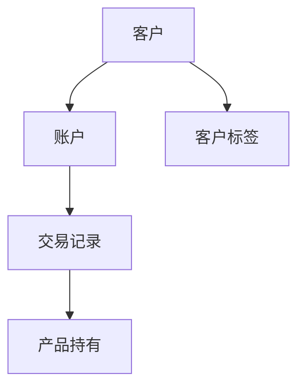
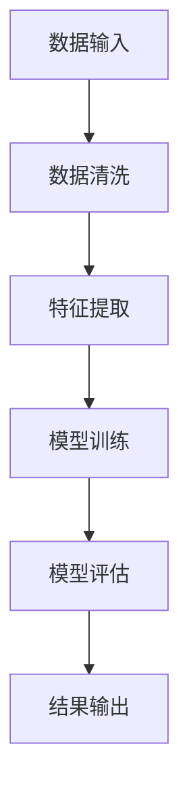
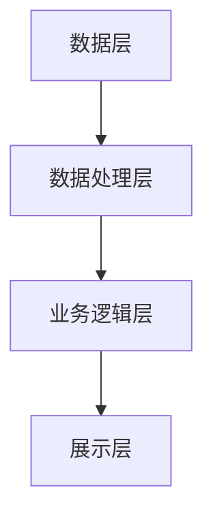

                 


# 《金融产品客户流失预警与干预系统》

## 关键词：客户流失预警、金融产品、机器学习、系统架构、项目实战

## 摘要：  
本文旨在探讨如何利用数据分析和机器学习技术构建金融产品客户流失预警与干预系统。通过系统化的分析和设计，结合实际案例，详细阐述了客户流失的背景、核心概念、算法原理、系统架构以及项目实现。本文将帮助读者理解如何通过技术手段有效降低客户流失率，提升金融服务的客户满意度和忠诚度。

---

# 第一部分: 金融产品客户流失预警与干预系统背景与概念

## 第1章: 客户流失的背景与重要性

### 1.1 客户流失的定义与特征

客户流失是指客户不再继续使用企业提供的产品或服务，从而导致企业失去这部分客户的现象。在金融行业，客户流失可能意味着客户不再持有金融产品（如基金、保险等）或不再使用银行服务（如储蓄、贷款等）。客户流失的特征包括：

1. **突然性**：客户流失往往出乎企业的意料，尤其是当客户在没有任何预警的情况下停止使用产品或服务时。
2. **潜在性**：客户流失的迹象可能在很长一段时间内不明显，但随着时间的推移，这些迹象会逐渐累积，最终导致客户流失。
3. **可预测性**：通过分析客户的交易行为、产品使用情况、投诉记录等数据，可以预测客户流失的可能性。

### 1.2 金融产品客户流失的背景

在金融行业中，客户流失是一个普遍存在的问题。随着市场竞争的加剧，客户的选择越来越多，金融机构需要通过创新和优化服务来留住客户。客户流失对金融机构的影响包括：

1. **收入下降**：客户流失直接导致金融机构收入的减少。
2. **成本增加**：客户流失意味着金融机构需要不断吸引新客户来弥补流失的客户，而吸引新客户的成本通常高于保留现有客户的成本。
3. **声誉受损**：客户流失可能影响金融机构的声誉，尤其是在客户流失的原因与服务质量相关时。

因此，建立客户流失预警与干预系统显得尤为重要。通过预警系统，金融机构可以在客户流失之前采取干预措施，从而降低客户流失率。

### 1.3 系统的目标

客户流失预警与干预系统的目标是通过分析客户的行为数据，预测客户流失的可能性，并在客户流失之前采取干预措施，以降低客户流失率。系统的核心目标包括：

1. **预测客户流失**：通过机器学习算法，预测客户流失的可能性。
2. **干预客户行为**：根据预测结果，采取相应的干预措施，如提供更好的服务、优惠活动等，以留住客户。
3. **优化客户体验**：通过分析客户流失的原因，优化产品和服务，提升客户满意度和忠诚度。

系统的边界包括：

- 数据来源：客户的交易数据、产品使用数据、投诉记录等。
- 预警范围：针对特定金融产品的客户流失预警。
- 干预方式：包括电话回访、邮件通知、优惠活动等。

系统的预期效益包括：

1. 提高客户留存率，增加收入。
2. 降低客户获取成本，优化资源配置。
3. 提升客户满意度和忠诚度，增强品牌形象。

---

## 第2章: 核心概念与系统架构

### 2.1 核心概念原理

客户流失预警与干预系统的核心概念包括：

1. **数据驱动的客户行为分析**：通过分析客户的交易数据、产品使用数据等，识别客户流失的潜在迹象。
2. **机器学习在客户流失预测中的应用**：利用机器学习算法，如逻辑回归、随机森林等，预测客户流失的可能性。
3. **多维度特征分析与建模**：从客户的特征（如年龄、性别）、行为（如交易频率）和产品特征（如产品类型）等多个维度进行分析，构建客户流失预测模型。

### 2.2 核心概念属性对比表

以下是核心概念属性的对比表：

| 特征维度 | 描述 | 示例 |
|----------|------|------|
| 客户行为 | 操作记录 | 账户登录频率 |
| 客户属性 | 基本信息 | 年龄、性别 |
| 产品特征 | 产品类型 | 基金、保险 |
| 时间因素 | 使用时长 | 账户活跃度 |

### 2.3 ER实体关系图

以下是客户流失预警与干预系统的ER实体关系图：



---

## 第3章: 算法原理与实现

### 3.1 数据预处理与特征工程

数据预处理是客户流失预测模型构建的基础。以下是数据预处理的主要步骤：

1. **数据清洗**：去除重复数据、处理缺失值、去除异常值。
2. **数据标准化**：将数据标准化到统一的范围，如0-1范围。
3. **特征选择**：通过统计分析、模型评估等方法选择对客户流失预测影响较大的特征。

### 3.2 常用算法与模型

在客户流失预测中，常用的算法包括：

1. **逻辑回归**：用于分类问题，可以预测客户流失的概率。
2. **随机森林**：一种基于决策树的集成学习方法，具有较强的抗过拟合能力。
3. **XGBoost**：一种高效的梯度提升算法，常用于处理分类问题。

以下是几种算法的对比：

| 算法 | 优点 | 缺点 |
|------|------|------|
| 逻辑回归 | 解释性强 | 对非线性关系的拟合能力较差 |
| 随机森林 | 抗过拟合能力强 | 对特征工程要求较高 |
| XGBoost | 高精度 | 对过拟合敏感 |

### 3.3 算法流程图

以下是算法流程图：



### 3.4 模型评估与优化

模型评估的主要指标包括准确率、召回率、F1值等。以下是混淆矩阵的示例：

|                | 预测为流失 | 预测为留存 |
|----------------|------------|------------|
| 实际为流失    | True Positive | False Negative |
| 实际为留存    | False Positive | True Negative |

模型优化可以通过网格搜索（Grid Search）进行参数调优。

---

## 第4章: 系统分析与架构设计

### 4.1 问题场景与项目介绍

客户流失预警与干预系统的典型场景包括：

1. **客户流失预警**：通过分析客户数据，预测客户流失的可能性。
2. **客户干预**：根据预测结果，采取相应的干预措施，如提供优惠活动、改善服务等。

### 4.2 系统功能设计

以下是系统的功能模块：

- 数据采集模块：负责采集客户数据。
- 数据处理模块：负责数据清洗、特征提取等。
- 模型训练模块：负责训练客户流失预测模型。
- 预警模块：根据模型预测结果，生成客户流失预警。
- 干预模块：根据预警结果，采取相应的干预措施。

### 4.3 系统架构设计

以下是系统的分层架构图：



### 4.4 接口与交互设计

以下是系统的API接口设计：

- 数据接口：用于数据的输入和输出。
- 模型接口：用于模型的训练和预测。
- 干预接口：用于干预措施的执行。

---

## 第5章: 项目实战与实现

### 5.1 环境搭建与数据准备

以下是项目实战的环境搭建步骤：

1. **安装必要的库**：如pandas、numpy、scikit-learn等。
2. **数据准备**：收集客户数据，包括交易数据、产品使用数据等。

### 5.2 核心代码实现

以下是核心代码实现：

```python
import pandas as pd
from sklearn.model_selection import train_test_split
from sklearn.ensemble import RandomForestClassifier
from sklearn.metrics import accuracy_score

# 数据加载
data = pd.read_csv('customer_churn.csv')

# 数据分割
X = data.drop('churn', axis=1)
y = data['churn']

X_train, X_test, y_train, y_test = train_test_split(X, y, test_size=0.2)

# 模型训练
model = RandomForestClassifier()
model.fit(X_train, y_train)

# 模型预测
y_pred = model.predict(X_test)

# 模型评估
print('Accuracy:', accuracy_score(y_test, y_pred))
```

### 5.3 实际案例分析

以下是实际案例分析：

1. **数据预处理**：去除重复数据、处理缺失值。
2. **特征选择**：选择对客户流失影响较大的特征，如交易频率、产品使用时长等。
3. **模型训练**：使用随机森林算法训练模型。
4. **模型评估**：评估模型的准确率、召回率等指标。

### 5.4 优化与改进

模型优化可以通过以下方式进行：

1. **参数调优**：使用网格搜索（Grid Search）优化模型参数。
2. **特征工程**：引入更多的特征，如客户投诉记录、产品反馈等。
3. **模型融合**：结合多种算法，如逻辑回归和随机森林，进行模型融合。

---

## 第六部分: 优化与展望

### 6.1 模型优化

模型优化可以通过以下方式进行：

1. **参数调优**：使用网格搜索优化模型参数。
2. **特征工程**：引入更多的特征，如客户投诉记录、产品反馈等。
3. **模型融合**：结合多种算法，如逻辑回归和随机森林，进行模型融合。

### 6.2 系统优化

系统优化可以通过以下方式进行：

1. **数据处理优化**：优化数据清洗和特征提取的流程，提高数据处理效率。
2. **系统架构优化**：优化系统的分层架构，提高系统的扩展性和可维护性。
3. **接口优化**：优化API接口的设计，提高系统的交互效率。

### 6.3 未来展望

未来，随着人工智能技术的不断发展，客户流失预警与干预系统将更加智能化和个性化。以下是未来的发展方向：

1. **智能预测**：利用深度学习技术，进一步提高客户流失预测的准确性。
2. **个性化干预**：根据客户的个性化需求，提供更加精准的干预措施。
3. **实时预警**：实现客户流失的实时预警，进一步提高系统的响应速度。

---

## 作者：AI天才研究院/AI Genius Institute & 禅与计算机程序设计艺术 /Zen And The Art of Computer Programming

---

通过本文的详细讲解，我们可以看到，客户流失预警与干预系统是一个复杂的系统工程，需要结合数据分析、机器学习和系统设计等多种技术。通过本文的理论分析和实际案例，读者可以更好地理解客户流失的预测和干预，从而为企业制定更加有效的客户 retention 策略提供参考。

