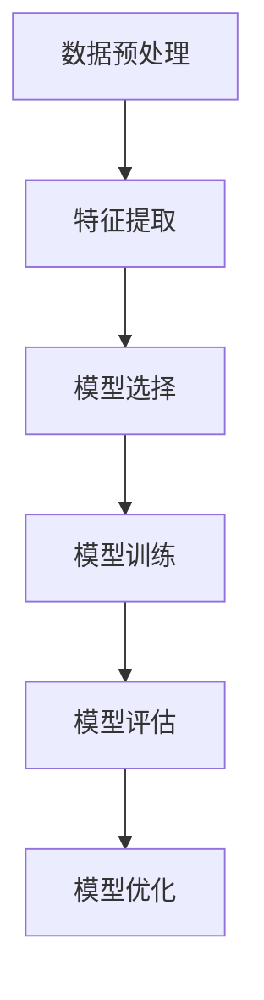
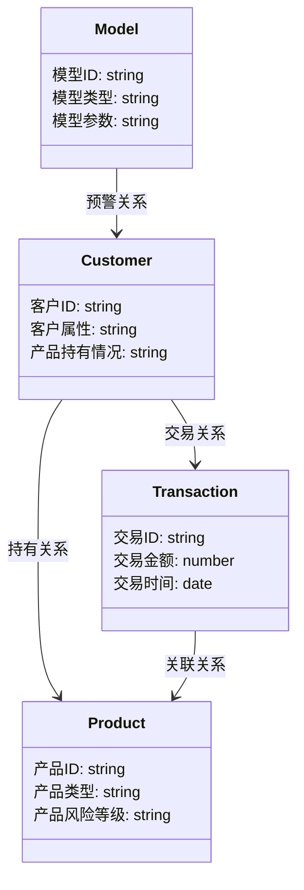
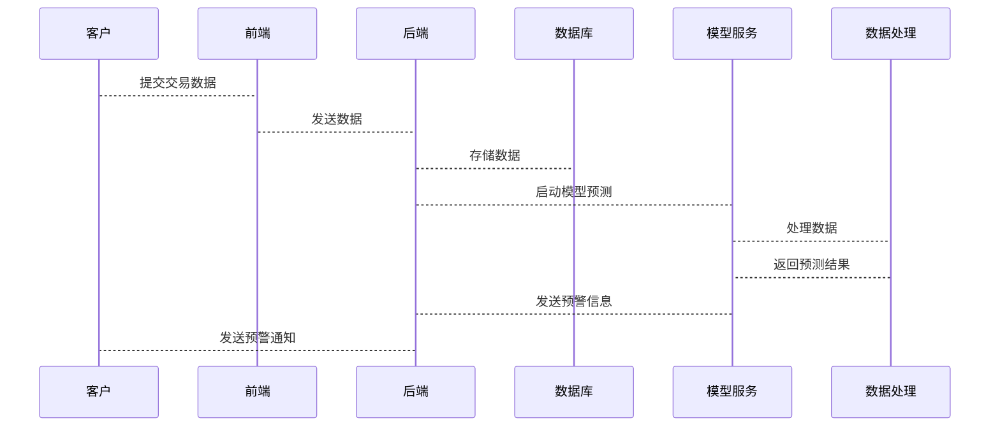

                 


# 《金融产品客户流失预警模型》

**关键词**：客户流失、预警模型、金融产品、机器学习、数据挖掘

**摘要**：本文系统地探讨了金融产品客户流失预警模型的设计与实现。通过分析客户流失的背景、核心概念、算法原理、系统架构以及实战案例，本文旨在为金融机构提供一套有效的客户流失预警解决方案。从数据预处理到模型构建，再到系统实现，本文详细阐述了每个环节的关键技术和实现步骤，同时提供了丰富的代码示例和系统设计图，帮助读者深入理解客户流失预警模型的构建过程。

---

# 第1章: 金融产品客户流失预警模型概述

## 1.1 问题背景与意义

### 1.1.1 金融产品客户流失的定义与影响

客户流失是指客户不再使用金融机构提供的产品或服务。在金融行业，客户流失可能导致收入下降、市场占有率降低，同时还会增加客户获取的成本。客户流失预警模型的目标是通过分析客户的行为数据，提前识别出可能流失的客户，并采取相应的措施减少客户流失。

### 1.1.2 客户流失预警的重要性

及时预测客户流失可以帮助金融机构采取主动措施，如提供更好的服务、推荐适合的产品或进行营销活动，从而提高客户满意度和忠诚度。此外，客户流失预警还可以帮助金融机构优化资源分配，降低客户获取成本。

### 1.1.3 金融行业客户流失的现状与挑战

随着金融行业的竞争加剧，客户流失问题日益突出。传统的客户流失分析方法往往依赖于经验判断，缺乏数据支持。而机器学习等技术的应用，使得基于数据的客户流失预警成为可能。然而，数据隐私、模型解释性和实时性等问题仍然是当前的挑战。

---

## 1.2 问题描述与目标

### 1.2.1 客户流失预警的核心问题

客户流失预警的核心问题是如何从海量数据中提取有效的特征，并利用这些特征构建一个高精度的分类模型，以准确预测客户是否会流失。

### 1.2.2 预警模型的目标与边界

模型的目标是预测客户在一定时间内的流失概率，并提供预警。模型的边界包括数据的范围、预测的时间窗口以及模型的可解释性要求。

### 1.2.3 模型的适用场景与限制

客户流失预警模型适用于客户数据充足、流失行为可量化的场景。模型的限制包括数据质量、特征选择和模型的实时性要求。

---

## 1.3 问题解决思路

### 1.3.1 数据驱动的解决方案

通过收集和分析客户的交易数据、行为数据和产品使用数据，提取特征并构建模型。

### 1.3.2 机器学习在客户流失预测中的应用

利用分类算法（如逻辑回归、随机森林等）对客户流失进行预测。

### 1.3.3 多模型融合的优化思路

通过集成学习的方法，结合多个模型的优势，提高预测的准确性。

---

## 1.4 概念结构与核心要素

### 1.4.1 核心概念的层次化结构

客户流失预警模型的核心概念包括客户、产品、交易、模型和预警指标。

### 1.4.2 核心要素的属性特征对比表

| 特征类型 | 属性 | 描述 |
|----------|------|------|
| 数据特征 | 时间性 | 客户行为的时间分布 |
|          | 关联性 | 客户行为的关联程度 |
| 模型特征 | 精度 | 预测准确性 |
|          | 可解释性 | 模型的可解释性 |

### 1.4.3 ER实体关系图

```mermaid
erd
  Customer
    - 客户ID: string
    - 客户属性: string
    - 产品持有情况: string
  Product
    - 产品ID: string
    - 产品类型: string
    - 产品风险等级: string
  Transaction
    - 交易ID: string
    - 交易金额: number
    - 交易时间: date
  Model
    - 模型ID: string
    - 模型类型: string
    - 模型参数: string
```

---

# 第2章: 金融客户流失预警模型的核心概念与联系

## 2.1 核心概念原理

### 2.1.1 数据特征的提取与选择

数据特征的提取与选择是模型构建的关键步骤。常见的特征包括交易频率、账户余额、客户年龄、性别、收入水平等。

### 2.1.2 模型选择与优化策略

根据数据特征和业务需求选择合适的模型，并通过交叉验证和网格搜索进行参数优化。

### 2.1.3 预警指标的设计与计算

预警指标包括流失概率、风险等级等，用于衡量客户流失的可能性。

---

## 2.2 核心概念属性特征对比表

| 特征类型 | 属性 | 描述 |
|----------|------|------|
| 数据特征 | 时间性 | 客户行为的时间分布 |
|          | 关联性 | 客户行为的关联程度 |
| 模型特征 | 精度 | 预测准确性 |
|          | 可解释性 | 模型的可解释性 |

---

## 2.3 ER实体关系图

```mermaid
erd
  Customer
    - 客户ID: string
    - 客户属性: string
    - 产品持有情况: string
  Product
    - 产品ID: string
    - 产品类型: string
    - 产品风险等级: string
  Transaction
    - 交易ID: string
    - 交易金额: number
    - 交易时间: date
  Model
    - 模型ID: string
    - 模型类型: string
    - 模型参数: string
```

---

# 第3章: 金融客户流失预警模型的算法原理

## 3.1 算法原理概述

### 3.1.1 监督学习的基本原理

监督学习通过训练数据学习输入与输出之间的关系，从而实现对新数据的预测。

### 3.1.2 分类算法的选择与比较

常用的分类算法包括逻辑回归、支持向量机、随机森林等。每种算法都有其优缺点和适用场景。

### 3.1.3 模型训练的流程与步骤

模型训练的流程包括数据预处理、特征选择、模型训练、模型评估和模型优化。

---

## 3.2 算法流程图



---

## 3.3 算法实现代码

```python
import pandas as pd
from sklearn.model_selection import train_test_split
from sklearn.linear_model import LogisticRegression
from sklearn.metrics import accuracy_score

# 数据加载与预处理
data = pd.read_csv('customer_data.csv')
X = data.drop('label', axis=1)
y = data['label']

# 数据分割
X_train, X_test, y_train, y_test = train_test_split(X, y, test_size=0.2)

# 模型训练
model = LogisticRegression()
model.fit(X_train, y_train)

# 模型预测与评估
y_pred = model.predict(X_test)
print("准确率:", accuracy_score(y_test, y_pred))
```

---

## 3.4 数学公式

### 3.4.1 逻辑回归的损失函数

$$ L(\theta) = -\frac{1}{m} \sum_{i=1}^{m} [y^{(i)} \log(h(x^{(i)})) + (1 - y^{(i)}) \log(1 - h(x^{(i)}))] $$

其中，$$ h(x^{(i)}) = \frac{e^{\theta^T x^{(i)}}}{1 + e^{\theta^T x^{(i)}}} $$

### 3.4.2 随机森林的分类原理

随机森林通过构建多棵决策树，并对结果进行投票或取平均值来提高模型的准确性和鲁棒性。

---

## 3.5 模型调优与优化

通过交叉验证和网格搜索优化模型参数，如逻辑回归的正则化系数和随机森林的树的数量。

---

## 3.6 模型评估与解释

通过混淆矩阵、ROC曲线等指标评估模型的性能，并对模型的可解释性进行分析。

---

# 第4章: 金融客户流失预警模型的系统分析与架构设计

## 4.1 问题场景介绍

客户流失预警系统需要实时监控客户的交易行为，并根据模型预测结果发出预警。

---

## 4.2 项目介绍

本项目旨在构建一个基于机器学习的客户流失预警系统，帮助金融机构降低客户流失率。

---

## 4.3 系统功能设计

### 4.3.1 领域模型设计



### 4.3.2 系统架构设计


### 4.3.3 系统接口设计

系统接口包括数据接口、模型接口和预警接口。

### 4.3.4 系统交互流程设计



---

## 4.4 系统实现

### 4.4.1 环境安装

安装Python、Scikit-learn、Pandas等依赖库。

### 4.4.2 核心实现代码

```python
from flask import Flask, request, jsonify
import joblib
import pandas as pd

app = Flask(__name__)
model = joblib.load('customer_churn_model.pkl')

@app.route('/predict', methods=['POST'])
def predict():
    data = request.json
    df = pd.DataFrame([data])
    prediction = model.predict(df)
    return jsonify({'prediction': int(prediction[0])})

if __name__ == '__main__':
    app.run(debug=True)
```

---

## 4.5 系统优化与扩展

通过容器化部署、分布式计算等技术优化系统的性能和扩展性。

---

## 4.6 系统测试与验证

通过单元测试、集成测试和用户测试验证系统的功能和性能。

---

# 第5章: 金融客户流失预警模型的项目实战

## 5.1 数据加载与预处理

### 5.1.1 数据清洗

处理缺失值、重复值和异常值。

### 5.1.2 特征工程

提取特征并进行归一化处理。

### 5.1.3 数据分割

将数据分割为训练集和测试集。

---

## 5.2 模型训练与优化

### 5.2.1 模型训练

使用训练数据训练模型。

### 5.2.2 模型优化

通过网格搜索优化模型参数。

---

## 5.3 系统部署与测试

### 5.3.1 系统部署

将模型部署到服务器并配置接口。

### 5.3.2 系统测试

通过实际数据测试系统的性能和准确性。

---

## 5.4 实际案例分析

通过具体案例分析模型的预测结果，并验证模型的准确性。

---

## 5.5 项目总结与优化

总结项目的成果，并提出进一步优化的方向。

---

# 第6章: 金融客户流失预警模型的最佳实践与注意事项

## 6.1 最佳实践 tips

### 6.1.1 数据质量的重要性

确保数据的完整性和准确性。

### 6.1.2 模型解释性的提升

通过特征重要性分析和可视化工具提高模型的可解释性。

### 6.1.3 系统的实时性要求

确保系统的实时性，及时发出预警。

---

## 6.2 小结

客户流失预警模型的构建需要综合考虑数据、算法和系统架构等多个方面。

---

## 6.3 注意事项

### 6.3.1 数据隐私与合规性

确保数据的使用符合相关法律法规。

### 6.3.2 模型的可扩展性

设计可扩展的系统架构，方便后续的功能扩展。

### 6.3.3 模型的维护与更新

定期更新模型，确保模型的准确性和适用性。

---

# 结语

金融产品客户流失预警模型的应用可以帮助金融机构提高客户满意度和忠诚度，降低客户流失率。通过本文的详细讲解，读者可以掌握客户流失预警模型的构建方法，并将其应用于实际业务中。

---

**作者：AI天才研究院/AI Genius Institute & 禅与计算机程序设计艺术 /Zen And The Art of Computer Programming**

