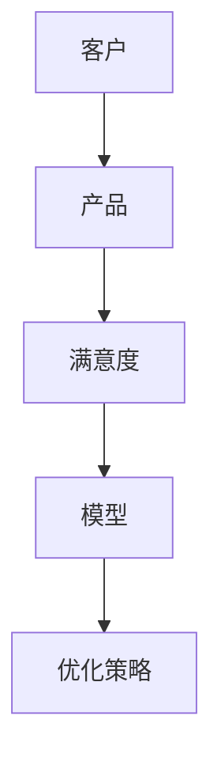
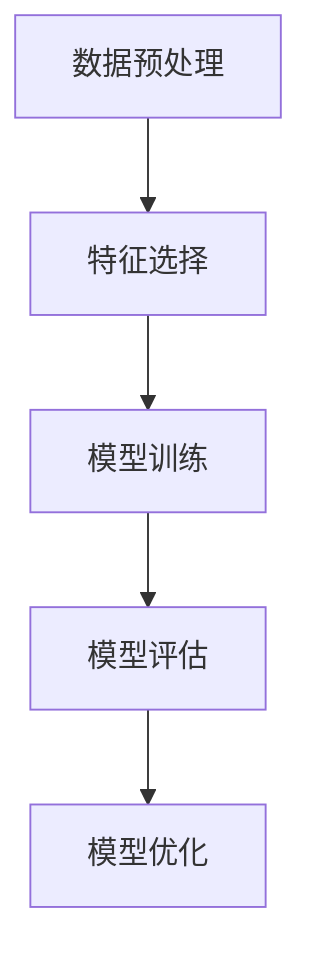
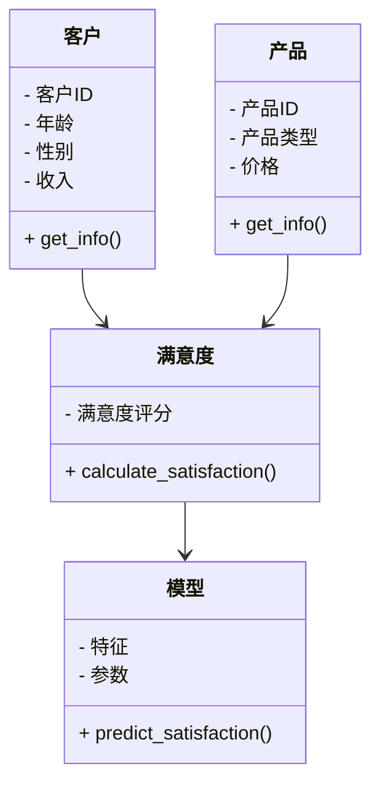
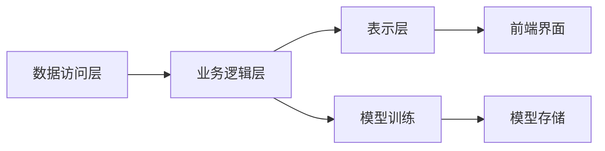
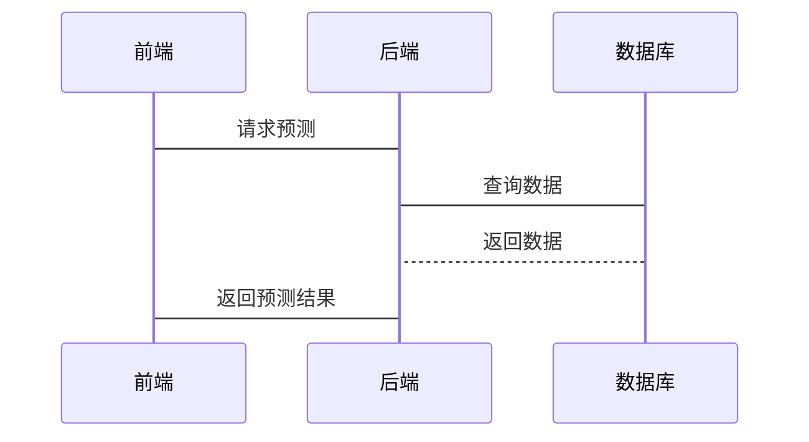

                 


# 金融产品客户满意度预测模型

## 关键词：金融产品、客户满意度、预测模型、机器学习、数据分析、客户体验

## 摘要：本文通过详细分析金融产品客户满意度预测模型的构建过程，结合实际案例，深入探讨了如何利用数据分析和机器学习技术来预测客户满意度。文章从背景介绍、核心概念、算法原理、系统架构设计、项目实战到最佳实践，全面阐述了构建模型的各个阶段，旨在为金融行业的从业者提供理论支持和实践指导。

---

# 第一部分: 金融产品客户满意度预测模型概述

## 第1章: 金融产品客户满意度预测模型背景介绍

### 1.1 问题背景与描述

#### 1.1.1 金融产品客户满意度的重要性
金融产品的客户满意度是衡量客户对产品和服务的整体感受和评价的重要指标。高客户满意度不仅能够提高客户忠诚度，还能间接提升金融机构的市场竞争力和品牌价值。

#### 1.1.2 当前金融行业客户满意度面临的挑战
随着金融行业的快速发展，客户对金融产品和服务的要求越来越高。然而，金融机构在客户满意度管理方面仍存在以下挑战：
1. 数据分散：客户数据来源多样，难以整合。
2. 数据维度复杂：金融产品的数据涉及多个维度，如产品功能、服务质量、价格敏感性等。
3. 预测精度不足：传统方法难以准确预测客户满意度。

#### 1.1.3 预测模型在金融产品优化中的作用
客户满意度预测模型能够帮助金融机构提前识别客户潜在的不满，优化产品设计和服务流程，从而提高客户满意度和忠诚度。

### 1.2 客户满意度预测的核心要素

#### 1.2.1 客户满意度的定义与测量
客户满意度（Customer Satisfaction）是指客户对产品或服务的实际体验与期望值之间的差距。测量客户满意度通常采用调查问卷、数据分析等方式。

#### 1.2.2 金融产品的核心属性
金融产品的核心属性包括：
- 产品功能：产品的基本功能和服务内容。
- 服务质量：客户在使用产品过程中感受到的服务质量。
- 价格敏感性：客户对产品价格的敏感程度。

#### 1.2.3 预测客户满意度的关键指标
关键指标包括：
- 客户满意度评分（如1-5分）
- 客户留存率
- 客户投诉率
- 产品使用频率

### 1.3 问题解决与边界

#### 1.3.1 预测模型的目标与边界
目标：通过分析客户行为数据和产品数据，建立预测模型，准确预测客户满意度。
边界：仅关注直接影响客户满意度的产品和服务因素，排除外部市场波动等不可控因素。

#### 1.3.2 数据来源与处理方法
数据来源包括：
- 客户调查问卷数据
- 历史交易数据
- 客户投诉记录
- 产品性能数据

数据处理方法包括：
- 数据清洗
- 特征提取
- 数据标准化

#### 1.3.3 模型适用的场景与限制
适用场景：
- 新产品上线前的客户满意度预测
- 现有产品的客户满意度优化
- 客户流失风险预警

模型限制：
- 数据质量对模型性能有直接影响
- 模型假设可能与实际客户行为存在偏差

### 1.4 概念结构与核心要素

#### 1.4.1 模型的核心组成
模型的核心组成包括：
1. 数据输入：客户行为数据、产品数据
2. 特征提取：提取影响客户满意度的关键特征
3. 模型训练：选择合适的算法训练模型
4. 模型评估：通过验证数据评估模型性能
5. 模型优化：调整参数或更换算法以提升预测精度

#### 1.4.2 核心要素的特征对比
| 特征 | 描述 | 示例 |
|------|------|------|
| 数据输入 | 客户行为数据和产品数据 | 调查问卷数据、交易数据 |
| 模型训练 | 机器学习算法 | 线性回归、随机森林 |
| 模型评估 | 评估指标 | RMSE（均方根误差）、MAE（平均绝对误差）、R²（决定系数） |

#### 1.4.3 模型的输入与输出关系
输入：客户行为数据（如年龄、职业、收入）、产品数据（如产品类型、价格）
输出：客户满意度评分（如1-5分）

---

# 第二部分: 客户满意度预测模型的核心概念与联系

## 第2章: 客户满意度预测模型的核心概念与联系

### 2.1 核心概念原理

#### 2.1.1 数据特征提取方法
数据特征提取是将原始数据转化为对客户满意度有影响的关键特征。常用方法包括：
1. 主成分分析（PCA）
2. 特征重要性分析（如随机森林特征重要性）

#### 2.1.2 模型选择与优化策略
模型选择：
- 线性回归：适合线性关系
- 随机森林：适合非线性关系
- 支持向量机（SVM）：适合小样本数据

优化策略：
- 参数调优（如网格搜索）
- 正则化（L1/L2正则化）

#### 2.1.3 模型评价指标
常用评价指标：
- RMSE（均方根误差）
- MAE（平均绝对误差）
- R²（决定系数）
- AUC（适用于分类问题）

### 2.2 核心概念属性特征对比表

| 特征 | 描述 | 示例 |
|------|------|------|
| 数据输入 | 客户行为数据和产品数据 | 调查问卷数据、交易数据 |
| 模型训练 | 机器学习算法 | 线性回归、随机森林 |
| 模型评估 | 评估指标 | RMSE、MAE、R² |

### 2.3 ER实体关系图


---

# 第三部分: 客户满意度预测模型的算法原理

## 第3章: 客户满意度预测模型的算法原理

### 3.1 算法原理概述

#### 3.1.1 线性回归模型
线性回归模型假设自变量与因变量之间存在线性关系。模型公式：
$$ y = \beta_0 + \beta_1 x_1 + \beta_2 x_2 + ... + \beta_n x_n + \epsilon $$
其中，$\beta_0$是截距，$\beta_1, \beta_2, ..., \beta_n$是回归系数，$\epsilon$是误差项。

#### 3.1.2 随机森林模型
随机森林是一种基于树的集成算法，通过构建多棵决策树并进行投票或平均来提高预测准确性和鲁棒性。

#### 3.1.3 支持向量机模型
支持向量机（SVM）通过找到一个超平面，将数据点分为两类，适用于线性可分的情况。

### 3.2 算法流程图


### 3.3 算法实现代码

#### 3.3.1 数据预处理
```python
import pandas as pd
import numpy as np

# 加载数据
data = pd.read_csv('customer_satisfaction.csv')

# 数据清洗
data.dropna(inplace=True)
data = pd.get_dummies(data)
```

#### 3.3.2 模型训练
```python
from sklearn.ensemble import RandomForestRegressor
from sklearn.model_selection import train_test_split
from sklearn.metrics import mean_squared_error

# 划分训练集和测试集
X = data.drop('satisfaction', axis=1)
y = data['satisfaction']
X_train, X_test, y_train, y_test = train_test_split(X, y, test_size=0.2, random_state=42)

# 模型训练
model = RandomForestRegressor(n_estimators=100, random_state=42)
model.fit(X_train, y_train)
```

#### 3.3.3 模型评估
```python
# 预测
y_pred = model.predict(X_test)

# 评估指标
rmse = np.sqrt(mean_squared_error(y_test, y_pred))
print(f'RMSE: {rmse}')
print(f'R²: {model.score(X_test, y_test)}')
```

---

# 第四部分: 客户满意度预测模型的系统分析与架构设计

## 第4章: 客户满意度预测模型的系统分析与架构设计

### 4.1 系统功能设计

#### 4.1.1 领域模型


#### 4.1.2 系统架构设计


### 4.2 接口设计与交互

#### 4.2.1 接口设计
1. 数据输入接口：接收客户行为数据和产品数据
2. 模型训练接口：训练客户满意度预测模型
3. 预测接口：根据输入数据返回客户满意度预测结果

#### 4.2.2 交互序列图


---

# 第五部分: 客户满意度预测模型的项目实战

## 第5章: 客户满意度预测模型的项目实战

### 5.1 项目环境安装

#### 5.1.1 安装Python环境
建议使用Anaconda或虚拟环境，安装Python 3.8以上版本。

#### 5.1.2 安装依赖库
```bash
pip install pandas numpy scikit-learn
```

### 5.2 系统核心实现源代码

#### 5.2.1 数据预处理
```python
import pandas as pd
import numpy as np

# 加载数据
data = pd.read_csv('customer_satisfaction.csv')

# 数据清洗
data.dropna(inplace=True)
data = pd.get_dummies(data)
```

#### 5.2.2 模型训练与预测
```python
from sklearn.ensemble import RandomForestRegressor
from sklearn.model_selection import train_test_split
from sklearn.metrics import mean_squared_error

# 划分训练集和测试集
X = data.drop('satisfaction', axis=1)
y = data['satisfaction']
X_train, X_test, y_train, y_test = train_test_split(X, y, test_size=0.2, random_state=42)

# 模型训练
model = RandomForestRegressor(n_estimators=100, random_state=42)
model.fit(X_train, y_train)

# 预测
y_pred = model.predict(X_test)

# 评估指标
rmse = np.sqrt(mean_squared_error(y_test, y_pred))
print(f'RMSE: {rmse}')
print(f'R²: {model.score(X_test, y_test)}')
```

### 5.3 实际案例分析

#### 5.3.1 数据准备
假设我们有一个客户满意度调查数据集，包含以下字段：
- 客户ID
- 年龄
- 性别
- 收入
- 产品类型
- 价格
- 满意度评分

#### 5.3.2 模型训练与优化
```python
# 超参数优化
from sklearn.model_selection import GridSearchCV

param_grid = {
    'n_estimators': [100, 200],
    'max_depth': [None, 10, 20],
    'min_samples_split': [2, 5],
    'min_samples_leaf': [1, 2]
}

grid_search = GridSearchCV(RandomForestRegressor(), param_grid, cv=5, scoring='neg_mean_squared_error')
grid_search.fit(X_train, y_train)

best_model = grid_search.best_estimator_
print(f'最优参数组合: {grid_search.best_params_}')
```

#### 5.3.3 模型结果分析
- RMSE：衡量预测值与实际值之间的平均误差
- R²：衡量模型解释的方差比例
- 特征重要性分析：找出影响客户满意度的关键因素

### 5.4 项目小结
通过实际案例分析，我们可以看到随机森林模型在客户满意度预测中的表现。模型的预测精度可以通过超参数优化进一步提升。

---

# 第六部分: 客户满意度预测模型的最佳实践

## 第6章: 客户满意度预测模型的最佳实践

### 6.1 小结
客户满意度预测模型是金融行业优化产品和服务的重要工具。通过数据分析和机器学习技术，我们可以更准确地预测客户满意度，从而提高客户忠诚度和市场竞争力。

### 6.2 注意事项
1. 数据质量：确保数据的完整性和准确性
2. 模型选择：根据数据特征选择合适的算法
3. 模型优化：通过超参数调优和特征工程提高模型性能
4. 模型解释：确保模型结果可解释，避免黑箱模型

### 6.3 拓展阅读
1. 《机器学习实战》
2. 《Python数据分析与挖掘实战》
3. 《金融数据分析导论》

---

作者：AI天才研究院/AI Genius Institute & 禅与计算机程序设计艺术/Zen And The Art of Computer Programming

