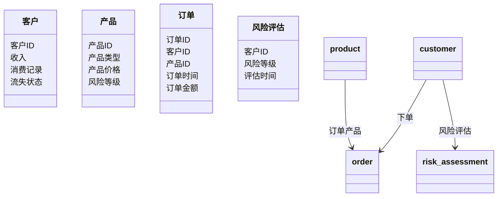
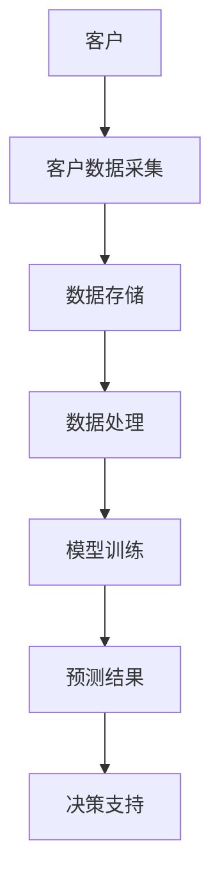
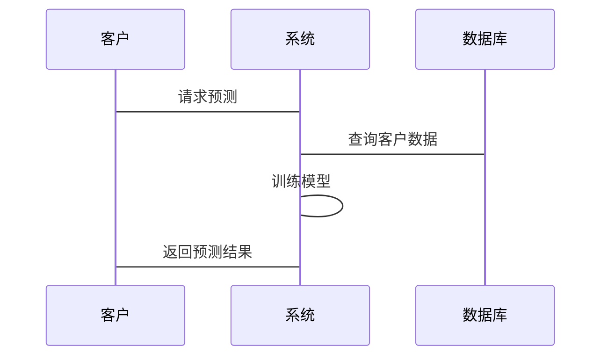

                 


# 《金融产品客户生命周期价值最大化》

## 关键词：客户生命周期价值、金融产品、客户分层、机器学习、系统架构、Python代码

## 摘要：  
本文围绕金融产品客户生命周期价值最大化这一主题，系统性地分析了客户生命周期价值的核心概念、量化方法、预测算法、系统架构设计及项目实现方案。通过结合数学模型、机器学习算法和系统架构设计，本文深入探讨了如何通过客户分层、行为预测和价值评估等手段，实现金融产品客户生命周期价值的最大化。文章最后通过一个具体的银行客户生命周期价值管理系统案例，展示了如何将理论应用于实际场景，为读者提供了一套完整的解决方案。

---

# 第1章: 客户生命周期价值最大化的核心概念

## 1.1 客户生命周期价值的定义与背景

### 1.1.1 客户生命周期的基本概念  
客户生命周期（Customer Life Cycle，简称 CLC）是指客户与企业之间的互动关系从初次接触、建立关系、持续交互到最终流失的全过程。在金融领域，客户生命周期价值（Customer Lifetime Value，简称 CLV）是衡量客户在整个生命周期内为企业带来的净收益的重要指标。

### 1.1.2 金融产品客户生命周期的特殊性  
金融产品具有高价值、高风险和强监管的特点，客户生命周期价值的计算需要考虑市场波动、政策变化和客户风险偏好等复杂因素。此外，金融产品的销售往往涉及复杂的交易流程和合规要求，这使得客户生命周期价值的管理更具挑战性。

### 1.1.3 客户生命周期价值最大化的目标与意义  
最大化客户生命周期价值的核心目标是通过优化客户获取、维护和流失管理的成本与收益，实现企业价值的最大化。在金融领域，这不仅有助于提升企业的盈利能力，还能增强客户满意度和忠诚度，降低客户流失率。

---

## 1.2 金融产品客户生命周期价值的核心要素

### 1.2.1 客户获取阶段的价值分析  
客户获取阶段的价值分析包括客户获取成本（Customer Acquisition Cost，CAC）、客户的初始价值（Initial Value）和客户转化率的预测。通过分析这些指标，企业可以优化营销策略，降低客户获取成本。

### 1.2.2 客户维护阶段的价值提升  
客户维护阶段的价值提升包括客户留存率的优化、客户交叉销售和向上销售策略的实施。通过分析客户的消费行为和偏好，企业可以制定个性化的维护策略，提升客户的生命周期价值。

### 1.2.3 客户流失阶段的价值回收  
客户流失阶段的价值回收包括客户流失预测、流失客户价值的评估和流失客户挽回策略的制定。通过分析客户流失的原因，企业可以采取针对性措施，减少客户流失带来的损失。

---

## 1.3 客户生命周期价值模型的构建与应用

### 1.3.1 生命周期价值模型的构建方法  
生命周期价值模型的构建需要结合客户的行为数据、交易数据和外部市场数据。常用的方法包括线性回归模型、决策树模型和随机森林模型等。

### 1.3.2 模型在金融产品中的具体应用  
在金融产品中，生命周期价值模型可以用于客户分层、产品推荐和风险评估。例如，银行可以通过客户生命周期价值模型，对客户进行分层，制定个性化的理财产品推荐策略。

### 1.3.3 模型的优缺点与改进方向  
生命周期价值模型的优点包括数据驱动、可量化和可优化。缺点包括数据依赖性高、模型复杂性和实施成本高。未来的研究方向可以包括模型的实时更新、多模态数据的融合和AI技术的深度应用。

---

## 1.4 本章小结  
本章详细介绍了客户生命周期价值的核心概念、核心要素和模型构建方法。通过分析客户生命周期的各个阶段，我们明确了客户生命周期价值最大化的目标和实现路径。

---

# 第2章: 客户生命周期价值的量化与预测

## 2.1 客户生命周期价值的量化指标

### 2.1.1 客户终身价值（CLV）的计算公式  
客户终身价值（CLV）的计算公式如下：

$$CLV = \frac{R - C}{1 - \delta}$$

其中，$R$ 表示客户生命周期内的总收入，$C$ 表示获取客户的成本，$\delta$ 表示客户流失率。

### 2.1.2 客户获取成本（CAC）与客户生命周期价值（CLV）的关系  
客户获取成本（CAC）与客户生命周期价值（CLV）的关系可以通过以下公式表示：

$$CAC = \frac{C}{N}$$

其中，$C$ 是客户获取的总成本，$N$ 是获取的客户数量。

### 2.1.3 客户生命周期价值的动态调整方法  
客户生命周期价值的动态调整方法包括实时更新客户行为数据、定期评估模型性能和根据市场变化调整模型参数。

---

## 2.2 客户行为预测与价值评估

### 2.2.1 客户行为预测的数学模型  
客户行为预测的数学模型可以采用线性回归模型：

$$P(t) = \beta_1 + \beta_2 t + \epsilon$$

其中，$P(t)$ 表示客户在时间 $t$ 的行为概率，$\beta_1$ 和 $\beta_2$ 是回归系数，$\epsilon$ 是误差项。

### 2.2.2 基于机器学习的客户价值预测  
基于机器学习的客户价值预测可以通过随机森林模型实现：

```python
from sklearn.ensemble import RandomForestRegressor
import pandas as pd

# 加载数据
data = pd.read_csv('customer_data.csv')

# 分离特征和目标变量
X = data.drop('CLV', axis=1)
y = data['CLV']

# 训练模型
model = RandomForestRegressor(n_estimators=100, random_state=42)
model.fit(X, y)

# 预测客户价值
predicted_CLV = model.predict(X)
```

### 2.2.3 客户分层与价值评估的实现方法  
客户分层可以通过K-means聚类算法实现：

```python
from sklearn.cluster import KMeans

# 加载数据
data = pd.read_csv('customer_data.csv')

# 分离特征和目标变量
X = data.drop('CLV', axis=1)
y = data['CLV']

# 训练聚类模型
model = KMeans(n_clusters=3, random_state=42)
model.fit(X)

# 预测客户分层
predicted_clusters = model.predict(X)
```

---

## 2.3 本章小结  
本章详细介绍了客户生命周期价值的量化指标和预测方法。通过数学模型和机器学习算法，我们展示了如何量化和预测客户生命周期价值，为后续的客户价值管理提供了理论基础。

---

# 第3章: 客户生命周期价值预测的算法原理

## 3.1 基于线性回归的客户价值预测

### 3.1.1 线性回归模型的构建  
线性回归模型可以通过以下步骤构建：

```python
import statsmodels.api as sm

# 加载数据
data = pd.read_csv('customer_data.csv')

# 分离特征和目标变量
X = data['收入'].values.reshape(-1, 1)
y = data['CLV'].values

# 添加截距项
X = sm.add_constant(X)

# 训练模型
model = sm.OLS(y, X).fit()
print(model.summary())
```

### 3.1.2 线性回归的优缺点  
线性回归的优点包括简单易懂和计算效率高。缺点包括模型假设严格和对非线性关系的拟合能力差。

---

## 3.2 基于决策树的客户价值预测

### 3.2.1 决策树算法的基本原理  
决策树算法的基本原理是通过特征分裂，构建一棵树状结构，用于分类或回归。常用的决策树算法包括ID3、C4.5和C5.0。

### 3.2.2 ID3/C4.5/C5.0算法的实现步骤  
ID3/C4.5/C5.0算法的实现步骤包括数据预处理、特征选择、树的构建和剪枝。

---

## 3.3 基于随机森林的客户价值预测

### 3.3.1 随机森林算法的基本原理  
随机森林算法是一种基于树袋装方法，通过集成多个决策树模型，提高模型的泛化能力和稳定性。

### 3.3.2 随机森林在客户价值预测中的优势  
随机森林在客户价值预测中的优势包括抗过拟合能力强、特征重要性分析和模型解释性好。

### 3.3.3 随机森林算法的实现步骤  
随机森林算法的实现步骤包括数据预处理、特征选择、模型训练和结果分析。

---

## 3.4 本章小结  
本章详细介绍了客户生命周期价值预测的算法原理，包括线性回归、决策树和随机森林等方法。通过对比分析，我们明确了不同算法的优缺点和适用场景。

---

# 第4章: 客户生命周期价值管理系统的架构设计

## 4.1 系统功能设计

### 4.1.1 系统功能模块划分  
客户生命周期价值管理系统的主要功能模块包括客户数据采集、客户分层、客户价值预测、客户维护和客户流失管理。

### 4.1.2 领域模型设计  
领域模型可以通过Mermaid类图表示：



---

## 4.2 系统架构设计

### 4.2.1 系统架构图  
系统架构可以通过Mermaid架构图表示：



### 4.2.2 系统接口设计  
系统接口设计包括客户数据接口、模型训练接口和预测结果接口。

### 4.2.3 系统交互设计  
系统交互可以通过Mermaid序列图表示：



---

## 4.3 本章小结  
本章详细介绍了客户生命周期价值管理系统的架构设计，包括功能模块、系统架构和交互设计。通过系统化的架构设计，我们可以实现客户生命周期价值的最大化。

---

# 第5章: 项目实战——银行客户生命周期价值管理系统

## 5.1 项目背景与需求分析

### 5.1.1 项目背景  
本文将以银行客户生命周期价值管理系统为案例，展示如何通过客户分层、行为预测和价值评估，实现客户生命周期价值的最大化。

### 5.1.2 项目需求  
项目的具体需求包括客户数据采集、客户分层、客户价值预测、客户维护和客户流失管理。

---

## 5.2 项目环境与工具安装

### 5.2.1 项目环境  
项目环境包括Python 3.8及以上版本、Jupyter Notebook和相关数据集。

### 5.2.2 工具安装  
需要安装的工具包括Pandas、NumPy、Scikit-learn和Mermaid。

---

## 5.3 项目核心代码实现

### 5.3.1 客户分层代码  
客户分层代码可以通过K-means聚类算法实现：

```python
from sklearn.cluster import KMeans
import pandas as pd

# 加载数据
data = pd.read_csv('bank_customer.csv')

# 分离特征和目标变量
X = data[['收入', '消费记录']]

# 训练聚类模型
model = KMeans(n_clusters=3, random_state=42)
model.fit(X)

# 预测客户分层
predicted_clusters = model.predict(X)
```

### 5.3.2 客户价值预测代码  
客户价值预测代码可以通过随机森林回归模型实现：

```python
from sklearn.ensemble import RandomForestRegressor
import pandas as pd

# 加载数据
data = pd.read_csv('bank_customer.csv')

# 分离特征和目标变量
X = data.drop('CLV', axis=1)
y = data['CLV']

# 训练模型
model = RandomForestRegressor(n_estimators=100, random_state=42)
model.fit(X, y)

# 预测客户价值
predicted_CLV = model.predict(X)
```

---

## 5.4 项目小结  
本章通过一个具体的银行客户生命周期价值管理系统案例，展示了如何将理论应用于实际场景。通过客户分层和价值预测，我们可以实现客户生命周期价值的最大化。

---

# 第6章: 总结与展望

## 6.1 本章总结  
本文系统性地分析了金融产品客户生命周期价值最大化的核心概念、量化方法、预测算法和系统架构设计。通过理论与实践相结合，我们展示了如何通过客户分层、行为预测和价值评估，实现客户生命周期价值的最大化。

## 6.2 未来展望  
未来的研究方向包括模型的实时更新、多模态数据的融合和AI技术的深度应用。此外，随着大数据和人工智能技术的不断发展，客户生命周期价值管理将更加智能化和个性化。

---

# 作者：AI天才研究院/AI Genius Institute & 禅与计算机程序设计艺术 /Zen And The Art of Computer Programming

