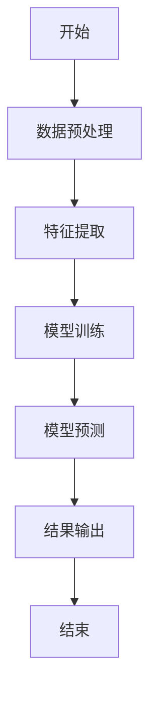
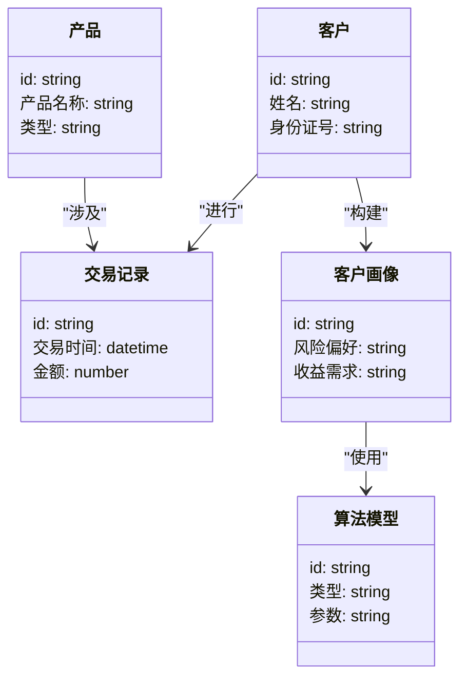
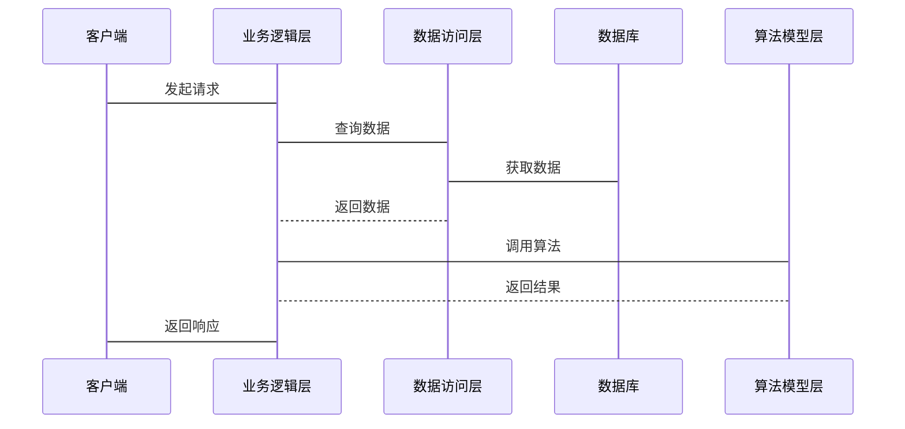

                 


# 金融产品客户生命周期管理平台

> 关键词：金融产品，客户生命周期，系统架构，算法原理，项目实战

> 摘要：本文详细探讨了金融产品客户生命周期管理平台的构建与实现。从背景介绍到系统架构设计，再到项目实战和最佳实践，系统地分析了该平台的核心概念、算法原理和实际应用。通过本文，读者将能够全面理解金融产品客户生命周期管理的理论与实践，掌握平台的设计与实现方法。

---

# 第一部分: 金融产品客户生命周期管理平台概述

# 第1章: 金融产品客户生命周期管理平台背景

## 1.1 金融产品与客户生命周期管理概述

### 1.1.1 金融产品的定义与分类

- 金融产品的定义：金融产品是指金融机构提供的各种服务或工具，用于满足客户的资金需求、投资需求或风险管理需求。常见的金融产品包括存款、贷款、基金、保险、股票、债券等。

- 金融产品的分类：根据功能和用途的不同，金融产品可以分为以下几类：
  - 负债类：如存款、债券等。
  - 资产权益类：如股票、基金等。
  - 保险类：如人寿保险、财产保险等。
  - 衍生品类：如期货、期权等。

### 1.1.2 客户生命周期管理的定义与意义

- 客户生命周期管理的定义：客户生命周期管理是指通过对客户在整个生命周期中的行为、需求和偏好进行分析和管理，以优化客户关系、提高客户满意度和忠诚度的过程。

- 客户生命周期管理的意义：
  - 提高客户 retention 率。
  - 提高客户 lifetime value (LTV)。
  - 提供个性化服务，增强客户体验。
  - 优化资源配置，降低运营成本。

### 1.1.3 金融产品客户生命周期管理的必要性

- 金融产品客户生命周期管理的必要性：
  - 金融产品具有复杂性和风险性，需要通过客户生命周期管理来控制风险。
  - 客户需求具有多样性和变化性，需要通过客户生命周期管理来精准匹配产品和服务。
  - 金融机构需要通过客户生命周期管理来提高客户忠诚度和满意度，从而增强市场竞争力。

## 1.2 问题背景与问题描述

### 1.2.1 传统金融产品管理的痛点

- 传统金融产品管理的痛点：
  - 产品同质化严重，难以满足客户的个性化需求。
  - 产品信息不透明，客户难以选择适合自己的产品。
  - 缺乏客户数据分析能力，难以精准匹配客户需求。
  - 风险控制能力不足，容易导致客户流失或财务损失。

### 1.2.2 客户生命周期管理的挑战

- 客户生命周期管理的挑战：
  - 客户数据分散，难以整合和分析。
  - 客户需求变化快，难以及时调整产品和服务策略。
  - 客户体验不足，难以提升客户忠诚度和满意度。
  - 风险控制能力不足，难以应对复杂的市场环境。

### 1.2.3 问题解决的思路与目标

- 问题解决的思路：
  - 建立客户生命周期管理系统，整合客户数据，分析客户需求，优化产品匹配。
  - 通过大数据和人工智能技术，提高客户画像的准确性和产品推荐的精准性。
  - 实现客户分层管理，提供个性化服务，提升客户体验和满意度。

- 问题解决的目标：
  - 提高客户 retention 率和忠诚度。
  - 提高产品推荐的精准性和客户满意度。
  - 降低运营成本，提高机构的市场竞争力。

## 1.3 问题解决与边界定义

### 1.3.1 解决方案的核心思路

- 解决方案的核心思路：
  - 建立客户生命周期管理系统，整合客户数据，分析客户需求，优化产品匹配。
  - 通过大数据和人工智能技术，提高客户画像的准确性和产品推荐的精准性。
  - 实现客户分层管理，提供个性化服务，提升客户体验和满意度。

### 1.3.2 系统的边界与外延

- 系统的边界与外延：
  - 系统边界：金融产品客户生命周期管理系统仅关注客户和产品的生命周期管理，不涉及其他业务模块。
  - 系统外延：系统可以通过接口与其他系统（如 CRM、ERP）集成，扩展功能。

### 1.3.3 核心要素与组成分析

- 核心要素与组成分析：
  - 客户数据：包括客户基本信息、交易记录、资产配置、风险偏好等。
  - 产品数据：包括产品基本信息、产品属性、产品风险等级等。
  - 算法模型：包括客户画像构建算法、产品推荐算法、风险评估与预警算法等。
  - 系统架构：包括数据层、业务逻辑层、用户界面层等。

## 1.4 本章小结

- 本章小结：
  - 介绍了金融产品和客户生命周期管理的定义与意义。
  - 分析了传统金融产品管理的痛点和客户生命周期管理的挑战。
  - 提出了问题解决的思路与目标，并界定了系统的边界与核心要素。

---

# 第二部分: 核心概念与联系

# 第2章: 核心概念与关联分析

## 2.1 核心概念原理

### 2.1.1 金融产品生命周期模型

- 金融产品生命周期模型：
  - 产品设计：根据市场需求设计产品。
  - 产品推广：通过营销渠道推广产品。
  - 产品运营：监控产品运行情况，优化产品参数。
  - 产品终止：根据市场反馈终止产品。

### 2.1.2 客户生命周期模型

- 客户生命周期模型：
  - 获取阶段：吸引新客户。
  - 转化阶段：将潜在客户转化为实际客户。
  - 保留阶段：保持客户忠诚度。
  - 增值阶段：提高客户的 lifetime value (LTV)。

### 2.1.3 两者结合的管理机制

- 两者结合的管理机制：
  - 通过客户生命周期管理，优化金融产品的设计和推广。
  - 通过金融产品的生命周期管理，提升客户体验和满意度。

## 2.2 核心概念属性特征对比

### 2.2.1 金融产品的属性特征

- 金融产品的属性特征：
  - 风险性：产品的风险高低。
  - 收益性：产品的预期收益。
  - 流动性：产品的流动性高低。
  - 复杂性：产品的复杂程度。

### 2.2.2 客户的属性特征

- 客户的属性特征：
  - 风险偏好：客户对风险的承受能力。
  - 收益需求：客户对收益的需求。
  - 生命周期阶段：客户所处的生命周期阶段。
  - 行为特征：客户的消费习惯和行为模式。

### 2.2.3 两者特征的对比分析

- 两者特征的对比分析：
  - 金融产品的风险性和收益性直接影响客户的决策。
  - 客户的风险偏好和收益需求影响金融产品的选择。
  - 金融产品的生命周期与客户的生命周期相互影响。

## 2.3 ER实体关系图

- ER实体关系图：
```mermaid
er
    actor 客户 {
        id: string
        姓名: string
        身份证号: string
    }
    actor 产品 {
        id: string
        产品名称: string
        类型: string
    }
    actor 交易记录 {
        id: string
        交易时间: datetime
        金额: number
    }
    客户 --> 交易记录: "进行"
    产品 --> 交易记录: "涉及"
```

## 2.4 本章小结

- 本章小结：
  - 介绍了金融产品生命周期模型和客户生命周期模型的核心概念。
  - 分析了金融产品和客户的属性特征，并通过对比分析揭示了两者之间的关系。
  - 通过 ER 实体关系图展示了金融产品客户生命周期管理平台的核心数据模型。

---

# 第三部分: 算法原理讲解

# 第3章: 算法原理与实现

## 3.1 算法原理概述

### 3.1.1 客户画像构建算法

- 客户画像构建算法：
  - 数据收集：收集客户的基本信息、交易记录、资产配置、风险偏好等数据。
  - 数据分析：通过数据分析工具（如 Python、Pandas）对数据进行清洗、转换和分析。
  - 数据建模：利用机器学习算法（如聚类分析、决策树）对客户进行分类，构建客户画像。

### 3.1.2 产品推荐算法

- 产品推荐算法：
  - 数据收集：收集客户的画像信息和产品的属性信息。
  - 数据分析：通过协同过滤、内容推荐等方法分析客户与产品之间的关联性。
  - 算法实现：利用推荐算法（如基于用户的协同过滤、基于物品的协同过滤）生成推荐列表。

### 3.1.3 风险评估与预警算法

- 风险评估与预警算法：
  - 数据收集：收集客户的基本信息、交易记录、资产配置、产品持有情况等数据。
  - 数据分析：通过统计分析和机器学习算法（如逻辑回归、随机森林）建立风险评估模型。
  - 算法实现：根据模型预测客户的风险等级，并设置预警机制。

## 3.2 算法流程图

### 3.2.1 客户画像构建算法流程图



### 3.2.2 产品推荐算法流程图


### 3.2.3 风险评估与预警算法流程图


## 3.3 算法实现代码

### 3.3.1 客户画像构建算法实现

```python
import pandas as pd
from sklearn.cluster import KMeans

# 数据预处理
data = pd.read_csv('customer_data.csv')
data = data.dropna()
data = pd.get_dummies(data)

# 模型训练
model = KMeans(n_clusters=3)
model.fit(data)

# 模型预测
labels = model.predict(data)
```

### 3.3.2 产品推荐算法实现

```python
from sklearn.metrics.pairwise import cosine_similarity

# 数据预处理
product_data = pd.read_csv('product_data.csv')
product_data = product_data.dropna()
product_data = pd.get_dummies(product_data)

# 模型训练
similarity_matrix = cosine_similarity(product_data)

# 模型预测
def recommend_product(customer_id):
    similarity_scores = similarity_matrix[customer_id]
    top_indices = similarity_scores.argsort()[-3:][::-1]
    recommended_products = product_data.iloc[top_indices]['product_name']
    return recommended_products
```

### 3.3.3 风险评估与预警算法实现

```python
from sklearn.linear_model import LogisticRegression

# 数据预处理
risk_data = pd.read_csv('risk_data.csv')
risk_data = risk_data.dropna()
risk_data = pd.get_dummies(risk_data)

# 模型训练
model = LogisticRegression()
model.fit(risk_data.drop('risk_level', axis=1), risk_data['risk_level'])

# 模型预测
def predict_risk(customer_id):
    customer_features = risk_data[risk_data['customer_id'] == customer_id].drop('risk_level', axis=1)
    risk_level = model.predict(customer_features)
    return risk_level
```

## 3.4 本章小结

- 本章小结：
  - 介绍了客户画像构建、产品推荐和风险评估与预警的核心算法。
  - 通过流程图和代码示例展示了算法的实现步骤。
  - 强调了算法在金融产品客户生命周期管理中的重要性。

---

# 第四部分: 系统分析与架构设计方案

# 第4章: 系统分析与架构设计方案

## 4.1 问题场景介绍

- 问题场景介绍：
  - 金融机构需要通过客户生命周期管理平台优化客户体验和产品推荐。
  - 通过数据分析和人工智能技术，实现客户画像构建、产品推荐和风险评估。
  - 提供个性化的客户服务，提高客户满意度和忠诚度。

## 4.2 项目介绍

- 项目介绍：
  - 项目目标：构建金融产品客户生命周期管理平台，实现客户画像构建、产品推荐和风险评估。
  - 项目范围：包括客户数据管理、产品数据管理、算法模型开发、系统架构设计等。
  - 项目利益相关者：金融机构、客户、开发团队等。

## 4.3 系统功能设计

### 4.3.1 领域模型 mermaid 类图



### 4.3.2 系统架构设计 mermaid 架构图

```mermaid
archi
    客户端 --> 业务逻辑层: HTTP 请求
    业务逻辑层 --> 数据访问层: 数据库操作
    数据访问层 --> 数据库: 数据存储
    业务逻辑层 --> 算法模型层: 算法调用
    算法模型层 --> 数据分析层: 数据处理
    数据分析层 --> 数据存储层: 数据存储
```

### 4.3.3 系统接口设计

- 系统接口设计：
  - 客户端接口：API 接口用于与前端交互。
  - 数据访问层接口：数据库操作接口。
  - 算法模型层接口：算法调用接口。

### 4.3.4 系统交互 mermaid 序列图



## 4.4 本章小结

- 本章小结：
  - 介绍了金融产品客户生命周期管理平台的系统架构设计。
  - 通过领域模型、架构图和交互序列图展示了系统的整体结构和工作流程。

---

# 第五部分: 项目实战

# 第5章: 项目实战

## 5.1 环境安装与配置

### 5.1.1 环境要求

- 环境要求：
  - 操作系统：Linux/Windows/MacOS。
  - 开发工具：PyCharm、VS Code等。
  - 数据库：MySQL、PostgreSQL等。
  - 依赖库：Python、Pandas、Scikit-learn、Flask等。

### 5.1.2 安装步骤

- 安装步骤：
  1. 安装 Python 和 pip。
  2. 安装所需的依赖库：`pip install numpy pandas scikit-learn flask`.
  3. 安装数据库：根据选择的数据库类型安装相应的数据库管理工具。

## 5.2 系统核心实现源代码

### 5.2.1 客户画像构建代码

```python
import pandas as pd
from sklearn.cluster import KMeans

# 数据预处理
data = pd.read_csv('customer_data.csv')
data = data.dropna()
data = pd.get_dummies(data)

# 模型训练
model = KMeans(n_clusters=3)
model.fit(data)

# 模型预测
labels = model.predict(data)
```

### 5.2.2 产品推荐代码

```python
from sklearn.metrics.pairwise import cosine_similarity

# 数据预处理
product_data = pd.read_csv('product_data.csv')
product_data = product_data.dropna()
product_data = pd.get_dummies(product_data)

# 模型训练
similarity_matrix = cosine_similarity(product_data)

# 模型预测
def recommend_product(customer_id):
    similarity_scores = similarity_matrix[customer_id]
    top_indices = similarity_scores.argsort()[-3:][::-1]
    recommended_products = product_data.iloc[top_indices]['product_name']
    return recommended_products
```

### 5.2.3 风险评估与预警代码

```python
from sklearn.linear_model import LogisticRegression

# 数据预处理
risk_data = pd.read_csv('risk_data.csv')
risk_data = risk_data.dropna()
risk_data = pd.get_dummies(risk_data)

# 模型训练
model = LogisticRegression()
model.fit(risk_data.drop('risk_level', axis=1), risk_data['risk_level'])

# 模型预测
def predict_risk(customer_id):
    customer_features = risk_data[risk_data['customer_id'] == customer_id].drop('risk_level', axis=1)
    risk_level = model.predict(customer_features)
    return risk_level
```

## 5.3 代码应用解读与分析

- 代码应用解读与分析：
  - 客户画像构建代码：通过 KMeans 算法对客户进行聚类分析，构建客户画像。
  - 产品推荐代码：通过协同过滤算法生成产品推荐列表。
  - 风险评估与预警代码：通过逻辑回归算法预测客户的风险等级，并设置预警机制。

## 5.4 实际案例分析和详细讲解剖析

### 5.4.1 案例分析

- 案例分析：
  - 某银行希望通过客户生命周期管理平台优化客户体验和产品推荐。
  - 通过客户画像构建算法，将客户分为高净值客户、中端客户和低端客户。
  - 根据客户的风险偏好和收益需求，推荐相应的金融产品。
  - 通过风险评估与预警算法，预测客户的风险等级，并进行预警。

### 5.4.2 详细讲解剖析

- 详细讲解剖析：
  - 客户画像构建：通过数据分析工具对客户数据进行清洗、转换和分析，利用 KMeans 算法对客户进行聚类分析，构建客户画像。
  - 产品推荐：通过协同过滤算法分析客户与产品之间的关联性，生成产品推荐列表。
  - 风险评估与预警：通过逻辑回归算法预测客户的风险等级，并设置预警机制。

## 5.5 项目小结

- 项目小结：
  - 介绍了金融产品客户生命周期管理平台的项目实战过程。
  - 通过代码实现和案例分析展示了算法在实际中的应用。
  - 强调了项目实战在理论与实践结合中的重要性。

---

# 第六部分: 最佳实践、小结、注意事项、拓展阅读

# 第6章: 最佳实践与总结

## 6.1 最佳实践 tips

### 6.1.1 系统设计 tips

- 系统设计 tips：
  - 系统架构设计要模块化，便于后续扩展和维护。
  - 数据库设计要规范化，避免数据冗余和不一致。
  - 系统接口设计要标准化，便于与其他系统集成。

### 6.1.2 算法实现 tips

- 算法实现 tips：
  - 算法选择要根据数据特点和业务需求进行，避免盲目追求复杂算法。
  - 数据预处理要仔细，避免数据噪声对模型的影响。
  - 模型调优要结合业务需求，进行适当的参数调整和优化。

## 6.2 小结

- 小结：
  - 本文详细探讨了金融产品客户生命周期管理平台的构建与实现。
  - 从背景介绍到系统架构设计，再到项目实战和最佳实践，系统地分析了该平台的核心概念、算法原理和实际应用。

## 6.3 注意事项

- 注意事项：
  - 数据隐私和安全问题：金融数据涉及客户隐私，需严格遵守相关法律法规。
  - 算法的可解释性：金融产品推荐和风险评估需要算法具有较高的可解释性，避免“黑箱”模型。
  - 系统的稳定性与可靠性：金融系统需要高可用性和稳定性，避免因系统故障导致客户损失。

## 6.4 拓展阅读

- 拓展阅读：
  - 《金融产品设计与创新》：了解金融产品的设计和创新方法。
  - 《客户关系管理》：深入理解客户生命周期管理的理论与实践。
  - 《机器学习实战》：掌握机器学习算法的实现与应用。

## 6.5 本章小结

- 本章小结：
  - 总结了金融产品客户生命周期管理平台的最佳实践。
  - 强调了系统设计和算法实现中的注意事项。
  - 提供了拓展阅读的建议，帮助读者进一步深入学习相关知识。

---

# 结语

金融产品客户生命周期管理平台的构建与实现是一项复杂的系统工程，涉及金融、数据科学和软件工程等多个领域的知识。通过本文的详细探讨，读者可以全面理解该平台的核心概念、算法原理和实际应用。未来，随着人工智能和大数据技术的不断发展，金融产品客户生命周期管理平台将更加智能化和个性化，为金融机构和客户带来更大的价值。

作者：AI天才研究院/AI Genius Institute & 禅与计算机程序设计艺术 /Zen And The Art of Computer Programming

