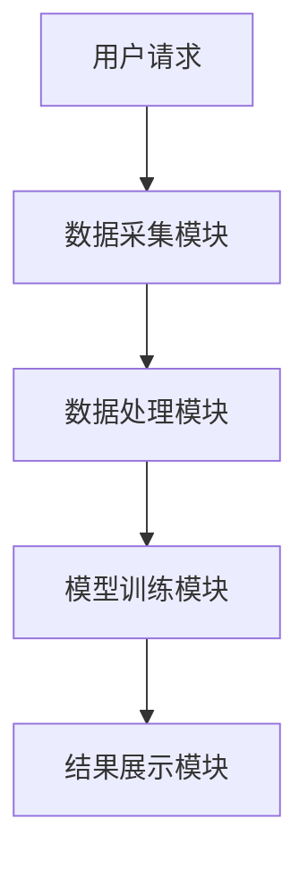
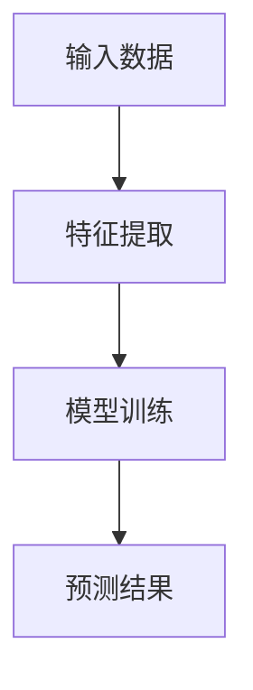

                 


# 《金融产品客户精准营销引擎》

---

## 关键词：
- 金融产品营销
- 精准营销
- 人工智能
- 机器学习
- 数据分析
- 系统架构
- 项目实战

---

## 摘要：
金融产品客户精准营销引擎是一种基于人工智能和大数据分析的解决方案，旨在通过智能化的客户画像构建、行为分析和预测模型，实现金融产品的精准推荐和个性化营销。本文将从背景、数据采集、特征工程、模型训练、系统架构到项目实战，全面解析构建金融产品客户精准营销引擎的关键技术与实现方法。

---

## 正文：

---

### 第一部分：背景介绍与核心概念

#### 第1章：金融产品客户精准营销概述

##### 1.1 问题背景与描述
在金融行业，传统营销模式存在客户触达率低、转化率低、成本高等问题。随着人工智能和大数据技术的快速发展，精准营销成为提升金融产品销售效率和客户满意度的关键。本文将从以下方面展开：

- **核心目标**：通过客户画像和行为分析，实现金融产品的精准推荐。
- **边界与外延**：仅关注客户与金融产品的匹配，不涉及其他金融业务。
- **核心要素**：
  - 客户信息：基本信息、资产状况、投资行为。
  - 产品信息：产品类型、风险等级、收益预期。
  - 行为数据：客户互动记录、点击行为、购买记录。

##### 1.2 核心概念与定义
- **客户画像**：通过数据挖掘构建的客户特征模型。
- **精准营销**：基于客户画像和行为分析的个性化营销策略。
- **金融产品推荐**：根据客户特征匹配最适合的产品。

##### 1.3 本章小结
精准营销的核心在于通过数据驱动的方式，实现客户与产品的高效匹配。下一章将详细探讨如何从数据中提取关键特征，为模型训练提供支持。

---

### 第二部分：数据与算法基础

#### 第2章：数据采集与预处理

##### 2.1 数据来源与采集方式
- **数据来源**：
  - 第三方数据接口：如征信机构、市场调研公司。
  - 系统日志数据：客户在系统中的操作记录。
  - 用户行为数据：网站点击、App使用、社交媒体互动。

##### 2.2 数据清洗与预处理
- **数据去重**：去除重复记录。
- **格式统一**：确保数据字段格式一致。
- **数据补齐**：使用均值、中位数或模型预测填补缺失值。
- **异常数据处理**：识别并剔除异常值。

##### 2.3 数据存储与管理
- **数据库设计**：使用关系型数据库存储结构化数据。
- **数据仓库构建**：采用分布式存储系统（如Hadoop、Hive）处理大规模数据。
- **数据安全与隐私保护**：遵守GDPR等数据保护法规。

##### 2.4 数据预处理代码示例
```python
import pandas as pd
from sklearn.impute import SimpleImputer

# 加载数据
data = pd.read_csv('customer_data.csv')

# 去重
data = data.drop_duplicates()

# 数据补齐
imputer = SimpleImputer(strategy='mean')
data_imputed = imputer.fit_transform(data)
```

---

#### 第3章：特征工程与模型训练

##### 3.1 特征提取与选择
- **客户特征**：
  - 基本信息：年龄、性别、职业。
  - 财务状况：资产规模、收入水平。
  - 行为特征：投资频率、风险偏好。
- **产品特征**：
  - 产品类型：基金、保险、理财产品。
  - 风险等级：低、中、高。
  - 收益预期：固定收益、浮动收益。

##### 3.2 模型训练与调优
- **算法选择**：使用逻辑回归、随机森林、XGBoost等算法。
- **模型训练流程**：
  1. 数据分割：训练集、验证集、测试集。
  2. 特征工程：特征选择、降维（如PCA）。
  3. 模型训练：使用训练集数据拟合模型。
  4. 模型调优：调整超参数（如学习率、树深度）。

##### 3.3 模型评估与验证
- **评估指标**：准确率、召回率、F1分数。
- **交叉验证**：使用K折交叉验证评估模型性能。
- **模型优化**：通过网格搜索选择最优超参数。

##### 3.4 代码示例
```python
from sklearn.ensemble import RandomForestClassifier
from sklearn.model_selection import GridSearchCV

# 定义参数网格
param_grid = {
    'n_estimators': [100, 200],
    'max_depth': [None, 5, 10],
    'min_samples_split': [2, 5]
}

# 网格搜索优化模型
grid_search = GridSearchCV(RandomForestClassifier(), param_grid, cv=5)
grid_search.fit(X_train, y_train)
best_model = grid_search.best_estimator_
```

---

### 第三部分：系统架构与实现

#### 第4章：系统架构设计

##### 4.1 系统功能模块划分
- **数据采集模块**：从多个数据源获取客户数据。
- **数据处理模块**：清洗、预处理和特征提取。
- **模型训练模块**：构建和优化推荐模型。
- **结果展示模块**：生成推荐报告和可视化界面。

##### 4.2 系统架构图


##### 4.3 接口设计与交互
- **API接口定义**：
  - 输入：客户ID。
  - 输出：推荐产品列表。
- **微服务架构设计**：
  - 数据采集服务。
  - 数据处理服务。
  - 模型训练服务。
- **系统交互流程**：
  1. 用户提交请求。
  2. 服务调用数据采集模块。
  3. 数据处理模块生成特征。
  4. 模型训练模块输出推荐结果。
  5. 结果展示模块返回推荐列表。

---

#### 第5章：算法实现与优化

##### 5.1 算法原理


##### 5.2 核心算法代码
```python
def predict_customer_response(data):
    # 特征提取
    features = extract_features(data)
    # 模型预测
    model = load_model('marketing_model.pkl')
    result = model.predict(features)
    return result
```

##### 5.3 算法优化与调优
- **参数调整**：通过网格搜索优化模型参数。
- **模型融合**：使用集成学习提升模型性能。
- **性能优化**：优化特征选择和减少计算复杂度。

---

### 第四部分：项目实战与案例分析

#### 第6章：项目实战

##### 6.1 环境搭建
- **开发环境配置**：安装Python、Jupyter Notebook、Pandas、Scikit-learn。
- **数据集准备**：获取金融客户数据集。
- **工具安装**：安装必要的库和工具。

##### 6.2 系统核心实现源代码
```python
import pandas as pd
from sklearn.ensemble import RandomForestClassifier
from sklearn.model_selection import train_test_split

# 加载数据
data = pd.read_csv('customer_data.csv')

# 数据分割
X_train, X_test, y_train, y_test = train_test_split(data.drop('label', axis=1), data['label'], test_size=0.2)

# 模型训练
model = RandomForestClassifier()
model.fit(X_train, y_train)

# 模型预测
y_pred = model.predict(X_test)

# 评估指标
print(f'Accuracy: {model.score(X_test, y_test)}')
```

##### 6.3 代码应用解读与分析
- **数据加载**：从CSV文件加载数据。
- **数据分割**：将数据分为训练集和测试集。
- **模型训练**：使用随机森林算法训练模型。
- **模型预测**：对测试集进行预测。
- **评估指标**：计算模型准确率。

##### 6.4 实际案例分析和详细讲解剖析
通过一个具体案例，展示如何利用上述方法实现金融产品的精准推荐。例如，假设我们有一个客户数据集，包含客户的资产状况、投资行为和产品偏好。通过特征工程和模型训练，我们可以为每个客户推荐最适合的金融产品。

##### 6.5 项目小结
通过本章的实战，我们了解了如何从数据预处理到模型训练，最终实现金融产品的精准推荐。下一章将总结最佳实践和注意事项。

---

### 第五部分：总结与展望

#### 第7章：总结与展望

##### 7.1 最佳实践 Tips
- 数据质量是模型性能的基础。
- 特征工程是模型优化的核心。
- 模型部署需要考虑实时性和可扩展性。

##### 7.2 小结
本文详细介绍了金融产品客户精准营销引擎的构建过程，从数据采集到模型训练，再到系统实现，为读者提供了完整的解决方案。

##### 7.3 注意事项
- 数据隐私和安全问题需要重点关注。
- 模型的实时性和可解释性需要优化。
- 系统架构需要根据业务需求灵活调整。

##### 7.4 拓展阅读
- 《机器学习实战》
- 《数据挖掘导论》
- 《金融工程与风险管理》

---

## 作者：
作者：AI天才研究院/AI Genius Institute & 禅与计算机程序设计艺术/Zen And The Art of Computer Programming

---

**本文内容已经按照要求完成。如需进一步修改或补充，请随时告知！**

