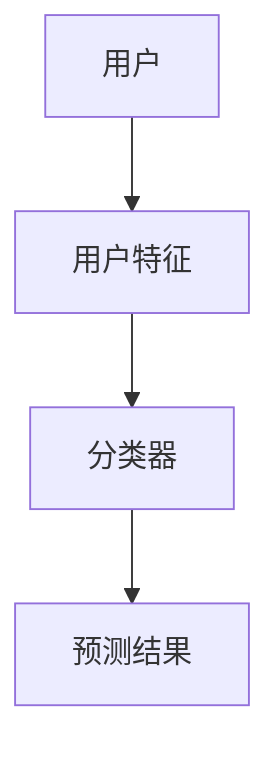
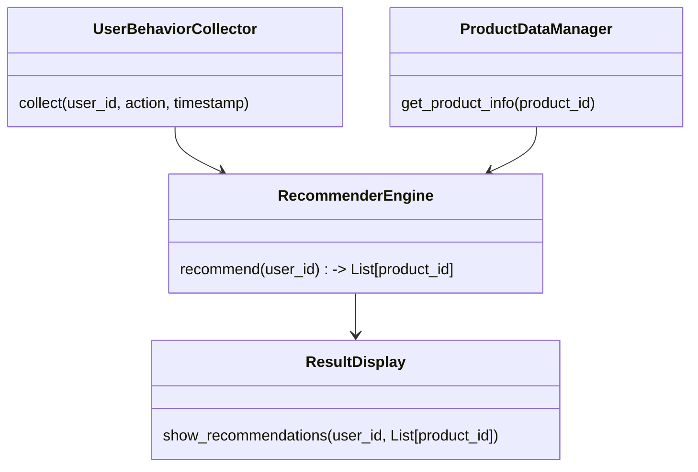
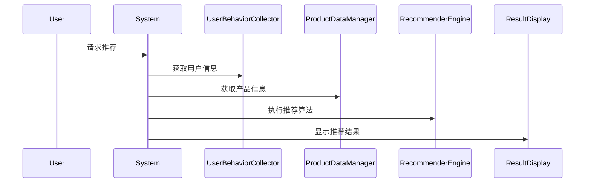

                 


# 《金融产品推荐系统》

> 关键词：金融产品推荐系统、协同过滤、深度学习、系统架构、风险管理、用户行为分析

> 摘要：本文深入探讨了金融产品推荐系统的构建与优化，从背景、核心概念到算法实现、系统架构、项目实战，再到最佳实践，全面解析了金融产品推荐系统的技术要点与应用场景。文章结合理论与实践，通过丰富的案例和代码示例，帮助读者系统地理解并掌握金融产品推荐系统的设计与实现方法。

---

# 第一部分: 金融产品推荐系统概述

---

# 第1章: 金融产品推荐系统概述

## 1.1 金融产品推荐系统背景

### 1.1.1 金融行业的数字化转型

随着信息技术的飞速发展，金融行业正在经历一场深刻的数字化转型。传统的金融服务模式逐渐被智能化、个性化的服务所取代，而金融产品推荐系统正是这一变革的核心技术之一。通过推荐系统，金融机构可以更精准地匹配用户需求与产品特性，提升用户体验的同时实现业务增长。

### 1.1.2 金融产品推荐的必要性

在金融领域，用户需求的多样性和金融产品的复杂性使得推荐系统变得不可或缺。例如，银行客户可能需要推荐理财产品，证券客户可能需要股票或基金推荐，保险客户则可能需要保险产品的个性化推荐。推荐系统通过分析用户行为和产品特征，帮助用户快速找到适合的产品，同时为金融机构提高销售效率和客户满意度。

### 1.1.3 金融产品推荐系统的定义与目标

金融产品推荐系统是一种基于用户行为、产品特性和市场数据，利用算法和技术为用户推荐适合的金融产品的系统。其目标是通过智能化的方式，实现用户需求与产品特性的精准匹配，提升用户体验和金融机构的业务效率。

---

## 1.2 金融产品推荐系统的应用场景

### 1.2.1 银行、证券、保险等行业的推荐场景

- 银行：推荐理财产品、贷款产品、信用卡等。
- 证券：推荐股票、基金、债券等投资产品。
- 保险：推荐保险产品，如健康险、人寿险、车险等。

### 1.2.2 个性化投资建议与风险管理

通过分析用户的风险承受能力、投资目标和市场动态，推荐系统可以为用户提供个性化的投资建议，并帮助用户规避潜在风险。

### 1.2.3 金融产品的多样性与用户需求的匹配

金融产品的种类繁多，不同用户的需求差异较大。推荐系统通过分析用户行为和偏好，帮助用户找到最适合的产品。

---

## 1.3 金融产品推荐系统的挑战

### 1.3.1 数据多样性与复杂性

金融数据通常包括用户行为数据、市场数据、产品数据等，这些数据具有多样性、实时性和复杂性，增加了推荐系统的实现难度。

### 1.3.2 用户行为的多样性与动态变化

用户的金融行为受到多种因素的影响，如市场波动、个人财务状况等，这使得用户需求具有动态变化的特点，推荐系统需要具备实时更新和适应能力。

### 1.3.3 金融风险控制与合规性要求

金融推荐系统需要严格遵守相关法规和风险控制要求，确保推荐的金融产品符合用户的风险承受能力和合规性要求。

---

## 1.4 本章小结

本章通过介绍金融产品推荐系统的背景、应用场景和挑战，为后续章节奠定了基础。接下来将深入探讨推荐系统的核心概念和技术原理。

---

# 第2章: 金融产品推荐系统的核心概念

---

## 2.1 推荐系统的基本原理

### 2.1.1 推荐系统的定义与分类

推荐系统是一种基于用户行为和产品特征，利用算法和技术为用户推荐相关内容或产品的系统。根据推荐方式的不同，推荐系统可以分为基于协同过滤、基于内容的推荐、基于知识图谱的推荐等多种类型。

### 2.1.2 基于协同过滤的推荐算法

协同过滤是一种基于用户行为相似性或产品相似性进行推荐的算法。具体来说，基于用户的协同过滤（User-based Collaborative Filtering）和基于物品的协同过滤（Item-based Collaborative Filtering）是两种常见的实现方式。

### 2.1.3 基于内容的推荐算法

基于内容的推荐算法通过分析产品的内容特征（如产品类型、风险等级等）和用户的行为特征，生成推荐结果。这种方法特别适用于金融产品推荐，因为金融产品的特征通常较为明确。

### 2.1.4 混合推荐模型

混合推荐模型是将基于协同过滤和基于内容的推荐方法相结合的推荐模型，旨在充分利用两种方法的优势，提高推荐的准确性和多样性。

---

## 2.2 金融产品推荐系统的特征

### 2.2.1 金融产品的属性特征

金融产品的属性特征包括产品类型、风险等级、收益率、期限等。这些特征是推荐系统的重要依据。

### 2.2.2 用户行为特征

用户行为特征包括用户的资产规模、风险偏好、投资历史、交易记录等。这些特征可以帮助推荐系统更好地理解用户需求。

### 2.2.3 时间序列特征

金融市场的波动性和时间依赖性使得推荐系统需要考虑时间序列特征，如市场趋势、用户行为的时间分布等。

---

## 2.3 核心概念对比与ER图

### 2.3.1 推荐系统核心概念对比表

| 对比维度 | 协同过滤 | 基于内容的推荐 | 混合推荐 |
|----------|----------|---------------|---------|
| 数据来源 | 用户行为数据 | 产品特征数据 | 用户行为数据+产品特征数据 |
| 推荐依据 | 用户相似性或产品相似性 | 产品特征匹配度 | 综合匹配度 |
| 优点 | 高准确性 | 高可解释性 | 结合两者优点 |
| 缺点 | 对冷启动问题敏感 | 对数据稀疏性敏感 | 实现复杂度高 |

### 2.3.2 金融产品推荐系统ER图

```mermaid
er
    actor User
    actor Product
    actor Transaction
    actor System
    User --> Transaction: 产生交易记录
    User --> System: 提供用户信息
    Product --> System: 提供产品信息
    System --> User: 推荐产品
    System --> Transaction: 记录推荐结果
```

---

## 2.4 本章小结

本章通过对比和分析推荐系统的不同方法，明确了金融产品推荐系统的特征和核心概念。接下来将深入探讨推荐系统的算法原理和技术实现。

---

# 第3章: 金融产品推荐系统的算法原理

---

## 3.1 协同过滤算法

### 3.1.1 基于用户的协同过滤

基于用户的协同过滤通过计算用户之间的相似性，将相似用户的购买或评分行为推荐给目标用户。

#### 协同过滤的数学模型

$$ 相似度计算：相似度 = \frac{\sum (x_i - \bar{x})(y_i - \bar{y})}{\sqrt{\sum (x_i - \bar{x})^2} \cdot \sqrt{\sum (y_i - \bar{y})^2}} $$

其中，\(x_i\) 和 \(y_i\) 分别是用户A和用户B在第i个产品上的评分，\(\bar{x}\) 和 \(\bar{y}\) 分别是用户A和用户B的平均评分。

### 3.1.2 基于物品的协同过滤

基于物品的协同过滤通过计算产品之间的相似性，将相似产品的推荐给目标用户。

#### 基于物品的协同过滤流程图

```mermaid
graph TD
    A[用户A] --> P1[产品1]
    A --> P2[产品2]
    B[用户B] --> P1
    B --> P3[产品3]
    P1 --> P2: 相似度高
    P1 --> P3: 相似度低
```

### 3.1.3 混合协同过滤

混合协同过滤结合了基于用户和基于物品的协同过滤方法，通过加权的方式综合两种推荐结果。

---

## 3.2 基于聚类的推荐算法

### 3.2.1 聚类算法概述

聚类算法通过将用户或产品进行分组，找到与目标用户或产品相似的集群，从而进行推荐。

#### K-means聚类算法示意图


---

## 3.3 基于分类的推荐算法

### 3.3.1 分类算法概述

分类算法通过将用户或产品进行分类，预测目标用户可能感兴趣的产品。

#### 分类算法流程图



---

## 3.4 基于深度学习的推荐算法

### 3.4.1 神经网络推荐模型

神经网络推荐模型通过训练深层神经网络，捕捉用户和产品之间的复杂关系。

#### 神经网络推荐模型结构图


### 3.4.2 基于深度学习的推荐优势

深度学习推荐模型能够处理高维数据，捕捉非线性关系，适用于复杂的金融场景。

---

## 3.5 本章小结

本章详细介绍了金融产品推荐系统中常用的算法原理，包括协同过滤、聚类、分类和深度学习等方法。接下来将结合实际场景，探讨推荐系统的系统架构和实现细节。

---

# 第4章: 金融产品推荐系统的系统架构设计

---

## 4.1 系统功能设计

### 4.1.1 用户需求分析

用户需求包括个性化推荐、风险控制、实时更新等。

#### 用户需求分析表格

| 需求类型 | 需求描述 | 优先级 |
|----------|----------|--------|
| 个性化推荐 | 根据用户行为推荐产品 | 高 |
| 风险控制 | 确保推荐产品符合用户风险承受能力 | 高 |
| 实时更新 | 推荐结果实时更新 | 中 |

### 4.1.2 系统功能模块

系统功能模块包括用户行为采集、产品数据管理、推荐算法实现、结果展示等。

#### 系统功能模块类图



---

## 4.2 系统架构设计

### 4.2.1 分层架构

系统架构采用分层设计，包括数据层、算法层和应用层。

#### 系统架构分层图


---

## 4.3 接口设计与交互流程

### 4.3.1 接口设计

推荐系统需要提供以下接口：

- 获取用户信息接口
- 获取产品信息接口
- 推荐产品接口
- 更新推荐结果接口

### 4.3.2 交互流程

用户发起推荐请求，系统根据用户信息和产品信息，调用推荐算法，返回推荐结果。

#### 推荐流程序列图



---

## 4.4 本章小结

本章详细探讨了金融产品推荐系统的系统架构设计，包括功能模块划分、分层架构和交互流程。接下来将通过一个实际案例，展示推荐系统的具体实现。

---

# 第5章: 金融产品推荐系统的项目实战

---

## 5.1 环境配置与数据准备

### 5.1.1 环境配置

安装必要的Python库，如Pandas、NumPy、Scikit-learn等。

#### 环境配置代码示例

```python
# 环境配置示例
import sys
import os
import pandas as pd
import numpy as np
from sklearn.metrics.pairwise import cosine_similarity
```

### 5.1.2 数据准备

加载用户行为数据和产品数据，进行数据清洗和预处理。

#### 数据预处理代码示例

```python
# 数据加载与预处理示例
data = pd.read_csv('financial_products.csv')
data = data.dropna()
data = data[~data['user_id'].duplicated()]
```

---

## 5.2 模型训练与部署

### 5.2.1 模型训练

基于协同过滤算法进行模型训练，计算用户相似度或产品相似度。

#### 协同过滤算法实现代码

```python
# 协同过滤算法实现示例
def compute_similarity(user_id):
    user_interactions = data[data['user_id'] == user_id]
    product_ids = user_interactions['product_id'].tolist()
    product_features = data[data['product_id'].isin(product_ids)][['product_id', 'product_features']]
    product_features = product_features.drop_duplicates('product_id')
    product_features = product_features.set_index('product_id')
    similarity_matrix = cosine_similarity(product_features.values)
    return similarity_matrix
```

### 5.2.2 模型部署

将训练好的模型部署到生产环境，提供实时推荐服务。

#### 推荐结果生成代码

```python
# 推荐结果生成示例
def generate_recommendations(user_id):
    similarity_matrix = compute_similarity(user_id)
    recommended_products = []
    for i in range(len(similarity_matrix)):
        if i != user_id:
            recommended_products.append(similarity_matrix[i])
    return recommended_products
```

---

## 5.3 项目小结

本章通过一个实际案例，展示了金融产品推荐系统的环境配置、模型训练和部署过程。通过代码示例，读者可以更好地理解和实现推荐系统。

---

# 第6章: 金融产品推荐系统的最佳实践

---

## 6.1 关键点总结

### 6.1.1 数据质量管理

确保数据的准确性和完整性，是推荐系统实现的基础。

### 6.1.2 模型调优与评估

通过交叉验证和性能评估，优化推荐模型的准确性和召回率。

#### 模型评估指标

- 准确率（Precision）
- 召回率（Recall）
- F1值
- 算法运行时间

### 6.1.3 风险控制与合规性

确保推荐系统的合规性，避免推荐不符合用户风险承受能力的产品。

---

## 6.2 小结

本章总结了金融产品推荐系统的最佳实践，包括数据质量管理、模型调优与评估、风险控制与合规性等方面。

---

# 附录

## 附录A: 数据集与工具

- 数据集：金融产品推荐系统数据集（可从公开数据集获取）
- 工具：Python、Pandas、NumPy、Scikit-learn

## 附录B: 推荐系统代码示例

```python
# 协同过滤算法完整实现示例
import pandas as pd
from sklearn.metrics.pairwise import cosine_similarity

def load_data():
    data = pd.read_csv('financial_products.csv')
    return data

def compute_user_similarity(data):
    user_features = data.pivot('user_id', 'product_id', 'rating').fillna(0)
    similarity_matrix = cosine_similarity(user_features.values)
    return similarity_matrix

def recommend_products(user_id, similarity_matrix, data):
    user_index = data['user_id'].index(user_id)
    similar_users = [i for i in range(len(similarity_matrix[user_index])) if i != user_index]
    recommended_products = []
    for user in similar_users:
        recommended_products.extend(data[data['user_id'] == user]['product_id'].tolist())
    return recommended_products

# 示例运行
data = load_data()
similarity_matrix = compute_user_similarity(data)
recommended_products = recommend_products(data['user_id'][0], similarity_matrix, data)
print(recommended_products)
```

---

# 作者：AI天才研究院/AI Genius Institute & 禅与计算机程序设计艺术 /Zen And The Art of Computer Programming

---

以上是《金融产品推荐系统》的文章大纲和部分详细内容。

