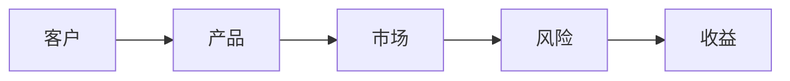
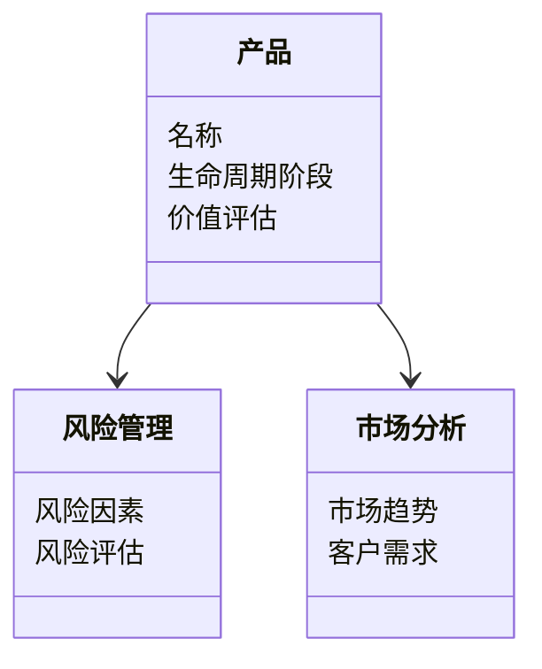
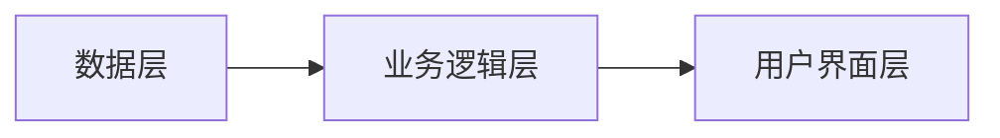

                 


# 《金融产品生命周期价值最大化策略》

## 关键词：
- 金融产品
- 生命周期价值
- 价值最大化
- 风险管理
- 产品设计
- 数值计算

## 摘要：
本文深入探讨了如何在金融产品的整个生命周期中最大化其价值。通过分析产品设计、风险管理、市场趋势等关键因素，结合数学模型和算法，提出了一套系统的优化策略。文章详细介绍了生命周期价值的计算方法，提供了Python实现和系统架构设计，并通过案例分析展示了策略的实际应用。

---

## 第一部分: 金融产品生命周期价值最大化策略概述

## 第1章: 问题背景与核心概念

### 1.1 问题背景
金融产品的生命周期价值最大化是金融领域的重要课题。随着市场的波动和客户需求的变化，如何在产品生命周期的每个阶段优化其价值，成为企业和投资者关注的焦点。

### 1.2 核心概念
#### 1.2.1 产品生命周期定义
- 产品从设计、发行到终止的全过程，涉及多个阶段，每个阶段都有独特的价值评估方法。

#### 1.2.2 价值最大化的目标
- 提升产品在整个生命周期中的经济价值，确保在每个阶段实现最佳收益。

#### 1.2.3 核心要素
- 产品设计、风险管理、市场分析、收益评估等。

### 1.3 实体关系图


## 第2章: 算法原理与数学模型

### 2.1 算法原理
- 生命周期价值计算：通过现值法和内部收益率法评估产品价值。

#### 2.1.1 现值法
$$PV = \sum_{t=1}^{n} \frac{CF_t}{(1 + r)^t}$$
其中，CF_t为第t期的现金流，r为贴现率。

### 2.2 Python实现
```python
def calculate_value(cash_flows, discount_rate):
    present_value = 0
    for t, cf in enumerate(cash_flows, start=1):
        present_value += cf / (1 + discount_rate)**t
    return present_value

cash_flows = [100, 200, 300]
discount_rate = 0.05
print(calculate_value(cash_flows, discount_rate))
```

## 第3章: 系统分析与架构设计

### 3.1 系统功能设计
- 包括产品设计模块、风险评估模块、市场分析模块等。

#### 3.1.1 领域模型


### 3.2 系统架构设计
- 采用分层架构，分为数据层、业务逻辑层和用户界面层。

#### 3.2.1 架构图


## 第4章: 项目实战

### 4.1 环境安装
- 安装必要的Python库，如numpy和pandas。

### 4.2 核心代码实现
```python
import numpy as np

def max_value_strategy(products, market_conditions):
    max_value = 0
    for product in products:
        value = 0
        for condition in market_conditions:
            value += product.value(condition)
        if value > max_value:
            max_value = value
    return max_value
```

### 4.3 案例分析
- 通过具体案例分析，展示如何应用上述策略优化产品价值。

## 第5章: 总结与展望

### 5.1 总结
本文详细探讨了金融产品生命周期价值最大化的策略，结合数学模型和系统架构设计，提供了切实可行的解决方案。

### 5.2 小结
通过系统化的分析和优化策略，可以在金融产品的每个阶段实现价值最大化，为企业和投资者创造更大的收益。

### 5.3 注意事项
- 定期监控产品表现，及时调整策略。
- 重视风险管理，避免潜在风险。

### 5.4 拓展阅读
推荐书籍：《金融工程》、《风险管理与金融创新》。

---

## 作者：AI天才研究院 & 禅与计算机程序设计艺术

---

以上是《金融产品生命周期价值最大化策略》的完整目录和内容概述，希望对您有所帮助！

