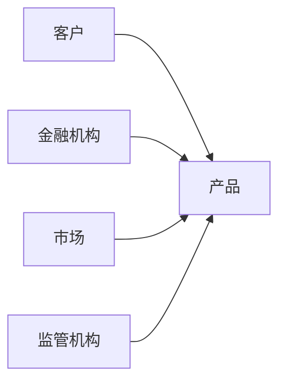
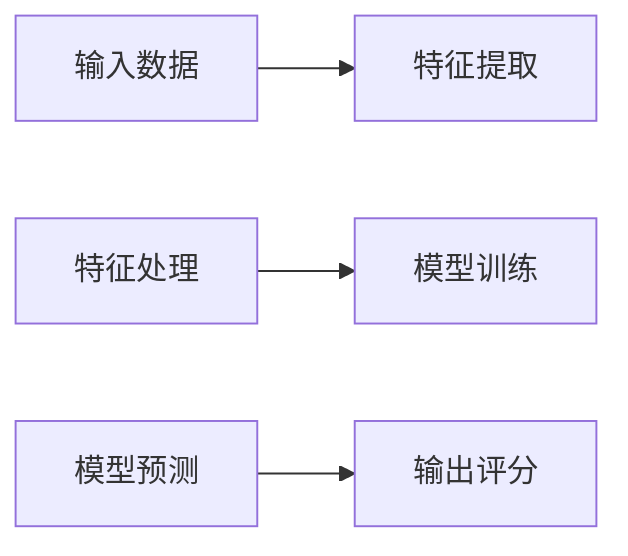
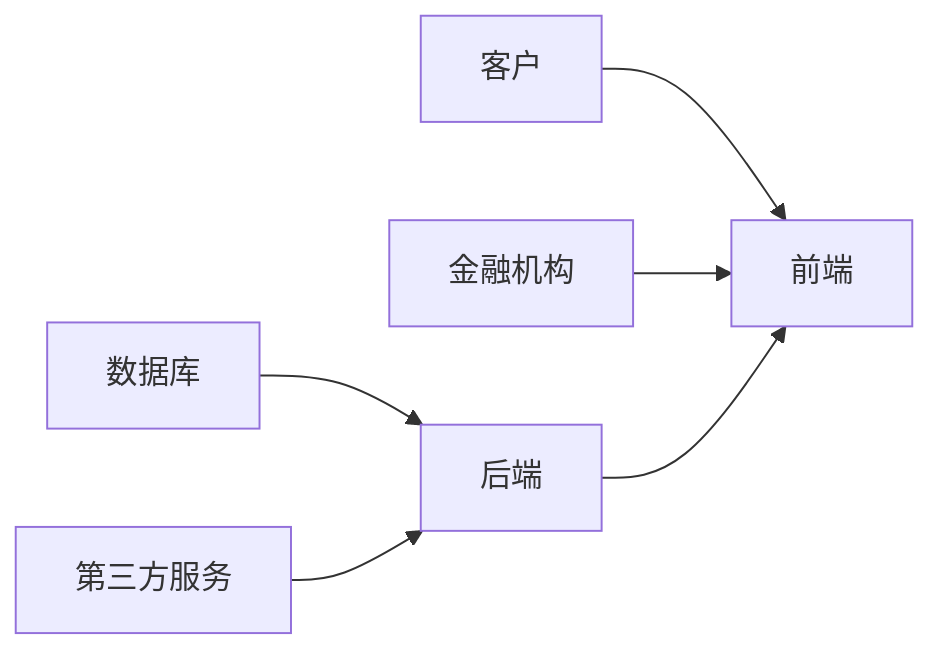

                 


# 金融产品生命周期管理

## 关键词
金融产品生命周期、风险管理、系统架构、评分模型、项目实战

## 摘要
本文详细探讨了金融产品生命周期管理的核心概念、算法原理、系统架构设计和项目实战。从背景介绍到数学模型，从风险评分算法到系统设计，结合实际案例和代码实现，全面剖析了金融产品生命周期管理的关键环节。

---

# 第一部分: 金融产品生命周期管理概述

## 第1章: 金融产品生命周期管理背景介绍

### 1.1 问题背景与描述
#### 1.1.1 金融产品的定义与分类
金融产品是金融机构为满足客户需求而设计的金融工具，主要包括贷款、债券、基金、保险等类型。每类产品的特点、风险和收益不同，需根据生命周期进行管理。

#### 1.1.2 金融产品生命周期的管理需求
金融机构在产品开发、运营和终止阶段，需要对产品进行实时监控和风险评估，以确保产品合规性和盈利能力。

#### 1.1.3 当前行业面临的挑战与痛点
当前，金融机构在产品生命周期管理中面临以下挑战：
1. **复杂性**：金融产品的种类繁多，生命周期各阶段的管理复杂。
2. **风险**：市场波动和客户需求变化增加了产品管理的难度。
3. **合规性**：监管要求日益严格，需确保产品符合相关法规。

### 1.2 问题解决与边界
#### 1.2.1 生命周期管理的核心目标
通过系统化的方法对金融产品进行全生命周期管理，降低风险，提高产品效率和客户满意度。

#### 1.2.2 管理范围与边界
- **管理范围**：产品开发、运营、终止的全过程。
- **边界**：不包括产品设计的具体细节，但包括与产品相关的风险管理、合规性检查和客户反馈。

#### 1.2.3 相关概念的外延与区别
- **外延**：生命周期管理涉及的产品类型包括贷款、保险、基金等。
- **区别**：与传统的项目管理不同，金融产品管理更注重风险和合规性。

### 1.3 核心概念结构与要素
#### 1.3.1 生命周期模型的构成
金融产品生命周期模型包括以下几个阶段：
1. **开发阶段**：产品设计、需求分析、合规性检查。
2. **测试阶段**：产品测试、风险评估。
3. **运营阶段**：产品上线、监控、客户支持。
4. **终止阶段**：产品下线、客户通知、数据归档。

#### 1.3.2 核心要素的特征分析
- **产品类型**：不同金融产品的生命周期管理需求不同。
- **风险管理**：贯穿产品生命周期的各个阶段。
- **合规性**：确保产品符合相关法规和监管要求。

#### 1.3.3 概念结构图的展示


---

# 第二部分: 核心概念与联系

## 第2章: 金融产品生命周期模型

### 2.1 生命周期模型的原理
#### 2.1.1 各阶段的核心特征
1. **开发阶段**：需求分析、产品设计、合规性检查。
2. **测试阶段**：风险评估、压力测试。
3. **运营阶段**：实时监控、客户支持。
4. **终止阶段**：产品下线、客户通知。

#### 2.1.2 阶段之间的关系与依赖
各阶段相互依存，开发阶段为测试阶段提供基础，测试阶段为运营阶段提供保障，运营阶段为终止阶段提供数据支持。

### 2.2 核心概念属性对比
#### 2.2.1 生命周期阶段的特征对比
| 阶段       | 核心特征                     |
|------------|------------------------------|
| 开发阶段    | 需求分析、设计、合规性检查   |
| 测试阶段    | 风险评估、压力测试           |
| 运营阶段    | 实时监控、客户支持           |
| 终止阶段    | 产品下线、客户通知           |

#### 2.2.2 关键要素的属性分析
| 要素       | 属性                       |
|------------|----------------------------|
| 产品类型   | 贷款、保险、基金等           |
| 风险管理   | 量化风险、实时监控           |
| 合规性     | 相关法规、监管要求           |

### 2.3 实体关系图


---

# 第三部分: 算法原理讲解

## 第3章: 金融产品风险评分模型

### 3.1 算法原理
#### 3.1.1 风险评分的计算方法
风险评分是基于客户和市场数据，通过机器学习模型进行预测。

#### 3.1.2 基于机器学习的评分模型
使用随机森林算法对客户数据进行特征提取和模型训练，输出风险评分。

### 3.2 算法实现


### 3.3 核心代码实现
```python
# 风险评分模型代码示例
import pandas as pd
from sklearn.model_selection import train_test_split
from sklearn.ensemble import RandomForestClassifier

# 数据加载与预处理
data = pd.read_csv('financial_data.csv')
X = data.drop('risk_score', axis=1)
y = data['risk_score']

# 划分训练集与测试集
X_train, X_test, y_train, y_test = train_test_split(X, y, test_size=0.2)

# 模型训练
model = RandomForestClassifier()
model.fit(X_train, y_train)

# 模型预测
y_pred = model.predict(X_test)
```

---

# 第四部分: 数学模型与公式

## 第4章: 风险评估的数学模型

### 4.1 风险评分函数
$$ \text{风险评分} = \sum_{i=1}^{n} w_i x_i $$

其中，$w_i$ 是第 $i$ 个特征的权重，$x_i$ 是第 $i$ 个特征的值。

### 4.2 风险概率模型
$$ P(\text{违约}) = \frac{1}{1 + e^{- (b_0 + b_1 x_1 + \cdots + b_k x_k)}} $$

其中，$b_0$ 是截距项，$b_i$ 是第 $i$ 个特征的系数，$x_i$ 是第 $i$ 个特征的值。

---

# 第五部分: 系统分析与架构设计方案

## 第5章: 金融产品生命周期管理系统设计

### 5.1 问题场景介绍
金融机构需要一个系统来管理金融产品的全生命周期，包括开发、测试、运营和终止阶段。

### 5.2 系统功能设计
- **开发阶段**：需求分析、产品设计。
- **测试阶段**：风险评估、压力测试。
- **运营阶段**：实时监控、客户支持。
- **终止阶段**：产品下线、客户通知。

### 5.3 系统架构设计


### 5.4 系统接口设计
- **前端接口**：客户与金融机构的交互界面。
- **后端接口**：处理业务逻辑和数据存储。

### 5.5 系统交互流程


---

# 第六部分: 项目实战

## 第6章: 金融产品生命周期管理系统实战

### 6.1 环境安装
安装Python、Pandas、Scikit-learn等工具。

### 6.2 核心代码实现
```python
import pandas as pd
from sklearn.ensemble import RandomForestClassifier

# 数据加载
data = pd.read_csv('financial_data.csv')

# 特征提取
X = data.drop('risk_score', axis=1)

# 模型训练
model = RandomForestClassifier()
model.fit(X, data['risk_score'])

# 预测
y_pred = model.predict(X)
```

### 6.3 案例分析
以贷款产品为例，分析其生命周期管理的具体步骤。

### 6.4 项目总结
通过系统化的方法，实现了金融产品的全生命周期管理，降低了风险，提高了效率。

---

# 第七部分: 最佳实践与总结

## 第7章: 最佳实践与总结

### 7.1 最佳实践 tips
- 定期监控产品性能和市场变化。
- 及时更新模型和系统。

### 7.2 小结
金融产品生命周期管理是金融机构的重要任务，通过系统化的方法和先进技术的应用，可以有效降低风险，提高产品竞争力。

### 7.3 注意事项
- 注意数据隐私和合规性。
- 定期进行系统维护和更新。

### 7.4 拓展阅读
- 推荐阅读相关书籍和文献，深入学习金融产品管理的知识。

---

# 作者：AI天才研究院/AI Genius Institute & 禅与计算机程序设计艺术 /Zen And The Art of Computer Programming

