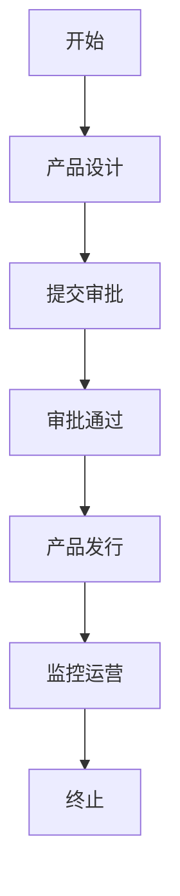
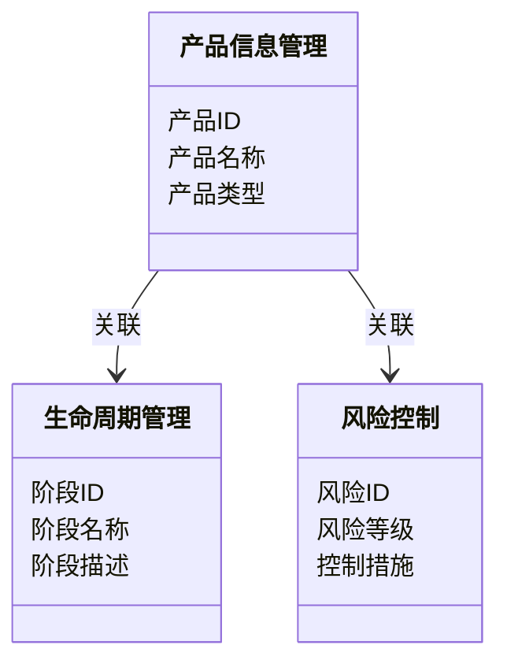
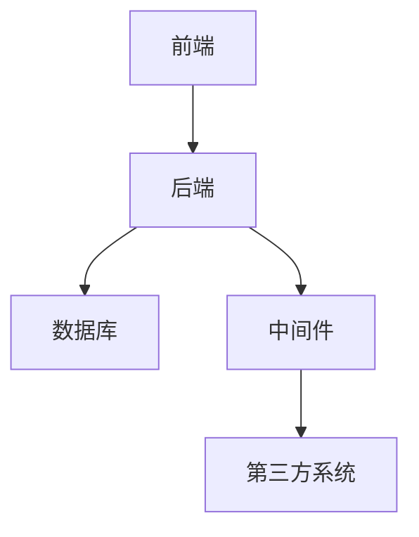
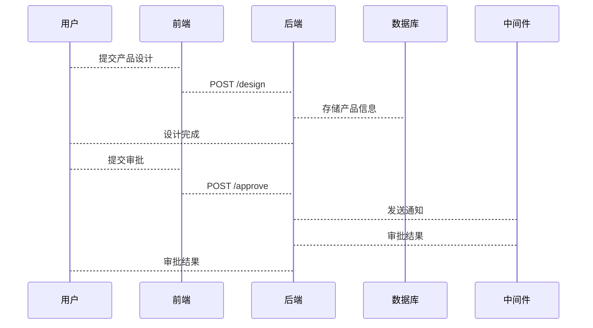

                 


```markdown
# 《金融产品生命周期管理平台》

> 关键词：金融产品生命周期管理，系统架构设计，工作流引擎，平台化解决方案，数字化转型

> 摘要：本文详细探讨了金融产品生命周期管理平台的设计与实现，从背景分析到系统架构，从算法原理到项目实战，结合实际案例，深入剖析了平台的核心功能和实现技术，提供了系统的解决方案和最佳实践。

---

# 第1章: 金融产品生命周期管理平台背景介绍

## 1.1 问题背景

### 1.1.1 传统金融产品管理的痛点
在传统的金融产品管理中，存在以下主要问题：
- 数据分散：产品信息分布在不同的系统中，难以统一管理和追踪。
- 流程复杂：产品从设计到终止涉及多个部门和流程，协作效率低下。
- 风险控制难：缺乏统一的风险评估和监控机制，难以及时发现和处理问题。

### 1.1.2 金融产品生命周期管理的重要性
金融产品生命周期管理是金融业务的核心，涉及产品的设计、审批、发行、运营和终止等多个阶段。有效的生命周期管理能够提高产品效率，降低风险，增强市场竞争力。

### 1.1.3 金融行业数字化转型的需求
随着金融科技的发展，金融行业正在加速数字化转型。构建一个统一的金融产品生命周期管理平台，能够提升金融机构的数字化能力，支持业务创新和高效运营。

## 1.2 问题描述

### 1.2.1 金融产品管理的复杂性
金融产品种类繁多，每个产品的生命周期阶段不同，管理复杂且需要高度定制化。

### 1.2.2 多部门协作的挑战
产品管理涉及研发、合规、风控、运营等多个部门，传统方式下协作效率低下，容易出现信息孤岛。

### 1.2.3 产品风险控制的难点
风险控制贯穿产品生命周期的每个阶段，但传统的管理方式难以实现实时监控和快速响应。

## 1.3 问题解决

### 1.3.1 系统化管理的必要性
通过构建统一的平台，实现对金融产品的全生命周期管理，提高管理效率和准确性。

### 1.3.2 平台化解决方案的优势
平台化解决方案能够整合资源，优化流程，提升协作效率，降低管理成本。

### 1.3.3 技术驱动金融创新的路径
利用人工智能、大数据等技术，提升产品设计、风险评估和运营效率，推动金融创新。

## 1.4 边界与外延

### 1.4.1 平台的功能边界
平台主要负责金融产品的全生命周期管理，包括产品信息管理、流程管理、风险控制等核心功能。

### 1.4.2 平台的外延扩展
平台可以与CRM、ERP等系统集成，扩展功能至客户管理、财务管理等领域。

### 1.4.3 与其他金融系统的接口关系
平台需要与核心业务系统、风控系统、合规系统等进行数据交互和业务协同。

## 1.5 核心要素组成

### 1.5.1 产品信息管理模块
用于存储和管理金融产品的基本信息、属性和文档。

### 1.5.2 生命周期管理模块
负责产品从设计到终止的各个阶段管理，包括审批、发行、监控等。

### 1.5.3 风险控制模块
实时监控产品风险，提供风险预警和控制措施。

---

# 第2章: 核心概念与联系

## 2.1 核心概念原理

### 2.1.1 金融产品生命周期模型
金融产品的生命周期包括设计、审批、发行、运营和终止五个阶段。

### 2.1.2 平台功能模块划分
平台分为产品信息管理、生命周期管理、风险控制三个主要模块。

### 2.1.3 用户角色与权限管理
用户角色包括管理员、产品负责人、风控人员等，权限管理确保数据安全和操作合规。

## 2.2 核心概念属性对比

### 2.2.1 产品类型与生命周期阶段对比表
| 产品类型   | 生命周期阶段       |
|------------|--------------------|
| 贷款产品   | 设计、审批、运营    |
| 基金产品   | 设计、发行、终止    |

### 2.2.2 用户角色与权限分配对比表
| 用户角色       | 权限               |
|----------------|--------------------|
| 管理员         | 系统管理、权限分配   |
| 产品负责人     | 产品设计、审批      |
| 风控人员       | 风险评估、预警      |

## 2.3 ER实体关系图

```mermaid
erDiagram
    用户角色 -->
    产品信息 : 所属产品
    用户角色 -->
    生命周期阶段 : 所属阶段
    产品信息 -->
    生命周期阶段 : 阶段信息
```

---

# 第3章: 算法原理讲解

## 3.1 算法选择

### 3.1.1 工作流引擎选择
选择合适的流程引擎，如Activiti，用于管理产品生命周期中的审批流程。

## 3.2 算法流程

### 3.2.1 工作流引擎流程图


## 3.3 算法实现

### 3.3.1 Python代码实现
```python
from workflow import Workflow

def productLifecycle():
    workflow = Workflow()
    workflow.add_task('开始', '结束')
    workflow.add_task('产品设计', '开始', '提交审批')
    workflow.add_task('提交审批', '审批通过', '产品发行')
    workflow.add_task('产品发行', '监控运营', '终止')
    return workflow

# 初始化工作流
workflow = productLifecycle()
# 执行工作流
workflow.execute()
```

## 3.4 算法原理的数学模型和公式

### 3.4.1 状态机模型
金融产品生命周期可以表示为一个状态机，用状态转移图表示：

$$
状态机 = \{状态, 过渡\}
$$

### 3.4.2 过渡条件
$$
过渡条件 = \{条件表达式\}
$$

### 3.4.3 示例
产品从“设计”状态转移到“审批”状态的条件是“设计完成”：

$$
\text{如果设计完成} \rightarrow \text{审批}
$$

---

# 第4章: 系统分析与架构设计方案

## 4.1 问题场景介绍

### 4.1.1 项目背景
本项目旨在构建一个支持金融产品全生命周期管理的平台，提高金融机构的管理效率和风险控制能力。

## 4.2 系统功能设计

### 4.2.1 领域模型类图


## 4.3 系统架构设计

### 4.3.1 系统架构图


### 4.3.2 技术选型
- 前端：React框架
- 后端：Spring Boot框架
- 数据库：MySQL
- 中间件：RabbitMQ

## 4.4 系统接口设计

### 4.4.1 接口描述
- GET /products：获取所有产品信息
- POST /approve：提交产品审批
- PUT /status/{id}：更新产品状态

## 4.5 系统交互流程图



---

# 第5章: 项目实战

## 5.1 环境安装

### 5.1.1 安装步骤
1. 安装JDK
2. 安装Maven
3. 安装MySQL
4. 安装Eclipse或IntelliJ IDEA

## 5.2 核心代码实现

### 5.2.1 核心代码
```java
@RestController
@RequestMapping("/api")
class ProductController {
    @GetMapping("/products")
    public List<Product> getAllProducts() {
        return productService.findAll();
    }
    
    @PostMapping("/approve")
    public String approveProduct(@RequestBody Product product) {
        return productService.approve(product);
    }
}
```

### 5.2.2 代码功能解读
- `getAllProducts`：获取所有产品信息
- `approveProduct`：提交产品审批

## 5.3 实际案例分析

### 5.3.1 案例分析
某银行开发一个贷款产品的生命周期管理平台，通过平台实现了产品设计、审批、发行和终止的全生命周期管理，提高了效率和风险控制能力。

## 5.4 项目小结

### 5.4.1 项目总结
通过构建金融产品生命周期管理平台，实现了对金融产品的高效管理，提升了金融机构的数字化能力。

---

# 第6章: 最佳实践

## 6.1 性能优化建议

### 6.1.1 数据库优化
- 使用索引优化查询
- 定期清理冗余数据

## 6.2 安全性增强

### 6.2.1 数据加密
- 对敏感数据进行加密存储
- 使用SSL加密通信

## 6.3 可扩展性设计

### 6.3.1 微服务架构
- 将平台拆分为多个微服务，提高系统的可扩展性
- 使用容器化技术部署

## 6.4 系统集成

### 6.4.1 与其他系统的集成
- 与CRM系统集成，实现客户信息共享
- 与合规系统集成，实现合规性检查

## 6.5 注意事项

### 6.5.1 数据一致性
- 确保数据在不同系统间保持一致性
- 使用事务管理保证数据一致性

---

# 附录

## 术语表

| 术语           | 定义                           |
|----------------|--------------------------------|
| 金融产品生命周期管理平台 | 管理金融产品全生命周期的平台 |

## 工具推荐

| 工具名称   | 描述               |
|------------|--------------------|
| Activiti   | 工作流引擎         |
| Spring Boot | 后端框架           |
| React       | 前端框架           |

## 参考文献

[1] Activiti官方文档  
[2] Spring Boot官方文档  
[3] React官方文档

---

# 小结

金融产品生命周期管理平台的构建是一个复杂而重要的任务。通过本文的详细讲解，读者可以了解平台的设计理念、实现技术以及最佳实践。未来，随着金融科技的不断发展，平台的功能将更加丰富，应用也将更加广泛。

作者：AI天才研究院/AI Genius Institute & 禅与计算机程序设计艺术/Zen And The Art of Computer Programming
```

