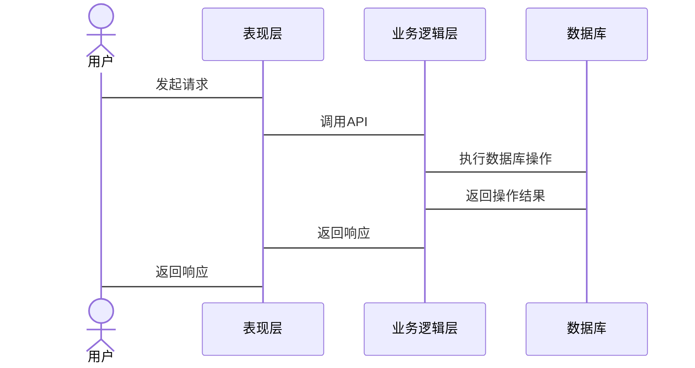
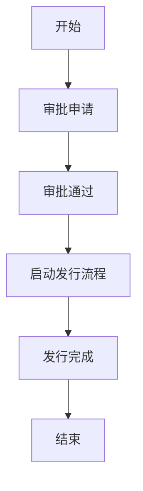
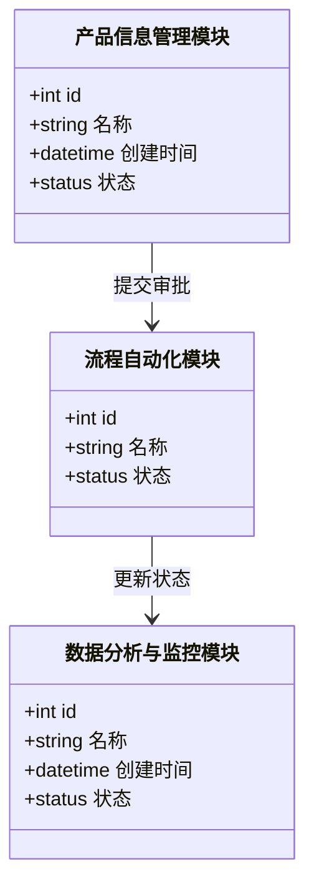

                 


# 《金融产品生命周期管理自动化平台》

> 关键词：金融产品生命周期管理，自动化平台，工作流引擎，风险评估模型，系统架构设计，业务流程优化

> 摘要：本文详细探讨了金融产品生命周期管理的自动化平台的设计与实现。从问题背景到核心概念，从算法原理到系统架构，从项目实战到最佳实践，全面分析了金融产品生命周期管理自动化平台的构建过程。通过具体案例分析，展示了如何利用工作流引擎和风险评估模型实现金融产品的自动化管理，为金融机构提供了高效的解决方案。

---

## 第1章: 金融产品生命周期管理概述

### 1.1 问题背景与核心概念

#### 1.1.1 金融产品生命周期的定义
金融产品的生命周期指的是从产品设计、审批、发行、销售、运营到终止的全过程。传统的金融产品管理流程复杂、效率低下，且容易出现人为错误。

#### 1.1.2 传统金融产品管理的痛点
- **流程繁琐**：从产品设计到终止需要经过多个部门和环节，流程长且复杂。
- **效率低下**：人工审批和协调耗时长，影响产品上市速度。
- **风险难控**：缺乏系统化的风险管理手段，容易出现操作风险。
- **信息孤岛**：各部门之间数据孤立，难以实现信息共享和协同管理。

#### 1.1.3 自动化管理的必要性
通过自动化平台实现金融产品生命周期的智能化管理，可以显著提高效率、降低风险，并提升整体管理能力。

---

### 1.2 核心概念与联系

#### 1.2.1 核心概念原理
金融产品生命周期管理平台的核心在于将业务流程自动化，通过工作流引擎实现各环节的无缝衔接。

#### 1.2.2 核心概念属性对比表格
| 核心概念       | 产品设计 | 产品审批 | 产品发行 | 产品运营 | 产品终止 |
|----------------|----------|----------|----------|----------|----------|
| 主要任务       | 设计产品 | 审批流程 | 发行产品 | 运营维护 | 终止产品 |
| 关键角色       | 产品设计人员 | 审批人员 | 发行人员 | 运营人员 | 终止执行人员 |
| 输入           | 产品需求文档 | 审批申请 | 发行申请 | 运营数据 | 终止申请 |
| 输出           | 设计完成的产品 | 审批结果 | 发行完成的产品 | 运营报告 | 终止完成的状态 |

#### 1.2.3 ER实体关系图
```mermaid
erDiagram
    actor 产品设计人员 {
        +int id
        +string name
    }
    actor 审批人员 {
        +int id
        +string name
    }
    actor 发行人员 {
        +int id
        +string name
    }
    actor 运营人员 {
        +int id
        +string name
    }
    actor 终止执行人员 {
        +int id
        +string name
    }
    product 产品 {
        +int id
        +string 名称
        +status 状态
    }
    product_document 产品文档 {
        +int id
        +string 文档内容
        +datetime 创建时间
    }
    approval 审批记录 {
        +int id
        +datetime 审批时间
        +status 审批状态
    }
    product_workflow 工作流 {
        +int id
        +string 名称
        +status 状态
    }
    产品设计人员 --> product_document : 创建文档
    product_document --> approval : 提交审批
    approval --> product_workflow : 启动工作流
    product_workflow --> product : 更新状态
```

---

## 第2章: 金融产品生命周期管理平台的核心要素

### 2.1 业务流程管理

#### 2.1.1 产品设计与审批流程
产品设计人员根据需求文档创建产品，并提交至审批人员进行审批。审批人员通过工作流引擎对审批流程进行自动化处理。

#### 2.1.2 产品发行与销售流程
审批通过后，发行人员启动产品发行流程，系统自动处理发行相关事宜。

#### 2.1.3 产品运营与终止流程
产品运营期间，系统实时监控产品状态，并在产品生命周期结束时启动终止流程。

---

### 2.2 平台功能模块

#### 2.2.1 产品信息管理模块
负责存储和管理产品的基本信息、文档和状态。

#### 2.2.2 流程自动化模块
通过工作流引擎实现业务流程的自动化处理。

#### 2.2.3 数据分析与监控模块
实时监控产品运行状态，并提供数据分析支持。

---

### 2.3 平台架构设计

#### 2.3.1 分层架构概述
平台采用分层架构，包括表现层、业务逻辑层和数据访问层。

#### 2.3.2 模块间关系分析
- 表现层与业务逻辑层通过API进行交互。
- 业务逻辑层通过数据库访问层与数据库交互。

#### 2.3.3 系统交互流程图


---

## 第3章: 业务流程自动化算法

### 3.1 工作流引擎原理

#### 3.1.1 工作流引擎的定义
工作流引擎是一种自动化执行业务流程的软件组件。

#### 3.1.2 工作流引擎的实现原理
- **流程定义**：通过BPMN（业务流程模型及notation）定义流程。
- **流程执行**：通过状态机和任务队列实现流程的执行。
- **流程监控**：实时监控流程的执行状态，并提供可视化界面。

#### 3.1.3 工作流引擎的流程图


#### 3.1.4 工作流引擎的Python代码实现
```python
from datetime import datetime

class WorkflowEngine:
    def __init__(self):
        self.states = {}
        self.current_state = "开始"

    def process(self):
        while self.current_state != "结束":
            state = self.states[self.current_state]
            action = state["action"]
            next_state = state["next_state"]
            action()
            self.current_state = next_state
            print(f"从状态 {self.current_state} 转到 {next_state}")

    def add_state(self, state_name, action, next_state):
        self.states[state_name] = {
            "action": action,
            "next_state": next_state
        }
```

---

### 3.2 流程优化算法

#### 3.2.1 简化流程的数学模型
$$ \text{流程时间} = \sum_{i=1}^{n} t_i $$
其中，$t_i$ 表示第i个环节的时间。

#### 3.2.2 流程优化的数学公式
$$ \text{优化后的时间} = \sum_{i=1}^{m} t_i $$
其中，$m$ 是优化后的环节数量。

#### 3.2.3 流程优化的实现步骤
1. **流程建模**：使用BPMN定义流程。
2. **流程分析**：识别冗余环节。
3. **流程优化**：简化流程并重新部署。

---

## 第4章: 产品风险评估模型

### 4.1 风险评估的数学模型
$$ R = \sum_{i=1}^{n} w_i \cdot f_i $$
其中，$R$ 表示风险值，$w_i$ 表示第i个风险因子的权重，$f_i$ 表示第i个风险因子的值。

#### 4.1.1 风险评估的Python代码实现
```python
def calculate_risk(risk_factors, weights):
    risk = 0
    for i in range(len(risk_factors)):
        risk += weights[i] * risk_factors[i]
    return risk

# 示例
risk_factors = [0.8, 0.5, 0.3]
weights = [0.4, 0.3, 0.3]
print("风险值为：", calculate_risk(risk_factors, weights))
```

---

## 第5章: 系统分析与架构设计

### 5.1 系统功能设计

#### 5.1.1 系统功能模块划分
- **产品信息管理模块**：负责产品的创建、修改和查询。
- **流程自动化模块**：负责业务流程的自动化处理。
- **数据分析与监控模块**：负责数据分析和实时监控。

#### 5.1.2 系统功能设计图


---

## 第6章: 项目实战

### 6.1 环境安装

#### 6.1.1 安装Python
```bash
# 安装Python
python --version
```

#### 6.1.2 安装依赖库
```bash
pip install mermaid.py
pip install pydot
```

---

### 6.2 核心代码实现

#### 6.2.1 产品信息管理模块
```python
class Product:
    def __init__(self, id, name, status):
        self.id = id
        self.name = name
        self.status = status
```

#### 6.2.2 流程自动化模块
```python
class Workflow:
    def __init__(self, id, name, status):
        self.id = id
        self.name = name
        self.status = status
```

---

### 6.3 案例分析

#### 6.3.1 案例分析
以某银行的理财产品为例，详细分析如何通过平台实现产品的全生命周期管理。

---

## 第7章: 最佳实践与总结

### 7.1 最佳实践
- **模块化设计**：确保系统模块化，便于扩展和维护。
- **实时监控**：通过实时监控确保系统运行状态良好。
- **安全合规**：确保系统符合金融行业的安全合规要求。

### 7.2 小结
金融产品生命周期管理自动化平台通过工作流引擎和风险评估模型，实现了金融产品的智能化管理，显著提高了管理效率和风险控制能力。

### 7.3 注意事项
- 系统上线前需进行充分的测试。
- 确保系统的安全性。
- 定期更新系统以适应新的业务需求。

### 7.4 拓展阅读
- 《业务流程管理》
- 《金融风险管理》
- 《系统架构设计》

---

## 作者信息

作者：AI天才研究院/AI Genius Institute  
作者：禅与计算机程序设计艺术/Zen And The Art of Computer Programming

---

这篇文章从金融产品生命周期管理的背景出发，详细探讨了自动化平台的核心概念、算法原理、系统架构设计和项目实战。通过具体案例分析，展示了如何利用工作流引擎和风险评估模型实现金融产品的自动化管理，为金融机构提供了高效的解决方案。

