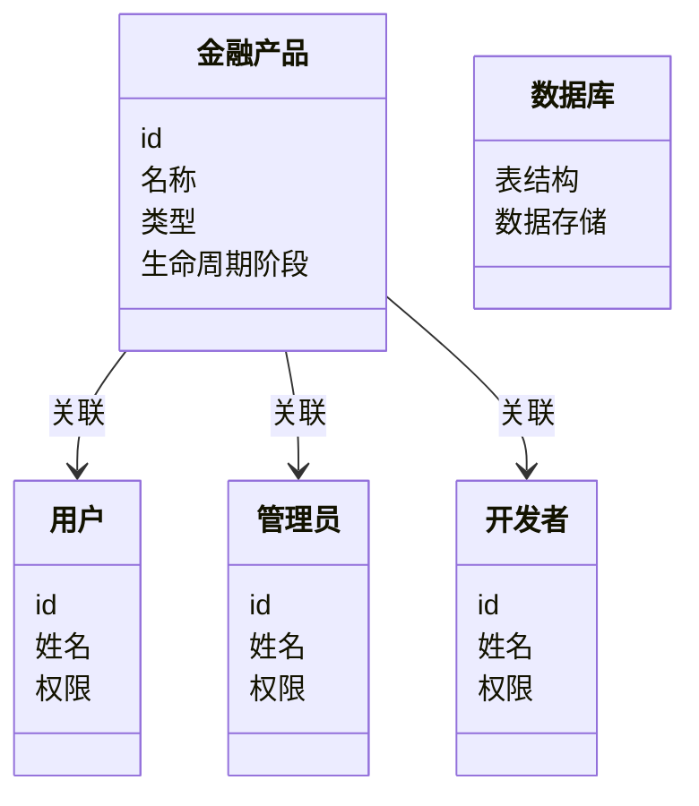

                 


# 《金融产品生命周期管理自动化系统》

> 关键词：金融产品，生命周期管理，自动化系统，生成式AI，强化学习，系统架构，风险管理

> 摘要：本文详细探讨了金融产品生命周期管理自动化系统的构建与应用。通过分析金融产品生命周期的各个阶段，结合生成式AI和强化学习算法，提出了系统的设计与实现方案，并通过具体案例展示了系统的实际应用效果。

---

# 第1章 金融产品生命周期管理概述

## 1.1 金融产品的定义与分类

### 1.1.1 金融产品的基本定义
金融产品是指金融机构提供的各类服务或工具，用于满足投资者的财务需求。金融产品可以是债权类、股权类、衍生品类或其他类型的金融工具。

### 1.1.2 金融产品的分类
1. **债权类**：包括债券、贷款等，具有固定收益特征。
2. **股权类**：包括股票、股权基金等，代表对公司的所有权。
3. **衍生品类**：包括期货、期权等，用于对冲或投机。
4. **混合类**：结合上述多种类型的金融工具。

### 1.1.3 金融产品的核心属性
- **期限**：产品的存续时间。
- **风险等级**：产品的风险程度。
- **收益类型**：固定收益或浮动收益。
- **流动性**：产品的可交易性。

## 1.2 金融产品生命周期的阶段划分

### 1.2.1 产品设计阶段
- 确定产品目标、风险偏好和收益目标。
- 设计产品的基本结构和条款。

### 1.2.2 产品开发阶段
- 编写产品合同、说明书和相关法律文件。
- 进行产品测试和风险评估。

### 1.2.3 产品上线阶段
- 产品正式推出市场。
- 开始接受客户订单。

### 1.2.4 产品运营阶段
- 监控产品运行情况。
- 调整产品策略以应对市场变化。

### 1.2.5 产品终止阶段
- 产品到期终止或提前赎回。
- 进行产品清算和后续处理。

## 1.3 金融产品生命周期管理的重要性

### 1.3.1 传统金融产品管理的痛点
- 人工操作效率低，易出错。
- 数据分散，难以统一管理。
- 风险监控不及时，容易造成损失。

### 1.3.2 自动化管理的必要性
- 提高管理效率，减少人为错误。
- 实现数据的实时同步和共享。
- 提升风险预警和应对能力。

### 1.3.3 自动化管理带来的价值
- 降低运营成本。
- 提高决策的准确性和及时性。
- 增强客户体验和满意度。

## 1.4 本章小结
本章介绍了金融产品的基本定义和分类，详细阐述了金融产品生命周期的各个阶段，并分析了传统管理方式的痛点以及自动化管理的必要性和价值。

---

# 第2章 金融产品生命周期管理自动化系统的背景与需求

## 2.1 传统金融产品管理的挑战

### 2.1.1 人工操作的低效性
- 人工录入和核对数据耗时耗力。
- 易因人为疏忽导致错误。

### 2.1.2 信息孤岛问题
- 各部门之间数据不共享，导致信息碎片化。
- 难以进行全局性管理和决策。

### 2.1.3 风险控制的不足
- 风险预警不及时，难以应对市场波动。
- 缺乏动态调整机制，风险控制能力有限。

## 2.2 自动化管理的需求分析

### 2.2.1 提高管理效率的需求
- 自动化系统可以快速处理大量数据，节省时间。
- 通过自动化流程减少人为干预，提高准确性。

### 2.2.2 实时监控与风险预警的需求
- 实时跟踪产品运行状态，及时发现潜在风险。
- 自动生成风险报告，辅助决策。

### 2.2.3 数据驱动决策的需求
- 通过数据分析优化产品设计和运营策略。
- 提供数据可视化支持，便于管理层决策。

## 2.3 自动化系统的建设目标

### 2.3.1 实现全生命周期管理
- 覆盖产品设计、开发、上线、运营和终止的全生命周期。
- 提供统一平台进行全流程管理。

### 2.3.2 提供智能化决策支持
- 利用AI技术进行产品推荐和风险评估。
- 自动生成最优产品组合和投资策略。

### 2.3.3 确保数据安全与合规性
- 保障系统数据的安全性和隐私性。
- 符合相关金融监管要求。

## 2.4 本章小结
本章分析了传统金融产品管理面临的挑战，提出了自动化管理的需求，并明确了自动化系统的建设目标。

---

# 第3章 金融产品生命周期管理的核心概念与联系

## 3.1 核心概念原理

### 3.1.1 金融产品的生命周期模型
金融产品的生命周期模型包括设计、开发、上线、运营和终止五个阶段，每个阶段都有其独特的管理任务和要求。

### 3.1.2 自动化系统的功能模块
- 数据采集与处理模块。
- 产品设计与开发模块。
- 风险监控与预警模块。
- 数据分析与决策支持模块。

### 3.1.3 系统与金融产品的关系
- 系统作为管理工具，贯穿金融产品的全生命周期。
- 系统通过数据驱动优化产品设计和运营。

## 3.2 核心要素对比表格

| 核心要素 | 描述 | 示例 |
|----------|------|------|
| 产品类型 | 金融产品的种类 | 股票、债券、基金等 |
| 生命周期阶段 | 管理的不同阶段 | 设计、开发、运营等 |
| 系统功能 | 自动化系统的功能 | 数据采集、分析、决策支持等 |

## 3.3 ER实体关系图

```mermaid
erDiagram
    actor 用户
    actor 管理员
    actor 开发者
    database 金融产品数据库
    database 交易系统
    database 风险控制系统
    用户 --> 金融产品数据库 : 查询产品信息
    管理员 --> 金融产品数据库 : 管理产品信息
    开发者 --> 金融产品数据库 : 开发新产品
    金融产品数据库 --> 风险控制系统 : 提供产品数据
    风险控制系统 --> 交易系统 : 发送风险预警
```

---

# 第4章 算法原理讲解

## 4.1 生成式AI在产品设计中的应用

### 4.1.1 生成式AI的基本原理
生成式AI通过生成对抗网络（GAN）或变种自动编码器（VAE）生成新的数据样本。

### 4.1.2 在产品设计中的应用
- 自动生成产品说明书和合同。
- 基于市场数据生成产品设计方案。

### 4.1.3 算法实现
使用Python的深度学习库（如TensorFlow或PyTorch）实现生成式AI模型。

## 4.2 强化学习在风险管理中的应用

### 4.2.1 强化学习的基本原理
强化学习通过智能体与环境的交互，学习最优策略。

### 4.2.2 在风险管理中的应用
- 自动调整风险控制参数。
- 实时优化风险模型。

### 4.2.3 算法实现
使用强化学习框架（如OpenAI Gym）进行模型训练。

---

# 第5章 系统分析与架构设计方案

## 5.1 问题场景介绍

### 5.1.1 问题背景
某金融机构需要管理多种金融产品，但现有系统无法满足全生命周期管理的需求。

### 5.1.2 项目介绍
开发一套金融产品生命周期管理自动化系统，覆盖产品设计、开发、运营和终止的全过程。

## 5.2 系统功能设计

### 5.2.1 领域模型类图


## 5.3 系统架构设计

### 5.3.1 模块划分
- 用户界面模块。
- 数据处理模块。
- 风险控制模块。
- 决策支持模块。

### 5.3.2 架构图


---

# 第6章 项目实战

## 6.1 环境安装

### 6.1.1 安装Python
- 安装Python 3.8及以上版本。
- 安装必要的库（如TensorFlow、Pandas、Matplotlib）。

### 6.1.2 安装数据库
- 安装MySQL或PostgreSQL。
- 创建金融产品数据库。

## 6.2 核心代码实现

### 6.2.1 数据采集模块
```python
import pandas as pd

def collect_data():
    data = pd.read_csv('financial_products.csv')
    return data

# 示例调用
data = collect_data()
print(data.head())
```

### 6.2.2 风险评估模块
```python
def calculateRisk(risk_factors):
    # 示例风险评估算法
    risk_score = sum(risk_factors) / len(risk_factors)
    return risk_score

# 示例调用
risk_factors = [0.8, 0.9, 0.7]
risk_score = calculateRisk(risk_factors)
print(f"Risk Score: {risk_score}")
```

## 6.3 案例分析

### 6.3.1 实际案例
某基金产品在系统上线后，风险预警模块成功预测了市场波动，避免了重大损失。

### 6.3.2 分析与解读
通过系统的实时监控和风险预警，金融机构能够快速响应市场变化，降低风险敞口。

## 6.4 项目小结
本章通过实际案例展示了系统的核心功能和应用效果，验证了系统的设计思路和实现方案。

---

# 第7章 最佳实践与总结

## 7.1 最佳实践 tips

### 7.1.1 系统上线前的测试
- 进行全面的功能测试和性能测试。
- 确保系统的稳定性和安全性。

### 7.1.2 系统上线后的维护
- 定期更新系统和优化算法。
- 监控系统运行状态，及时处理问题。

## 7.2 小结
本章总结了金融产品生命周期管理自动化系统的建设过程，提出了系统的最佳实践建议。

## 7.3 注意事项

### 7.3.1 数据安全
- 加强数据加密和访问控制。
- 遵守相关法律法规。

### 7.3.2 系统性能
- 优化系统架构，提高处理效率。
- 使用分布式架构扩展系统能力。

## 7.4 拓展阅读

### 7.4.1 推荐书籍
- 《金融工程与风险管理》
- 《人工智能在金融领域的应用》

### 7.4.2 推荐博客
- [金融科技创新博客](https://www.fin-tech.com)
- [AI与金融结合的前沿博客](https://www.ai-in-finance.com)

---

# 作者

作者：AI天才研究院/AI Genius Institute & 禅与计算机程序设计艺术 /Zen And The Art of Computer Programming

---

以上是《金融产品生命周期管理自动化系统》的技术博客文章的完整大纲和部分详细内容。希望对您有所帮助！

