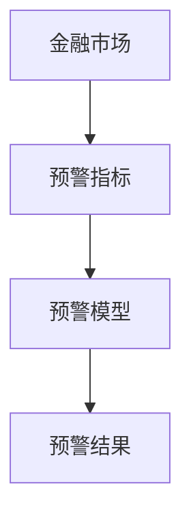
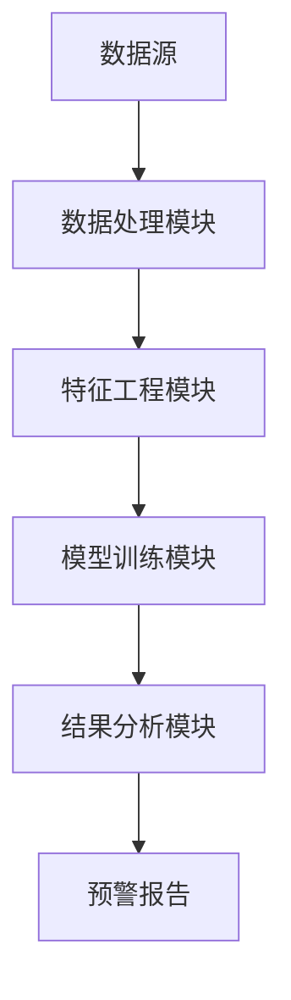

                 


---

# 金融危机预警系统

> **关键词**：金融危机、预警系统、数据分析、算法、风险管理、金融稳定

> **摘要**：金融危机预警系统是通过数据分析和算法构建，用于提前识别和预测潜在金融风险的系统。本文从背景、核心概念、算法原理、系统架构到项目实战，全面解析金融危机预警系统的构建与应用，帮助读者理解如何利用技术手段实现金融风险的早期预警。

---

## 第一部分：金融危机预警系统概述

### 第1章：金融危机预警系统背景介绍

#### 1.1 金融危机的定义与特征

金融危机是指金融体系中的重大失衡或崩溃，通常表现为股市崩盘、银行危机、货币贬值等。其主要特征包括：  
- **波动性**：金融市场的剧烈波动。  
- **传染性**：风险从局部向全局扩散。  
- **突发性**：危机往往在短时间内迅速恶化。  
- **系统性**：影响整个金融体系，甚至实体经济。

#### 1.2 金融危机预警系统的重要性

- **风险管理**：帮助金融机构提前识别潜在风险，避免重大损失。  
- **政策制定**：为政府和监管机构提供决策支持，维护金融稳定。  
- **投资者保护**：为投资者提供风险提示，减少投资损失。

#### 1.3 金融危机预警系统的核心要素

- **数据源**：包括市场数据、经济指标、新闻舆情等。  
- **预警指标**：如波动率、杠杆率、市场情绪等。  
- **预警模型**：统计模型和机器学习模型。  
- **预警机制**：触发警报和应对策略。

---

### 第2章：金融危机预警系统的核心概念与联系

#### 2.1 核心概念原理

- **数据采集与特征提取**：从多种数据源获取信息，并提取关键特征。  
- **预警指标的筛选与权重分配**：根据历史数据确定重要指标并赋予权重。  
- **预警模型的构建与评估**：选择合适的算法，训练模型并验证其准确性。

#### 2.2 核心概念属性特征对比表

| **指标名称** | **指标描述** | **指标类型** | **适用场景** |
|--------------|--------------|--------------|--------------|
| 波动率        | 市场价格波动程度 | 统计指标     | 评估市场稳定性 |
| 杠杆率        | 资产与负债比例   | 财务指标     | 评估机构风险 |
| 市场情绪      | 投资者情绪指数   | 行为指标     | 预测市场走势 |

#### 2.3 ER实体关系图



---

### 第3章：金融危机预警系统的算法原理

#### 3.1 统计学方法

- **时间序列分析**：用于预测未来的市场走势。  
  $$ARIMA(p, d, q)$$

- **回归分析**：用于分析变量之间的关系。  
  $$y = \beta_0 + \beta_1x + \epsilon$$

- **聚类分析**：用于识别市场中的异常行为。

#### 3.2 机器学习算法

- **支持向量机（SVM）**：用于分类问题。  
  $$maximize \quad \sum_{i=1}^{n} \alpha_i y_i - \sum_{i=1}^{n} \sum_{j=1}^{n} \alpha_i \alpha_j y_i y_j K(x_i, x_j)$$

- **随机森林**：用于特征重要性分析和分类。  
- **神经网络**：用于复杂非线性关系的建模。

---

### 第4章：金融危机预警系统的数学模型与公式

#### 4.1 时间序列模型

- **ARIMA模型**：  
  $$ARIMA(p, d, q)$$  
  其中，p为自回归阶数，d为差分阶数，q为移动平均阶数。

- **GARCH模型**：  
  $$GARCH(p, q)$$  
  用于估计金融资产的波动性。

#### 4.2 机器学习模型

- **支持向量机（SVM）**：  
  $$f(x) = \sigma(w_2 \sigma(w_1 x + b_1) + b_2)$$

- **神经网络**：  
  $$f(x) = \sigma(W_2 \sigma(W_1 x + b_1) + b_2)$$

---

### 第5章：金融危机预警系统的系统分析与架构设计

#### 5.1 问题场景介绍

金融危机预警系统需要解决的主要问题是：如何通过实时数据分析，提前发现潜在风险并发出警报。系统需要处理大量数据，选择合适的算法，构建高效的模型，并提供直观的预警结果。

#### 5.2 系统功能设计

- **数据处理模块**：负责数据清洗、转换和存储。  
- **特征工程模块**：提取关键特征并进行工程处理。  
- **模型训练模块**：选择算法并进行训练和优化。  
- **结果分析模块**：生成预警报告并可视化。

#### 5.3 系统架构设计



---

### 第6章：金融危机预警系统的项目实战

#### 6.1 数据收集与处理

- **数据来源**：包括历史价格、成交量、宏观经济指标等。  
- **数据清洗**：处理缺失值和异常值。  
- **数据转换**：标准化或归一化处理。

#### 6.2 系统实现与代码解读

- **特征工程**：  
  ```python
  def feature_engineering(data):
      # 计算波动率
      data['volatility'] = data['price'].pct_change().std()
      # 计算市场情绪
      data['sentiment'] = data['volume'].rank(pct=True)
      return data
  ```

- **模型训练**：  
  ```python
  from sklearn.ensemble import RandomForestClassifier
  model = RandomForestClassifier(n_estimators=100, random_state=42)
  model.fit(X_train, y_train)
  ```

#### 6.3 实际案例分析

以2008年金融危机为例，分析系统如何通过模型预测市场波动并发出预警。

---

### 第7章：总结与展望

#### 7.1 系统总结

金融危机预警系统通过数据分析和算法构建，能够有效识别潜在风险，为金融稳定提供支持。

#### 7.2 系统局限性

- 数据依赖性：预警系统依赖于历史数据，可能无法捕捉到新的风险因素。  
- 模型局限性：复杂的金融环境可能导致模型失效。  
- 实时性问题：处理大量数据可能会影响系统的实时性。

#### 7.3 未来展望

- **多模态数据融合**：结合文本、图像等多种数据源。  
- **深度学习应用**：利用更大规模的数据进行训练。  
- **实时预警系统**：优化计算效率，实现实时监控。

---

### 附录：最佳实践 tips

- **数据质量**：确保数据准确性和完整性。  
- **模型优化**：定期更新模型，避免过时。  
- **团队合作**：结合金融专家和数据科学家的力量。

---

**作者**：AI天才研究院/AI Genius Institute & 禅与计算机程序设计艺术/Zen And The Art of Computer Programming

