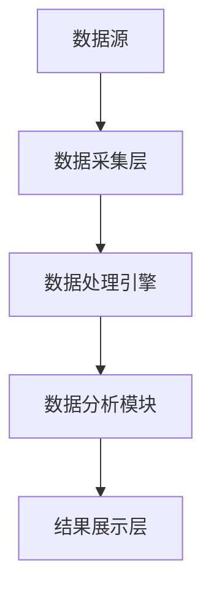
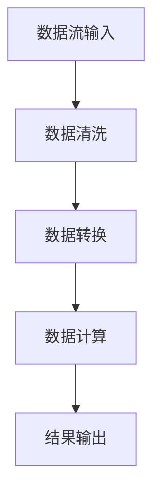
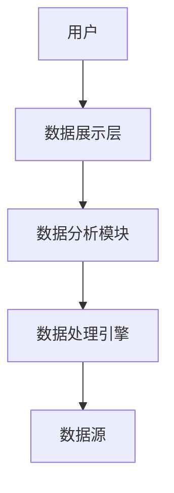

                 


# 金融大数据实时处理与分析平台

> 关键词：金融大数据、实时处理、数据流、分布式计算、数据分析、平台架构

> 摘要：本文详细介绍了金融大数据实时处理与分析平台的设计与实现，从问题背景、核心概念、算法原理到系统架构和项目实战，全面阐述了该平台的构建过程和应用价值。通过本文，读者可以深入了解如何利用大数据技术解决金融行业中的实时数据处理与分析问题。

---

## 第一部分: 金融大数据实时处理与分析平台概述

### 第1章: 问题背景与核心概念

#### 1.1 问题背景

金融行业每天都会产生海量的数据，包括交易数据、市场数据、用户行为数据等。这些数据具有以下特点：

- **数据量大**：金融市场的高频交易和大量用户行为产生了海量数据。
- **数据类型多样**：包括结构化数据（如交易记录）和非结构化数据（如文本信息）。
- **数据时效性强**：实时数据分析对于金融交易、风险控制等场景至关重要。
- **数据安全性要求高**：金融数据涉及用户隐私和商业机密，数据安全是重中之重。

#### 1.2 问题描述

传统的金融数据分析模式通常是批量处理，这种方式难以满足实时性要求。例如，在股票交易中，投资者需要实时了解市场动态和交易情况，才能做出快速决策。因此，如何实现金融数据的实时处理与分析，成为一个亟待解决的问题。

#### 1.3 问题解决

为了解决金融数据实时处理与分析的问题，我们需要构建一个实时大数据处理与分析平台。该平台需要具备以下功能：

- **实时数据采集**：从多种数据源实时采集数据。
- **实时数据处理**：对采集到的数据进行清洗、转换和计算。
- **实时数据分析**：利用大数据分析技术，提取有价值的信息。
- **实时结果展示**：将分析结果以可视化的方式展示给用户。

#### 1.4 边界与外延

- **数据范围**：平台仅处理与金融相关的数据，不涉及其他领域的数据。
- **时间范围**：平台支持实时数据处理，但不提供历史数据分析功能。
- **功能范围**：平台专注于实时数据处理与分析，不包括数据存储和管理功能。
- **系统架构**：平台基于分布式架构，支持高并发和高吞吐量。

---

## 第二部分: 核心概念与联系

### 第2章: 核心概念原理与对比

#### 2.1 大数据处理的核心原理

- **数据流处理模型**：数据以流的形式不断输入到系统中，系统对每一条数据进行实时处理。
- **分布式计算原理**：通过分布式计算框架（如Flink），将数据分发到多个节点进行并行处理，提升处理效率。

#### 2.2 核心概念对比分析

| 对比维度 | 数据流处理 | 批量处理 |
|----------|------------|----------|
| 处理方式 | 实时处理    | 批量处理 |
| 时延     | 低         | 高       |
| 资源消耗 | 高         | 较低     |

#### 2.3 实体关系图与流程图



---

## 第三部分: 算法原理讲解

### 第3章: 算法原理与实现

#### 3.1 算法原理

- **流处理模型**：数据以流的形式输入，系统对每一条数据进行处理，并实时更新结果。
- **分布式计算**：利用分布式计算框架（如Flink），将数据分发到多个节点进行并行处理。

#### 3.2 算法流程图



#### 3.3 Python实现与案例分析

以下是一个简单的实时数据处理代码示例：

```python
from kafka import KafkaConsumer
from pyspark import SparkContext
from pyspark.streaming import StreamingContext

# 初始化Spark上下文
sc = SparkContext()
ssc = StreamingContext(sc, 1)

# 初始化Kafka消费者
consumer = KafkaConsumer('finance_data')

# 实时数据处理
def process(rdd):
    # 数据清洗和转换
    cleaned_rdd = rdd.filter(lambda x: x is not None)
    # 数据计算
    result = cleaned_rdd.map(lambda x: (x['symbol'], x['price'])) \
                        .reduceByKey(lambda a, b: (a[0], max(a[1], b[1])))
    # 输出结果
    for res in result:
        print(f"Symbol: {res[0]}, Max Price: {res[1]}")

# 开始处理数据流
ssc.start()
ssc.awaitTermination()
```

---

## 第四部分: 系统分析与架构设计

### 第4章: 系统架构设计

#### 4.1 系统功能设计

- **数据采集层**：实时采集金融市场的各种数据，包括交易数据、市场数据等。
- **数据处理引擎**：对采集到的数据进行清洗、转换和计算。
- **数据分析模块**：利用大数据分析技术，提取有价值的信息。
- **结果展示层**：将分析结果以可视化的方式展示给用户。

#### 4.2 系统架构图



---

## 第五部分: 项目实战

### 第5章: 项目实现与案例分析

#### 5.1 环境安装

- 安装Flink、Kafka、Spark等工具，并配置好相关环境变量。

#### 5.2 核心实现

- 数据采集：使用Kafka实时采集金融数据。
- 数据处理：利用Spark Streaming进行实时数据处理。
- 数据分析：通过Flink进行实时数据分析。
- 结果展示：将分析结果展示在Web界面中。

#### 5.3 案例分析

以实时股票价格监控为例，展示平台的实际应用效果。通过平台，投资者可以实时监控股票价格的变化，并根据分析结果做出投资决策。

---

## 第六部分: 总结与展望

### 第6章: 总结与展望

#### 6.1 总结

本文详细介绍了金融大数据实时处理与分析平台的设计与实现，从问题背景到系统架构，再到项目实战，全面阐述了该平台的构建过程和应用价值。

#### 6.2 展望

未来，随着大数据技术的不断发展，金融大数据实时处理与分析平台将更加智能化和高效化。我们可以期待更多创新的技术和应用，为金融行业带来更多价值。

---

## 附录

- 附录A: 相关技术资料
- 附录B: 代码实现细节
- 附录C: 参考文献

---

## 作者信息

作者：AI天才研究院/AI Genius Institute & 禅与计算机程序设计艺术/Zen And The Art of Computer Programming

---

以上就是《金融大数据实时处理与分析平台》的完整内容，希望对您有所帮助！

