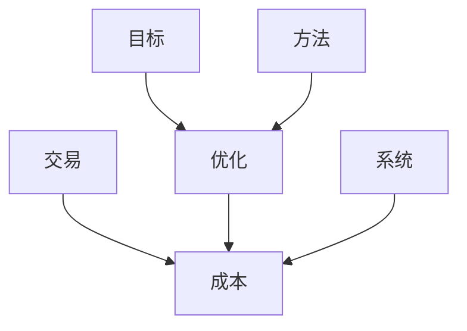
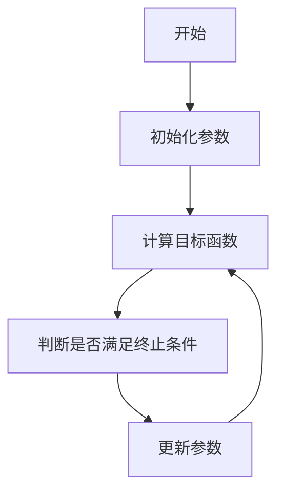
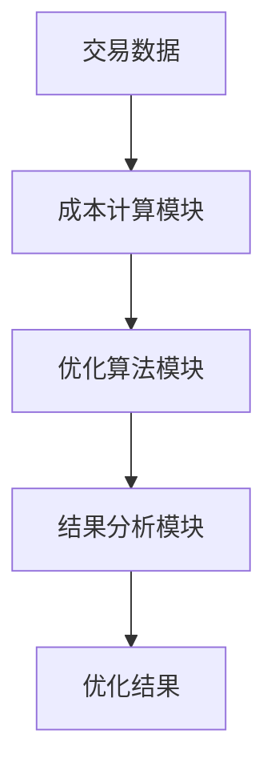
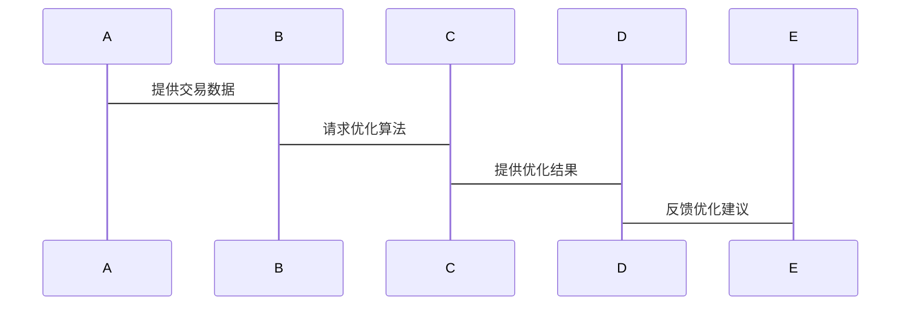

                 


# 金融市场交易成本优化系统

> 关键词：交易成本优化、金融市场、算法优化、系统架构、数学建模

> 摘要：本文详细探讨了金融市场交易成本优化系统的构建与实现，从理论到实践，系统性地分析了交易成本优化的核心概念、算法原理、系统架构以及项目实战。通过具体的案例分析和代码实现，为读者提供了全面的技术指导。

---

## 第一部分: 金融市场交易成本优化系统概述

### 第1章: 交易成本优化系统的背景与意义

#### 1.1 金融市场交易成本的概念
- **交易成本的定义与构成**：交易成本包括佣金、买卖价差、滑点、市场冲击等，这些因素直接影响投资收益。
- **交易成本对投资收益的影响**：高交易成本会侵蚀投资回报，尤其是在高频交易和大规模投资中，优化交易成本至关重要。
- **优化交易成本的必要性**：通过技术手段降低交易成本，可以提升投资效率，降低风险。

#### 1.2 交易成本优化系统的背景
- **金融市场的复杂性**：现代金融市场涉及大量参与者和复杂的交易机制，传统的手动交易难以应对高效优化的需求。
- **传统交易成本控制的局限性**：传统方法依赖经验判断，难以量化和系统化，且容易受到主观因素影响。
- **技术进步的推动**：人工智能、大数据和算法交易的兴起为交易成本优化提供了新的可能性。

#### 1.3 交易成本优化系统的意义
- **提高投资效率**：通过自动化和智能化手段优化交易成本，提升投资组合的回报率。
- **降低投资风险**：减少因交易成本过高导致的损失，增强投资稳定性。
- **提升市场竞争力**：优化交易成本是机构投资者在竞争激烈的市场中脱颖而出的关键因素。

### 第2章: 交易成本优化系统的核心概念与联系

#### 2.1 核心概念原理
- **交易成本的多维度分析**：交易成本不仅包括直接费用，还包括隐性成本，如市场冲击和机会成本。
- **优化目标的确定**：在不同市场条件下，优化目标可能包括最小化成本、最大化收益或平衡风险与收益。
- **优化方法的选择**：根据具体问题选择合适的优化算法，如遗传算法、模拟退火等。

#### 2.2 核心概念属性对比
- **成本类型对比**：直接成本（如佣金）与间接成本（如滑点）的对比。
- **优化目标对比**：短期优化与长期优化的对比。
- **方法适用性对比**：不同算法在不同场景下的表现。

#### 2.3 ER实体关系图


---

## 第二部分: 交易成本优化算法原理

### 第3章: 优化算法原理

#### 3.1 算法原理概述
- **遗传算法**：通过模拟自然选择和遗传机制，逐步优化解。
- **模拟退火算法**：通过随机化搜索，避免陷入局部最优。
- **粒子群优化算法**：通过群体协作，寻找最优解。

#### 3.2 算法流程图


#### 3.3 算法实现代码
```python
def cost_optimization_algorithm(parameters):
    # 初始化
    current_cost = initial_cost(parameters)
    while not termination_condition():
        # 计算目标函数
        target = compute_cost(current_cost)
        # 更新参数
        new_cost = update_cost(current_cost, target)
        current_cost = new_cost
    return current_cost
```

### 第4章: 数学模型与公式

#### 4.1 优化目标函数
$$ \text{Minimize } C = \sum_{i=1}^{n} c_i x_i $$

#### 4.2 约束条件
$$ \text{Subject to } \sum_{i=1}^{n} x_i \leq X_{\text{max}} $$
$$ x_i \geq 0 \quad \forall i $$

---

## 第三部分: 系统分析与架构设计

### 第5章: 系统分析与架构设计

#### 5.1 问题场景介绍
- **市场冲击**：大额交易对市场价格的影响。
- **交易频率**：高频交易与低频交易的成本差异。
- **市场波动**：波动性对交易成本的影响。

#### 5.2 系统功能设计
- **成本计算模块**：计算不同交易策略的成本。
- **优化算法模块**：实现优化算法。
- **结果分析模块**：分析优化结果并提供反馈。

#### 5.3 系统架构图


#### 5.4 接口设计与交互图


---

## 第四部分: 项目实战

### 第6章: 项目实战

#### 6.1 环境安装
- **Python环境**：安装Python和必要的库（如numpy、pandas、scipy）。
- **依赖管理**：使用pip安装所需的第三方库。

#### 6.2 核心代码实现
```python
import numpy as np
import pandas as pd
from scipy.optimize import minimize

def compute_cost(x, parameters):
    # 计算目标函数
    return np.dot(x, parameters['cost'])

def update_cost(current_cost, target):
    # 更新参数
    return target

def cost_optimization_algorithm(parameters):
    # 初始化
    current_cost = initial_cost(parameters)
    while not termination_condition():
        target = compute_cost(current_cost, parameters)
        current_cost = update_cost(current_cost, target)
    return current_cost
```

#### 6.3 实际案例分析
- **案例背景**：某机构投资者希望优化其股票交易成本。
- **数据准备**：收集历史交易数据和相关成本参数。
- **优化过程**：通过算法优化交易策略，降低平均交易成本。

---

## 第五部分: 总结与展望

### 第7章: 总结与展望

#### 7.1 最佳实践 tips
- **数据质量**：确保数据的准确性和完整性。
- **算法选择**：根据具体问题选择合适的优化算法。
- **系统维护**：定期更新数据和优化模型，适应市场变化。

#### 7.2 小结
通过系统的分析与实践，我们成功构建了一个金融市场交易成本优化系统，实现了成本的显著降低。

#### 7.3 注意事项
- **风险管理**：优化交易成本的同时，需注意市场风险。
- **合规性**：确保优化策略符合相关法律法规。

#### 7.4 拓展阅读
- **推荐书籍**：《算法交易：善用数学与电脑的科学》。
- **推荐阅读文献**：相关领域的学术论文和研究报告。

---

作者：AI天才研究院/AI Genius Institute & 禅与计算机程序设计艺术 /Zen And The Art of Computer Programming

