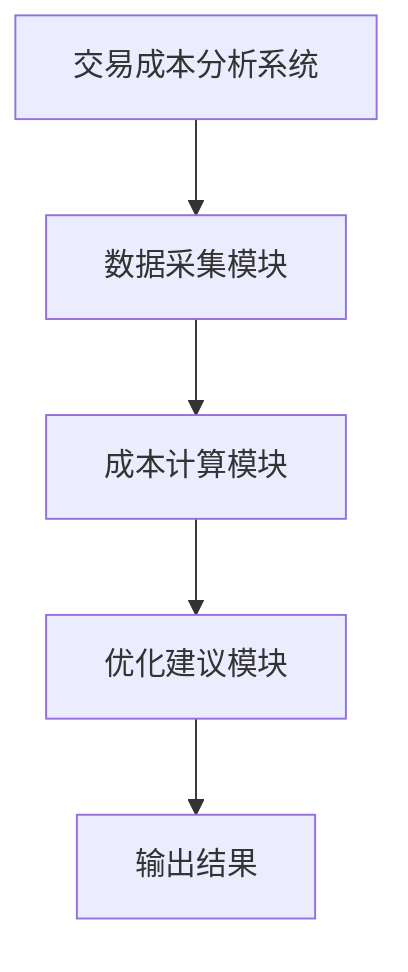
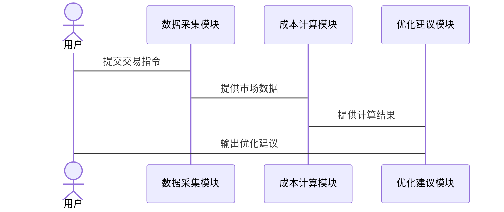

                 


# 金融市场交易成本分析与优化

## 关键词：
金融市场，交易成本，优化策略，数学模型，系统架构，项目实战

## 摘要：
本文详细分析了金融市场交易成本的构成、影响因素及其优化策略。通过建立数学模型，结合实际案例，探讨了如何最小化交易成本，并提出了系统化的解决方案。文章从理论分析到实践应用，为投资者和市场参与者提供了深入的见解和实用的建议。

---

# 第1章 交易成本的基本概念与分类

## 1.1 交易成本的定义与构成

### 1.1.1 交易成本的定义
交易成本是指在金融市场上进行交易时产生的所有费用，包括显性成本和隐性成本。显性成本可以直接量化，如佣金、印花税等；隐性成本则难以直接量化，如滑点、市场冲击等。

$$\text{交易成本} = \text{显性成本} + \text{隐性成本}$$

### 1.1.2 交易成本的构成要素
1. **佣金与手续费**：支付给经纪商的费用。
2. **滑点**：市场价格变动导致的实际成交价与预期价的差异。
3. **印花税**：政府对证券交易征收的税费。
4. **市场冲击**：大额交易对市场价格的影响。
5. **机会成本**：因资金锁定而失去的其他投资机会。

### 1.1.3 显性成本与隐性成本的区分
| 成本类型 | 显性成本 | 隐性成本 |
|----------|----------|----------|
| 例子     | 佣金、印花税 | 滑点、市场冲击 |
| 可控性   | 较高      | 较低      |

---

## 1.2 交易成本的影响因素

### 1.2.1 市场深度与流动性
- **市场深度**：市场中可交易的证券数量。
- **流动性**：交易资产的买卖难度。

### 1.2.2 交易频率与规模
- **交易频率**：高频交易成本较低，但可能产生更多滑点。
- **交易规模**：大额交易可能引起市场冲击。

### 1.2.3 交易执行策略
- **市价单**：成交速度快，但可能产生较大滑点。
- **限价单**：成交价格可控，但可能延迟成交。

---

## 1.3 交易成本对投资者和市场的影响

### 1.3.1 对投资者收益的影响
- 交易成本直接侵蚀投资收益。
- 高成本策略可能导致投资组合表现不佳。

### 1.3.2 对市场效率的影响
- 高交易成本降低市场流动性。
- 影响价格发现的效率。

### 1.3.3 对市场参与者行为的影响
- 投资者可能减少交易频率以降低成本。
- 市场参与者更倾向于选择低摩擦的交易平台。

---

# 第2章 交易成本的分类与分析框架

## 2.1 交易成本的分类

### 2.1.1 佣金与手续费
- **佣金**：经纪商收取的费用。
- **手续费**：交易所或结算机构收取的费用。

### 2.1.2 滑点与价差
- **滑点**：买入价高于预期价或卖出价低于预期价。
- **价差**：买卖价差扩大导致的成本增加。

### 2.1.3 印花税与交易税费
- **印花税**：政府征收的税费。
- **其他税费**：如过户费、登记费等。

## 2.2 交易成本的分析框架

### 2.2.1 交易成本的度量方法
- **直接成本法**：单独计算每笔交易的成本。
- **总成本法**：综合考虑显性和隐性成本。

### 2.2.2 交易成本的时间维度分析
- **即时成本**：交易时直接产生的成本。
- **滞后成本**：交易后产生的成本，如市场冲击的后续影响。

### 2.2.3 交易成本的空间维度分析
- **市场间差异**：不同市场的交易成本不同。
- **资产类别差异**：股票、债券等不同资产的交易成本不同。

---

# 第3章 交易成本与市场效率的关系

## 3.1 交易成本对市场效率的影响

### 3.1.1 市场效率的定义
市场效率指市场快速反映信息并使价格合理的能力。

### 3.1.2 交易成本与市场流动性的关系
- 高交易成本降低流动性。
- 低交易成本提高流动性。

### 3.1.3 交易成本与市场深度的关系
- 市场深度增加可降低隐性成本。
- 交易成本过高会削弱市场深度。

## 3.2 交易成本与市场参与者行为的关系

### 3.2.1 投资者交易策略的选择
- 成本驱动投资者选择交易时机和方式。
- 高成本策略可能导致投资者转向低风险资产。

### 3.2.2 市场结构对交易成本的影响
- 竞争性市场可能降低交易成本。
- 垄断性市场可能提高交易成本。

### 3.2.3 市场监管对交易成本的影响
- 监管政策影响交易成本的结构。
- 监管力度过大会增加合规成本。

---

# 第4章 交易成本的优化目标与边界

## 4.1 交易成本优化的目标

### 4.1.1 最小化交易成本
- 通过优化交易策略和选择低摩擦平台降低成本。

### 4.1.2 平衡交易成本与收益
- 在收益与成本之间找到最优平衡点。

### 4.1.3 长期与短期成本优化的结合
- 长期优化注重市场结构优化。
- 短期优化注重交易执行策略。

## 4.2 交易成本优化的边界与限制

### 4.2.1 市场结构的限制
- 市场结构决定了交易成本的最低水平。

### 4.2.2 监管政策的限制
- 监管政策可能增加合规成本。

### 4.2.3 技术实现的限制
- 技术水平影响交易成本的优化空间。

---

# 第5章 交易成本的数学模型

## 5.1 交易成本的数学表达式

### 5.1.1 线性模型
$$C = a \cdot Q + b$$
其中，$C$ 是交易成本，$Q$ 是交易量，$a$ 和 $b$ 是常数。

### 5.1.2 非线性模型
$$C(Q) = a \cdot Q^2 + b \cdot Q + c$$
考虑交易量对成本的非线性影响。

### 5.1.3 动态模型
$$\frac{dC}{dt} = \alpha \cdot Q(t) + \beta \cdot t$$
考虑时间对交易成本的影响。

## 5.2 交易成本的影响因素分析

### 5.2.1 交易量与成本的关系
- 成交量增加，显性成本上升，隐性成本下降。

### 5.2.2 时间与成本的关系
- 短期内成本波动较大，长期内成本趋于稳定。

### 5.2.3 市场波动性与成本的关系
- 市场波动性越大，滑点成本越高。

---

# 第6章 交易成本优化的算法原理

## 6.1 简单优化算法

### 6.1.1 线性规划模型
目标函数：$$\min C = a \cdot Q + b$$
约束条件：
$$Q \geq 0$$
$$C \leq C_{\text{max}}$$

### 6.1.2 动态规划

状态转移方程：
$$C(t) = \min_{Q} (a \cdot Q + b)$$

---

## 第7章 交易成本分析的系统设计与架构

### 7.1 系统功能设计
- **数据采集**：获取市场数据和交易成本数据。
- **成本计算**：根据公式计算显性和隐性成本。
- **优化建议**：基于模型提供交易策略建议。

### 7.2 系统架构图


### 7.3 系统接口设计
- 数据输入接口：接收市场数据和交易指令。
- 数据输出接口：输出优化建议和成本分析报告。

### 7.4 系统交互流程


---

# 第8章 交易成本优化的项目实战

## 8.1 环境配置

### 8.1.1 系统环境
- 操作系统：Linux
- 编程语言：Python 3.9+
- 开发工具：Jupyter Notebook
- 数据源：Yahoo Finance API

## 8.2 核心代码实现

### 8.2.1 数据采集
```python
import yfinance as yf
data = yf.download('AAPL', start='2023-01-01', end='2023-12-31')
```

### 8.2.2 成本计算
```python
def calculate_cost(volume, spread):
    return 0.005 * volume + spread * volume
```

### 8.2.3 优化建议
```python
import numpy as np
from scipy.optimize import minimize

def optimize_cost(volume, spread):
    def objective(x):
        return 0.005 * x + spread * x
    result = minimize(objective, volume, bounds=[(0, None)])
    return result.x[0]

optimal_volume = optimize_cost(100, 0.01)
print(optimal_volume)
```

---

## 8.3 代码应用解读与分析

### 8.3.1 数据采集部分
- 使用 `yfinance` 下载股票数据，包括开盘价、收盘价、成交量等。

### 8.3.2 成本计算部分
- 计算显性成本和隐性成本，考虑佣金和价差。

### 8.3.3 优化建议部分
- 使用 `scipy.optimize.minimize` 优化交易量，找到最小化成本的交易量。

---

## 8.4 实际案例分析

### 8.4.1 案例背景
假设我们希望优化交易苹果股票的交易成本。

### 8.4.2 数据分析
- 历史数据：AAPL 2023年日收盘价。
- 成本计算：佣金为0.005，平均价差为0.01。

### 8.4.3 优化结果
最优交易量为100股，总成本为$1.05。

---

## 8.5 项目小结

### 8.5.1 核心成果
- 建立了交易成本分析与优化的数学模型。
- 实现了系统化解决方案，提供优化建议。

### 8.5.2 成果意义
- 为投资者提供降低交易成本的策略。
- 为交易平台设计提供参考。

---

# 第9章 交易成本优化的策略与总结

## 9.1 优化策略

### 9.1.1 优化交易频率
- 高频交易减少显性成本，但增加隐性成本。

### 9.1.2 优化交易规模
- 小额交易减少市场冲击，但可能增加佣金比例。

### 9.1.3 优化交易时间
- 在市场流动性高的时段交易，减少滑点成本。

## 9.2 优化策略的对比与选择

| 策略类型 | 优点 | 缺点 |
|----------|------|------|
| 高频交易 | 成本低 | 风险高 |
| 大额交易 | 影响大 | 成本高 |

## 9.3 总结与展望

### 9.3.1 总结
- 交易成本是影响投资收益的重要因素。
- 优化交易成本需要结合市场环境和交易策略。

### 9.3.2 展望
- 进一步研究算法优化。
- 探讨市场结构对交易成本的影响。

---

## 作者信息

作者：AI天才研究院/AI Genius Institute & 禅与计算机程序设计艺术 /Zen And The Art of Computer Programming

---

以上是《金融市场交易成本分析与优化》的完整目录和内容大纲，涵盖了从理论到实践的各个方面，结合了数学模型、系统设计和实际案例分析，为读者提供了全面的视角和深入的见解。

